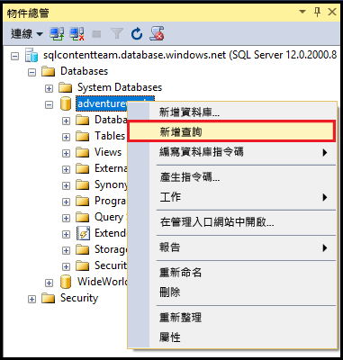
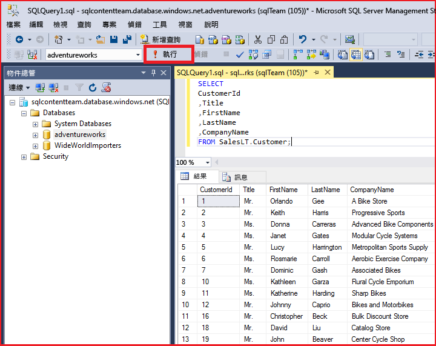

# 使用 SQL Server Management Studio 連接到 SQL Database 並執行範例 T-SQL 查詢
> [!div class="op_single_selector"]
> * [Visual Studio](sql-database-connect-query.md)
> * [SSMS](sql-database-connect-query-ssms.md)
> * [Excel](sql-database-connect-excel.md)
> 
> 

本文示範如何使用 SQL Server Management Studio (SSMS) 連接到 Azure SQL Database。成功連線之後，我們會執行簡單的 Transact-SQL (T-SQL) 查詢，以便驗證與資料庫的通訊。

[!INCLUDE [SSMS 安裝](../../includes/sql-server-management-studio-install.md)]

[!INCLUDE [SSMS 連線](../../includes/sql-database-sql-server-management-studio-connect-server-principal.md)]

## 執行範例查詢
連接到伺服器後，即可連接到資料庫並執行範例查詢。如果您不熟悉撰寫查詢，請參閱[撰寫 Transact-SQL 陳述式](https://msdn.microsoft.com/library/ms365303.aspx)。

1. 在 [物件總管] 中，瀏覽至伺服器上的資料庫，例如 **AdventureWorks** 範例資料庫。
2. 在資料庫上按一下滑鼠右鍵，然後選取 [新增查詢]：
   
    
3. 在查詢視窗中，複製並貼上下列內容：
   
        SELECT
        CustomerId
        ,Title
        ,FirstName
        ,LastName
        ,CompanyName
        FROM SalesLT.Customer;
4. 按一下 [執行] 按鈕：
   
    

## 後續步驟
如同您處理 SQL Server 的方式一樣，您可以使用 T-SQL 陳述式來建立及管理 Azure 中的資料庫。如果您已熟悉使用 T-SQL 搭配 SQL Server，請參閱 [Azure SQL Database Transact-SQL 資訊)](sql-database-transact-sql-information.md) 中的差異摘要。

如果您是 T-SQL 新手，請參閱[教學課程：撰寫 Transact-SQL 陳述式](https://msdn.microsoft.com/library/ms365303.aspx)和[Transact-SQL 參考 (Database Engine)](https://msdn.microsoft.com/library/bb510741.aspx)。

若要開始建立資料庫使用者和資料庫系統管理員，請參閱[開始使用 Azure SQL Database 安全性](sql-database-get-started-security.md)

如需有關 SSMS 的詳細資訊，請參閱[使用 SQL Server Management Studio](https://msdn.microsoft.com/library/ms174173.aspx)。

<!---HONumber=AcomDC_0824_2016-->