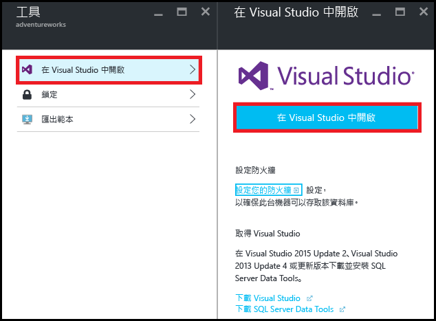
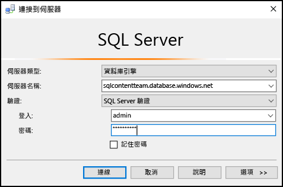
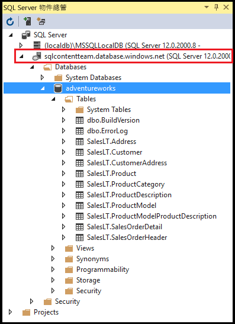
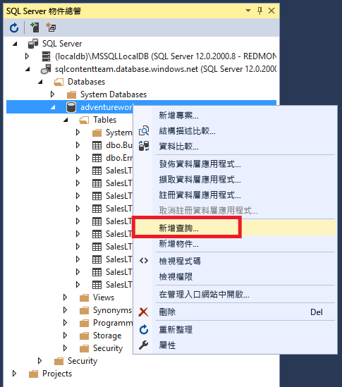
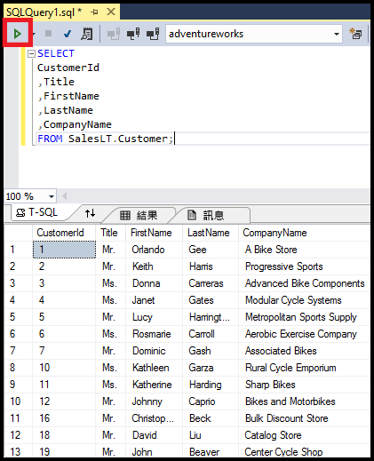

# 使用 Visual Studio 連接到 SQL Database
> [!div class="op_single_selector"]
> * [Visual Studio](sql-database-connect-query.md)
> * [SSMS](sql-database-connect-query-ssms.md)
> * [Excel](sql-database-connect-excel.md)
> 
> 

了解如何在 Visual Studio 中連接到 Azure SQL Database。

## 必要條件
若要使用 Visual Studio 連接到 SQL Database，您需要下列各項：

* 要連接的 SQL Database。本文使用 **AdventureWorks** 範例資料庫。若要取得 AdventureWorks 範例資料庫，請參閱[建立示範資料庫](sql-database-get-started.md)。
* Visual Studio 2013 Update 4 (或更新版本)。Microsoft 現在*免費*提供 Visual Studio Community。
  
  * [Visual Studio Community，下載](http://www.visualstudio.com/products/visual-studio-community-vs)
  * [免費 Visual Studio 的更多選項](http://www.visualstudio.com/products/free-developer-offers-vs.aspx)

## 從 Azure 入口網站開啟 Visual Studio
1. 登入 [Azure 入口網站](https://portal.azure.com/)。
2. 按一下 [其他服務] > [SQL Database]
3. 找出並按一下 AdventureWorks 資料庫，以開啟 **AdventureWorks** 資料庫刀鋒視窗。
4. 按一下資料庫刀鋒視窗頂端的 [工具] 按鈕：
   
    
5. 按一下 [在 Visual Studio 中開啟] \(如果您需要 Visual Studio，請按一下下載連結)︰
   
    
6. Visual Studio 隨即開啟，其 [連接到伺服器] 視窗已設定為連接到您在入口網站中選取的伺服器和資料庫。(按一下 [選項] 以確認連接已設為正確的資料庫)。 輸入您的伺服器系統管理員密碼，然後按一下 [連接]。

    

1. 如果您未針對您電腦的 IP 位址設定防火牆規則，您會在此收到「無法連接」訊息。若要建立防火牆規則，請參閱[設定 Azure SQL Database 伺服器層級的防火牆規則](sql-database-configure-firewall-settings.md)。
2. 成功連線之後，[SQL Server 物件總管] 視窗隨即開啟，內含您的資料庫連線。
   
    

## 執行範例查詢
我們現已連接至資料庫，下列步驟顯示如何執行簡單查詢︰

1. 在資料庫上按一下滑鼠右鍵，然後選取 [新增查詢]。
   
    
2. 在查詢視窗中，複製並貼上下列程式碼。
   
        SELECT
        CustomerId
        ,Title
        ,FirstName
        ,LastName
        ,CompanyName
        FROM SalesLT.Customer;
3. 按一下 [執行] 按鈕執行查詢：
   
    

## 後續步驟
* 在 Visual Studio 中開啟 SQL Database 以使用 SQL Server Data Tools。如需詳細資訊，請參閱 [SQL Server Data Tools](https://msdn.microsoft.com/library/hh272686.aspx)。
* 若要使用程式碼連接到 SQL Database，請參閱[使用 .NET (C#) 連接到 SQL Database](sql-database-develop-dotnet-simple.md)。

<!---HONumber=AcomDC_0824_2016--->