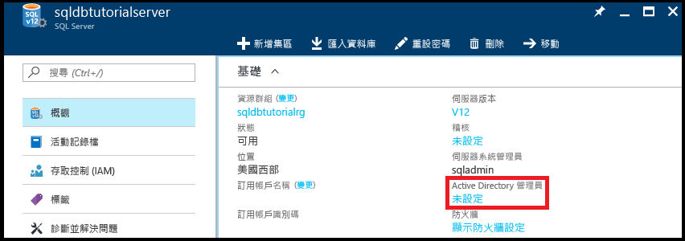
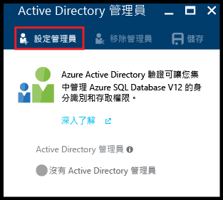
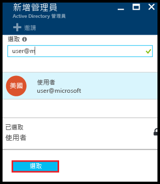
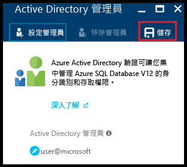
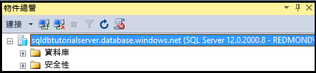
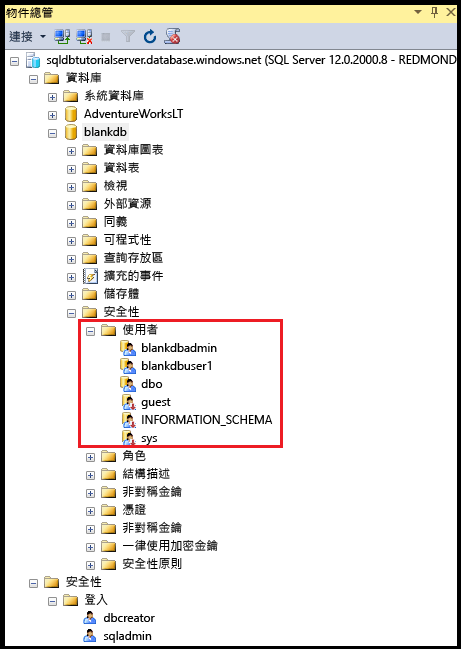
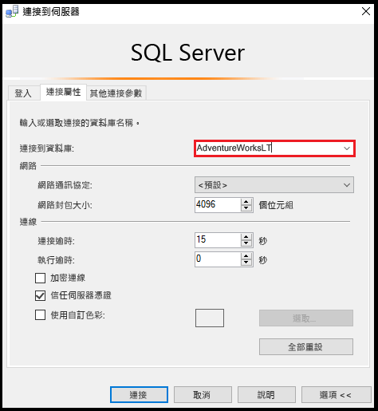
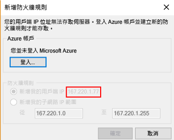
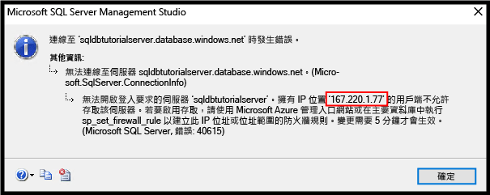

# <a name="azure-ad-authentication-access-and-database-level-firewall-rules"></a>Azure AD 驗證、存取，以及資料庫層級的防火牆規則
在本使用方法指南中，您會學習到如何使用 SQL Server Management Studio 來處理 Azure Active Directory 驗證、登入、使用者和資料庫角色，以授與 Azure SQL Database 伺服器和資料庫的存取權和權利。 您會學習：

- 檢視使用者在主要資料庫和使用者資料庫中的權限
- 根據 Azure Active Directory 驗證建立登入和使用者
- 對使用者授與全伺服器權限和資料庫特有權限
- 以非系統管理使用者的身分登入使用者資料庫
- 為資料庫使用者建立資料庫層級的防火牆規則
- 為伺服器管理員建立伺服器層級的防火牆規則

**時間估計**︰完成本使用方法指南將需要大約 45 分鐘 (假設您已符合先決條件)。

## <a name="prerequisites"></a>必要條件

* **Azure 帳戶**。 您需要 Azure 帳戶。 您可以[申請免費 Azure 帳戶](https://azure.microsoft.com/free/)或[啟用 Visual Studio 訂閱者權益](https://azure.microsoft.com/pricing/member-offers/msdn-benefits/)。 

* **Azure 建立權限**。 您必須能夠使用屬於訂用帳戶擁有者或參與者角色之成員的帳戶來連線 Azure 入口網站。 如需角色型存取控制 (RBAC) 的詳細資訊，請參閱[開始使用 Azure 入口網站中的存取管理](../active-directory/role-based-access-control-what-is.md)。

* **SQL Server Management Studio**。 您可以從[下載 SQL Server Management Studio](https://msdn.microsoft.com/library/mt238290.aspx) 下載和安裝最新版的 SQL Server Management Studio (SSMS)。 因為新的功能會持續不斷地推出，當您連接到 Azure SQL Database，務必使用最新版的 SSMS。

* **基本伺服器和資料庫** 若要安裝及設定本使用方法指南中使用的一部伺服器和兩部資料庫，請按一下 [部署至 Azure] 按鈕。 按一下此按鈕會開啟 [從範本部署] 刀鋒視窗、建立新的資源群組，並為將要建立的新伺服器提供 [系統管理員登入密碼]︰

   [](https://portal.azure.com/#create/Microsoft.Template/uri/https%3A%2F%2Fsqldbtutorial.blob.core.windows.net%2Ftemplates%2Fsqldbgetstarted.json)

   > [!NOTE]
   > 您可以選擇是否完成 SQL Server 驗證、[SQL 驗證、登入和使用者帳戶、資料庫角色、權限、伺服器層級防火牆規則和資料庫層級防火牆規則](sql-database-control-access-sql-authentication-get-started.md)的相關使用方法指南，不過，該使用方法指南所涵蓋的某些概念將不會在此處重複。 若您已在同一部電腦 (具有相同 IP 位址) 上完成本使用方法指南，則不必進行本使用方法指南中與伺服器和資料庫層級防火牆相關的程序，而本使用方法指南也會因此將其標示為選擇性程序。 此外，本使用方法指南中的螢幕擷取畫面會假設您已完成此相關使用方法指南。 
   >

* 您已建立和填入 Azure Active Directory。 如需詳細資訊，請參閱[整合內部部署身分識別與 Azure Active Directory](../active-directory/active-directory-aadconnect.md)、[將您自己的網域名稱新增至 Azure AD](../active-directory/active-directory-add-domain.md)、[Microsoft Azure 現在支援與 Windows Server Active Directory 同盟](https://azure.microsoft.com/blog/2012/11/28/windows-azure-now-supports-federation-with-windows-server-active-directory/)、[管理您的 Azure AD 目錄](https://msdn.microsoft.com/library/azure/hh967611.aspx)、[使用 Windows PowerShell 管理 Azure AD](https://msdn.microsoft.com/library/azure/jj151815.aspx) 和[混合式身分識別所需的連接埠和通訊協定](../active-directory/active-directory-aadconnect-ports.md)。

> [!NOTE]
> 本使用方法指南會協助您了解下列學習主題的內容︰[SQL Database 的存取權和控制權](sql-database-control-access.md)、[登入、使用者和資料庫角色](sql-database-manage-logins.md)、[主體](https://msdn.microsoft.com/library/ms181127.aspx)、[資料庫角色](https://msdn.microsoft.com/library/ms189121.aspx)、[SQL Database 防火牆規則](sql-database-firewall-configure.md)和 [Azure Active Directory 驗證](sql-database-aad-authentication.md)。 
>  

## <a name="sign-in-to-the-azure-portal-using-your-azure-account"></a>使用 Azure 帳戶登入 Azure 入口網站
使用 [現有的訂用帳戶](https://account.windowsazure.com/Home/Index)，遵循下列步驟來連接到 Azure 入口網站。

1. 開啟您選擇的瀏覽器並連接到 [Azure 入口網站](https://portal.azure.com/)。
2. 登入 [Azure 入口網站](https://portal.azure.com/)。
3. 在 [登入]  頁面上，提供您訂用帳戶的認證。
   
## <a name="provision-an-azure-active-directory-admin-for-your-sql-logical-server"></a>為 SQL 邏輯伺服器佈建 Azure Active Directory 系統管理員

在這一節的使用方法指南中，您會在 Azure 入口網站檢視邏輯伺服器安全性組態的相關資訊。

1. 開啟邏輯伺服器的 [SQL Server] 刀鋒視窗，然後檢視 [概觀] 頁面中的資訊。 請注意，Azure Active Directory 系統管理員尚未設定。

   

2. 按一下 [基本資訊] 窗格中的 [未設定]，以開啟 [Active Directory 系統管理員] 刀鋒視窗。

   

3. 按一下 [設定系統管理員] 以開啟 [新增系統管理員] 刀鋒視窗，然後選取 Active Directory 使用者或群組帳戶做為伺服器的 Active Directory 系統管理員。

   

4. 依序按一下 [選取] 和 [儲存]。

   

> [!NOTE]
> 若要檢閱此伺服器的連線資訊，請前往[以 SSMS 連線](sql-database-connect-query-ssms.md)。 在本使用方法指南系列中，完整伺服器名稱為「sqldbtutorialserver.database.windows.net」。
>

## <a name="connect-to-sql-server-using-sql-server-management-studio-ssms"></a>使用 SQL Server Management Studio (SSMS) 連接到 SQL Server

1. 如果您尚未這麼做，請下載並安裝最新版的 SSMS，位置是[下載 SQL Server Management Studio](https://msdn.microsoft.com/library/mt238290.aspx)。 為了保持最新狀態，最新版的 SSMS 會在有新版本可供下載時提示您。

2. 安裝之後，在 Windows 搜尋方塊中輸入 **Microsoft SQL Server Management Studio**，然後按一下 **Enter** 來開啟 SSMS。

   

3. 在 [連線到伺服器] 對話方塊中，選取其中一個 Active Directory 驗證方法，然後提供適當的驗證資訊。 如需選擇方法的資訊，請參閱 [Azure Active Directory 驗證](sql-database-aad-authentication.md)和[適用於 Azure AD MFA 的 SSMS 支援](sql-database-ssms-mfa-authentication.md)。

   

4. 輸入使用 SQL Server 驗證和伺服器管理帳戶連線到 SQL Server 所需的資訊。

5. 按一下 [ **連接**]。

   

## <a name="view-the-server-admin-account-and-its-permissions"></a>檢視伺服器管理帳戶和其權限 
在這一節的使用方法指南中，您會檢視主要資料庫和使用者資料庫中有關伺服器管理帳戶和其權限的資訊。

1. 在 [物件總管] 中，依序展開 [資料庫]、[系統資料庫]、[主要]、[安全性]和 [使用者]。 請注意，已在主要資料庫中針對 Active Directory 系統管理員建立使用者帳戶。 另請注意，並未針對 Active Directory 系統管理員使用者帳戶建立登入。

   

   > [!NOTE]
   > 如需所顯示之其他使用者帳戶的相關資訊，請參閱[主體](https://msdn.microsoft.com/library/ms181127.aspx)。
   >

2. 在 [物件總管] 中，以滑鼠右鍵按一下 [主要]，然後按一下 [新增查詢] 以開啟連線到主要資料庫的查詢視窗。
3. 在查詢視窗中，執行下列查詢來傳回執行查詢之使用者的相關資訊。 請注意，執行此查詢的使用者帳戶會傳回 user@microsoft.com (稍後以此程序查詢使用者資料庫時，我們會看到不同的結果)。

   ```
   SELECT USER;
   ```

   

4. 在查詢視窗中，執行下列查詢來傳回 Active Directory 系統管理員使用者權限的相關資訊。 請注意，Active Directory 系統管理員使用者擁有連線到主要資料庫、建立登入和使用者、從 sys.sql_logins 資料表選取資訊，以及將使用者新增至 dbmanager 和 dbcreator 資料庫角色的權限。 除了這些權限，也會有所有使用者都會從中繼承權限之公用角色所能獲得的權限 (例如，從特定資料表中選取資訊的權限)。 如需詳細資訊，請參閱[權限](https://msdn.microsoft.com/library/ms191291.aspx)。

   ```
   SELECT prm.permission_name
      , prm.class_desc
      , prm.state_desc
      , p2.name as 'Database role'
      , p3.name as 'Additional database role' 
   FROM sys.database_principals p
   JOIN sys.database_permissions prm
      ON p.principal_id = prm.grantee_principal_id
      LEFT JOIN sys.database_principals p2
      ON prm.major_id = p2.principal_id
      LEFT JOIN sys.database_role_members r
      ON p.principal_id = r.member_principal_id
      LEFT JOIN sys.database_principals p3
      ON r.role_principal_id = p3.principal_id
   WHERE p.name = 'user@microsoft.com';
   ```

   

6. 在 [物件總管] 中，依序展開 [blankdb]、[安全性] 和 [使用者]。 請注意，在此資料庫中，沒有名稱為 user@microsoft.com 的使用者帳戶。

   

7. 在 [物件總管] 中，以滑鼠右鍵按一下 [blankdb]，然後按一下 [新增查詢]。

8. 在查詢視窗中，執行下列查詢來傳回執行查詢之使用者的相關資訊。 請注意，執行此查詢的使用者帳戶會傳回 dbo (依預設，伺服器管理員登入會對應到每個使用者資料庫的 dbo 使用者帳戶)。

   ```
   SELECT USER;
   ```

   

9. 在查詢視窗中，執行下列查詢來傳回 dbo 使用者權限的相關資訊。 請注意，dbo 既是公用角色的成員，也是 db_owner 固定資料庫角色的成員。 如需詳細資訊，請參閱[資料庫層級角色](https://msdn.microsoft.com/library/ms189121.aspx)。

   ```
   SELECT prm.permission_name
      , prm.class_desc
      , prm.state_desc
      , p2.name as 'Database role'
      , p3.name as 'Additional database role' 
   FROM sys.database_principals AS p
   JOIN sys.database_permissions AS prm
      ON p.principal_id = prm.grantee_principal_id
      LEFT JOIN sys.database_principals AS p2
      ON prm.major_id = p2.principal_id
      LEFT JOIN sys.database_role_members r
      ON p.principal_id = r.member_principal_id
      LEFT JOIN sys.database_principals AS p3
      ON r.role_principal_id = p3.principal_id
   WHERE p.name = 'dbo';
   ```

   

10. (選擇性) 針對 AdventureWorksLT 使用者資料庫重複前面的三個步驟。

## <a name="create-a-new-user-in-the-adventureworkslt-database-with-select-permissions"></a>在 AdventureWorksLT 資料庫中建立具有 SELECT 權限的新使用者

在這一節的使用方法指南中，您會根據使用者的 Azure AD 使用者主體名稱或 Azure AD 群組的顯示名稱在 AdventureWorksLT 資料庫中建立使用者帳戶、以公用角色成員的身分測試這位使用者的權限、對這位使用者授與 SELECT 權限，然後再測試一次這位使用者的權限。

> [!NOTE]
> 資料庫層級使用者 ([自主使用者](https://msdn.microsoft.com/library/ff929188.aspx)) 可增加資料庫的可攜性，我們會在稍後的使用方法指南中探究此功能。
>

1. 在 [物件總管] 中，以滑鼠右鍵按一下 [AdventureWorksLT]，然後按一下 [新增查詢] 以開啟連線到 AdventureWorksLT 資料庫的查詢視窗。
2. 執行下列陳述式，以在 AdventureWorksLT 資料庫中針對 Microsoft 網域使用者 aaduser1 建立使用者帳戶。

   ```
   CREATE USER [aaduser1@microsoft.com]
   FROM EXTERNAL PROVIDER;
   ```
   

3. 在查詢視窗中，執行下列查詢來傳回 user1 權限的相關資訊。 請注意，user1 唯一具有的權限是繼承自公用角色的權限。

   ```
   SELECT prm.permission_name
      , prm.class_desc
      , prm.state_desc
      , p2.name as 'Database role'
      , p3.name as 'Additional database role' 
   FROM sys.database_principals AS p
   JOIN sys.database_permissions AS prm
      ON p.principal_id = prm.grantee_principal_id
      LEFT JOIN sys.database_principals AS p2
      ON prm.major_id = p2.principal_id
      LEFT JOIN sys.database_role_members r
      ON p.principal_id = r.member_principal_id
      LEFT JOIN sys.database_principals AS p3
      ON r.role_principal_id = p3.principal_id
   WHERE p.name = 'aaduser1@microsoft.com';
   ```

   

4. 執行下列查詢，嘗試以 user1 身分查詢 AdventureWorksLT 資料庫中的資料表。

   ```
   EXECUTE AS USER = 'aaduser1@microsoft.com';  
   SELECT * FROM [SalesLT].[ProductCategory];
   REVERT;
   ```

   

5. 執行下列陳述式，對 user1 授與 SalesLT 結構描述中 ProductCategory 資料表的 SELECT 權限。

   ```
   GRANT SELECT ON OBJECT::[SalesLT].[ProductCategory] to [aaduser1@microsoft.com];
   ```

   

6. 執行下列查詢，嘗試以 user1 身分查詢 AdventureWorksLT 資料庫中的資料表。

   ```
   EXECUTE AS USER = 'aaduser1@microsoft.com';  
   SELECT * FROM [SalesLT].[ProductCategory];
   REVERT;
   ```

   

## <a name="create-a-database-level-firewall-rule-for-adventureworkslt-database-users"></a>為 AdventureWorksLT 資料庫使用者建立資料庫層級的防火牆規則

> [!NOTE]
> 若您已在相關的 SQL Server 驗證使用方法指南 [SQL 驗證和授權](sql-database-control-access-sql-authentication-get-started.md)中完成對等的程序，且正使用具相同 IP 位址的同一部電腦進行學習，則您不需要完成此程序。
>

在這一節的使用方法指南中，您會嘗試從電腦使用新的使用者帳戶和不同的 IP 位址進行登入、以伺服器管理員身分建立資料庫層級的防火牆規則，然後使用這個新的資料庫層級防火牆規則成功進行登入。 

> [!NOTE]
> [資料庫層級防火牆規則](sql-database-firewall-configure.md)可增加資料庫的可攜性，我們會在稍後的使用方法指南中探究此功能。
>

1. 在另一部尚未建立伺服器層級防火牆規則的電腦上，開啟 SQL Server Management Studio。

   > [!IMPORTANT]
   > 請一律使用[下載 SQL Server Management Studio](https://msdn.microsoft.com/library/mt238290.aspx) 上的最新版 SSMS。 
   >

2. 在 [連線到伺服器] 視窗中輸入伺服器名稱和驗證資訊，以使用 SQL Server 驗證和 aaduser1@microsoft.com 帳戶進行連線。 
    
   

3. 在 [連線到伺服器] 對話方塊中，按一下 [選項] 指定您要連線的資料庫，然後在 [連線屬性] 索引標籤的 [連線到資料庫] 下拉式方塊中，輸入 **AdventureWorksLT**。
   
   

4. 按一下 [ **連接**]。 隨即會出現對話方塊，通知您嘗試用來連線到 SQL Database 的電腦沒有可存取資料庫的防火牆規則。 視您先前對防火牆採取的步驟而定，您可能收到兩種對話方塊，但所顯示的通常是第一種對話方塊。

   

   

   > [!NOTE]
   > 最新版 SSMS 包括可讓訂用帳戶擁有者和參與者登入 Microsoft Azure，並建立伺服器層級防火牆規則的功能。
   > 

4. 複製此對話方塊中的用戶端 IP 位址，以在步驟 7 中使用。
5. 按一下 [取消]，但不要關閉 [連線到伺服器] 對話方塊。
6. 切換回到您已建立伺服器層級防火牆規則的電腦，然後使用伺服器管理帳戶連線到伺服器。
7. 在以伺服器管理員身分連線到 AdventureWorksLT 資料庫的新查詢視窗中，執行下列陳述式來建立資料庫層級的防火牆，方法是使用步驟 4 中的 IP 位址執行 [sp_set_database_firewall_rule](https://msdn.microsoft.com/library/dn270010.aspx)︰

   ```
   EXEC sp_set_database_firewall_rule @name = N'AdventureWorksLTFirewallRule', 
     @start_ip_address = 'x.x.x.x', @end_ip_address = 'x.x.x.x';
   ```

   

8. 再次切換電腦，然後按一下 [連線到伺服器] 對話方塊中的 [連線]，以 aaduser1 身分連線到 AdventureWorksLT。 

9. 在 [物件總管] 中，依序展開 [資料庫]、[AdventureWorksLT]和 [資料表]。 請注意，user1 只具有檢視單一資料表 (**SalesLT.ProductCategory** 資料表) 的權限。 

10. 在 [物件總管] 中，以滑鼠右鍵按一下 [SalesLT.ProductCategory]，然後按一下 [選取前 1000 個資料列]。   

## <a name="next-steps"></a>後續步驟
- 如需 SQL Database 中存取權和控制權的概觀，請參閱 [SQL Database 的存取權和控制權](sql-database-control-access.md)。
- 如需 SQL Database 中登入、使用者和資料庫角色的概觀，請參閱[登入、使用者和資料庫角色](sql-database-manage-logins.md)。
- 如需資料庫主體的詳細資訊，請參閱[主體](https://msdn.microsoft.com/library/ms181127.aspx)。
- 如需資料庫角色的詳細資訊，請參閱[資料庫角色](https://msdn.microsoft.com/library/ms189121.aspx)。
- 如需 SQL Database 中防火牆規則的詳細資訊，請參閱 [SQL Database 防火牆規則](sql-database-firewall-configure.md)。


