# <a name="sql-server-authentication-access-and-database-level-firewall-rules"></a>SQL Server 驗證、存取和資料庫層級防火牆規則

在本教學課程中，您會學習到如何使用 SQL Server Management Studio 來處理授予 Azure SQL Database 伺服器和資料庫的 SQL Server 驗證、登入、使用者及資料庫角色。 完成本教學課程之後，您將了解如何：

- 根據 SQL Server 驗證建立登入和使用者
- 將使用者新增至角色並授與權限給角色
- 使用 T-SQL 建立資料庫層級和伺服器層級防火牆規則 
- 使用 SSMS 以使用者身分連接至特定資料庫
- 檢視使用者在主要資料庫和使用者資料庫中的權限

**時間估計**︰完成本教學課程將需要大約 45 分鐘 (前提是您已符合必要條件)。

> [!NOTE]
> 本教學課程會協助您了解下列學習主題的內容︰[SQL Database 的存取權和控制權](sql-database-control-access.md)、[登入、使用者和資料庫角色](sql-database-manage-logins.md)、[主體](https://msdn.microsoft.com/library/ms181127.aspx)、[資料庫角色](https://msdn.microsoft.com/library/ms189121.aspx)和 [SQL Database 防火牆規則](sql-database-firewall-configure.md)。 如需 Azure Active Directory 驗證的教學課程，請參閱[開始使用 Azure AD 驗證](sql-database-control-access-aad-authentication-get-started.md)。
>  

## <a name="prerequisites"></a>必要條件

* **Azure 帳戶**。 您需要 Azure 帳戶。 您可以[申請免費 Azure 帳戶](https://azure.microsoft.com/free/)或[啟用 Visual Studio 訂閱者權益](https://azure.microsoft.com/pricing/member-offers/msdn-benefits/)。 

* **Azure 建立權限**。 您必須能夠使用屬於訂用帳戶擁有者或參與者角色之成員的帳戶來連線 Azure 入口網站。 如需角色型存取控制 (RBAC) 的詳細資訊，請參閱[開始使用 Azure 入口網站中的存取管理](../active-directory/role-based-access-control-what-is.md)。

* **SQL Server Management Studio**。 您可以從[下載 SQL Server Management Studio](https://msdn.microsoft.com/library/mt238290.aspx) 下載和安裝最新版的 SQL Server Management Studio (SSMS)。 因為新的功能會持續不斷地推出，當您連接到 Azure SQL Database，務必使用最新版的 SSMS。

* **基本伺服器和資料庫** 若要安裝及設定本教學課程中使用的一部伺服器和兩部資料庫，請按一下 [部署至 Azure] 按鈕。 按一下此按鈕會開啟 [從範本部署] 刀鋒視窗、建立新的資源群組，並為將要建立的新伺服器提供 [系統管理員登入密碼]︰

   [](https://portal.azure.com/#create/Microsoft.Template/uri/https%3A%2F%2Fsqldbtutorial.blob.core.windows.net%2Ftemplates%2Fsqldbgetstarted.json)


## <a name="sign-in-to-the-azure-portal-using-your-azure-account"></a>使用 Azure 帳戶登入 Azure 入口網站
此程序中的步驟示範如何使用您的 Azure 帳戶連接到 Azure 入口網站 (https://account.windowsazure.com/Home/Index)。

1. 開啟您選擇的瀏覽器並連接到 [Azure 入口網站](https://portal.azure.com/)。
2. 登入 [Azure 入口網站](https://portal.azure.com/)。
3. 在 [登入]  頁面上，提供您訂用帳戶的認證。
   
   


<a name="create-logical-server-bk"></a>

## <a name="view-logical-server-security-information-in-the-azure-portal"></a>在 Azure 入口網站中檢視邏輯伺服器的安全性資訊

此程序中的步驟示範如何在 Azure 入口網站中，檢視邏輯伺服器安全性組態的相關資訊。

1. 開啟伺服器的 [SQL Server] 刀鋒視窗，然後檢視 [概觀] 頁面中的資訊。

   

2. 記下邏輯伺服器上的伺服器管理員名稱。 

3. 如果您不記得密碼，請按一下 [重設密碼] 來設定新的密碼。

4. 如果您需要取得此伺服器的連線資訊，請按一下 [屬性]。

## <a name="view-server-admin-permissions-using-ssms"></a>使用 SSMS 檢視伺服器管理員權限

此程序中的步驟示範如何在主要資料庫和使用者資料庫中，檢視伺服器管理帳戶和其權限的相關資訊。

1. 開啟 SQL Server Management Studio，並使用 SQL Server 驗證和伺服器管理帳戶，以伺服器管理員身分連接到您的伺服器。

   

2. 按一下 [ **連接**]。

   

3. 在 [物件總管] 中，展開 [安全性]，然後展開 [登入]，檢視伺服器的現有登入 - 新伺服器上的唯一登入是伺服器管理帳戶的登入。

   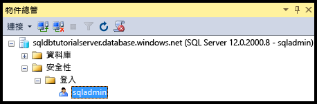

4. 在 [物件總管] 中，依序展開 [資料庫]、[系統資料庫]、[master]、[安全性] 和 [使用者]，以檢視此資料庫中為伺服器管理登入建立的使用者帳戶。

   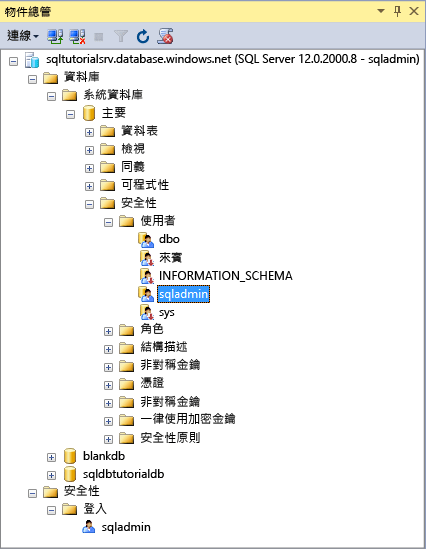

   > [!NOTE]
   > 如需 [使用者] 節點中顯示之其他使用者帳戶的相關資訊，請參閱[主體](https://msdn.microsoft.com/library/ms181127.aspx)。
   >

5. 在 [物件總管] 中，以滑鼠右鍵按一下 [主要]，然後按一下 [新增查詢] 以開啟連線到主要資料庫的查詢視窗。
6. 在查詢視窗中，執行下列查詢來傳回執行查詢之使用者的相關資訊。 

   ```
   SELECT USER;
   ```

   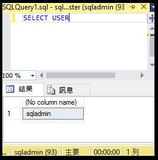

7. 在查詢視窗中，執行下列查詢，以傳回 **master**資料庫中有關 sqladmin 使用者權限的相關資訊。 

   ```
   SELECT prm.permission_name
      , prm.class_desc
      , prm.state_desc
      , p2.name as 'Database role'
      , p3.name as 'Additional database role' 
   FROM sys.database_principals p
   JOIN sys.database_permissions prm
      ON p.principal_id = prm.grantee_principal_id
      LEFT JOIN sys.database_principals p2
      ON prm.major_id = p2.principal_id
      LEFT JOIN sys.database_role_members r
      ON p.principal_id = r.member_principal_id
      LEFT JOIN sys.database_principals p3
      ON r.role_principal_id = p3.principal_id
   WHERE p.name = 'sqladmin';
   ```

   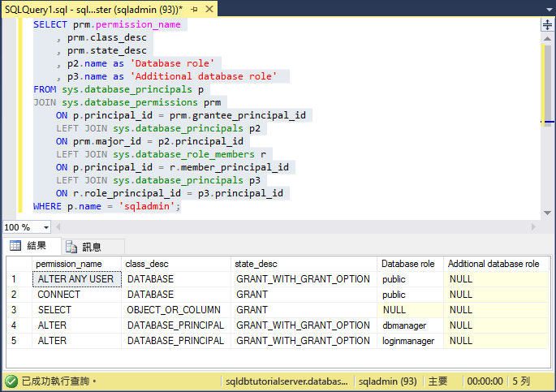

   >[!NOTE]
   > 伺服器管理員有權限連接到 master 資料庫、建立登入和使用者、從 sys.sql_logins 資料表選取資訊，以及將使用者新增至 dbmanager 和 dbcreator 資料庫角色。 除了這些權限，也會有所有使用者都會從中繼承權限之公用角色所能獲得的權限 (例如，從特定資料表中選取資訊的權限)。 如需詳細資訊，請參閱[權限](https://msdn.microsoft.com/library/ms191291.aspx)。
   >

8. 在 [物件總管] 中，依序展開 [blankdb]、[安全性] 和 [使用者]，以檢視此資料庫中 (以及每個使用者資料庫中) 為伺服器管理登入建立的使用者帳戶。

   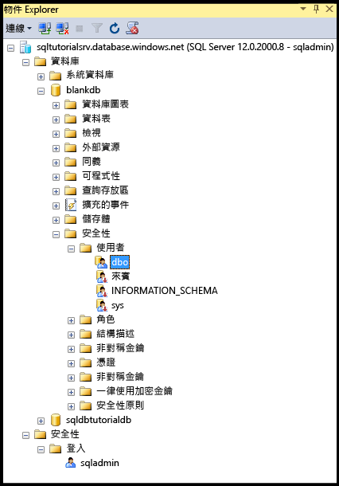

9. 在 [物件總管] 中，以滑鼠右鍵按一下 [blankdb]，然後按一下 [新增查詢]。

10. 在查詢視窗中，執行下列查詢來傳回執行查詢之使用者的相關資訊。

   ```
   SELECT USER;
   ```

   

11. 在查詢視窗中，執行下列查詢來傳回 dbo 使用者權限的相關資訊。 

   ```
   SELECT prm.permission_name
      , prm.class_desc
      , prm.state_desc
      , p2.name as 'Database role'
      , p3.name as 'Additional database role' 
   FROM sys.database_principals AS p
   JOIN sys.database_permissions AS prm
      ON p.principal_id = prm.grantee_principal_id
      LEFT JOIN sys.database_principals AS p2
      ON prm.major_id = p2.principal_id
      LEFT JOIN sys.database_role_members r
      ON p.principal_id = r.member_principal_id
      LEFT JOIN sys.database_principals AS p3
      ON r.role_principal_id = p3.principal_id
   WHERE p.name = 'dbo';
   ```

   

   > [!NOTE]
   > dbo 使用者是 public 角色的成員，也是 db_owner 固定資料庫角色的成員。 如需詳細資訊，請參閱[資料庫層級角色](https://msdn.microsoft.com/library/ms189121.aspx)。
   >

## <a name="create-a-new-user-with-select-permissions"></a>建立具有 SELECT 權限的新使用者

此程序中的步驟示範如何建立資料庫層級使用者、測試新使用者的預設權限 (透過 public 角色)、將 **SELECT** 權限授與使用者，然後檢視這些已修改的權限。

> [!NOTE]
> 資料庫層級使用者也稱為[自主使用者](https://msdn.microsoft.com/library/ff929188.aspx)，可提高資料庫的可攜性。 如需可攜性優點的相關資訊，請參閱[針對異地還原或容錯移轉至次要伺服器，設定和管理 Azure SQL Database 安全性](sql-database-geo-replication-security-config.md)。
>

1. 在 [物件總管] 中，以滑鼠右鍵按一下 [sqldbtutorialdb]，然後按一下 [新增查詢]。
2. 在查詢視窗中執行下列陳述式，以在 sqldbtutorialdb 資料庫中建立名為 **user1** 的使用者。

   ```
   CREATE USER user1
   WITH PASSWORD = 'p@ssw0rd';
   ```
   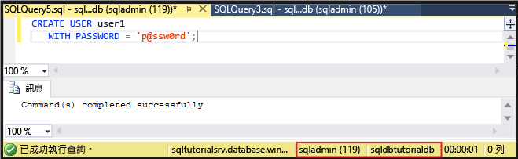

3. 在查詢視窗中，執行下列查詢來傳回 user1 權限的相關資訊。

   ```
   SELECT prm.permission_name
      , prm.class_desc
      , prm.state_desc
      , p2.name as 'Database role'
      , p3.name as 'Additional database role' 
   FROM sys.database_principals AS p
   JOIN sys.database_permissions AS prm
      ON p.principal_id = prm.grantee_principal_id
      LEFT JOIN sys.database_principals AS p2
      ON prm.major_id = p2.principal_id
      LEFT JOIN sys.database_role_members r
      ON p.principal_id = r.member_principal_id
      LEFT JOIN sys.database_principals AS p3
      ON r.role_principal_id = p3.principal_id
   WHERE p.name = 'user1';
   ```

   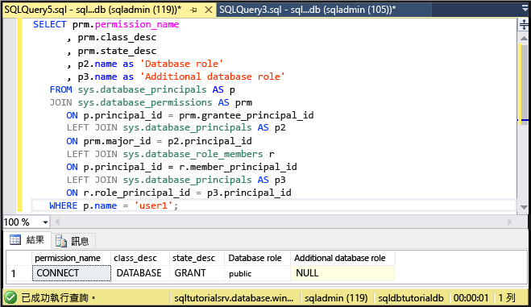

   > [!NOTE]
   > 資料庫中的新使用者只有繼承自 public 角色的權限。
   >

4. 使用 **EXECUTE AS USER** 陳述式，以 **user1** 身分 (只具有繼承自 public 角色的權限) 執行下列查詢，嘗試查詢 sqldbtutorialdb 資料庫中的 SalesLT.ProductCategory 資料表。

   ```
   EXECUTE AS USER = 'user1';  
   SELECT * FROM [SalesLT].[ProductCategory];
   REVERT;
   ```

   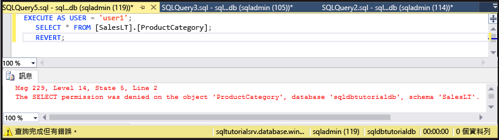

   > [!NOTE]
   > 根據預設，public 角色不會授與使用者物件的 **SELECT** 權限。
   >

5. 執行下列陳述式，將 SalesLT.ProductCategory 資料表的 **SELECT** 權限授與 **user1**。

   ```
   GRANT SELECT ON OBJECT::[SalesLT].[ProductCategory] to user1;
   ```

   

6. 執行下列查詢，以 **user1** 身分成功查詢 sqldbtutorialdb 資料庫中的 SalesLT.ProductCategory 資料表。

   ```
   EXECUTE AS USER = 'user1';  
   SELECT * FROM [SalesLT].[ProductCategory];
   REVERT;
   ```

   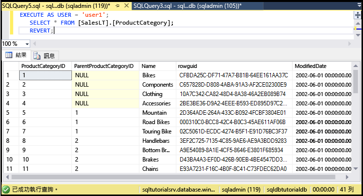

## <a name="create-a-database-level-firewall-rule-using-t-sql"></a>使用 T-SQL 建立資料庫層級防火牆規則

此程序中的步驟示範如何使用 [sp_set_database_firewall_rule](https://msdn.microsoft.com/library/dn270010.aspx) 系統預存程序，建立資料庫層級防火牆規則。 資料庫層級防火牆規則可讓伺服器管理員只針對特定的資料庫，才允許使用者通過 Azure SQL Database 防火牆。

> [!NOTE]
> [資料庫層級防火牆規則](sql-database-firewall-configure.md)可提高資料庫的可攜性。 如需可攜性優點的相關資訊，請參閱[針對異地還原或容錯移轉至次要伺服器，設定和管理 Azure SQL Database 安全性](sql-database-geo-replication-security-config.md)。
>

> [!IMPORTANT]
> 若要測試資料庫層級防火牆規則，從另一部電腦連接 (或在 Azure 入口網站中刪除伺服器層級防火牆規則)。
>

1. 在沒有伺服器層級防火牆規則的電腦上，開啟 SQL Server Management Studio。

2. 在 [連接到伺服器] 視窗中，輸入伺服器名稱和驗證資訊，以使用 SQL Server 驗證和 **user1** 帳戶進行連線。 
    
   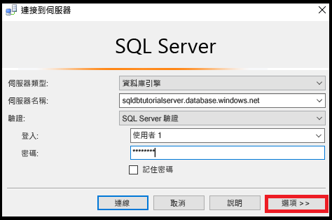

3. 按一下 [選項] 指定您要連線的資料庫，然後在 [連線屬性] 索引標籤的 [連線到資料庫] 下拉式方塊中，輸入 **sqldbtutorialdb**。
   
   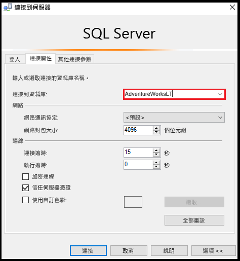

4. 按一下 [ **連接**]。 

   隨即會出現對話方塊，通知您嘗試用來連線到 SQL Database 的電腦沒有可存取資料庫的防火牆規則。 

   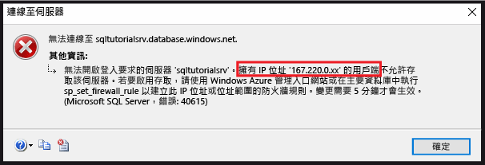


5. 複製此對話方塊中的用戶端 IP 位址，以在步驟 8 中使用。
6. 按一下 [確定] 關閉錯誤對話方塊，但不要關閉 [連接到伺服器] 對話方塊。
7. 切換回到您已建立伺服器層級防火牆規則的電腦。 
8. 在 SSMS 中，以伺服器管理員身分連接到 sqldbtutorialdb 資料庫，然後執行下列陳述式，使用步驟 5 中的 IP 位址 (或位址範圍) 建立資料庫層級防火牆。  

   ```
   EXEC sp_set_database_firewall_rule @name = N'sqldbtutorialdbFirewallRule', 
     @start_ip_address = 'x.x.x.x', @end_ip_address = 'x.x.x.x';
   ```

   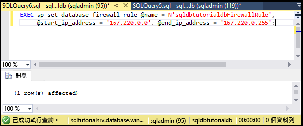

9. 再次切換電腦，然後按一下 [連接到伺服器] 對話方塊中的 [連接]，以 user1 身分連接到 sqldbtutorialdb。 

   > [!NOTE]
   > 建立資料庫層級防火牆規則之後，可能需要經過將近 5 分鐘才會生效。
   >

10. 成功連接之後，展開 [物件總管] 中的 [資料庫]。 請注意，**user1** 只能檢視 **sqldbtutorialdb** 資料庫。

   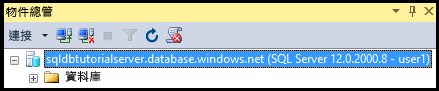

11. 展開 [sqldbtutorialdb]，然後展開 [資料表]。 請注意，user1 只擁有檢視單一資料表 (**SalesLT.ProductCategory** 資料表) 的權限。 

   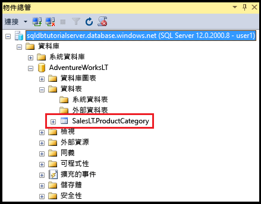

## <a name="create-a-new-user-as-dbowner-and-a-database-level-firewall-rule"></a>建立新的使用者做為 db_owner 和資料庫層級防火牆規則

此程序中的步驟示範如何在另一個資料庫中，建立具有 db_owner 資料庫角色權限的使用者，並為這個另外的資料庫建立資料庫層級防火牆。 這個具有 **db_owner** 角色成員資格的新使用者，只能連接和管理這單一資料庫。

1. 切換到使用伺服器管理帳戶連線 SQL Database 的電腦。
2. 開啟已連接到 **blankdb** 資料庫的查詢視窗，然後執行下列陳述式，在 blankdb 資料庫中建立名為 blankdbadmin 的使用者。

   ```
   CREATE USER blankdbadmin
   WITH PASSWORD = 'p@ssw0rd';
   ```

3. 在相同的查詢視窗中，執行下列陳述式將 blankdbadmin 使用者新增至 db_owner 資料庫角色。 此使用者現在可以執行管理 blankdb 資料庫所需的所有動作。

   ```
   ALTER ROLE db_owner ADD MEMBER blankdbadmin; 
   ```

4. 在相同的查詢視窗中，執行下列陳述式來建立資料庫層級的防火牆，方法是使用先前程序之步驟 4 中的 IP 位址 (或此資料庫之使用者的 IP 位址範圍) 執行 [sp_set_database_firewall_rule](https://msdn.microsoft.com/library/dn270010.aspx)︰

   ```
   EXEC sp_set_database_firewall_rule @name = N'blankdbFirewallRule', 
     @start_ip_address = 'x.x.x.x', @end_ip_address = 'x.x.x.x';
   ```

5. 切換電腦 (至已建立資料庫層級防火牆規則的電腦)，並使用 blankdbadmin 使用者帳戶連線到 blankdb 資料庫。
6. 開啟連往 blankdb 資料庫的查詢視窗，然後執行下列陳述式，在 blankdb 資料庫中建立名為 blankdbuser1 的使用者。

   ```
   CREATE USER blankdbuser1
   WITH PASSWORD = 'p@ssw0rd';
   ```
 
7. 視學習環境的需要，針對這位使用者建立其他的資料庫層級防火牆規則。 不過，如果您使用 IP 位址範圍建立資料庫層級防火牆規則，可能就不需要這樣做。

## <a name="grant-dbmanager-permissions-and-create-a-server-level-firewall-rule"></a>將權限授與 dbmanager 和建立伺服器層級防火牆規則

此程序中的步驟示範如何在 master 資料庫中建立登入和使用者，而且該使用者有權限建立和管理新的使用者資料庫。 這些步驟也示範如何使用 Transact-SQL 和 [sp_set_firewall_rule](https://msdn.microsoft.com/library/dn270017.aspx)，建立另一個伺服器層級防火牆規則。 

> [!IMPORTANT]
>第一個伺服器層級防火牆規則一定要在 Azure 中建立 (在 Azure 入口網站中、使用 PowerShell 或 REST API)。
>

> [!IMPORTANT]
> 必須在 master 資料庫中建立登入，再從登入建立使用者帳戶，伺服器管理員才能將建立資料庫的權限，委派給其他使用者。 不過，如果建立登入，再從登入建立使用者，這樣會降低環境的可攜性。
>

1. 切換到使用伺服器管理帳戶連線 SQL Database 的電腦。
2. 開啟連線到主要資料庫的查詢視窗，然後執行下列陳述式，在主要資料庫中建立名為 dbcreator 的登入。

   ```
   CREATE LOGIN dbcreator
   WITH PASSWORD = 'p@ssw0rd';
   ```

3. 在相同的查詢視窗中， 

   ```
   CREATE USER dbcreator
   FROM LOGIN dbcreator;
   ```

3. 在相同的查詢視窗中，執行下列查詢將 dbcreator 使用者新增至 dbmanager 資料庫角色。 此使用者現在可以建立和管理使用者所建立的資料庫。

   ```
   ALTER ROLE dbmanager ADD MEMBER dbcreator; 
   ```

4. 在相同的查詢視窗中，執行下列查詢，使用適合環境的 IP 位址執行 [sp_set_firewall_rule](https://msdn.microsoft.com/library/dn270017.aspx)，以建立伺服器層級防火牆︰

   ```
   EXEC sp_set_firewall_rule @name = N'dbcreatorFirewallRule', 
     @start_ip_address = 'x.x.x.x', @end_ip_address = 'x.x.x.x';
   ```

5. 切換電腦 (至已建立伺服器層級防火牆規則的電腦)，並使用 dbcreator 使用者帳戶連線到主要資料庫。
6. 開啟連往主要資料庫的查詢視窗，然後執行下列查詢以建立名為 foo 的資料庫。

   ```
   CREATE DATABASE FOO (EDITION = 'basic');
   ```
 7. (選擇性) 使用下列陳述式刪除此資料庫，以節省成本︰

   ```
   DROP DATABASE FOO;
   ```

## <a name="complete-script"></a>完整的指令碼

若要建立登入和使用者、將它們新增至角色、對它們授與權限、建立資料庫層級的防火牆規則，以及建立伺服器層級的防火牆規則，請在伺服器上的適當資料庫中執行下列陳述式。

### <a name="master-database"></a>主要資料庫
使用伺服器管理帳戶，並新增適當的 IP 位址或範圍，以在主要資料庫中執行這些陳述式。

```
CREATE LOGIN dbcreator WITH PASSWORD = 'p@ssw0rd';
CREATE USER dbcreator FROM LOGIN dbcreator;
ALTER ROLE dbmanager ADD MEMBER dbcreator;
EXEC sp_set_firewall_rule @name = N'dbcreatorFirewallRule', 
     @start_ip_address = 'x.x.x.x', @end_ip_address = 'x.x.x.x';
```

### <a name="sqldbtutorialdb-database"></a>sqldbtutorialdb 資料庫
使用伺服器管理帳戶，並新增適當的 IP 位址或範圍，以在 sqldbtutorialdb 資料庫中執行這些陳述式。

```
CREATE USER user1 WITH PASSWORD = 'p@ssw0rd';
GRANT SELECT ON OBJECT::[SalesLT].[ProductCategory] to user1;
EXEC sp_set_database_firewall_rule @name = N'sqldbtutorialdbFirewallRule', 
     @start_ip_address = 'x.x.x.x', @end_ip_address = 'x.x.x.x';
```

### <a name="blankdb-database"></a>blankdb 資料庫
使用伺服器管理帳戶，並新增適當的 IP 位址或範圍，以在 blankdb 資料庫中執行這些陳述式。

```
CREATE USER blankdbadmin
   WITH PASSWORD = 'p@ssw0rd';
ALTER ROLE db_owner ADD MEMBER blankdbadmin;
EXEC sp_set_database_firewall_rule @name = N'blankdbFirewallRule', 
     @start_ip_address = 'x.x.x.x', @end_ip_address = 'x.x.x.x';
CREATE USER blankdbuser1
   WITH PASSWORD = 'p@ssw0rd';
```

## <a name="next-steps"></a>後續步驟
- 如需 SQL Database 中存取權和控制權的概觀，請參閱 [SQL Database 的存取權和控制權](sql-database-control-access.md)。
- 如需 SQL Database 中登入、使用者和資料庫角色的概觀，請參閱[登入、使用者和資料庫角色](sql-database-manage-logins.md)。
- 如需資料庫主體的詳細資訊，請參閱[主體](https://msdn.microsoft.com/library/ms181127.aspx)。
- 如需資料庫角色的詳細資訊，請參閱[資料庫角色](https://msdn.microsoft.com/library/ms189121.aspx)。
- 如需 SQL Database 中防火牆規則的詳細資訊，請參閱 [SQL Database 防火牆規則](sql-database-firewall-configure.md)。
- 如需使用 Azure Active Directory 驗證的教學課程，請參閱 [Azure AD 驗證和授權](sql-database-control-access-aad-authentication-get-started.md)。


