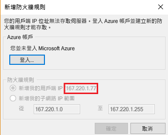
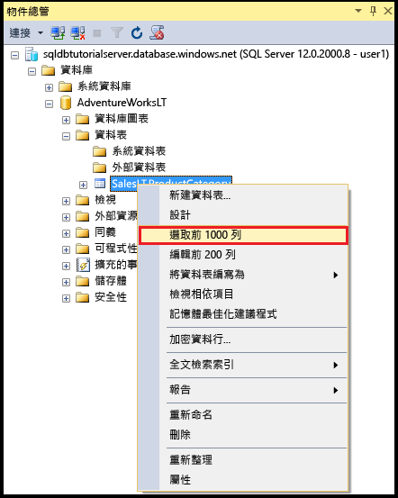
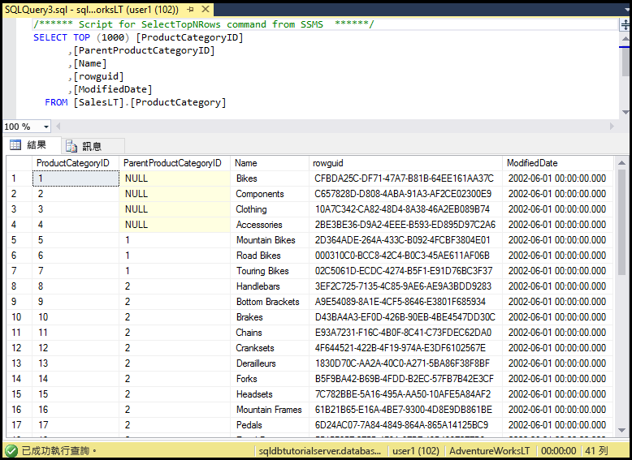

# <a name="sql-database-tutorial-sql-server-authentication-logins-and-user-accounts-database-roles-permissions-server-level-firewall-rules-and-database-level-firewall-rules"></a>SQL Database 教學課程︰SQL Server 驗證、登入和使用者帳戶、資料庫角色、權限、伺服器層級防火牆規則和資料庫層級防火牆規則
在本入門教學課程中，您會學習到如何使用 SQL Server Management Studio 來處理 SQL Server 驗證、登入、使用者和資料庫角色，以授與 Azure SQL Database 伺服器和資料庫的存取權和權利。 您會學習：

- 檢視使用者在主要資料庫和使用者資料庫中的權限
- 根據 SQL Server 驗證建立登入和使用者
- 對使用者授與全伺服器權限和資料庫特有權限
- 以非系統管理使用者的身分登入使用者資料庫
- 為資料庫使用者建立資料庫層級的防火牆規則
- 為伺服器管理員建立伺服器層級的防火牆規則

**時間估計**︰完成本教學課程將需要大約 45 分鐘 (前提是您已符合必要條件)。

## <a name="prerequisites"></a>必要條件

* 您需要 Azure 帳戶。 您可以[申請免費 Azure 帳戶](/pricing/free-trial/?WT.mc_id=A261C142F)或[啟用 Visual Studio 訂閱者權益](/pricing/member-offers/msdn-benefits-details/?WT.mc_id=A261C142F)。 

* 您必須能夠使用屬於訂用帳戶擁有者或參與者角色之成員的帳戶來連線 Azure 入口網站。 如需角色型存取控制 (RBAC) 的詳細資訊，請參閱[開始使用 Azure 入口網站中的存取管理](../active-directory/role-based-access-control-what-is.md)。

* 您已完成[藉由使用 Azure 入口網站和 SQL Server Management Studio 或相同的 [PowerShell 版本](sql-database-get-started-powershell.md)來開始使用 Azure SQL Database 伺服器、資料庫和防火牆規則](sql-database-get-started.md)。 如果沒有，請完成本必要的教學課程或執行 [PowerShell 版本](sql-database-get-started-powershell.md)結尾的 PowerShell 指令碼再繼續本教學課程。

> [!NOTE]
> 本教學課程會協助您了解下列學習主題的內容︰[SQL Database 的存取權和控制權](sql-database-control-access.md)、[登入、使用者和資料庫角色](sql-database-manage-logins.md)、[主體](https://msdn.microsoft.com/library/ms181127.aspx)、[資料庫角色](https://msdn.microsoft.com/library/ms189121.aspx)和 [SQL Database 防火牆規則](sql-database-firewall-configure.md)。
>  

## <a name="sign-in-to-the-azure-portal-using-your-azure-account"></a>使用 Azure 帳戶登入 Azure 入口網站
使用 [現有的訂用帳戶](https://account.windowsazure.com/Home/Index)，遵循下列步驟來連接到 Azure 入口網站。

1. 開啟您選擇的瀏覽器並連接到 [Azure 入口網站](https://portal.azure.com/)。
2. 登入 [Azure 入口網站](https://portal.azure.com/)。
3. 在 [登入]  頁面上，提供您訂用帳戶的認證。
   
   


<a name="create-logical-server-bk"></a>

## <a name="view-information-about-the-security-configuration-for-your-logical-server"></a>檢視邏輯伺服器安全性組態的相關資訊

在這一節的教學課程中，您會在 Azure 入口網站中檢視邏輯伺服器安全性組態的相關資訊。

1. 開啟邏輯伺服器的 [SQL Server] 刀鋒視窗，然後檢視 [概觀] 頁面中的資訊。

   

2. 記下邏輯伺服器之伺服器管理帳戶的名稱。 如果您不記得密碼，請按一下 [重設密碼] 來設定新的密碼。

> [!NOTE]
> 若要檢閱此伺服器的連線資訊，請移至[檢視或更新伺服器設定](sql-database-view-update-server-settings.md)。 在本教學課程系列中，完整伺服器名稱為「sqldbtutorialserver.database.windows.net」。
>

## <a name="connect-to-sql-server-using-sql-server-management-studio-ssms"></a>使用 SQL Server Management Studio (SSMS) 連接到 SQL Server

1. 如果您尚未這麼做，請下載並安裝最新版的 SSMS，位置是[下載 SQL Server Management Studio](https://msdn.microsoft.com/library/mt238290.aspx)。 為了保持最新狀態，最新版的 SSMS 會在有新版本可供下載時提示您。

2. 安裝之後，在 Windows 搜尋方塊中輸入 **Microsoft SQL Server Management Studio**，然後按一下 **Enter** 來開啟 SSMS。

   

3. 在 [連線到伺服器] 對話方塊中，輸入使用 SQL Server 驗證和伺服器管理帳戶連線到 SQL Server 所需的資訊。

   

4. 按一下 [ **連接**]。

   

## <a name="view-the-server-admin-account-and-its-permissions"></a>檢視伺服器管理帳戶和其權限 
在這一節的教學課程中，您會檢視主要資料庫和使用者資料庫中有關伺服器管理帳戶和其權限的資訊。

1. 在 [物件總管] 中，展開 [安全性]，然後展開 [登入] 來檢視 Azure SQL Database 伺服器的現有登入。 請注意，此時會顯示佈建期間所指定之伺服器管理帳戶的登入，在本教學課程系列中，所顯示的會是 sqladmin 登入。

   

2. 在 [物件總管] 中，依序展開 [資料庫]、[系統資料庫]、[主要]、[安全性]和 [使用者]。 請注意，主要資料庫中已建立伺服器管理員登入的使用者帳戶，其名稱和登入的使用者帳戶相同 (名稱不一定要相符，但最好相符以免產生混淆)。

   

   > [!NOTE]
   > 如需所顯示之其他使用者帳戶的相關資訊，請參閱[主體](https://msdn.microsoft.com/library/ms181127.aspx)。
   >

3. 在 [物件總管] 中，以滑鼠右鍵按一下 [主要]，然後按一下 [新增查詢] 以開啟連線到主要資料庫的查詢視窗。
4. 在查詢視窗中，執行下列查詢來傳回執行查詢之使用者的相關資訊。 請注意，執行此查詢的使用者帳戶會傳回 sqladmin (稍後以此程序查詢使用者資料庫時，我們會看到不同的結果)。

   ```
   SELECT USER;
   ```

   

5. 在查詢視窗中，執行下列查詢來傳回 sqladmin 使用者權限的相關資訊。 請注意，sqladmin 擁有連線到主要資料庫、建立登入和使用者、從 sys.sql_logins 資料表選取資訊，以及將使用者新增至 dbmanager 和 dbcreator 資料庫角色的權限。 除了這些權限，也會有所有使用者都會從中繼承權限之公用角色所能獲得的權限 (例如，從特定資料表中選取資訊的權限)。 如需詳細資訊，請參閱[權限](https://msdn.microsoft.com/library/ms191291.aspx)。

   ```
   SELECT prm.permission_name
      , prm.class_desc
      , prm.state_desc
      , p2.name as 'Database role'
      , p3.name as 'Additional database role' 
   FROM sys.database_principals p
   JOIN sys.database_permissions prm
      ON p.principal_id = prm.grantee_principal_id
      LEFT JOIN sys.database_principals p2
      ON prm.major_id = p2.principal_id
      LEFT JOIN sys.database_role_members r
      ON p.principal_id = r.member_principal_id
      LEFT JOIN sys.database_principals p3
      ON r.role_principal_id = p3.principal_id
   WHERE p.name = 'sqladmin';
   ```

   

6. 在 [物件總管] 中，依序展開 [blankdb]、[安全性] 和 [使用者]。 請注意，在此資料庫中，沒有名稱為 sqladmin 的使用者帳戶。

   

7. 在 [物件總管] 中，以滑鼠右鍵按一下 [blankdb]，然後按一下 [新增查詢]。

8. 在查詢視窗中，執行下列查詢來傳回執行查詢之使用者的相關資訊。 請注意，執行此查詢的使用者帳戶會傳回 dbo (依預設，伺服器管理員登入會對應到每個使用者資料庫的 dbo 使用者帳戶)。

   ```
   SELECT USER;
   ```

   

9. 在查詢視窗中，執行下列查詢來傳回 dbo 使用者權限的相關資訊。 請注意，dbo 既是公用角色的成員，也是 db_owner 固定資料庫角色的成員。 如需詳細資訊，請參閱[資料庫層級角色](https://msdn.microsoft.com/library/ms189121.aspx)。

   ```
   SELECT prm.permission_name
      , prm.class_desc
      , prm.state_desc
      , p2.name as 'Database role'
      , p3.name as 'Additional database role' 
   FROM sys.database_principals AS p
   JOIN sys.database_permissions AS prm
      ON p.principal_id = prm.grantee_principal_id
      LEFT JOIN sys.database_principals AS p2
      ON prm.major_id = p2.principal_id
      LEFT JOIN sys.database_role_members r
      ON p.principal_id = r.member_principal_id
      LEFT JOIN sys.database_principals AS p3
      ON r.role_principal_id = p3.principal_id
   WHERE p.name = 'dbo';
   ```

   

10. (選擇性) 針對 AdventureWorksLT 使用者資料庫重複前面的三個步驟。

## <a name="create-a-new-user-in-the-adventureworkslt-database-with-select-permissions"></a>在 AdventureWorksLT 資料庫中建立具有 SELECT 權限的新使用者

在這一節的教學課程中，您會在 AdventureWorksLT 資料庫中建立使用者帳戶、以公用角色成員的身分測試這位使用者的權限、對這位使用者授與 SELECT 權限，然後再測試一次這位使用者的權限。

> [!NOTE]
> 資料庫層級使用者 ([自主使用者](https://msdn.microsoft.com/library/ff929188.aspx)) 可增加資料庫的可攜性，我們會在稍後的教學課程中探究此功能。
>

1. 在 [物件總管] 中，以滑鼠右鍵按一下 [AdventureWorksLT]，然後按一下 [新增查詢] 以開啟連線到 AdventureWorksLT 資料庫的查詢視窗。
2. 執行下列陳述式，以在 AdventureWorksLT 資料庫中建立名為 user1 的使用者。

   ```
   CREATE USER user1
   WITH PASSWORD = 'p@ssw0rd';
   ```
   

3. 在查詢視窗中，執行下列查詢來傳回 user1 權限的相關資訊。 請注意，user1 唯一具有的權限是繼承自公用角色的權限。

   ```
   SELECT prm.permission_name
      , prm.class_desc
      , prm.state_desc
      , p2.name as 'Database role'
      , p3.name as 'Additional database role' 
   FROM sys.database_principals AS p
   JOIN sys.database_permissions AS prm
      ON p.principal_id = prm.grantee_principal_id
      LEFT JOIN sys.database_principals AS p2
      ON prm.major_id = p2.principal_id
      LEFT JOIN sys.database_role_members r
      ON p.principal_id = r.member_principal_id
      LEFT JOIN sys.database_principals AS p3
      ON r.role_principal_id = p3.principal_id
   WHERE p.name = 'user1';
   ```

   

4. 執行下列查詢，嘗試以 user1 身分查詢 AdventureWorksLT 資料庫中的資料表。

   ```
   EXECUTE AS USER = 'user1';  
   SELECT * FROM [SalesLT].[ProductCategory];
   REVERT;
   ```

   

5. 執行下列陳述式，對 user1 授與 SalesLT 結構描述中 ProductCategory 資料表的 SELECT 權限。

   ```
   GRANT SELECT ON OBJECT::[SalesLT].[ProductCategory] to user1;
   ```

   

6. 執行下列查詢，嘗試以 user1 身分查詢 AdventureWorksLT 資料庫中的資料表。

   ```
   EXECUTE AS USER = 'user1';  
   SELECT * FROM [SalesLT].[ProductCategory];
   REVERT;
   ```

   

## <a name="create-a-database-level-firewall-rule-for-an-adventureworkslt-database-user"></a>為 AdventureWorksLT 資料庫使用者建立資料庫層級的防火牆規則

在這一節的教學課程中，您會嘗試從電腦使用不同的 IP 位址進行登入、以伺服器管理員身分建立資料庫層級的防火牆規則，然後使用這個新的資料庫層級防火牆規則進行登入。 

> [!NOTE]
> [資料庫層級防火牆規則](sql-database-firewall-configure.md)可增加資料庫的可攜性，我們會在稍後的教學課程中探究此功能。
>

1. 在另一部尚未建立伺服器層級防火牆規則的電腦上，開啟 SQL Server Management Studio。

   > [!IMPORTANT]
   > 請一律使用[下載 SQL Server Management Studio](https://msdn.microsoft.com/library/mt238290.aspx) 上的最新版 SSMS。 
   >

2. 在 [連線到伺服器] 視窗中輸入伺服器名稱和驗證資訊，以使用 SQL Server 驗證和 user1 帳戶進行連線。 
    
   

3. 按一下 [選項] 來指定所要連線到的資料庫，然後在 [連接屬性] 索引標籤的 [連線到資料庫] 下拉式方塊中輸入 **AdventureWorksLT**。
   
   

4. 按一下 [ **連接**]。 隨即會出現對話方塊，通知您嘗試用來連線到 SQL Database 的電腦沒有可存取資料庫的防火牆規則。 視您先前對防火牆採取的步驟而定，您可能收到兩種對話方塊，但所顯示的通常是第一種對話方塊。

   

   

   > [!NOTE]
   > 最新版 SSMS 包括可讓訂用帳戶擁有者和參與者登入 Microsoft Azure，並建立伺服器層級防火牆規則的功能。
   > 

4. 複製此對話方塊中的用戶端 IP 位址，以在步驟 7 中使用。
5. 按一下 [取消]，但不要關閉 [連線到伺服器] 對話方塊。
6. 切換回到您已建立伺服器層級防火牆規則的電腦，然後使用伺服器管理帳戶連線到伺服器。
7. 在以伺服器管理員身分連線到 AdventureWorksLT 資料庫的新查詢視窗中，執行下列陳述式來建立資料庫層級的防火牆，方法是使用步驟 4 中的 IP 位址執行 [sp_set_database_firewall_rule](https://msdn.microsoft.com/library/dn270010.aspx)︰

   ```
   EXEC sp_set_database_firewall_rule @name = N'AdventureWorksLTFirewallRule', 
     @start_ip_address = 'x.x.x.x', @end_ip_address = 'x.x.x.x';
   ```

   

8. 再次切換電腦，然後按一下 [連線到伺服器] 對話方塊中的 [連線]，以 user1 身分連線到 AdventureWorksLT。 

   

9. 在 [物件總管] 中，依序展開 [資料庫]、[AdventureWorksLT]和 [資料表]。 請注意，user1 只擁有檢視單一資料表 (**SalesLT.ProductCategory** 資料表) 的權限。 

   

10. 在 [物件總管] 中，以滑鼠右鍵按一下 [SalesLT.ProductCategory]，然後按一下 [選取前 1000 個資料列]。   

   

   

## <a name="create-a-new-user-in-the-blankdb-database-with-dbowner-database-role-permissions-and-a-database-level-firewall-rule"></a>在 blankdb 資料庫中建立具有 db_owner 資料庫角色權限的新使用者和資料庫層級的防火牆規則

在這一節的教學課程中，您會在 blankdb 資料庫中建立具有 db_owner 資料庫角色權限的使用者，並使用伺服器管理帳戶為這個資料庫建立資料庫層級的防火牆。 

1. 切換到使用伺服器管理帳戶連線到 SQL Database 的電腦。
2. 開啟連線到 blankdb 資料庫的查詢視窗，然後執行下列陳述式，在 blankdb 資料庫中建立名為 blankdbadmin 的使用者。

   ```
   CREATE USER blankdbadmin
   WITH PASSWORD = 'p@ssw0rd';
   ```

3. 在相同的查詢視窗中，執行下列陳述式將 blankdbadmin 使用者新增至 db_owner 資料庫角色。 此使用者現在可以執行管理 blankdb 資料庫所需的所有動作。

   ```
   ALTER ROLE db_owner ADD MEMBER blankdbadmin; 
   ```

4. 在相同的查詢視窗中，執行下列陳述式來建立資料庫層級的防火牆，方法是使用先前程序之步驟 4 中的 IP 位址 (或此資料庫之使用者的 IP 位址範圍) 執行 [sp_set_database_firewall_rule](https://msdn.microsoft.com/library/dn270010.aspx)︰

   ```
   EXEC sp_set_database_firewall_rule @name = N'blankdbFirewallRule', 
     @start_ip_address = 'x.x.x.x', @end_ip_address = 'x.x.x.x';
   ```

5. 切換電腦 (至已建立資料庫層級防火牆規則的電腦)，並使用 blankdbadmin 使用者帳戶連線到 blankdb 資料庫。
6. 開啟連往 blankdb 資料庫的查詢視窗，然後執行下列陳述式，在 blankdb 資料庫中建立名為 blankdbuser1 的使用者。

   ```
   CREATE USER blankdbuser1
   WITH PASSWORD = 'p@ssw0rd';
   ```
 
7. 視學習環境的需要，針對這位使用者建立其他的資料庫層級防火牆規則。 

## <a name="create-a-new-login-and-user-in-the-master-database-with-dbmanager-permissions-and-create-a-server-level-firewall-rule"></a>在主要資料庫中建立具有 dbmanager 權限的新登入和使用者，然後建立伺服器層級的防火牆規則

在這一節的教學課程中，您會在主要資料庫中建立具有權限來建立和管理新使用者資料庫的登入和使用者。 您也會使用 Transact-SQL 與 [sp_set_firewall_rule](https://msdn.microsoft.com/library/dn270017.aspx) 建立其他的伺服器層級防火牆規則。

> [!NOTE]
> 必須在主要資料庫中建立登入並透過該登入建立使用者帳戶，才能讓伺服器管理帳戶持有者對其他使用者委派建立資料庫的權限。 不過，建立登入並透過登入建立使用者會降低環境的可攜性，我們會在稍後的教學課程中探究其後果，包括如何在規劃災害復原時加以預測及處理。
>

1. 切換到使用伺服器管理帳戶連線到 SQL Database 的電腦。
2. 開啟連線到主要資料庫的查詢視窗，然後執行下列陳述式，在主要資料庫中建立名為 dbcreator 的登入。

   ```
   CREATE LOGIN dbcreator
   WITH PASSWORD = 'p@ssw0rd';
   ```

3. 在相同的查詢視窗中， 

   ```
   CREATE USER dbcreator
   FROM LOGIN dbcreator;
   ```

3. 在相同的查詢視窗中，執行下列查詢將 dbcreator 使用者新增至 dbmanager 資料庫角色。 此使用者現在可以建立和管理使用者所建立的資料庫。

   ```
   ALTER ROLE dbmanager ADD MEMBER dbcreator; 
   ```

4. 在相同的查詢視窗中，執行下列查詢來建立伺服器層級的防火牆，方法是使用適合您環境的 IP 位址執行 [sp_set_database_firewall_rule](https://msdn.microsoft.com/library/dn270010.aspx)︰

   ```
   EXEC sp_set_firewall_rule @name = N'dbcreatorFirewallRule', 
     @start_ip_address = 'x.x.x.x', @end_ip_address = 'x.x.x.x';
   ```

5. 切換電腦 (至已建立伺服器層級防火牆規則的電腦)，並使用 dbcreator 使用者帳戶連線到主要資料庫。
6. 開啟連往主要資料庫的查詢視窗，然後執行下列查詢以建立名為 foo 的資料庫。

   ```
   CREATE DATABASE FOO (EDITION = 'basic');
   ```
 7. (選擇性) 使用下列陳述式刪除此資料庫，以節省成本︰

   ```
   DROP DATABASE FOO;
   ```

## <a name="complete-script"></a>完整的指令碼

若要建立登入和使用者、將它們新增至角色、對它們授與權限、建立資料庫層級的防火牆規則，以及建立伺服器層級的防火牆規則，請在伺服器上的適當資料庫中執行下列陳述式。

### <a name="master-database"></a>主要資料庫
使用伺服器管理帳戶，並新增適當的 IP 位址或範圍，以在主要資料庫中執行這些陳述式。

```
CREATE LOGIN dbcreator WITH PASSWORD = 'p@ssw0rd';
CREATE USER dbcreator FROM LOGIN dbcreator;
ALTER ROLE dbmanager ADD MEMBER dbcreator;
EXEC sp_set_firewall_rule @name = N'dbcreatorFirewallRule', 
     @start_ip_address = 'x.x.x.x', @end_ip_address = 'x.x.x.x';
```

### <a name="adventureworkslt-database"></a>AdventureWorksLT 資料庫
使用伺服器管理帳戶，並新增適當的 IP 位址或範圍，以在 AdventureWorksLT 資料庫中執行這些陳述式。

```
CREATE USER user1 WITH PASSWORD = 'p@ssw0rd';
GRANT SELECT ON OBJECT::[SalesLT].[ProductCategory] to user1;
EXEC sp_set_database_firewall_rule @name = N'AdventureWorksLTFirewallRule', 
     @start_ip_address = 'x.x.x.x', @end_ip_address = 'x.x.x.x';
```

### <a name="blankdb-database"></a>blankdb 資料庫
使用伺服器管理帳戶，並新增適當的 IP 位址或範圍，以在 blankdb 資料庫中執行這些陳述式。

```
CREATE USER blankdbadmin
   WITH PASSWORD = 'p@ssw0rd';
ALTER ROLE db_owner ADD MEMBER blankdbadmin;
EXEC sp_set_database_firewall_rule @name = N'blankdbFirewallRule', 
     @start_ip_address = 'x.x.x.x', @end_ip_address = 'x.x.x.x';
CREATE USER blankdbuser1
   WITH PASSWORD = 'p@ssw0rd';
```

## <a name="next-steps"></a>後續步驟
- 如需 SQL Database 中存取權和控制權的概觀，請參閱 [SQL Database 的存取權和控制權](sql-database-control-access.md)。
- 如需 SQL Database 中登入、使用者和資料庫角色的概觀，請參閱[登入、使用者和資料庫角色](sql-database-manage-logins.md)。
- 如需資料庫主體的詳細資訊，請參閱[主體](https://msdn.microsoft.com/library/ms181127.aspx)。
- 如需資料庫角色的詳細資訊，請參閱[資料庫角色](https://msdn.microsoft.com/library/ms189121.aspx)。
- 如需 SQL Database 中防火牆規則的詳細資訊，請參閱 [SQL Database 防火牆規則](sql-database-firewall-configure.md)。
- 如需使用 Azure Active Directory 驗證的教學課程，請參閱 [SQL Database 教學課程︰AAD 驗證、登入和使用者帳戶、資料庫角色、權限、伺服器層級防火牆規則和資料庫層級防火牆規則](sql-database-control-access-sql-authentication-get-started.md)。


<!--HONumber=Jan17_HO3-->


