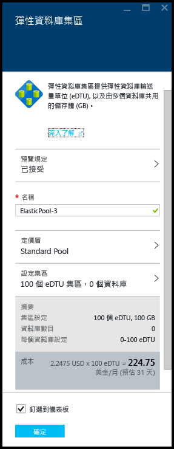
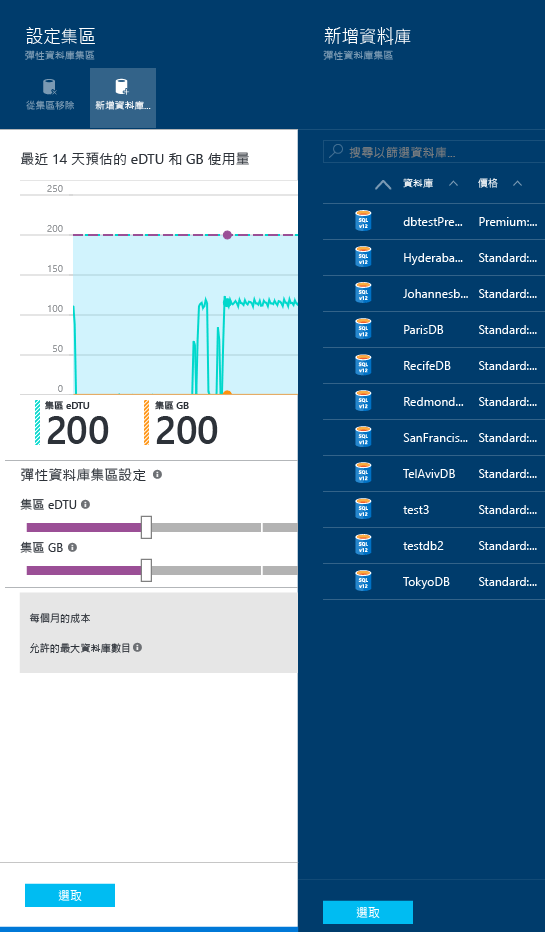
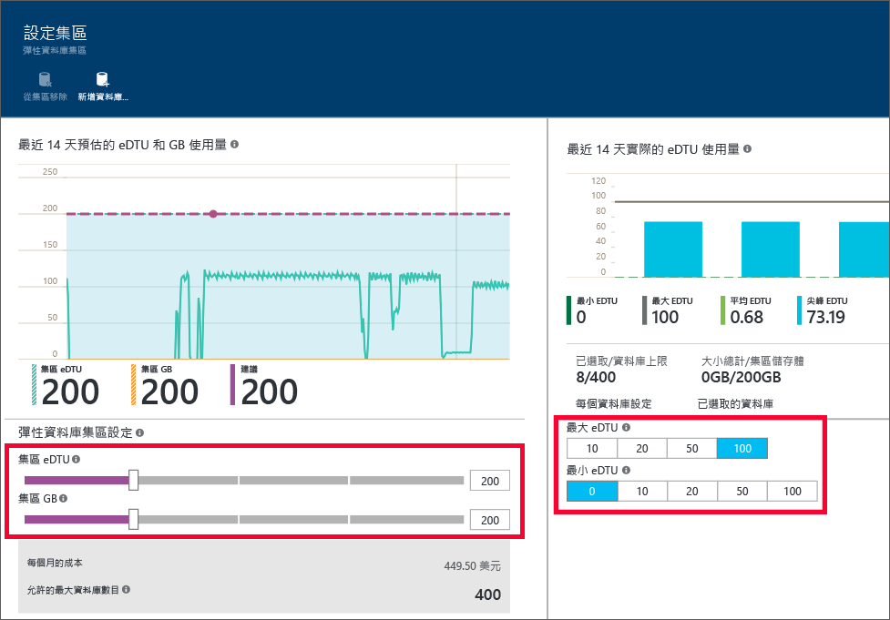

# 使用 Azure 入口網站建立及管理彈性集區
本主題說明如何使用 Azure 入口網站來建立及管理可調整的[彈性集區](sql-database-elastic-pool.md)。 您也可以使用 [PowerShell](sql-database-elastic-pool-manage-powershell.md)、REST API 或 [C#](sql-database-elastic-pool-manage-csharp.md) 來建立及管理 Azure 彈性集區。 您也可以使用 [Transact-SQL](sql-database-elastic-pool-manage-tsql.md) 來建立資料庫並將它移入和移出彈性集區。

## 建立彈性集區 

彈性集區的建立方式有兩種。 如果您知道您要的集區設定則可從頭開始進行，或從服務的建議著手。 SQL Database 擁有的內建智慧功能會根據您資料庫過去的使用狀況遙測，為您建議更符合成本效益的彈性集區設定。

您可以在伺服器上建立多個集區，但無法將來自不同伺服器的資料庫新增到相同的集區。 

> [!NOTE]
> 彈性集區已在所有 Azure 區域中正式運作 (GA)，但印度西部除外，此區域目前提供預覽版。  我們將儘速在此區域提供彈性集區的 GA。
>
>

### 步驟 1：建立彈性集區

從入口網站中的現有**伺服器** 刀鋒視窗建立彈性集區，是將現有資料庫移到彈性集區中的最簡單方式。

> [!NOTE]
> 您也可以在 [Marketplace] 中搜尋 **SQL 彈性集區**，或按一下 [SQL 彈性集區] 瀏覽刀鋒視窗中的 [+新增]，以建立彈性集區。 您可以透過此集區佈建工作流程來指定新的或現有的伺服器。
>
>

1. 在 [Azure 入口網站](http://portal.azure.com/)中，按一下 [更多服務] **>** [SQL 伺服器]，然後按一下要新增到彈性集區之資料庫所在的伺服器。
2. 按一下 [新增集區] 。

    

    **-或-**

    您可能會看到一則訊息，表示伺服器有建議的彈性集區。 按一下訊息以查看系統根據資料庫的歷史使用量遙測資料所推薦的集區，然後按一下定價層以查看更多詳細資料並自訂集區。 若要了解系統是如何做出推薦的，請參閱本主題稍後的 [了解集區建議](#understand-pool-recommendations) 。

    

3. [彈性集區] 刀鋒視窗將會出現，您將在這裡指定集區的設定。 如果您在上一個步驟中按一下 [新增集區]，定價層預設會是 [標準]，而且未選取任何資料庫。 您可以建立空的集區，或指定一組該伺服器的現有資料庫以移入集區。 如果您正在建立建議的集區，即會預先填入建議的定價層、效能設定與資料庫清單，但您仍然可以變更它們。

    

4. 指定彈性集區的名稱，或保留預設值。

### 步驟 2：選擇定價層

集區的定價層決定了集區中彈性資料庫可用的功能，還有每個資料庫可用的 eDTU 數目上限 (eDTU MAX) 與儲存體 (GB)。 如需詳細資訊，請參閱服務層。

若要變更集區的定價層，請依序按一下 [定價層]、您想要的定價層及 [選取]。

> [!IMPORTANT]
> 在最後一個步驟中選擇好定價層並按一下 [確定] 認可變更後，您就無法再變更集區的定價層。 若要變更現有彈性集區的定價層，在所需的定價層中建立一個彈性集區，並將資料庫移轉至這個新的集區。
>
>

### 步驟 3︰設定集區

設定定價層之後，請按一下 [設定集區]，即可新增資料庫、設定集區 eDTU 和儲存體 (集區 GB)，以及設定集區中彈性資料庫的最小和最大 eDTU。

1. 按一下 [設定集區] 
2. 選取您要新增至集區的資料庫。 建立集區時，這個步驟是選擇性步驟。 建立集區後，可以新增資料庫。
    若要新增資料庫，請依序按一下 [新增資料庫]、您想要新增的資料庫以及 [選取] 按鈕。

    

    如果您要使用的資料庫有足夠的歷史使用量遙測資料，[預估的 eDTU 和 GB 使用量] 圖形和 [實際的 eDTU 使用量] 長條圖便會更新以幫助您決定要使用的組態。 此外，該服務可能會提供您建議訊息，協助您決定集區的適當大小。 請參閱 [動態建議](#dynamic-recommendations)。

3. 使用 [設定集區]  頁面上的控制項，探索設定及設定您的集區。 如需各服務層限制的詳細資訊，請參閱[彈性集區限制](sql-database-elastic-pool.md#edtu-and-storage-limits-for-elastic-pools)；如需如何決定彈性集區適當大小的詳細指導方針，請參閱[彈性集區的價格和效能考量](sql-database-elastic-pool.md)。 如需集區設定的詳細資訊，請參閱[彈性集區屬性](sql-database-elastic-pool.md#database-properties-for-pooled-databases)。

    

4. 變更設定之後，請按一下 [設定集區] 刀鋒視窗中的 [選取]。
5. 按一下 [確定]  以建立集區。

## 了解彈性集區建議

SQL Database 服務會評估使用量的歷史資料，並為您推薦一或多個比使用單一資料庫更符合成本效益的集區。 每個推薦集區都是以最適合該集區的伺服器資料庫唯一子集進行設定。

  

集區建議包含下列內容︰

- 集區的定價層 (基本、標準、進階或進階 RS)
- 適當的 [集區 eDTU]  \(也稱為每一集區的最大 eDTU)
- 每一資料庫的 [eDTU 上限] 和 [eDTU 下限]
- 集區的建議資料庫清單

> [!IMPORTANT]
> 服務在建議集區時，會計算過去 30 天的遙測。 為了讓資料庫被視為彈性集區的候選項目，它必須存在至少 7 天。 已在彈性集區中的資料庫不會被視為彈性集區建議候選項目。
>

服務會評估將每個服務層中的單一資料庫移至同一層集區的資源需求和成本效益。 例如，會評估伺服器上的所有 Standard 資料庫是否適合 Standard 彈性集區。 這表示服務不會進行跨層建議，例如將 Standard 資料庫移到 Premium 集區。

將資料庫新增至集區之後，會根據您所選資料庫的過去使用情況來動態產生建議。 這些建議會顯示在 eDTU 和 GB 使用情況圖表，以及 [設定集區] 刀鋒視窗頂端的建議橫幅中。 這些建議旨在協助您為特定的資料庫建立最佳化彈性集區。

## 管理及監視彈性集區

您可以使用 Azure 入口網站來監視及管理彈性集區和集區中的資料庫。 從入口網站，您可以監視彈性集區與集區內資料庫的使用率。 也可以對彈性集區進行一些變更，並且一次提交所有的變更。 這些變更包括新增或移除資料庫、變更您的彈性集區設定，或變更您的資料庫設定。

下圖顯示彈性集區範例。 此檢視包括︰

*  圖表，可供監視彈性集區和集區中內含資料庫的資源使用量。
*  [設定]  集區按鈕，以對彈性集區進行變更。
*  [建立資料庫] 按鈕，以建立資料庫並將它加入至目前的彈性集區。
*  彈性工作，可藉由對清單中的所有資料庫執行 Transact SQL 指令碼，協助您管理大量資料庫。

![集區檢視][2]

您可以移至特定集區，以查看其資源使用率。 根據預設，集區已設定為顯示過去 1 小時內的儲存體和 eDTU 使用量。 此圖表可以設定為顯示各種時間範圍的不同度量。

1. 選取要使用的彈性集區。
2. [彈性集區監視] 之下的是標示為 [資源使用率] 的圖表。 按一下此圖表。

    ![彈性集區監視][3]

    [度量] 刀鋒視窗將會開啟，顯示指定時間範圍內指定度量的詳細檢視。   

    ![[度量] 刀鋒視窗][9]

### 自訂圖表顯示

您可以編輯此圖表和 [度量] 刀鋒視窗，以顯示其他度量，例如所用的 CPU 百分比、資料 IO 百分比和記錄 IO 百分比。

1. 在 [度量] 刀鋒視窗上，按一下 [編輯] 。

    ![按一下 [編輯]。][6]

2. 在 [編輯圖表] 刀鋒視窗中，選取一個時間範圍 (過去 1 小時、今天或上一週)，或按一下 [自訂] 以選取過去兩週內的任何日期範圍。 選取圖表類型 (長條圖或折線圖)，再選取要監視的資源。

   > [!Note]
   > 圖表中只能同時顯示具有相同測量單位的度量。 例如，如果您選取 [eDTU 百分比]，則只能選取以百分比做為測量單位的其他度量。
   >

    ![按一下 [編輯]。](./media/sql-database-elastic-pool-manage-portal/edit-chart.png)

    

3. 然後按一下 [確定] 。

## 管理及監視彈性集區中的資料庫

您也可以監視個別資料庫的潛在問題。

1. 在 [彈性資料庫監視] 之下，有一個圖表可顯示五個資料庫的度量。 根據預設，此圖表會依過去一小時內的平均 eDTU 使用量顯示集區中的前 5 個資料庫。 按一下此圖表。

    ![彈性集區監視][4]

2. [資料庫資源使用率]  刀鋒視窗隨即出現。 這會提供集區中資料庫使用量的詳細檢視。 使用刀鋒視窗下半部中的方格，可以選取集區中的任何資料庫，以在圖表中顯示其使用情況 (最多 5 個資料庫)。 也可以按一下 [編輯圖表] ，自訂圖表中顯示的度量和時間範圍。

    ![資料庫資源使用率刀鋒視窗][8]

### 自訂檢視

1. 在 [資料庫資源使用率] 刀鋒視窗中，按一下 [編輯圖表]。

    

2. 在 [編輯圖表] 刀鋒視窗中，選取一個時間範圍 (過去 1 小時或過去 24 小時)，或按一下 [自訂]以選取要顯示過去 2 週內的不同一天。

    

3. 按一下 [比較資料庫依據]  下拉式清單，選取比較資料庫時所要使用的不同度量。

    

### 選取要監視的資料庫

在 [資料庫資源使用率]  刀鋒視窗的資料庫清單中，瀏覽清單中的頁面或輸入資料庫的名稱，即可找到特定的資料庫。 使用此核取方塊來選取資料庫。

![搜尋要監視的資料庫][7]

## 將警示新增到彈性集區資源

您可以將規則新增到彈性集區，以在當彈性集區達到您設定的使用率閾值時，傳送電子郵件給人員或傳送警示字串到 URL 端點。

> [!IMPORTANT]
> 監視彈性集區的資源使用率至少有 20 分鐘的延遲。 目前不支援將彈性集區的警示設定為小於 30 分鐘。 任何針對彈性集區所設定且期間 (PowerShell API 中名為 “-WindowSize” 的參數) 小於 30 分鐘的警示可能都不會觸發。 請確定您針對彈性集區定義的任何警示都會使用 30 分鐘以上的期間 (WindowSize)。
>
>

**將警示加入任何資源：**

1. 按一下 [資源使用率] 圖表以開啟 [度量] 刀鋒視窗，按一下 [加入警示]，然後在 [加入警示規則] 刀鋒視窗中填寫資訊 ([資源] 會自動設定為使用中的集區)。
2. 輸入可供您和收件者辨別警示的 [名稱] 和 [描述]。
3. 從清單中選擇要警示的 [度量]  。

    圖表會以動態方式顯示該度量的資源使用量，協助您選擇閾值。

4. 選擇 [條件] \(大於、小於等等) 和 [臨界值]。
5. 按一下 [確定] 。

## 將資料庫移入彈性集區

您可以從現有的集區中新增或移除資料庫。 資料庫可以位於其他集區。 不過，您只可以新增位於相同邏輯伺服器上的資料庫。

1. 在集區刀鋒視窗的 [彈性資料庫] 下，按一下 [設定集區]。

    ![按一下 [設定集區]][1]

2. 在 [設定集區] 刀鋒視窗中，按一下 [加入集區中]。

    ![按一下 [新增到集區]](./media/sql-database-elastic-pool-manage-portal/add-to-pool.png)

3. 在 [加入資料庫]  刀鋒視窗中，選取一或多個要加入集區的資料庫。 然後按一下 [選取] 。

    

    [設定集區] 刀鋒視窗現在會列出您選取要加入的資料庫，其狀態設為 [暫止]。

    

3. 在 [設定集區] 刀鋒視窗中，按一下 [儲存]。

    ![按一下 [儲存]。](./media/sql-database-elastic-pool-manage-portal/click-save.png)

## 將資料庫移出彈性集區

1. 在 [設定集區]  刀鋒視窗中，選取一或多個要移除的資料庫。

    

2. 按一下 [從集區移除] 。

    

    [設定集區] 刀鋒視窗現在會列出您選取要移除的資料庫，其狀態設為 [暫止]。

    

3. 在 [設定集區] 刀鋒視窗中，按一下 [儲存]。

    ![按一下 [Save] \(儲存)。](./media/sql-database-elastic-pool-manage-portal/click-save.png)

## 變更彈性集區的效能設定

當您監視彈性集區的資源使用率時，可能會發現需要一些調整。 也許集區的效能或儲存體限制需要變更。 您可能想要變更集區中的資料庫設定。 您可以隨時變更集區設定，以在效能和成本之間取得最佳平衡。 如需詳細資訊，請參閱[何時應該使用彈性集區？](sql-database-elastic-pool.md)

若要變更每個集區的 eDTU 和儲存體限制，以及每個資料庫的 eDTU：

1. 開啟 [設定集區]  刀鋒視窗。

    在 [彈性集區設定] 下，使用滑桿來變更集區設定。

    

2. 當設定變更時，則會顯示變更的每月預估成本。

    

## 彈性集區的作業延遲
* 每個資料庫的最小 eDTU 數或每個資料庫的最大 eDTU 數變更作業通常在 5 分鐘內即可完成。
* 集區的 eDTU 變更作業，需視集區中所有資料庫使用的總空間量而定。 變更作業平均每 100 GB 會在 90 分鐘以內完成。 舉例來說，如果集區中所有資料庫使用的總空間為 200 GB，則每集區 eDTU 變更作業的預期延遲時間會少於 3 小時。

## 後續步驟

- 若要了解什麼是彈性集區，請參閱 [SQL Database 彈性集區](sql-database-elastic-pool.md)。
- 如需使用彈性集區的相關指導方針，請參閱[彈性集區的價格和效能考量](sql-database-elastic-pool.md)。
- 若要使用彈性工作對集區中任意數目的資料庫執行 Transact-SQL 指令碼，請參閱[彈性工作概觀](sql-database-elastic-jobs-overview.md)。
- 若要對跨集區中任意數目的資料庫執行查詢，請參閱[彈性查詢概觀](sql-database-elastic-query-overview.md)。
- 如需集區中任意數目的資料庫的相關交易，請參閱[彈性交易](sql-database-elastic-transactions-overview.md)。

<!--Image references-->
[1]: ./media/sql-database-elastic-pool-manage-portal/configure-pool.png
[2]: ./media/sql-database-elastic-pool-manage-portal/basic.png
[3]: ./media/sql-database-elastic-pool-manage-portal/basic-2.png
[4]: ./media/sql-database-elastic-pool-manage-portal/basic-3.png
[5]: ./media/sql-database-elastic-pool-manage-portal/elastic-jobs.png
[6]: ./media/sql-database-elastic-pool-manage-portal/edit-metric.png
[7]: ./media/sql-database-elastic-pool-manage-portal/select-dbs.png
[8]: ./media/sql-database-elastic-pool-manage-portal/db-utilization.png
[9]: ./media/sql-database-elastic-pool-manage-portal/metric.png

