# 教學課程：使用 Azure 入口網站備份及還原 Azure SQL Database
在本教學課程裡，您將學習如何使用 Azure 入口網站來：

- 檢視資料庫的現有備份
- 將資料庫還原至先前的時間點
- 在 Azure 復原服務保存庫中設定資料庫備份檔案的長期保留
- 從 Azure 復原服務保存庫還原資料庫

**時間估計**︰完成本教學課程將需要大約 30 分鐘 (假設您已符合先決條件)。

> [!TIP]
> 您可以使用 [PowerShell](sql-database-get-started-backup-recovery-powershell.md) 來執行入門教學課程中相同的工作。
>

## 必要條件

* 您需要 Azure 帳戶。 您可以[申請免費 Azure 帳戶](https://azure.microsoft.com/free/)或[啟用 Visual Studio 訂閱者權益](https://azure.microsoft.com/pricing/member-offers/msdn-benefits/)。 

* 您必須能夠使用屬於訂用帳戶擁有者或參與者角色之成員的帳戶來連線 Azure 入口網站。 如需角色型存取控制 (RBAC) 的詳細資訊，請參閱[開始使用 Azure 入口網站中的存取管理](../active-directory/role-based-access-control-what-is.md)。

* 您已完成[藉由使用 Azure 入口網站和 SQL Server Management Studio 或相同的 [PowerShell 版本](sql-database-get-started-powershell.md)來開始使用 Azure SQL Database 伺服器、資料庫和防火牆規則](sql-database-get-started.md)。 如果您尚未安裝，請完成本必要的教學課程或執行 [PowerShell 版本](sql-database-get-started-powershell.md)結尾的 PowerShell 指令碼再繼續本教學課程。

> [!NOTE]
> 本教學課程會協助您了解下列學習主題的內容︰[SQL Database 備份](sql-database-automated-backups.md)、[長期備份保留期](sql-database-long-term-retention.md)和[使用自動資料庫備份復原 Azure SQL Database](sql-database-recovery-using-backups.md)。
>  

## 使用 Azure 帳戶登入 Azure 入口網站
使用 [現有的訂用帳戶](https://account.windowsazure.com/Home/Index)，遵循下列步驟來連接到 Azure 入口網站。

1. 開啟您選擇的瀏覽器並連接到 [Azure 入口網站](https://portal.azure.com/)。
2. 登入 [Azure 入口網站](https://portal.azure.com/)。
3. 在 [登入]  頁面上，提供您訂用帳戶的認證。
   
   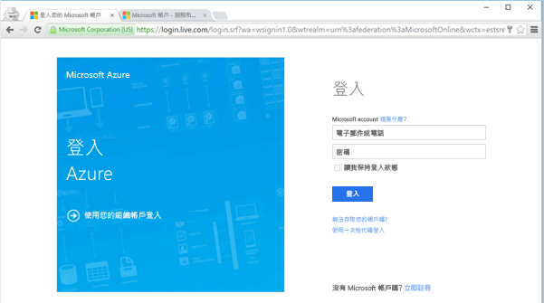

## 從服務產生的資料庫備份檢視最早的還原點

在本節的教學課程中，您可以從您資料庫的[服務產生的自動備份](sql-database-automated-backups.md)檢視最早還原點的相關資訊。 

1. 開啟您資料庫的 [SQL Database] 刀鋒視窗，**sqldbtutorialdb**。

   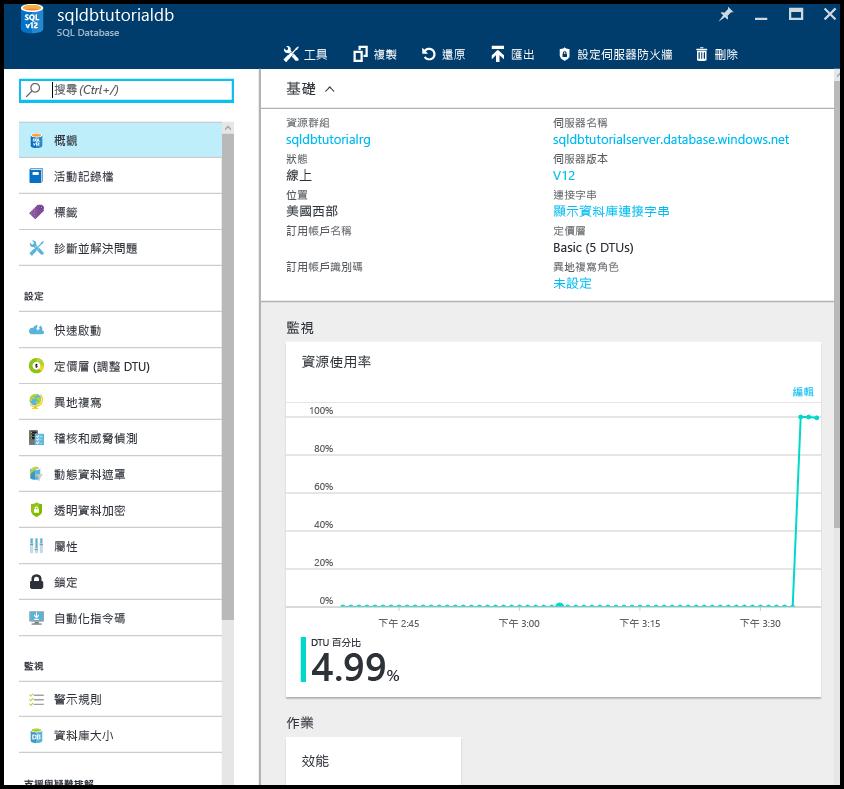

2. 在工具列上，按一下 [還原]。

   

3. 在 [還原] 刀鋒視窗中，檢閱最早的還原點。

   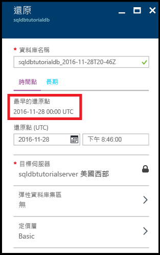

## 將資料庫還原至先前的時間點

在本節的教學課程中，您將資料庫還原到特定時間點的新資料庫。

1. 在資料庫的 [還原] 刀鋒視窗中，檢閱要用來還原資料庫至先前時間點 (名稱為現有資料庫名稱加上時間戳記) 之新資料庫的預設名稱。 這個名稱會變更以反映您在接下來幾個步驟中指定的時間。

   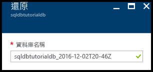

2. 按一下 [還原點 (UTC)] 輸入方塊中的 [行事曆] 圖示。

   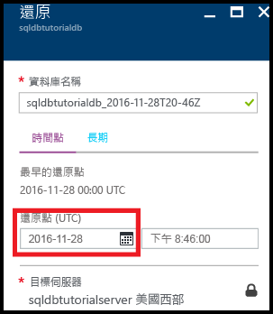

2. 在行事曆上，選取保留期限內的日期

   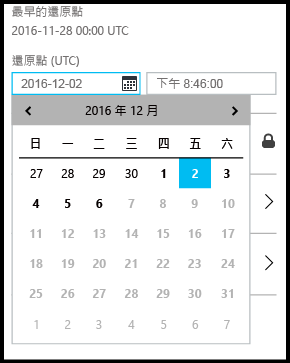

3. 在 [還原點 (UTC)] 輸入方塊中，指定您要從自動資料庫備份還原資料庫資料之選取日期上的時間。

   

   >[!NOTE]
   >請注意，資料庫名稱已變更，以反映您所選取的時間與日期。 另請注意，您無法變更您要還原至特定點之伺服器。 若要還原至不同的伺服器，請使用[異地還原](sql-database-disaster-recovery.md#recover-using-geo-restore)。 最後請注意，您可以還原至[彈性集區](sql-database-elastic-jobs-overview.md)或不同的定價層。 
   >

4. 按一下 [確定] 將您的資料庫還原到較早的時間點到新的資料庫。

5. 在工具列上，按一下 [通知] 圖示以檢視還原作業的狀態。

   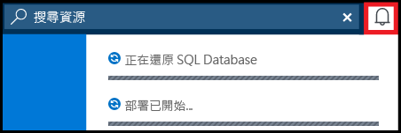

6. 完成還原作業之後，開啟 [SQL Database] 刀鋒視窗，以檢視剛還原的資料庫。

   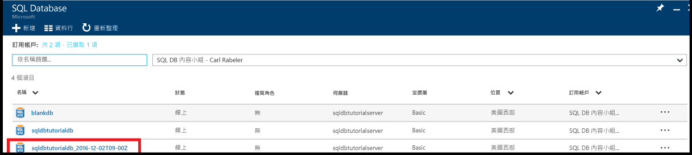

> [!NOTE]
> 從這裡開始，您可以使用 SQL Server Management Studio 連接到已還原的資料庫來執行所需的工作，例如[從還原的資料庫擷取一堆資料來複製到現有的資料庫，或刪除現有的資料庫，並將還原的資料庫重新命名為現有的資料庫名稱](sql-database-recovery-using-backups.md#point-in-time-restore)。
>

## 在 Azure 復原服務保存庫中設定自動備份的長期保留 

在本節的教學課程中，您會[設定 Azure 復原服務保存庫以保留自動備份](sql-database-long-term-retention.md)，時間較您服務層的保留期限長。 

> [!TIP]
> 若要刪除長期備份保留中的備份，請參閱[使用 PowerShell 來管理長期備份保留](sql-database-manage-long-term-backup-retention-powershell.md)。
>

1. 開啟您伺服器的 **SQL Server** 刀鋒視窗，**sqldbtutorialserver**。

   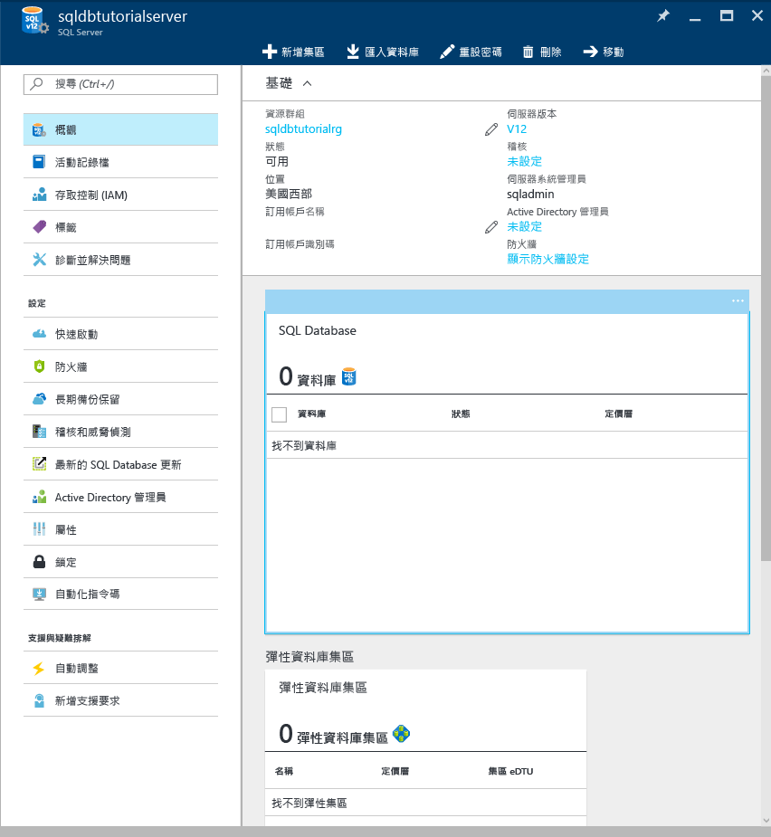

2. 按一下 [長期備份保留]。

   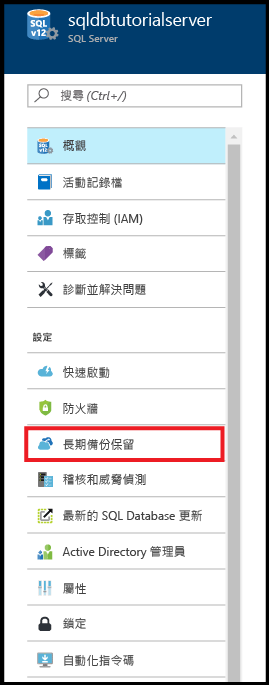

3. 在 [sqldbtutorial - 長期備份保留] 刀鋒視窗中，檢閱並接受預覽條款 (除非您已完成 - 或這項功能不再於預覽中)。

   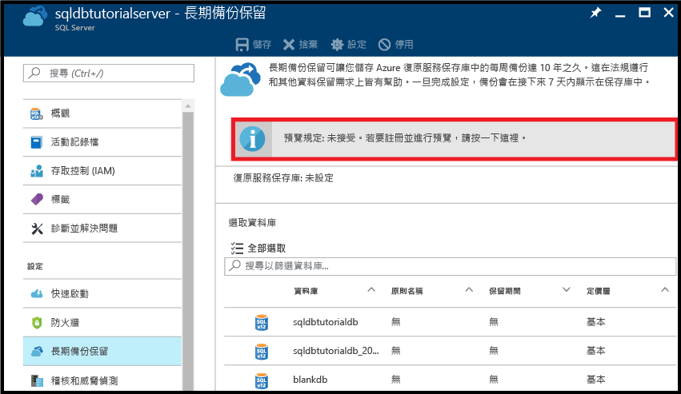

4. 要設定 sqldbtutorialdb 資料庫的長期備份保留時間，在方格中選取該資料庫，然後按一下工具列上的 [設定]。

   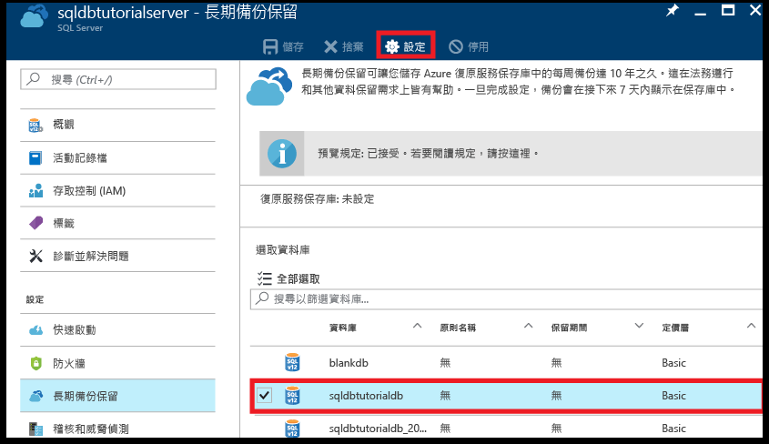

5. 在 [設定] 刀鋒視窗中，按一下 [復原服務保存庫] 下的 [設定所需設定]。

   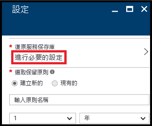

6. 在 [復原服務保存庫] 刀鋒視窗中，選取現有的保存庫 (若有)。 否則，如果找不到您訂用帳戶的復原服務保存庫，按一下以結束流程，並建立復原服務保存庫。

   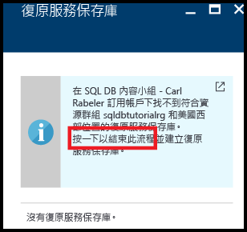

7. 在 [復原服務保存庫] 刀鋒視窗上，按一下 [新增]。

   
   
8. 在 [復原服務保存庫] 刀鋒視窗中，提供新復原服務保存庫的有效名稱。

   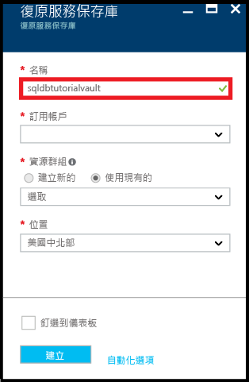

9. 選取您的訂用帳戶和資源群組，然後選取保存庫的位置。 完成時，按一下 [建立]。

   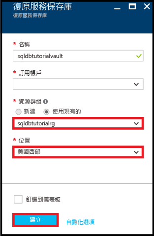

   > [!IMPORTANT]
   > 保存庫必須位於與 Azure SQL 邏輯伺服器相同的區域，而且必須使用相同的資源群組做為邏輯伺服器。
   >

10. 建立新的保存庫之後，執行必要的步驟以返回 [復原服務保存庫] 刀鋒視窗。

11. 在 [復原服務保存庫] 刀鋒視窗中，按一下保存庫，然後按一下 [選取]。

   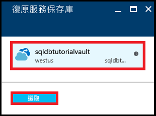

12. 在 [設定] 刀鋒視窗中，提供新保留原則的有效名稱、適當修改預設保留原則，然後按一下 [確定]。

   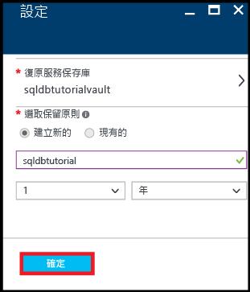

13. 在 [sqldbtutorial - 長期備份保留] 刀鋒視窗中，按一下 [儲存]，然後按一下 [確定]，將長期備份保留原則套用到所有選取的資料庫。

   

14. 按一下 [儲存] 以使用這個新的原則對您所設定的 Azure 復原服務保存庫啟用長期備份保留。

   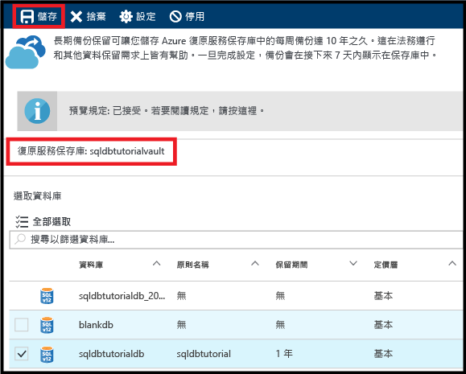

15. 在啟用長期備份保留之後，開啟 [sqldbtutorialvault] 刀鋒視窗 (移至 [所有資源]，並從您訂用帳戶的資源清單中選取)。

   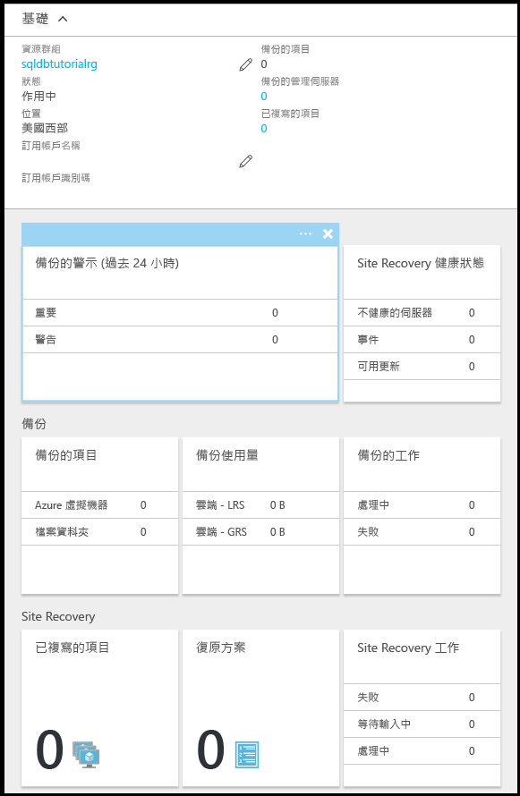

> [!IMPORTANT]
> 設定之後，備份會在接下來七天內顯示於保存庫中。 備份出現在保存庫之前，請勿繼續本教學課程。
>

## 在長期保留期限中檢視備份

在本節的教學課程中，您在[長期備份保留](sql-database-long-term-retention.md)中檢視您資料庫備份的相關資訊。 

1. 開啟 [sqldbtutorialvault]刀鋒視窗 (移至 [所有資源]，並從您訂用帳戶的資源清單中選取) 來檢視您保存庫中的資料庫備份所使用之儲存體數量。

   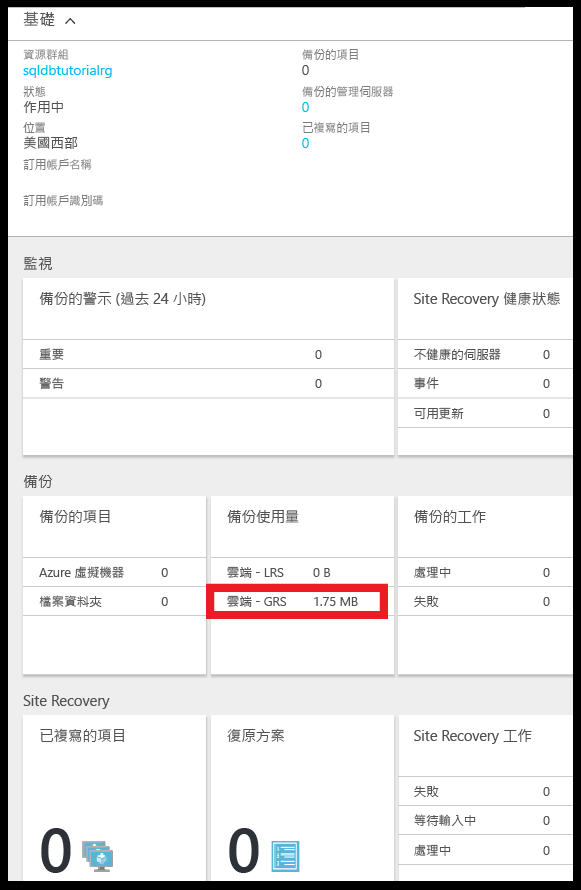

2. 開啟您資料庫的 [SQL Database] 刀鋒視窗，**sqldbtutorialdb**。

   

3. 在工具列上，按一下 [還原]。

   

4. 在 [還原] 刀鋒視窗中，按一下 [長期]。

5. 在 Azure 保存庫備份下，按一下 [選取備份]，在長期備份保留中檢視可用的資料庫備份。

   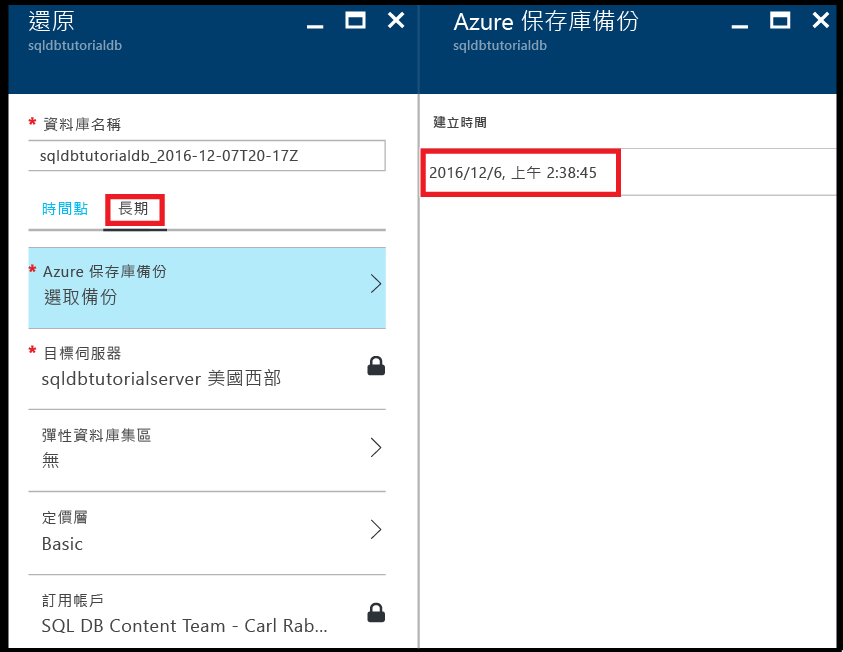

## 從長期備份保留備份中還原資料庫

在本節的教學課程中，您從 Azure 復原服務保存庫中的備份將資料庫還原到新的資料庫。

1. 在 [Azure 保存庫備份] 刀鋒視窗中，按一下要還原的備份，然後按一下 [選取]。

   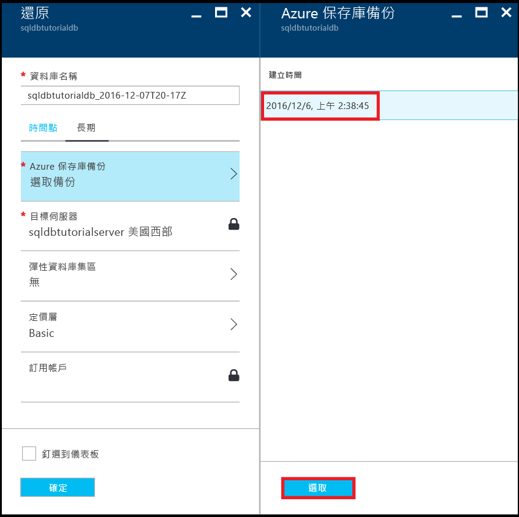

2. 在 [資料庫名稱] 文字方塊中，提供還原的資料庫名稱。

   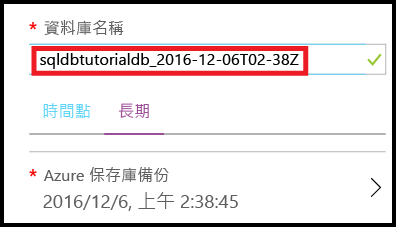

3. 按一下 [確定]，從保存庫中的備份將資料庫還原到新的資料庫。

4. 在工具列上，按一下 [通知] 圖示以檢視還原作業的狀態。

   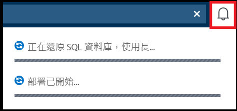

5. 完成還原作業之後，開啟 [SQL Database] 刀鋒視窗，以檢視剛還原的資料庫。

   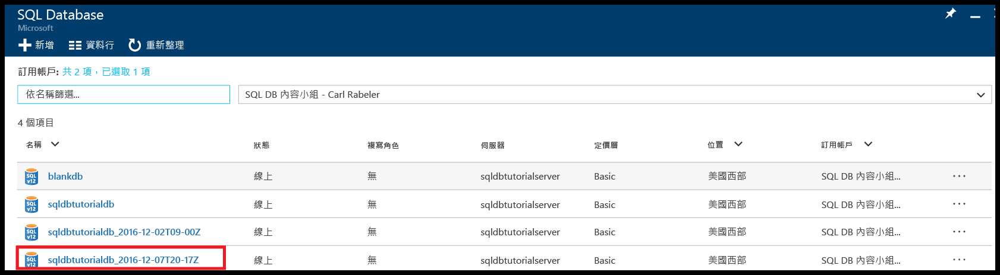

> [!NOTE]
> 從這裡開始，您可以使用 SQL Server Management Studio 連接到已還原的資料庫來執行所需的工作，例如[從還原的資料庫擷取一堆資料來複製到現有的資料庫，或刪除現有的資料庫，並將還原的資料庫重新命名為現有的資料庫名稱](sql-database-recovery-using-backups.md#point-in-time-restore)。
>

## 後續步驟

- 若要深入了解服務產生的自動備份，請參閱[自動備份](sql-database-automated-backups.md)
- 若要深入了解長期備份保留，請參閱[長期備份保留](sql-database-long-term-retention.md)
- 若要深入了解從備份還原，請參閱[從備份還原](sql-database-recovery-using-backups.md)

