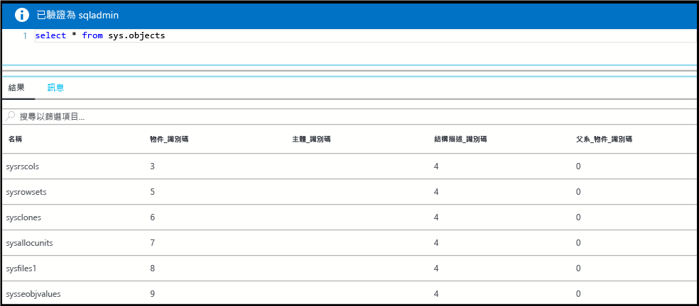

# <a name="create-and-query-a-single-azure-sql-database-in-the-azure-portal"></a>在 Azure 入口網站中建立和查詢單一 Azure SQL Database

您可以透過 Azure 入口網站建立 Azure SQL Database。 此方法可提供以瀏覽器為基礎的使用者介面，以便建立和設定 Azure SQL Database，以及所有相關的 Azure 資源。

## <a name="log-in-to-the-azure-portal"></a>登入 Azure 入口網站

登入 [Azure 入口網站](https://portal.azure.com/)。

## <a name="create-a-sql-database"></a>建立 SQL 資料庫

Azure SQL Database 會使用一組定義的[計算和儲存體資源](sql-database-service-tiers.md)建立。 此資料庫建立於 [Azure 資源群組](../azure-resource-manager/resource-group-overview.md)和 [Azure SQL Database 邏輯伺服器](sql-database-features.md)內。 

請遵循下列步驟來建立包含 Adventure Works LT 範例資料的 SQL Database。 

1. 按一下 Azure 入口網站左上角的 [新增] 按鈕。

2. 從 [新增] 頁面中選取 [資料庫]，然後從 [資料庫] 頁面中選取 [SQL Database]。

3. 在 SQL Database 表單中填入必要資訊︰ 
   - 資料庫名稱︰提供資料庫名稱
   - 訂用帳戶︰選取您的訂用帳戶
   - 資源群組︰選取新的或現有的
   - 來源︰選取 [範例 (AdventureWorksLT)]
   - 伺服器︰建立新的伺服器 (**伺服器**名稱必須是全域唯一的)
   - 彈性集區︰針對此快速入門選取 [現在不要]
   - 定價層：選取 [20 DTU] 和 [250] GB 的儲存體
   - 定序︰匯入範例資料庫時無法變更此值 
   - 釘選到儀表板︰選取此核取方塊

      

4. 完成時按一下 [建立]。 佈建需要幾分鐘的時間。
5. SQL Database 部署完成後，在儀表板上選取 [SQL Database] 或從左側功能表中選取 [SQL Database]，然後在 [SQL Database] 頁面上按一下新的資料庫。 資料庫的 [概觀] 頁面隨即開啟，其中會顯示完整伺服器名稱 (例如 **mynewserver20170313.database.windows.net**)，並提供進一步的組態選項。

       

## <a name="create-a-server-level-firewall-rule"></a>建立伺服器層級防火牆規則

SQL Database 服務會建立防火牆來防止外部應用程式和工具連線至您的伺服器和資料庫。 請遵循下列步驟來為您的 IP 位址建立 [SQL Database 伺服器層級防火牆規則](sql-database-firewall-configure.md)，以便讓外部連線能夠穿過 SQL Database 防火牆。 

1. 在資料庫的工具列上按一下 [設定伺服器防火牆]。 SQL Database 伺服器的 [防火牆設定] 頁面隨即開啟。 

       

2. 依據按一下工具列上的 [新增用戶端 IP] 和 [儲存]。 系統便會為目前的 IP 位址建立伺服器層級防火牆規則。

3. 依序按一下 [確定] 和 [X] 以關閉 [防火牆設定] 頁面。

您現在可以使用 SQL Server Management Studio 或您選擇的其他工具來連線至資料庫及其伺服器。

## <a name="query-the-sql-database"></a>查詢 SQL Database

請遵循下列步驟，在 Azure 入口網站中使用查詢編輯器來查詢資料庫。 

1. 在資料庫的 [SQL Database] 頁面上，按一下工具列上的 [工具]。 [查詢編輯器] 預覽頁面隨即開啟。

     ![[工具] 功能表](./media/sql-database-get-started/tools-menu.png) 

2. 依序按一下 [查詢編輯器 (預覽)]、[預覽條款] 核取方塊和 [確定]。 查詢編輯器隨即開啟。

3. 按一下 [登入]，然後在出現提示時選取 [SQL Server 驗證]，接著提供伺服器管理員登入和密碼。
4. 按一下 [確定] 以登入。

5. 通過驗證後，在查詢視窗中輸入您選擇的查詢，例如下列查詢：

   ```
   SELECT pc.Name as CategoryName, p.name as ProductName
   FROM SalesLT.ProductCategory pc
   JOIN SalesLT.Product p
   ON pc.productcategoryid = p.productcategoryid;
   ```

6. 按一下 [執行]，然後在 [結果] 窗格中檢閱查詢結果。

    

7. 按一下 [X] 關閉 [查詢編輯器] 頁面。

## <a name="clean-up-resources"></a>清除資源

這個集合中的**連線**快速入門與教學課程都是以本快速入門為基礎。 如果您打算繼續進行後續的快速入門或教學課程，請勿清除在此快速入門中建立的資源。 如果您不打算繼續，請使用下列步驟，在 Azure 入口網站中刪除本快速入門所建立的所有資源。

1. 從 Azure 入口網站的左側功能表中，依序按一下 [資源群組] 和 [myResourceGroup]。 
2. 在資源群組頁面上，按一下 [刪除]，在文字方塊中輸入 **myResourceGroup**，然後按一下 [刪除]。

## <a name="next-steps"></a>後續步驟

- 若要使用 SQL Server Management Studio 來連線和查詢，請參閱[使用 SSMS 連線及查詢](sql-database-connect-query-ssms.md)
- 若要使用 Visual Studio 來連線，請參閱[使用 Visual Studio 連線及查詢](sql-database-connect-query.md)。
- 如需 SQL Database 的技術概觀，請參閱[關於 SQL Database 服務](sql-database-technical-overview.md)。

