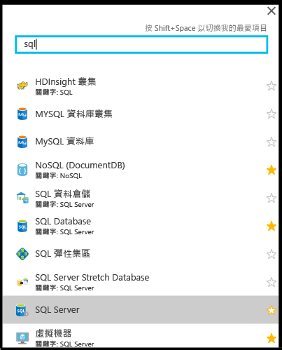
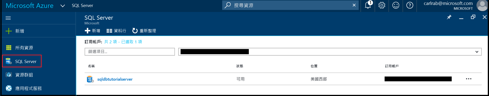
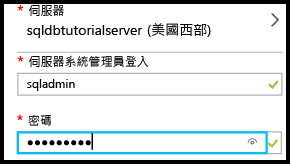
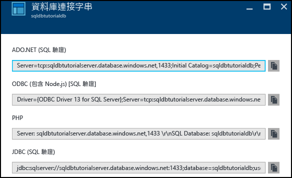
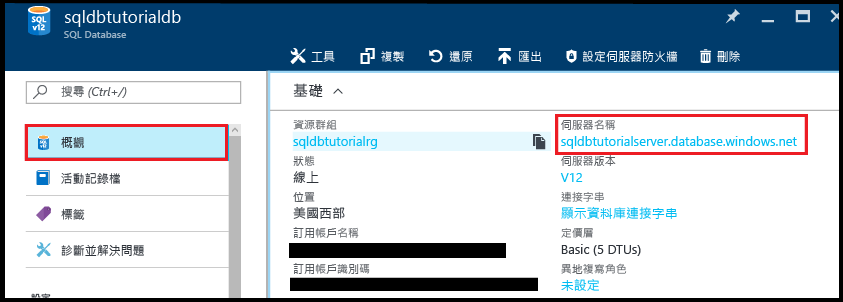
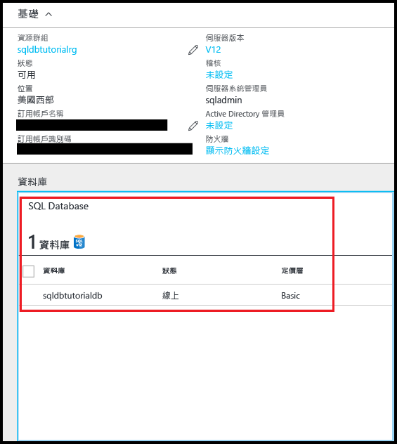

# <a name="quick-start-tutorial-your-first-azure-sql-database"></a>快速入門教學課程：您的第一個 Azure SQL Database

在本快速入門教學課程中，您可了解如何：

* [建立新的邏輯伺服器](sql-database-get-started.md#create-a-new-logical-sql-server) 
* [檢視邏輯伺服器屬性](sql-database-get-started.md#view-the-logical-server-properties) 
* [建立伺服器層級防火牆規則](sql-database-get-started.md#create-a-server-level-firewall-rule) 
* [使用 SSMS 連接到伺服器](sql-database-get-started.md#connect-to-the-server-with-ssms) 
* [使用範例資料建立資料庫](sql-database-get-started.md#create-a-database-with-sample-data) 
* [檢視資料庫屬性](sql-database-get-started.md#view-the-database-properties) 
* [在 Azure 入口網站中查詢資料庫](sql-database-get-started.md#query-the-database-in-the-azure-portal) 
* [使用 SSMS 連接和查詢資料庫](sql-database-get-started.md#connect-and-query-the-database-with-ssms) 
* [使用 SSMS 建立空白資料庫](sql-database-get-started.md#create-a-blank-database-with-ssms) 
* [針對連線問題進行疑難排解](sql-database-get-started.md#troubleshoot-connectivity) 
* [刪除資料庫](sql-database-get-started.md#delete-a-single-database) 


在本快速入門教學課程中，您會建立在 Azure 資源群組中執行並連接到邏輯伺服器的範例資料庫和空白資料庫。 您也會建立兩個伺服器層級防火牆規則，其設定為可啟用伺服器層級主體以從兩個指定的 IP 位址登入伺服器。 最後，您會學習如何在 Azure 入口網站查詢資料庫，以及如何使用 SQL Server Management Studio 進行連線和查詢。 

**時間估計**︰本教學課程需要大約 30 分鐘 (假設您已符合先決條件)。

> [!TIP]
> 您可以透過 [C#](sql-database-get-started-csharp.md) 或 [PowerShell](sql-database-get-started-powershell.md) 來執行相同的工作。
>

## <a name="prerequisites"></a>必要條件

* 您需要 Azure 帳戶。 您可以[申請免費 Azure 帳戶](/pricing/free-trial/?WT.mc_id=A261C142F)或[啟用 Visual Studio 訂閱者權益](/pricing/member-offers/msdn-benefits-details/?WT.mc_id=A261C142F)。 

* 您必須能夠利用屬於訂用帳戶擁有者或參與者角色成員的帳戶來連線 Azure 入口網站。 如需角色型存取控制 (RBAC) 的詳細資訊，請參閱[開始使用 Azure 入口網站中的存取管理](../active-directory/role-based-access-control-what-is.md)。

> [!NOTE]
> 本快速入門教學課程會協助您了解下列學習主題的內容︰[SQL Database 伺服器概觀](sql-database-server-overview.md)、[SQL Database 概觀](sql-database-overview.md)和 [Azure SQL Database 防火牆規則概觀](sql-database-firewall-configure.md)。
>  


### <a name="sign-in-to-the-azure-portal-with-your-azure-account"></a>使用您的 Azure 帳戶登入 Azure 入口網站
使用您的 [Azure 帳戶](https://account.windowsazure.com/Home/Index)，遵循下列步驟來連接到 Azure 入口網站。

1. 開啟您選擇的瀏覽器並連接到 [Azure 入口網站](https://portal.azure.com/)。
2. 登入 [Azure 入口網站](https://portal.azure.com/)。
3. 在 [登入]  頁面上，提供您訂用帳戶的認證。
   
   


<a name="create-logical-server-bk"></a>

## <a name="create-a-new-logical-sql-server"></a>建立新的邏輯 SQL Server

遵循此程序中的步驟，在您所選的區域中透過 Azure 入口網站建立新的邏輯伺服器。

1. 按一下 [新增]，接著鍵入 **sql server**，然後按一下 **Enter**。

    
2. 按一下 [SQL Server (邏輯伺服器)]。
   
    
3. 按一下 [建立] 以開啟新的 SQL Server (邏輯伺服器) 刀鋒視窗。

    
3. 在 [伺服器名稱] 文字方塊中，為新的邏輯伺服器提供有效名稱。 綠色核取記號指示您提供的名稱有效。
    
    

    > [!IMPORTANT]
    > 您的新伺服器完整名稱格式如下：<your_server_name>.database.windows.net。
    >
    
4. 在 [伺服器管理登入] 文字方塊中，為此伺服器提供用於 SQL 驗證登入的使用者名稱。 此登入就是所謂的伺服器主體登入。 綠色核取記號指示您提供的名稱有效。
    
    
5. 在 [密碼] 和 [確認密碼] 文字方塊中，提供伺服器主體登入帳戶的密碼。 綠色核取記號指示您提供的密碼有效。
    
    
6. 選取您有權限建立物件的訂用帳戶。

    
7. 在 [資源群組] 文字方塊中，選取 [建立新的]，接著在 [資源群組] 文字方塊中，為新的資源群組提供有效名稱 (如果您已為自己建立了一個資源群組，也可以使用現有的資源群組)。 綠色核取記號指示您提供的名稱有效。

    

8. 在 [位置] 文字方塊中，選取您的位置適用的資料中心 - 例如「澳大利亞東部」。
    
    
    
    > [!TIP]
    > [允許 Azure 服務存取伺服器] 核取方塊無法在此刀鋒視窗中變更。 您可以在伺服器防火牆刀鋒視窗上變更此設定。 如需詳細資訊，請參閱[安全性入門](sql-database-control-access-sql-authentication-get-started.md)。
    >
    
9. 按一下 [建立] 。

    

## <a name="view-the-logical-server-properties"></a>檢視邏輯伺服器屬性

遵循此程序中的步驟，透過 Azure 入口網站檢視伺服器屬性。 您需要完整的伺服器名稱，才能在後續程序中連接到這部伺服器。 

1. 在 Azure 入口網站中，按一下 [更多服務]。

    
2. 在 [篩選] 文字方塊中，鍵入 **SQL** 然後按一下 SQL Server 的星號，在 Azure 中將 SQL Server 指定為我的最愛。 

    
3. 在預設刀鋒視窗中，按一下 [SQL Server] 開啟您 Azure 訂閱中的 SQL Server 清單。 

    

4. 按一下新的 SQL Server 來檢視其在 Azure 入口網站中的屬性。 後續的教學課程可協助您了解此刀鋒視窗中可用的選項。

    
5. 在 [設定] 下，按一下 [屬性] 來檢視邏輯 SQL Server 的各種屬性。

    
6. 將完整的伺服器名稱複製到剪貼簿，以供稍後在本教學課程中使用。

    

## <a name="create-a-server-level-firewall-rule"></a>建立伺服器層級防火牆規則

遵循此程序中的步驟，透過 Azure 入口網站建立新的伺服器層級防火牆規則，可讓您在下一個程序中透過 SQL Server Management Studio 連接到您的伺服器。

1. 在 SQL Server 刀鋒視窗的 [設定] 下，按一下 [防火牆] 來開啟 SQL Server 的防火牆刀鋒視窗。

    

2. 按一下工具列上的 [新增用戶端 IP] 。

    

    > [!NOTE]
    > 您可以在伺服器上的 SQL Database 防火牆，針對單一 IP 位址或整個位址區段作開放。 開放防火牆可讓 SQL 系統管理員和使用者登入伺服器上，任何他們具備有效認證的資料庫。
    >

4. 按一下工具列上的 [儲存] 來儲存此項伺服器層級防火牆規則，然後按一下 [確定]。

    

## <a name="connect-to-the-server-with-ssms"></a>使用 SSMS 連接到伺服器

遵循此程序中的步驟，透過 SQL Server Management Studio 連接到 SQL 邏輯伺服器。

1. 如果您尚未這麼做，請下載並安裝最新版的 SSMS，位置是[下載 SQL Server Management Studio](https://msdn.microsoft.com/library/mt238290.aspx)。 為了保持最新狀態，最新版的 SSMS 會在有新版本可供下載時提示您。

2. 安裝之後，在 Windows 搜尋方塊中輸入 **Microsoft SQL Server Management Studio**，然後按一下 **Enter** 來開啟 SSMS：

    
3. 在 [連接到伺服器] 對話方塊中，輸入使用 SQL Server 驗證連接到 SQL Server 所需的資訊。

    
4. 按一下 [ **連接**]。

    
5. 在 [物件總管] 中，展開 [資料庫]，展開 [系統資料庫]，然後展開 [主要] 來檢視主要資料庫的物件。

    
6. 以滑鼠右鍵按一下 [主要] 然後按一下 [新增查詢]。

    

8. 在查詢視窗中，輸入下列查詢︰

   ```select * from sys.objects```

9.  在工具列上，按一下 [執行] 來傳回主要資料庫中所有系統物件的清單。

    

    > [!NOTE]
    > 若要瀏覽 SQL 安全性，請參閱 [SQL 安全性入門](sql-database-control-access-sql-authentication-get-started.md)
    >

## <a name="create-a-database-with-sample-data"></a>使用範例資料建立資料庫

遵循此程序中的步驟，經由 Azure 入口網站使用範例資料建立資料庫。 您建立的這個資料庫會附加至您先前建立的邏輯伺服器。 如果在您建立伺服器的區域中無法使用基本服務層，請刪除您的伺服器並在其他區域中予以重建。 如需刪除步驟，請參閱本教學課程中的最後一個程序。

1. 在 Azure 入口網站中，按一下預設刀鋒視窗中的 [SQL Database]。

    
2. 在 SQL Database 刀鋒視窗中，按一下 [新增]。

    
3. 在 SQL Database 刀鋒視窗中，檢閱已完成的資訊。

    
4. 請提供有效的資料庫名稱。

    
5. 在 [選取來源] 下，按一下 [範例]，然後在 [選取範例] 下，按一下 [AdventureWorksLT [V12]]。
   
    
6. 在 [伺服器] 下，提供伺服器系統管理員登入使用者名稱和密碼。

    

    > [!NOTE]
    > 將資料庫加入至伺服器時，可以新增為單一資料庫 (這是預設值) 或新增至彈性集區。 如需有關彈性集區的詳細資訊，請參閱[彈性集區](sql-database-elastic-pool.md)。
    >

7. 在 [定價層] 下，將定價層變更為 [基本] (如有需要，您可以稍後增加定價層，但基於學習的目的，我們建議您使用最低成本層)。

    
8. 按一下 [建立] 。

    

## <a name="view-the-database-properties"></a>檢視資料庫屬性

遵循此程序中的步驟，透過 Azure 入口網站查詢資料庫。

1. 在 SQL Database 刀鋒視窗中，按一下新的資料庫以檢視其在 Azure 入口網站內的屬性。 後續的教學課程可協助您了解此刀鋒視窗中可用的選項。 

    
2. 按一下 [屬性] 來檢視您資料庫的其他資訊。

    

3. 按一下 [顯示資料庫連接字串]。

    
4. 按一下 [概觀]，然後在基本功能窗格中按一下您的伺服器名稱。
    
    
5. 在您的伺服器基本功能窗格中，查看新加入的資料庫。

    

## <a name="query-the-database-in-the-azure-portal"></a>在 Azure 入口網站中查詢資料庫

遵循此程序中的步驟，透過 Azure 入口網站中的查詢編輯器來查詢資料庫。 查詢會顯示資料庫中的物件。

1. 在 [SQL Database] 刀鋒視窗中，按一下工具列上的 [工具]。

    
2. 在 [工具] 刀鋒視窗上，按一下 [查詢編輯器 (預覽)]。

    
3. 按一下核取方塊，確認查詢編輯器是預覽功能，然後按一下 [確定]。
4. 在 [查詢編輯器] 刀鋒視窗中，按一下 [登入]。

    
5. 檢閱授權類型和登入，然後提供此登入的密碼。 

    
6. 按一下 [確定] 以嘗試登入。
7. 當您收到登入錯誤 (指出您的用戶端 IP 位址沒有防火牆規則，所以您的用戶端沒有登入權限) 時，請複製錯誤視窗中的用戶端 IP 位址，並在此資料庫的 [SQL Server] 刀鋒視窗中，建立伺服器層級防火牆規則。

    
8. 重複先前的 6 個步驟，登入您的資料庫。
9. 經過驗證後，在查詢視窗中輸入下列查詢︰

   ```select * from sys.objects```

    
10.  按一下 **[執行]**。
11. 在 [結果] 窗格中檢閱查詢結果。

    

## <a name="connect-and-query-the-database-with-ssms"></a>使用 SSMS 連接和查詢資料庫

遵循此程序中的步驟，透過 SQL Server Management Studio 連接到資料庫，然後查詢範例資料以檢視資料庫中的物件。

1. 切換至 SQL Server Management Studio，並在 [物件總管] 中按一下 [資料庫]，然後按一下工具列上的 [重新整理] 來檢視範例資料庫。

    
2. 在 [物件總管] 中，展開您的新資料庫來檢視其物件。

    
3. 以滑鼠右鍵按一下您的範例資料庫，然後按一下 [新增查詢]。

    
4. 在查詢視窗中，輸入下列查詢︰

   ```select * from sys.objects```
   
9.  在工具列上，按一下 [執行] 來傳回範例資料庫中所有系統物件的清單。

    

## <a name="create-a-blank-database-with-ssms"></a>使用 SSMS 建立空白資料庫

遵循此程序中的步驟，透過 SQL Server Management Studio 在邏輯伺服器上建立新資料庫。

1. 在 [物件總管] 中，以滑鼠右鍵按一下 [資料庫] 然後按一下 [新增資料庫]。

    

    > [!NOTE]
    > 您也可以讓 SSMS 為您建立資料庫指令碼，進而透過 Transact-SQL 建立新的資料庫。
    >

2. 在 [新增資料庫] 對話方塊中，在資料庫名稱文字方塊中提供資料庫名稱。 

    

3. 在 [新增資料庫] 對話方塊中，按一下 [選項]，然後將版本變更為 [基本]。

    

    > [!TIP]
    > 檢閱此對話方塊中，您可以為 Azure SQL Database 修改的其他選項。 如需這些選項的詳細資訊，請參閱[建立資料庫](https://msdn.microsoft.com/library/dn268335.aspx)。
    >

4. 按一下 [確定] 以建立空白資料庫。
5. 完成時，在物件總管中重新整理資料庫節點，以便檢視新建立的空白資料庫。 

    

## <a name="troubleshoot-connectivity"></a>針對連線問題進行疑難排解

> [!IMPORTANT]
> 如果您有連線問題，請參閱[連線問題](sql-database-troubleshoot-common-connection-issues.md)。
> 

## <a name="delete-a-single-database"></a>刪除單一資料庫

遵循此程序中的步驟，透過 Azure 入口網站刪除單一資料庫。

1. 在 Azure 入口網站中您的 SQL Database 的刀鋒視窗上，按一下 [刪除]。

    
2. 按一下 [是] 確認要永久刪除此資料庫。

    

> [!TIP]
> 您的資料庫的保留期內，您可以從服務起始的自動備份還原資料庫。 針對基本版的資料庫，您可以在七天內進行還原。 然而，不要刪除伺服器。 如果您這樣做，就無法復原伺服器或任何已刪除的資料庫。 如需資料庫備份的詳細資訊，請參閱[深入了解 SQL Database 備份](sql-database-automated-backups.md)，而如需從備份還原資料庫的相關資訊，請參閱[資料庫復原](sql-database-recovery-using-backups.md)。 如需還原已刪除資料庫的作法文章，請參閱[還原已刪除的 Azure SQL Database - Azure 入口網站](sql-database-restore-deleted-database-portal.md)。
>


## <a name="next-steps"></a>後續步驟
現在您已經完成本教學課程，您或許有興趣探索其他教學課程，來建置在本教學課程中已學習到的內容。 

- 如需 SQL Server 驗證的入門教學課程，請參閱 [SQL 驗證和授權](sql-database-control-access-sql-authentication-get-started.md)
- 如需 Azure Active Directory 驗證的入門教學課程，請參閱 [ AAD 驗證和授權](sql-database-control-access-aad-authentication-get-started.md)
* 如果您想要查詢 Azure 入口網站中的範例資料庫，請參閱[公用預覽︰適用於 SQL 資料庫的互動式查詢經驗](https://azure.microsoft.com/en-us/updates/azure-sql-database-public-preview-t-sql-editor/)
* 如果您熟悉 Excel，請了解如何 [在 Azure 中使用 Excel 連接至 SQL Database](sql-database-connect-excel.md)。
* 如果您準備好開始撰寫程式碼，請在 [SQL Database 和 SQL Server 的連線庫](sql-database-libraries.md)選擇您的程式語言。
* 如果您想要將內部部署的 SQL Server 資料庫移動至 Azure，請參閱 [將資料庫移轉至 SQL Database](sql-database-cloud-migrate.md)。
* 如果您想要透過 BCP 命令列工具，將某些資料從 CSV 檔案載入新資料表，請參閱[透過 BCP 將資料從 CSV 檔案載入 SQL Database](sql-database-load-from-csv-with-bcp.md)。
* 如果您想要開始建立資料表和其他物件，請參閱[建立資料表](https://msdn.microsoft.com/library/ms365315.aspx)中的「建立資料表」主題。

## <a name="additional-resources"></a>其他資源

- 如需技術概觀，請參閱[什麼是 SQL Database？](sql-database-technical-overview.md)
- 如需價格資訊，請參閱 [Azure SQL Database 價格](https://azure.microsoft.com/pricing/details/sql-database/)。


<!--HONumber=Feb17_HO2-->


