# SQL Database 教學課程：使用 Azure 入口網站在幾分鐘內建立 SQL Database
> [!div class="op_single_selector"]
> * [Azure 入口網站](sql-database-get-started.md)
> * [C#](sql-database-get-started-csharp.md)
> * [PowerShell](sql-database-get-started-powershell.md)
> 
> 

在本教學課程裡，您將學習如何使用 Azure 入口網站來：

* 使用範例資料建立 Azure SQL Database。
* 針對單一 IP 位址或某個 IP 位址範圍，建立伺服器層級防火牆規則。

您可以使用 [C#](sql-database-get-started-csharp.md) 或 [PowerShell](sql-database-get-started-powershell.md) 來執行相同的工作。

[!INCLUDE [Login](../../includes/azure-getting-started-portal-login.md)]

## 建立您的第一個 Azure SQL Database
1. 如果目前未連線，請連線到 [Azure 入口網站](http://portal.azure.com)。
2. 依序按一下 [新增] 和 [資料 + 儲存體]，然後找出 [SQL Database]。
   
    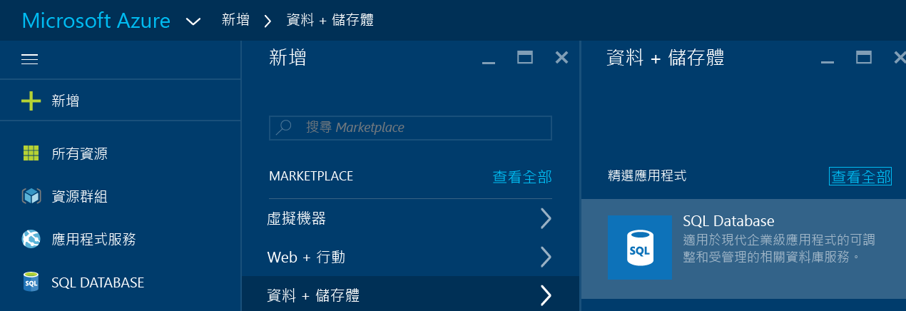
3. 按一下 [SQL Database]  來開啟 [SQL Database] 刀鋒視窗。 此刀鋒視窗上的內容會視您的訂用帳戶和您現有的物件 (例如現有的伺服器) 數目而定。
   
    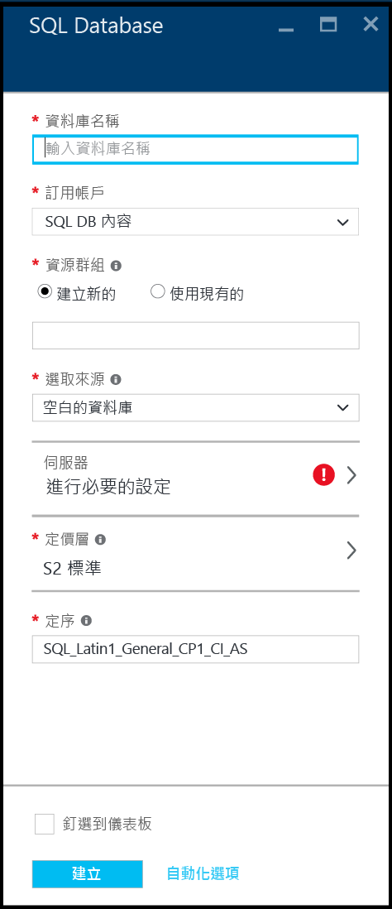
4. 在 [資料庫名稱]  文字方塊中，提供您第一個資料庫的名稱 - 例如 "my-database"。 綠色核取記號指示您提供的名稱有效。
   
    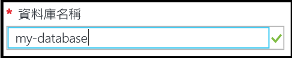
5. 如果您有多個訂用帳戶，請選取一個訂用帳戶。
6. 在 [資源群組] 底下，按一下 [新建] 並提供您第一個資源群組的名稱 - 例如 "my-resource-group"。 綠色核取記號指示您提供的名稱有效。
   
    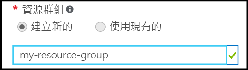
7. 在 [選取來源] 底下，按一下 [範例]，然後在 [選取範例] 底下，按一下 [AdventureWorksLT [V12]]。
   
    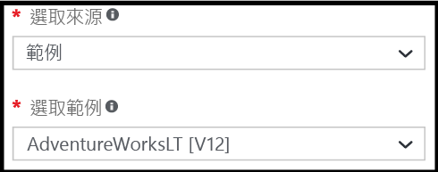
8. 在 [伺服器] 底下，按一下 [設定必要設定]。
   
    
9. 在 [伺服器] 刀鋒視窗中，按一下 [建立新的伺服器] 。 就會在伺服器物件 (可以是一個新的伺服器或現有的伺服器) 中建立一個 Azure SQL Database。
   
    
10. 檢閱 [新增伺服器]  刀鋒視窗來了解您需要為新伺服器提供哪些資訊。
    
    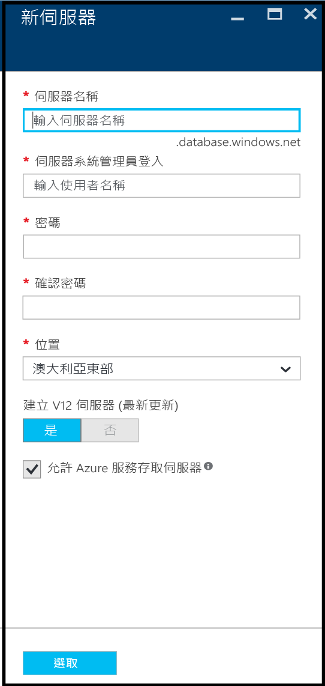
11. 在 [伺服器名稱]  文字方塊中，提供您第一個伺服器的名稱 - 例如 "my-new-server-object"。 綠色核取記號指示您提供的名稱有效。
    
    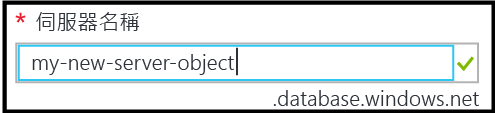
12. 在 [伺服器管理登入] 底下，為此伺服器提供用於系統管理員登入的使用者名稱 - 例如 "my-admin-account"。 此登入就是所謂的伺服器主體登入。 綠色核取記號指示您提供的名稱有效。
    
    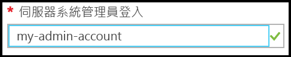
13. 在 [密碼] 和 [確認密碼] 底下，提供伺服器主體登入帳戶的密碼 - 例如 "p@ssw0rd1".。綠色核取記號指示您提供的密碼有效。
    
    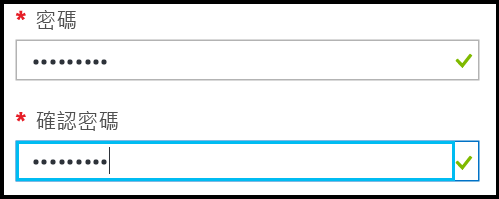
14. 在 [位置] 底下，選取您的位置適用的資料中心 - 例如「澳大利亞東部」。
    
    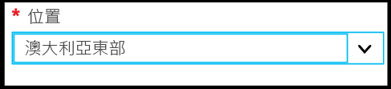
15. 請注意，在 [建立 V12 伺服器 (最新更新)] 底下，您只有建立目前版本 Azure SQL 伺服器的選項。
    
    
16. 請注意，已預設選取 [允許 Azure 服務存取伺服器]  核取方塊，且無法在這裡變更。 這是進階選項。 您可以在此伺服器物件的伺服器防火牆設定中變更此設定，不過在大部分情況下並不需要這樣做。
    
    
17. 在 [新增伺服器] 刀鋒視窗中，檢閱您選取的項目，然後按一下 [選取]  來選取這個新的伺服器作為您的新資料庫。
    
    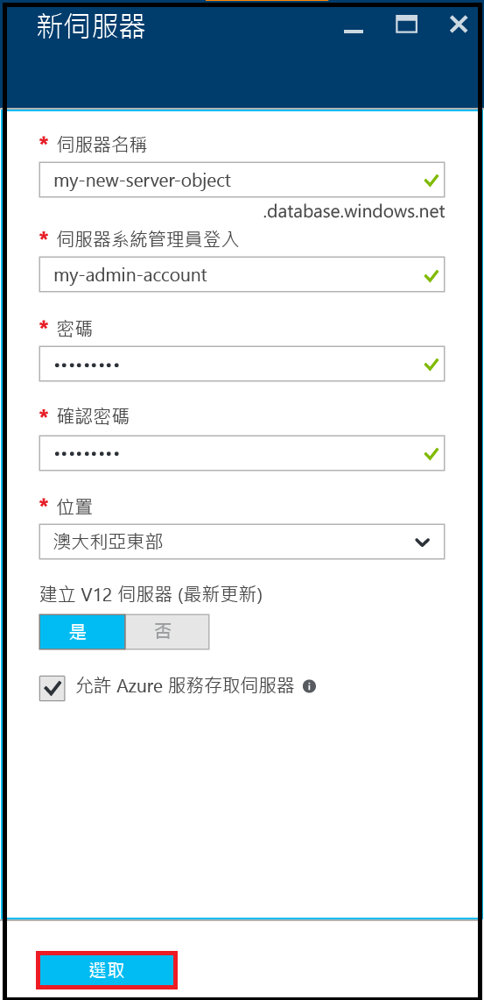
18. 在 [SQL Database] 刀鋒視窗中的 [定價層] 底下，按一下 [S2 標準]，然後按一下 [基本] 來為您的第一個資料庫選擇價格最低的定價層。 您永遠可以在之後變更定價層。
    
    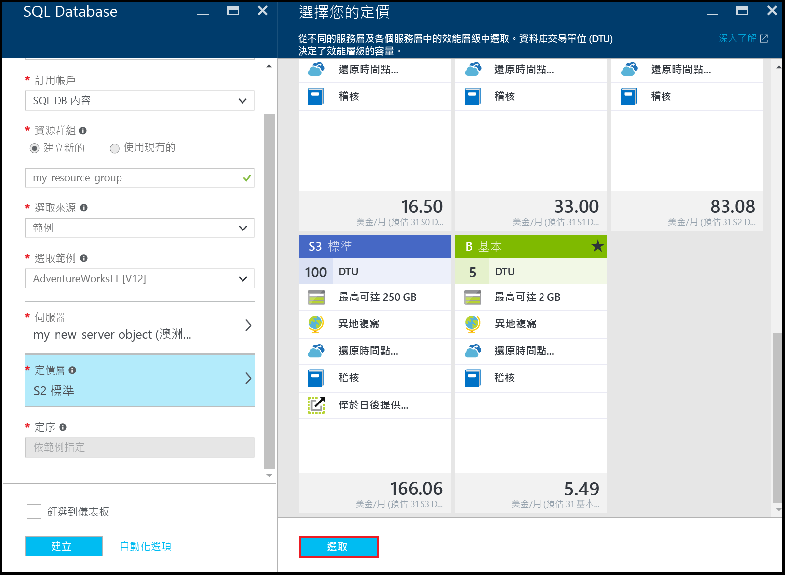
19. 在 [SQL Database] 刀鋒視窗中，檢閱您選取的項目，然後按一下 [建立]  來建立您的第一個伺服器和資料庫。 您提供的值會被驗證並且會開始部署。
    
    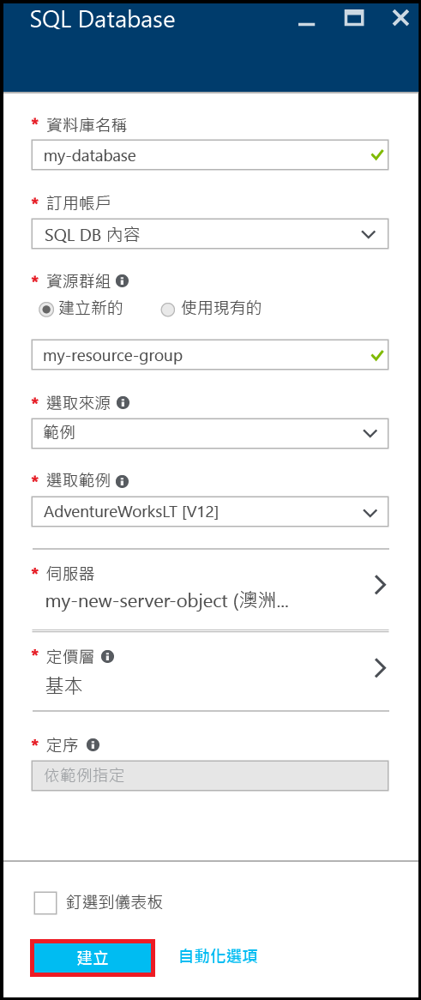
20. 在入口網站工具列中，按一下 [通知]  項目來檢查部署的狀態。
    
    

> [!IMPORTANT]
> 當部署完成時，就會在 Azure 中建立您的新 Azure SQL 伺服器和資料庫。 在您針對來自 Azure 外部的連線建立伺服器防火牆規則，以開啟 SQL Database 防火牆之前，您將無法使用 SQL 伺服器工具連線至您的新伺服器或資料庫。
> 
> 

[!INCLUDE [Create server firewall rule](../../includes/sql-database-create-new-server-firewall-portal.md)]

## 後續步驟
現在您已完成本 SQL Database 教學課程並建立有一些範例資料的資料庫，您可以準備開始使用慣用的工具進行探索。

* 如果您熟悉 Transact-SQL 和 SQL Server Management Studio (SSMS)，請了解如何 [使用 SSMS 連接和查詢 SQL Database](sql-database-connect-query-ssms.md)。
* 如果您熟悉 Excel，請了解如何 [在 Azure 中使用 Excel 連接至 SQL Database](sql-database-connect-excel.md)。
* 如果您準備好開始撰寫程式碼，請在 [SQL Database 和 SQL Server 的連線庫](sql-database-libraries.md)選擇您的程式語言。
* 如果您想要進一步了解如何將內部部署的 SQL Server 資料庫移動至 Azure，請參閱 [將資料庫移轉至 SQL Database](sql-database-cloud-migrate.md) 。
* 如果您想要使用 BCP 命令列工具將某些資料從 CSV 檔案載入新資料表，請參閱 [使用 BCP 將資料從 CSV 檔案載入 SQL Database](sql-database-load-from-csv-with-bcp.md)。
* 如果您想要探索 Azure SQL Database 安全性，請參閱 [安全性入門](sql-database-get-started-security.md)

## 其他資源
[什麼是 SQL Database？](sql-database-technical-overview.md)

<!--HONumber=Nov16_HO2-->

