# <a name="create-connect-to-and-query-your-first-azure-sql-databases-in-the-azure-portal-and-using-ssms"></a>在 Azure 入口網站中和使用 SSMS 建立、連接和查詢第一個 Azure SQL 資料庫

在本教學課程中，您將了解如何在 Azure 入口網站中和使用 SQL Server Management Studio，以建立、連接和查詢 Azure SQL 資料庫。 完成本教學課程之後，您將會：

* 已建立一個資源群組，內含邏輯伺服器、伺服器層級防火牆規則和兩個資料庫。
* 了解如何在 Azure 入口網站中和使用 SQL Server Management Studio，以檢視伺服器和資料庫屬性。
* 了解如何在 Azure 入口網站中和使用 SQL Server Management Studio 來查詢資料庫。

**時間估計**︰本教學課程需要大約 30 分鐘 (假設您已符合先決條件)。

> [!TIP]
> 您也可以了解如何使用 [PowerShell](sql-database-get-started-powershell.md) 或 [C#](sql-database-get-started-csharp.md)，以建立、連接和查詢 Azure SQL 資料庫。
>

> [!NOTE]
> 本教學課程會協助您了解下列學習主題的內容︰[SQL Database 伺服器概觀](sql-database-server-overview.md)、[SQL Database 概觀](sql-database-overview.md)和 [Azure SQL Database 防火牆規則概觀](sql-database-firewall-configure.md)。 如需了解 SQL Database 服務的概觀，請參閱[什麼是 SQL Database？](sql-database-technical-overview.md)。
>  

## <a name="prerequisites"></a>必要條件

* **Azure 帳戶**。 您可以[申請免費 Azure 帳戶](https://azure.microsoft.com/free/)或[啟用 Visual Studio 訂閱者權益](https://azure.microsoft.com/pricing/member-offers/msdn-benefits/)。 

* **Azure 建立權限**。 您必須能夠利用屬於訂用帳戶擁有者或參與者角色成員的帳戶來連線 Azure 入口網站。 如需角色型存取控制 (RBAC) 的詳細資訊，請參閱[開始使用 Azure 入口網站中的存取管理](../active-directory/role-based-access-control-what-is.md)。

* **SQL Server Management Studio**。 您可以從[下載 SQL Server Management Studio](https://msdn.microsoft.com/library/mt238290.aspx) 下載和安裝最新版的 SQL Server Management Studio (SSMS)。 因為新的功能會持續不斷地推出，當您連接到 Azure SQL Database，務必使用最新版的 SSMS。

### <a name="sign-in-to-the-azure-portal"></a>登入 Azure 入口網站

此程序中的步驟示範如何使用您的 [Azure 帳戶](https://account.windowsazure.com/Home/Index)連接到 Azure 入口網站。

1. 開啟您選擇的瀏覽器並連接到 [Azure 入口網站](https://portal.azure.com/)。
2. 登入 [Azure 入口網站](https://portal.azure.com/)。
3. 在 [登入]  頁面上，提供您訂用帳戶的認證。
   
   


<a name="create-logical-server-bk"></a>

## <a name="create-a-new-logical-sql-server"></a>建立新的邏輯 SQL Server

此程序中的步驟示範如何透過 Azure 入口網站，在您選擇的區域中建立新的邏輯伺服器。 邏輯伺服器是您可以在其中建立 SQL 資料庫的物件，也是您可以在其中建立防火牆規則的物件，以允許使用者透過 Azure SQL Database 防火牆來連接。 

1. 按一下 [新增]，接著鍵入 **sql server**，然後按一下 **Enter**。

    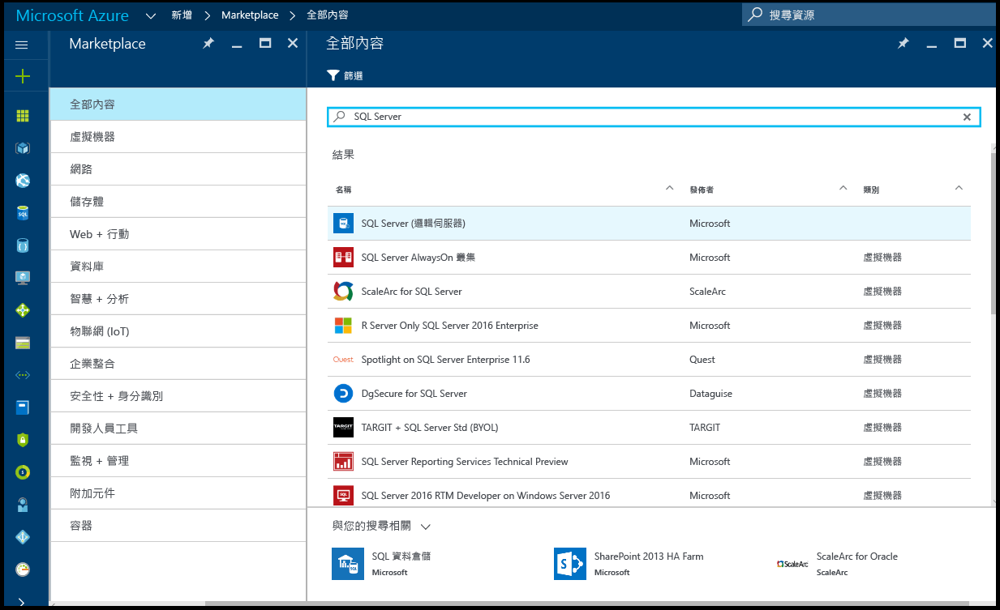
2. 按一下 [SQL Server (邏輯伺服器)]。
   
    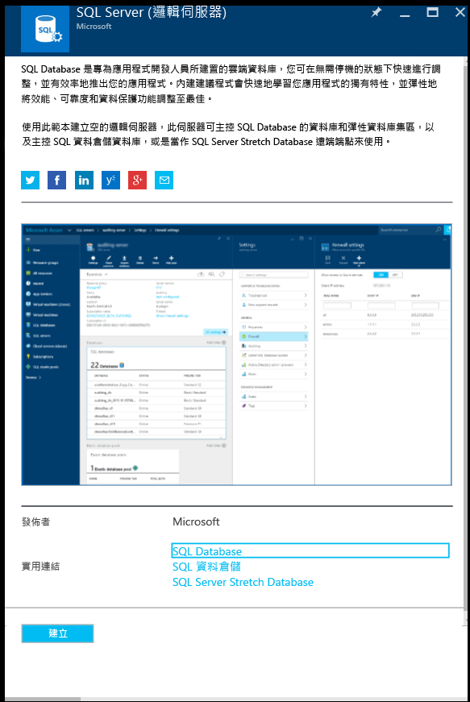
3. 按一下 [建立]，開啟新的 SQL Server (邏輯伺服器) 專用刀鋒視窗。

    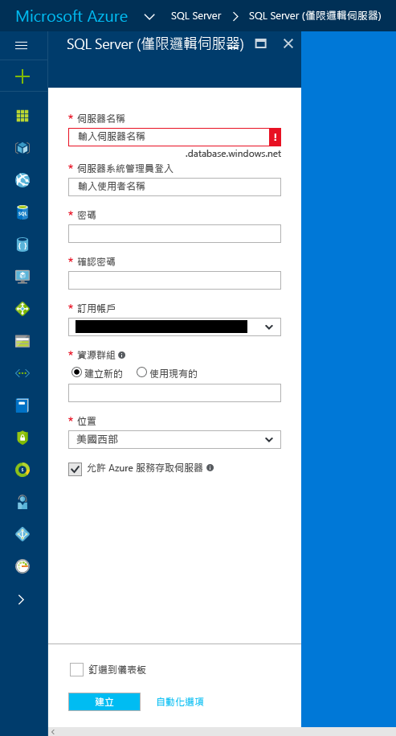
3. 在 [伺服器名稱] 文字方塊中，為新的邏輯伺服器提供有效名稱。 綠色核取記號指示您提供的名稱有效。
    
    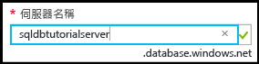

    > [!IMPORTANT]
    > 新伺服器的完整名稱必須是全域唯一，且格式為：**<your_server_name>.database.windows.net**。 稍後在本教學課程中，您會使用這個完整伺服器名稱連接到伺服器和資料庫。
    >
    
4. 在 [伺服器管理登入] 文字方塊中，為此伺服器提供用於 SQL 驗證登入的使用者名稱。 此登入稱為伺服器主體登入。 綠色核取記號指示您提供的名稱有效。
    
    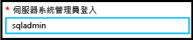
5. 在 [密碼] 和 [確認密碼] 文字方塊中，提供伺服器主體登入帳戶的密碼。 綠色核取記號指示您提供的密碼有效。
    
    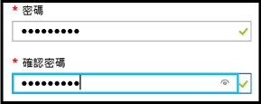
6. 在 [訂用帳戶] 下拉式清單方塊中，選取您有權限建立物件的訂用帳戶。

    
7. 在 [資源群組] 文字方塊中，選取 [新建]，然後為新的資源群組提供有效名稱。 綠色核取記號指示您提供的名稱有效。

    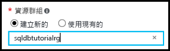

8. 在 [位置] 文字方塊中，選取要在其中建立邏輯伺服器的資料中心。
    
    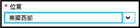
    
    > [!TIP]
    > [允許 Azure 服務存取伺服器] 核取方塊無法在此刀鋒視窗中變更。 您可以在伺服器防火牆刀鋒視窗上變更此設定。 如需詳細資訊，請參閱[安全性入門](sql-database-control-access-sql-authentication-get-started.md)。
    >
    
9. 選取 [釘選到儀表板] 核取方塊。

10. 按一下 [建立]，將這個指令碼部署至 Azure，以建立您的邏輯伺服器。

    

11. 建立您的伺服器之後，檢閱依預設顯示的伺服器屬性。 

    
12. 按一下 [屬性]，檢視您的邏輯 SQL Server 的其他屬性。

    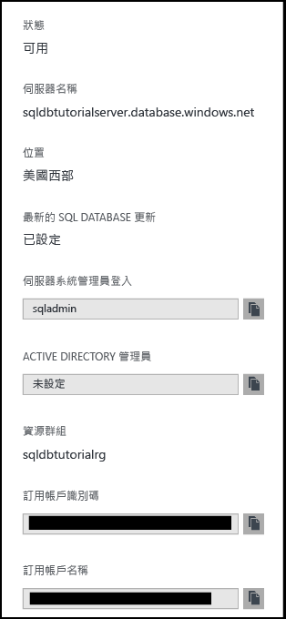
13. 將完整的伺服器名稱複製到剪貼簿，以供稍後在本教學課程中使用。

    

## <a name="create-a-server-level-firewall-rule"></a>建立伺服器層級防火牆規則

此程序中的步驟示範如何在 Azure 入口網站中建立伺服器層級的防火牆規則。 根據預設，Azure SQL Database 防火牆會防止外部連接至您的邏輯伺服器和其資料庫。 若要能夠連接到您的伺服器，您需要在下一個程序中，為您連接時的來源電腦 IP 位址建立防火牆規則。 如需詳細資訊，請參閱 [Azure SQL Database 防火牆規則概觀](sql-database-firewall-configure.md)。

1. 在 SQL Server 刀鋒視窗中，按一下 [防火牆]，開啟伺服器的 [防火牆] 刀鋒視窗。 請注意，顯示的是用戶端電腦的 IP 位址。

    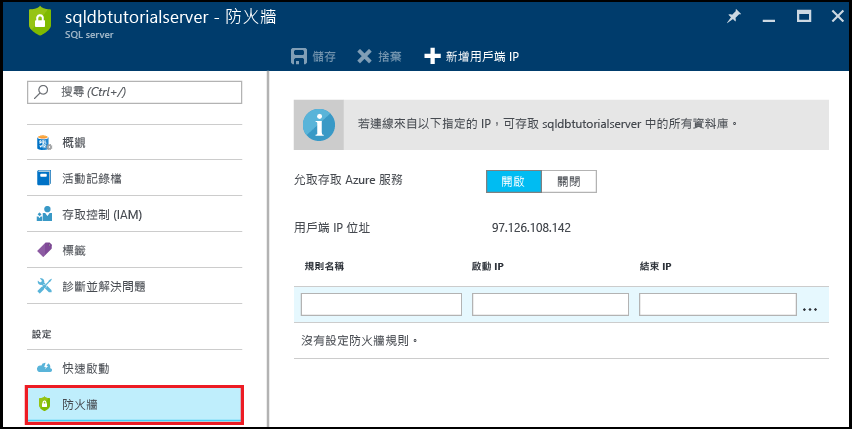

2. 按一下工具列上的 [新增用戶端 IP]，為您目前的 IP 位址建立防火牆規則。

    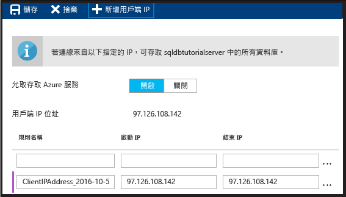

    > [!NOTE]
    > 您可以針對單一 IP 位址或整個位址範圍，建立防火牆規則。 開放防火牆可讓 SQL 系統管理員和使用者登入伺服器上，任何他們具備有效認證的資料庫。
    >

4. 按一下工具列上的 [儲存]，儲存此伺服器層級防火牆規則，然後按一下 [確定]，關閉 [成功] 對話方塊。

    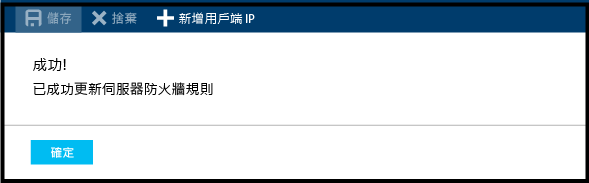

## <a name="connect-to-the-server-with-ssms"></a>使用 SSMS 連接到伺服器

此程序中的步驟示範如何使用 SQL Server Management Studio 連接到 SQL 邏輯伺服器。 SSMS 是 DBA 用來管理 SQL 伺服器和資料庫的主要工具。

1. 開啟 SQL Server Management Studio (在 Windows 搜尋方塊中，輸入 **Microsoft SQL Server Management Studio**，然後按一下 **Enter** 來開啟 SSMS)。

    
3. 在 [連接到伺服器] 對話方塊中，輸入前一個程序中的完整伺服器名稱，選取 [SQL Server 驗證]，然後提供您在建佈伺服器期間指定的登入和密碼。

    
4. 按一下 [連線]，起始連線並在 SSMS 中開啟 [物件總管]。

    
5. 在 [物件總管] 中，展開 [資料庫]，展開 [系統資料庫]，然後展開 [主要] 來檢視主要資料庫的物件。

    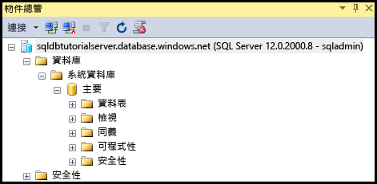
6. 以滑鼠右鍵按一下 [主要] 然後按一下 [新增查詢]。

    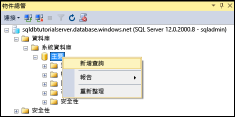

8. 在查詢視窗中，輸入下列查詢︰

   ```select * from sys.objects```

9.  在工具列上，按一下 [執行] 來傳回主要資料庫中所有系統物件的清單。

    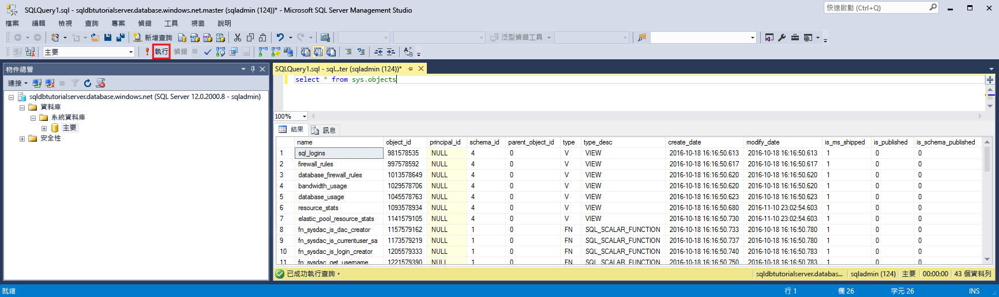

    > [!NOTE]
    > 若要開始使用 SQL 安全性，請參閱[開始使用 SQL 驗證](sql-database-control-access-sql-authentication-get-started.md)
    >

## <a name="create-a-database-with-sample-data"></a>使用範例資料建立資料庫

此程序中的步驟示範如何在您先前建立的邏輯伺服器相關聯的 Azure 入口網站中，使用範例資料建立資料庫。 

1. 在 Azure 入口網站中，按一下預設刀鋒視窗中的 [SQL Database]。

    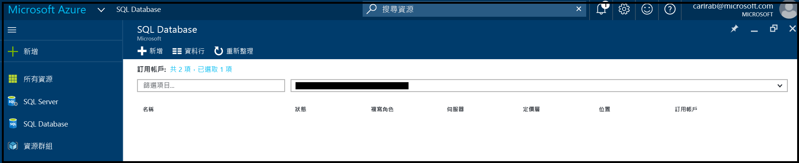
2. 在 SQL Database 刀鋒視窗中，按一下 [新增]。 

    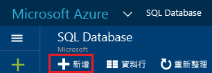

    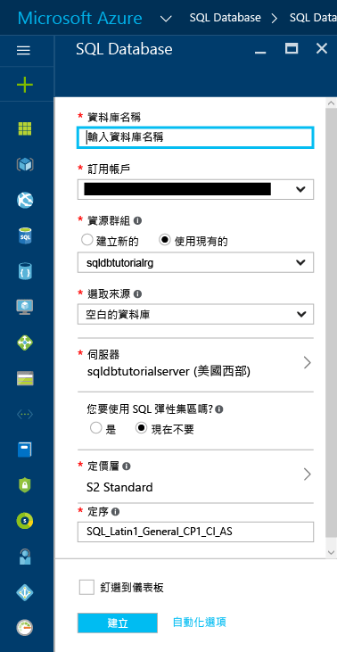
3. 在 [資料庫名稱] 文字方塊中，提供有效的資料庫名稱。

    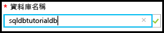
4. 在 [選取來源] 中，選取 [範例 (AdventureWorksLT)]。
   
    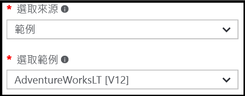
5. 在 [伺服器] 中，確認已選取您的伺服器。 也請注意，將資料庫新增至伺服器時，可以新增為單一資料庫 (這是預設值) 或新增至彈性集區。 如需有關彈性集區的詳細資訊，請參閱[彈性集區](sql-database-elastic-pool.md)。

6. 在 [定價層] 中，將定價層變更為 [基本]，然後按一下 [選取]。 未來想要的話，您可以提高定價層，但基於學習的目的，我們建議您使用最低成本層。

    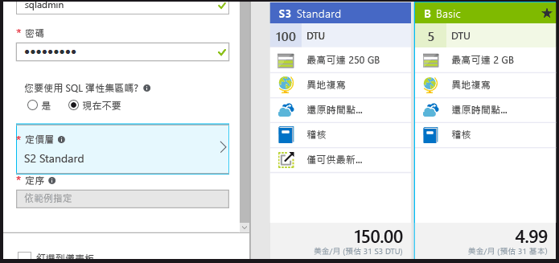
7. 選取 [釘選到儀表板] 核取方塊，然後按一下 [建立]。

    

8. 建立資料庫之後，在 Azure 入口網站中檢視其屬性。 後續的教學課程可協助您了解此刀鋒視窗中可用的選項。 

    

## <a name="query-the-database-in-the-azure-portal"></a>在 Azure 入口網站中查詢資料庫

此程序中的步驟示範如何直接在 Azure 入口網站中查詢資料庫。 

1. 在 [SQL Database] 刀鋒視窗中，按一下工具列上的 [工具]。

    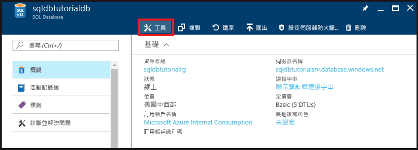
2. 在 [工具] 刀鋒視窗上，按一下 [查詢編輯器 (預覽)]。

    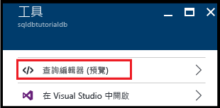
3. 按一下核取方塊，確認查詢編輯器是預覽功能，然後按一下 [確定]。
4. 在 [查詢編輯器] 刀鋒視窗中，按一下 [登入]。

    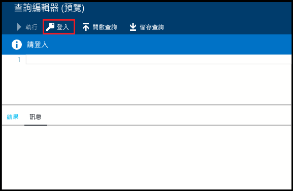
5. 檢閱授權類型和登入，然後提供此登入的密碼。 

    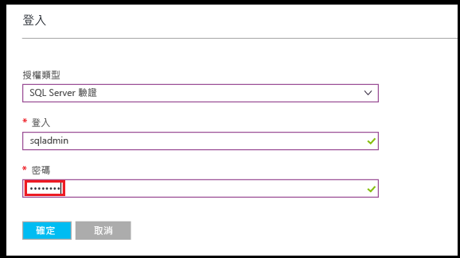
6. 按一下 [確定] 以嘗試登入。
7. 經過驗證後，在查詢視窗中輸入下列查詢，然後按一下 [執行]。

   ```select * from sys.objects```

    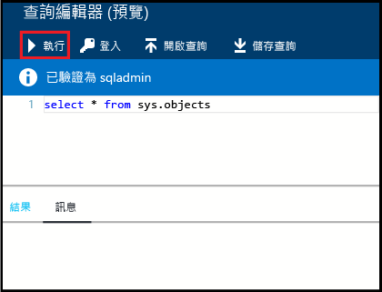

8. 在 [結果] 窗格中檢閱查詢結果。

    

## <a name="query-the-database-with-ssms"></a>使用 SSMS 查詢資料庫

此程序中的步驟示範如何用 SQL Server Management Studio 連接到資料庫，然後查詢範例資料，以檢視資料庫中的物件。

1. 切換至 SQL Server Management Studio，並在 [物件總管] 中按一下 [資料庫]，然後按一下工具列上的 [重新整理] 來檢視範例資料庫。

    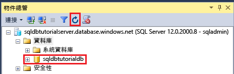
2. 在 [物件總管] 中，展開您的新資料庫來檢視其物件。

    
3. 以滑鼠右鍵按一下您的範例資料庫，然後按一下 [新增查詢]。

    
4. 在查詢視窗中，輸入下列查詢︰

   ```select * from sys.objects```
   
9.  在工具列上，按一下 [執行] 來傳回範例資料庫中所有系統物件的清單。

    

## <a name="create-a-blank-database-with-ssms"></a>使用 SSMS 建立空白資料庫

此程序中的步驟示範如何使用 SQL Server Management Studio 連接到新的資料庫。

1. 在 [物件總管] 中，以滑鼠右鍵按一下 [資料庫] 然後按一下 [新增資料庫]。

    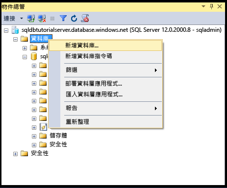

2. 在 [新增資料庫] 對話方塊中，在 [資料庫名稱] 文字方塊中提供資料庫名稱。 

    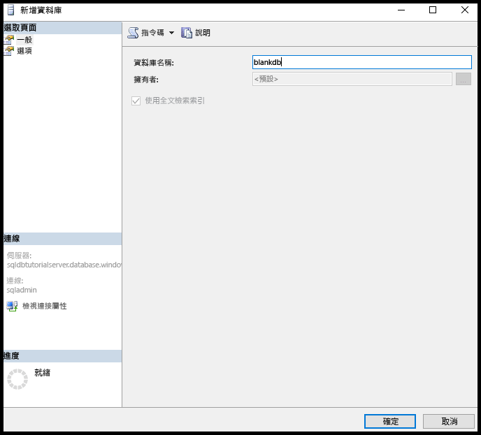

3. 在 [新增資料庫] 對話方塊中，按一下 [選項]，然後將版本變更為 [基本]。

    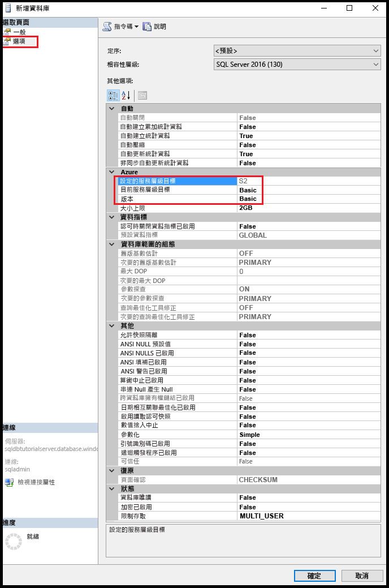

    > [!TIP]
    > 檢閱此對話方塊中，您可以為 Azure SQL Database 修改的其他選項。 如需這些選項的詳細資訊，請參閱[建立資料庫](https://msdn.microsoft.com/library/dn268335.aspx)。
    >

4. 按一下 [確定] 以建立空白資料庫。
5. 完成時，在物件總管中重新整理資料庫節點，以便檢視新建立的空白資料庫。 

    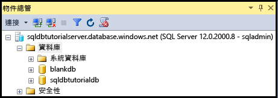

## <a name="troubleshoot-connectivity"></a>針對連線問題進行疑難排解

Azure SQL Database 的連線失敗時，您會收到錯誤訊息。 連線問題可能起因於 SQL Azure 資料庫重新設定、防火牆設定、連線逾時或不正確的登入資訊。 有關連線能力問題疑難排解工具，請參閱[針對 Microsoft Azure SQL Database 的連線能力問題進行疑難排解](https://support.microsoft.com/help/10085/troubleshooting-connectivity-issues-with-microsoft-azure-sql-database)。

## <a name="delete-a-single-database-in-the-azure-portal"></a>在 Azure 入口網站中刪除單一資料庫

此程序中的步驟示範如何透過 Azure 入口網站刪除單一資料庫。

1. 在 Azure 入口網站的 [SQL 資料庫] 刀鋒視窗上，按一下您要刪除的資料庫。 
2.  針對您的 SQL 資料庫，按一下 [刪除]。

    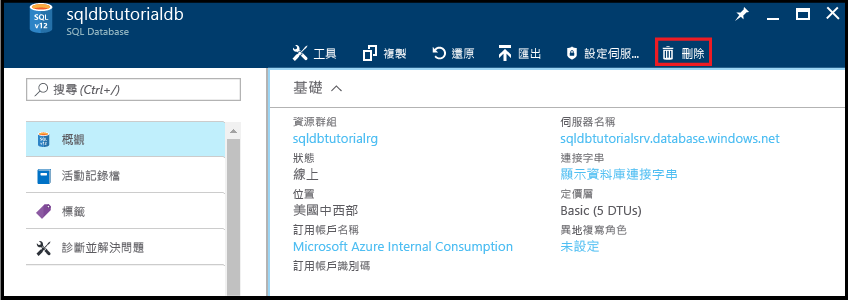
2. 按一下 [是] 確認要永久刪除此資料庫。

    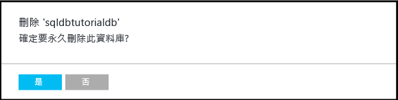

> [!TIP]
> 在資料庫的保留期內，您可以從服務起始的自動備份還原資料庫 (前提是您未刪除伺服器本身)。 針對基本版的資料庫，您可以在七天內進行還原。 至於其他所有版本，您可以在 35 天內進行還原。 如果您刪除伺服器本身，就無法復原伺服器或任何已刪除的資料庫。 如需資料庫備份的詳細資訊，請參閱[深入了解 SQL Database 備份](sql-database-automated-backups.md)，而如需從備份還原資料庫的相關資訊，請參閱[資料庫復原](sql-database-recovery-using-backups.md)。 如需還原已刪除資料庫的作法文章，請參閱[還原已刪除的 Azure SQL Database - Azure 入口網站](sql-database-restore-deleted-database-portal.md)。
>


## <a name="next-steps"></a>後續步驟
現在您已經完成本教學課程，您或許有興趣探索其他教學課程，來建置在本教學課程中已學習到的內容。 

- 如需 SQL Server 驗證的入門教學課程，請參閱 [SQL 驗證和授權](sql-database-control-access-sql-authentication-get-started.md)
- 如需 Azure Active Directory 驗證的入門教學課程，請參閱 [ AAD 驗證和授權](sql-database-control-access-aad-authentication-get-started.md)
* 如果您想要查詢 Azure 入口網站中的範例資料庫，請參閱[公用預覽︰適用於 SQL 資料庫的互動式查詢經驗](https://azure.microsoft.com/updates/azure-sql-database-public-preview-t-sql-editor/)
* 如果您熟悉 Excel，請了解如何 [在 Azure 中使用 Excel 連接至 SQL Database](sql-database-connect-excel.md)。
* 如果您準備好開始撰寫程式碼，請在 [SQL Database 和 SQL Server 的連線庫](sql-database-libraries.md)選擇您的程式語言。
* 如果您想要將內部部署的 SQL Server 資料庫移動至 Azure，請參閱 [將資料庫移轉至 SQL Database](sql-database-cloud-migrate.md)。
* 如果您想要透過 BCP 命令列工具，將某些資料從 CSV 檔案載入新資料表，請參閱[透過 BCP 將資料從 CSV 檔案載入 SQL Database](sql-database-load-from-csv-with-bcp.md)。
* 如果您想要開始建立資料表和其他物件，請參閱[建立資料表](https://msdn.microsoft.com/library/ms365315.aspx)中的「建立資料表」主題。

## <a name="additional-resources"></a>其他資源

- 如需技術概觀，請參閱[什麼是 SQL Database？](sql-database-technical-overview.md)
- 如需價格資訊，請參閱 [Azure SQL Database 價格](https://azure.microsoft.com/pricing/details/sql-database/)。


