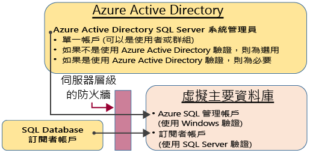
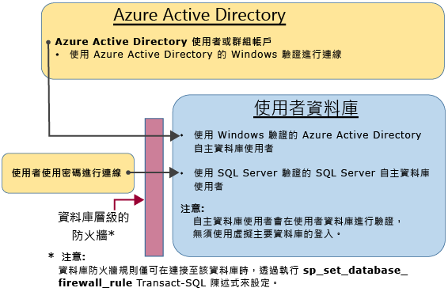

# SQL Database 驗證和授權：授與存取
> [!div class="op_single_selector"]
> * [開始使用教學課程](sql-database-get-started-security.md)
> * [授與存取權](sql-database-manage-logins.md)
> 
> 

從這裡開始系統管理員、非系統管理員和角色的 SQL Database 存取概念。

## 不受限制的系統管理帳戶
有兩個可能的系統管理帳戶具有不受限制的權限，可以存取虛擬 master 資料庫和所有使用者資料庫。這些帳戶稱為伺服器層級主體帳戶。

### Azure SQL Database 訂戶帳戶
建立名為 SQL Database 訂戶帳戶的邏輯 SQL 執行個體時，會建立單一登入帳戶。此帳戶會使用 SQL Server 驗證 (使用者名稱和密碼) 連接。此帳戶是邏輯伺服器執行個體和附加至該執行個體之所有使用者資料庫的系統管理員。無法限制訂戶帳戶的權限。只有其中一個帳戶可以存在。

### Azure Active Directory 系統管理員
一個 Azure Active Directory 帳戶也可以設定為系統管理員。此帳戶可以是個別的 Azure AD 使用者，或可以是包含數個 Azure AD 使用者的 Azure AD 群組。選擇性地設定 Azure AD 系統管理員，但是如果您想要使用 Azure AD 帳戶的 Windows 驗證來連接到 SQL Database，則必須設定 Azure AD 系統管理員。如需有關設定 Azure Active Directory 存取權的詳細資訊，請參閱[使用 Azure Active Directory 驗證連線到 SQL Database 或 SQL 資料倉儲](sql-database-aad-authentication.md)和[適用於與 SQL Database 和 SQL 資料倉儲搭配使用之 Azure AD MFA 的 SSMS 支援](sql-database-ssms-mfa-authentication.md)。

### 設定防火牆
已設定伺服器層級防火牆時，「Azure SQL Database 訂閱者帳戶」和 Azure Active Directory 帳戶能夠連接到主要資料庫和所有使用者資料庫。伺服器層級防火牆可以透過入口網站來設定。建立連線之後，也可以藉由使用 [sp\_set\_firewall\_rule](https://msdn.microsoft.com/library/dn270017.aspx) Transact-SQL 陳述式來設定其他伺服器層級防火牆規則。如需有關設定防火牆的詳細資訊，請參閱 [做法：使用 Azure 入口網站設定 Azure SQL Database 防火牆](sql-database-configure-firewall-settings.md)。

### 系統管理員存取路徑
伺服器層級防火牆設定正確時，SQL Database 訂戶帳戶和 Azure Active Directory SQL Server 系統管理員可以使用用戶端工具 (例如 SQL Server Management Studio 或 SQL Server Data Tools) 來連接。只有最新的工具會提供所有的功能。下圖顯示兩個系統管理員帳戶的一般組態。

在伺服器層級防火牆中使用開啟的連接埠時，系統管理員可以連接到任何 SQL Database。

### 使用 SQL Server Management Studio 連接到資料庫
如需使用 SQL Server Management Studio 進行連線的逐步解說，請參閱 [使用 SQL Server Management Studio 連接到 SQL Database 並執行範例 T-SQL 查詢](sql-database-connect-query-ssms.md)。

> [!IMPORTANT]
> 建議您一律使用最新版本的 Management Studio 保持與 Microsoft Azure 及 SQL Database 更新同步。[更新 SQL Server Management Studio](https://msdn.microsoft.com/library/mt238290.aspx)。
> 
> 

## 其他的特殊帳戶
SQL Database 在虛擬 master 資料庫中提供兩個限制的系統管理角色，可以將使用者帳戶新增至該資料庫。

### 資料庫建立者
系統管理帳戶可以建立新的資料庫。若要建立可以建立資料庫的其他帳戶，您必須在 master 資料庫中建立使用者，然後將該使用者新增至特殊的 **dbmanager** 資料庫角色。使用者可以是自主資料庫使用者，或依據虛擬 master 資料庫中的 SQL Server 登入的使用者。

1. 使用系統管理員帳戶，連接至虛擬 master 資料庫。
2. 選擇性步驟︰使用 [CREATE LOGIN](https://msdn.microsoft.com/library/ms189751.aspx) 陳述式來建立 SQL Server 驗證登入。範例陳述式︰
   
   ```
   CREATE LOGIN Mary WITH PASSWORD = '<strong_password>';
   ```
   
   > [!NOTE]
   > 建立登入或自主資料庫使用者時，請使用強式密碼。如需詳細資訊，請參閱[增強式密碼](https://msdn.microsoft.com/library/ms161962.aspx)。
   > 
   > 
   
   為了改進效能，系統會暫時在資料庫層級快取登入 (伺服器層級主體)。若要重新整理驗證快取，請參閱 [DBCC FLUSHAUTHCACHE](https://msdn.microsoft.com/library/mt627793.aspx)。
3. 在虛擬 master 資料庫中，藉由使用 [CREATE USER](https://msdn.microsoft.com/library/ms173463.aspx) 陳述式來建立使用者。使用者可以是 Azure Active Directory 驗證自主資料庫使用者 (如果您已針對 Azure AD 驗證設定您的環境)，或 SQL Server 驗證自主資料庫使用者，或根據 SQL Server 驗證登入 (在上一個步驟中建立) 的 SQL Server 驗證使用者。 範例陳述式︰
   
   ```
   CREATE USER [mike@contoso.com] FROM EXTERNAL PROVIDER;
   CREATE USER Tran WITH PASSWORD = '<strong_password>';
   CREATE USER Mary FROM LOGIN Mary; 
   ```
4. 藉由使用 [ALTER ROLE](https://msdn.microsoft.com/library/ms189775.aspx) 陳述式，將新的使用者新增至 **dbmanager** 資料庫角色。範例陳述式︰
   
   ```
   ALTER ROLE dbmanager ADD MEMBER Mary; 
   ALTER ROLE dbmanager ADD MEMBER [mike@contoso.com];
   ```
   
   > [!NOTE]
   > dbmanager 是虛擬 master 資料庫中的資料庫角色，因此您只可以將使用者新增至 dbmanager 角色。您無法將伺服器層級登入新增至資料庫層級角色。
   > 
   > 
5. 必要時，設定伺服器層級防火牆以允許新的使用者連接。

現在使用者可以連接至虛擬 master 資料庫，而且可以建立新的資料庫。建立資料庫的帳戶會成為資料庫的擁有者。

### 登入管理員
如果您想要的話，可以完成相同的步驟 (建立登入和使用者，並將使用者新增至 **loginmanager** 角色)，讓使用者能夠在虛擬 master 資料庫中建立新的登入。通常並不需要這麼做，因為 Microsoft 建議使用自主資料庫使用者，這會在資料庫層級進行驗證，而不是根據登入來使用使用者。如需詳細資訊，請參閱[自主資料庫使用者 - 讓資料庫具有可攜性](https://msdn.microsoft.com/library/ff929188.aspx)。

## 非系統管理員的使用者
一般而言，非系統管理員帳戶不需要虛擬 master 資料庫的存取權。請使用 [CREATE USER (Transact-SQL)](https://msdn.microsoft.com/library/ms173463.aspx) 陳述式，在資料庫層級建立自主資料庫使用者。使用者可以是 Azure Active Directory 驗證自主資料庫使用者 (如果您已針對 Azure AD 驗證設定您的環境)，或 SQL Server 驗證自主資料庫使用者，或根據 SQL Server 驗證登入 (在上一個步驟中建立) 的 SQL Server 驗證使用者。 如需詳細資訊，請參閱[自主資料庫使用者 - 讓資料庫具有可攜性](https://msdn.microsoft.com/library/ff929188.aspx)。

若要建立使用者，請連線到資料庫，然後執行類似以下範例的陳述式︰

```
CREATE USER Mary FROM LOGIN Mary; 
CREATE USER [mike@contoso.com] FROM EXTERNAL PROVIDER;
```

一開始，只有其中一個系統管理員或資料庫擁有者可以建立使用者。若要授權讓其他使用者建立新的使用者，請授與該選取的使用者 `ALTER ANY USER` 權限，例如使用下列陳述式︰

```
GRANT ALTER ANY USER TO Mary;
```

若要將資料庫的完整控制權提供給其他使用者，請使用 `ALTER ROLE` 陳述式，讓他們成為 **db\_owner** 固定資料庫角色的成員。

> [!NOTE]
> 之所以要根據登入建立資料庫使用者，主要是為了應付有 SQL Server 驗證使用者需要存取多個資料庫的情況。根據登入的使用者會繫結至登入，只會針對該登入維護一個密碼。在個別資料庫中的自主資料庫使用者是個別的實體，而且各個都會維護它自己的密碼。如果它們不會維護各自的密碼相同，會造成自主資料庫使用者的混淆。
> 
> 

### 設定資料庫層級防火牆規則
最佳做法是，非系統管理員的使用者應該只能透過防火牆來存取所使用的資料庫。做法是不透過伺服器層級防火牆授權其 IP 位址來讓他們存取所有資料庫，而是改用 [sp\_set\_database\_firewall\_rule](https://msdn.microsoft.com/library/dn270010.aspx) 陳述式來設定資料庫層級防火牆。無法藉由使用入口網站設定資料庫層級防火牆。

### 非系統管理員存取路徑
當資料庫層級防火牆設定正確時，資料庫使用者可以使用如 SQL Server Management Studio 或 SQL Server Data Tools 之類的用戶端工具來連接。只有最新的工具會提供所有的功能。下圖顯示一個典型的非系統管理員存取途徑。

## 群組和角色
有效率存取管理會使用指派給群組和角色的權限，而不是指派給個別使用者的權限。例如，當使用 Azure Active Directory 驗證時：

* 將 Azure Active Directory 使用者放入 Azure Active Directory 群組。建立群組的自主資料庫使用者。將一或多個資料庫使用者放入資料庫角色。然後將權限指派給資料庫角色。

當使用 SQL Server 驗證時：

* 在資料庫中建立自主資料庫使用者。將一或多個資料庫使用者放入資料庫角色。然後將權限指派給資料庫角色。

資料庫角色可以是內建的角色，例如 **db\_owner**、**db\_ddladmin**、**db\_datawriter**、**db\_datareader**、**db\_denydatawriter** 和 **db\_denydatareader**。**db\_owner** 通常是用來將完整權限授與少數幾個使用者。其他固定的資料庫角色適用於快速開發簡單的資料庫，但不建議用於大多數實際執行資料庫。例如，**db\_datareader** 固定資料庫角色可授與資料庫中每個資料表的讀取存取權，這通常並非絕對必要。最好是使用 [CREATE ROLE](https://msdn.microsoft.com/library/ms187936.aspx) 陳述式來建立您自己的使用者定義資料庫角色，並謹慎地授與每個角色在業務需求上所需的最小權限。當使用者是多個角色的成員時，會集所有這些角色的權限在一身。

## 權限
有超過 100 個權限可在 SQL Database 中分別授與或拒絕。這些權限有許多為巢狀。例如，結構描述上的 `UPDATE` 權限包括該結構描述中每個資料表的 `UPDATE` 權限。如同大多數的權限系統，拒絕權限會覆寫授與權限。因為權限的巢狀本質和數目，可能需要仔細研究，設計適當的權限系統以便適當地保護您的資料庫。請從[權限 (Database Engine)](https://msdn.microsoft.com/library/ms191291.aspx) 的權限清單開始著手，然後檢閱[海報大小的權限圖](http://go.microsoft.com/fwlink/?LinkId=229142)。

## 後續步驟
[保護您的 SQL Database](sql-database-security.md)

[建立資料表 (教學課程)](https://msdn.microsoft.com/library/ms365315.aspx)

[在資料表中插入和更新資料 (教學課程)](https://msdn.microsoft.com/library/ms365309.aspx)

[在資料表中讀取資料 (教學課程)](https://msdn.microsoft.com/library/ms365310.aspx)

[建立檢視和預存程序](https://msdn.microsoft.com/library/ms365311.aspx)

[授與資料庫物件的存取權](https://msdn.microsoft.com/library/ms365327.aspx)

## 其他資源
[保護您的 SQL Database](sql-database-security.md)

[SQL Server Database Engine 和 Azure SQL Database 的資訊安全中心](https://msdn.microsoft.com/library/bb510589.aspx)

<!---HONumber=AcomDC_0914_2016-->