# 使用 Azure 入口網站管理 Azure SQL Database
> [!div class="op_single_selector"]
> * [Azure 入口網站](sql-database-manage-portal.md)
> * [SSMS](sql-database-manage-azure-ssms.md)
> * [PowerShell](sql-database-command-line-tools.md)
> 
> 

[Azure 入口網站](https://portal.azure.com/)可讓您建立、監視和管理 Azure SQL Database 與伺服器。本文提供較常見工作的快速說明和詳細資料連結。

## 檢視您的 Azure SQL Database、伺服器和集區
若要檢視可用的 SQL Database 服務，請按一下 [更多服務]，然後在搜尋方塊中輸入 **SQL**︰

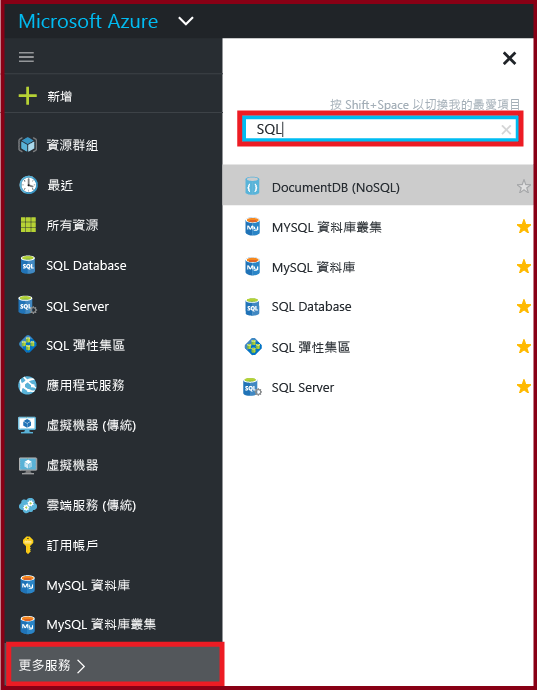

## 如何建立或檢視 Azure SQL Database？
若要開啟 [SQL Database] 刀鋒視窗，請按一下 [SQL Database]，然後按一下您想要使用的資料庫，或按一下 [+新增] 以建立 SQL Database。如需詳細資訊，請參閱[使用 Azure 入口網站在幾分鐘內建立 SQL Database](sql-database-get-started.md)。

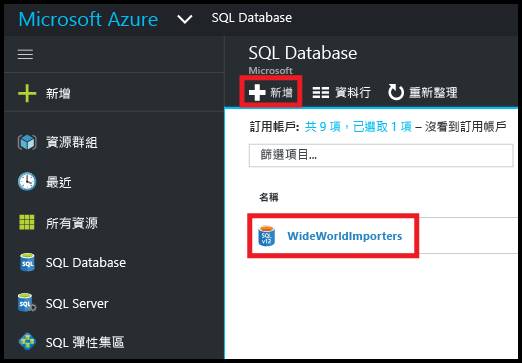

## 如何建立或檢視 Azure SQL Server？
若要開啟 [SQL Server] 刀鋒視窗，請按一下 [SQL Server]，然後按一下您想要使用的伺服器，或按一下 [+新增] 以建立 SQL Server。如需詳細資訊，請參閱[使用 Azure 入口網站在幾分鐘內建立 SQL Database](sql-database-get-started.md)。

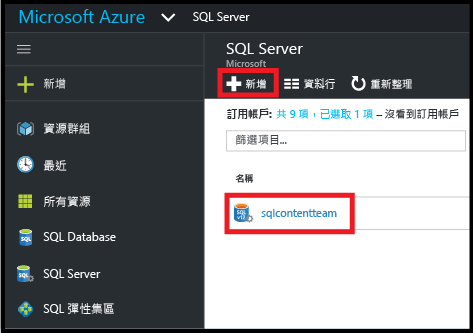

## 如何建立或檢視 Azure 彈性集區？
若要開啟 [SQL 彈性集區] 刀鋒視窗，請按一下 [SQL 彈性集區]，然後按一下您想要使用的集區，或按一下 [+新增] 以建立集區。如需詳細資訊，請參閱[使用 Azure 入口網站來建立彈性資料庫集區](sql-database-elastic-pool-create-portal.md)。

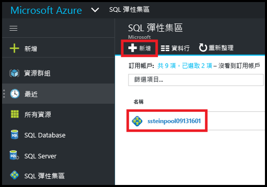

## 如何更新或檢視 SQL Database 設定？
若要檢視或更新您的資料庫設定，請按一下 [SQL Database] 刀鋒視窗上所需的設定︰

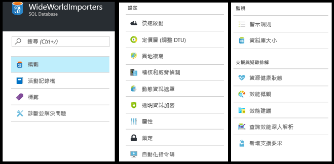

## 如何尋找 SQL Database 的完整伺服器名稱？
若要檢視您的資料庫伺服器名稱，請按一下 [SQL Database] 刀鋒視窗上的 [概觀]，然後記下伺服器名稱︰

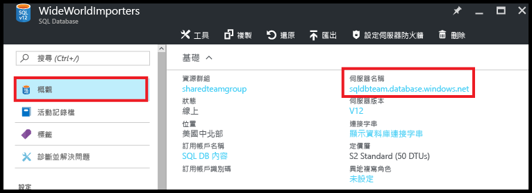

## 如何管理防火牆規則以控制我的 SQL Server 和 Database 的存取權？
若要檢視、建立或更新防火牆規則，請按一下 [SQL Database] 刀鋒視窗上的 [設定伺服器防火牆]。如需詳細資訊，請參閱[使用 Azure 入口網站設定 Azure SQL Database 伺服器層級防火牆規則](sql-database-configure-firewall-settings.md)。

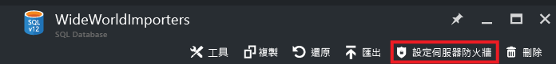

## 如何變更 SQL Database 服務層或效能等級？
若要更新 SQL Database 的服務層或效能等級，請按一下 [SQL Database] 刀鋒視窗上的 [定價層 (級別 DTU)]。如需詳細資訊，請參閱[變更 SQL Database 的服務層和效能等級 (定價層)](sql-database-scale-up.md)。

## 如何為 SQL Database 設定稽核和威脅偵測？
若要為 SQL Database 設定稽核和威脅偵測，請按一下 [SQL Database] 刀鋒視窗上的 [稽核與威脅偵測]。如需詳細資訊，請參閱[開始使用 SQL Database 稽核](sql-database-auditing-get-started.md)和[開始使用 SQL Database 威脅偵測](sql-database-threat-detection-get-started.md)。

## 如何為 SQL Database 設定動態資料遮罩？
若要為 SQL Database 設定動態資料遮罩，請按一下 [SQL Database] 刀鋒視窗上的 [動態資料遮罩]。如需詳細資訊，請參閱[開始使用 SQL Database 動態資料遮罩](sql-database-dynamic-data-masking-get-started.md)。

## 如何為 SQL Database 設定透明資料加密 (TDE)？
若要為 SQL Database 設定透明資料加密，請按一下 [SQL Database] 刀鋒視窗上的 [透明資料加密]。如需詳細資訊，請參閱[使用入口網站在資料庫上啟用 TDE](https://msdn.microsoft.com/library/dn948096#Anchor_1)。

## 如何檢視或變更SQL Database 的大小上限？
若要檢視或變更SQL Database 的大小，請按一下 [SQL Database] 刀鋒視窗上的 [資料庫大小]。藉由變更服務層或效能等級來更新資料庫的大小上限。如需詳細資訊，請參閱[變更 SQL Database 的服務層和效能等級 (定價層)](sql-database-scale-up.md)。

## 如何監視和改善 SQL Database 的效能？
若要監視和改善 SQL Database 的效能特性，請按一下 [SQL Database] 刀鋒視窗上的 [效能概觀]。如需詳細資訊，請參閱 [SQL Database 效能深入解析](sql-database-performance.md)。

## 如何設定異地複寫？
若要為 SQL Database 設定異地複寫，請按一下 [SQL Database] 刀鋒視窗上的 [異地複寫]。如需詳細資訊，請參閱[使用 Azure 入口網站為 Azure SQL Database 設定異地複寫](sql-database-geo-replication-portal.md)。

## 如何容錯移轉至異地複寫的 SQL Database？
若要容錯移轉至異地複寫的次要資料庫，請按一下 [SQL Database] 刀鋒視窗上的 [異地複寫]，然後按一下 [容錯移轉]。如需詳細資訊，請參閱[使用 Azure 入口網站為 Azure SQL Database 起始計劃性或非計劃性容錯移轉](sql-database-geo-replication-failover-portal.md)。

## 如何複製 SQL Database？
若要複製 SQL Database，請按一下 [SQL Database] 刀鋒視窗上的 [複製]。如需詳細資訊，請參閱[使用 Azure 入口網站複製 Azure SQL Database](sql-database-copy-portal.md)。

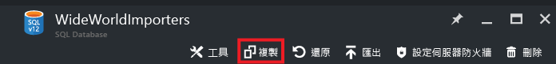

## 如何將 Azure SQL Database 封存到 BACPAC 檔案？
若要建立 SQL Database 的 BACPAC，請按一下 [SQL Database] 刀鋒視窗上的 [匯出]。如需詳細資訊，請參閱[使用 Azure 入口網站將 Azure SQL Database 封存到 BACPAC 檔案](sql-database-export.md)。

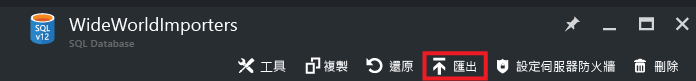

## 如何將 SQL Database 還原至先前的時間點？
若要還原 SQL Database，請按一下 [SQL Database] 刀鋒視窗上的 [還原]。如需詳細資訊，請參閱[使用 Azure 入口網站將 Azure SQL Database 還原至先前的時間點](sql-database-point-in-time-restore-portal.md)。

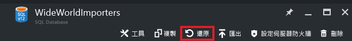

## 如何從 BACPAC 檔案建立 Azure SQL Database？
若要從 BACPAC 檔案建立 Azure SQL Database，請按一下 [SQL Server] 刀鋒視窗上的 [匯入資料庫]。如需詳細資訊，請參閱[匯入 BACPAC 檔案以建立 Azure SQL Database](sql-database-import.md)。

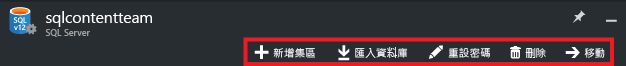

## 如何還原已刪除的 SQL Database？
若要還原已刪除的 SQL Database，請按一下 [SQL Server] 刀鋒視窗上的 [已刪除的資料庫] \(內含已刪除資料庫的 SQL Server)。如需詳細資訊，請參閱[使用 Azure 入口網站還原已刪除的 Azure SQL Database](sql-database-restore-deleted-database-portal.md)。

## 如何刪除 SQL Database？
若要刪除 SQL Database，請按一下 [SQL Database] 刀鋒視窗上的 [刪除]。

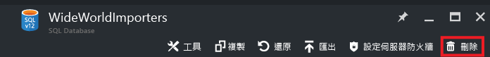

## 其他資源
* [SQL Database](sql-database-technical-overview.md)
* [使用 Azure 入口網站監視和管理彈性資料庫集區](sql-database-elastic-pool-manage-portal.md)

<!---HONumber=AcomDC_0921_2016-->