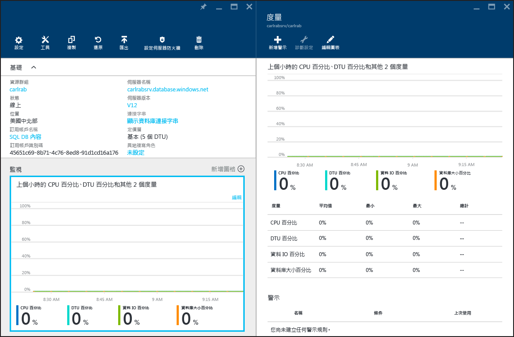

# 監視 Azure SQL Database 中的資料庫效能
在 Azure 中監視 SQL Database 的效能，必須從監視您選擇之資料庫效能等級相關的資源使用率開始。 監視可協助您判斷您的資料庫是否有超量的容量或因為資源超量而發生問題，然後判斷是否開始調整您資料庫的效能等級和[服務層](sql-database-service-tiers.md)。 您可以使用 [Azure 入口網站](https://portal.azure.com)中的圖形化工具或使用 SQL [動態管理檢視](https://msdn.microsoft.com/library/ms188754.aspx)，監視您的資料庫。

## 使用 Azure 入口網站監視資料庫
在 [Azure 入口網站](https://portal.azure.com/)中，您可以透過選取資料庫，並按一下 [監視] 圖表，監視單一資料庫的使用率。 如此會帶出您可變更的 [度量] 視窗，只要按一下 [編輯圖表] 按鈕即可。 新增下列度量：

* CPU 百分比
* DTU 百分比
* 資料 IO 百分比
* 資料庫大小百分比

新增這些度量之後，您可以在 [度量] 視窗中，在含有詳細資料的 [監視] 圖表中繼續檢視它們。 這四個度量都會顯示與資料庫 **DTU** 相對的平均使用率百分比。 如需 DTU 的詳細資訊，請參閱 [服務層](sql-database-service-tiers.md) 文章。

您也可以在效能度量中設定警示。 按一下 [度量] 視窗中的 [新增警示] 按鈕。 遵循精靈的指示以設定警示。 您可以選擇在度量超出或低於特定臨界值時發出警示。

例如，如果您預期資料庫中的工作負載會成長，可以選擇設定電子郵件警示，以便在資料庫的任何效能度量達到 80% 時收到警示。 您可以使用此警示做為早期警告，協助您判斷何時需要切換至更高的效能層級。

效能度量也可協助您判斷您是否能夠降級至較低的效能層級。 假設您使用標準 S2 資料庫，且所有效能度量皆顯示在指定時間內，資料庫平均使用率沒有超過 10%。 則該資料庫可能在標準 S1 中會運作得不錯。 不過，在您決定將資料庫移至較低效能層級前，請先注意暴增或大幅變動的工作負載。

## 使用 DMV 監視資料庫
您也可以透過下列系統檢視取得公開在入口網站中的相同度量：伺服器的邏輯 **master** 資料庫中的 [sys.resource_stats](https://msdn.microsoft.com/library/dn269979.aspx)，以及使用者資料庫中的 [sys.dm_db_resource_stats](https://msdn.microsoft.com/library/dn800981.aspx)。 如果您需要在一段長時間內監視較不細微的資料，請使用 **sys.resource_stats**。 如果您需要在較小的時間範圍內監視較細微的資料，請使用 **sys.dm_db_resource_stats**。 如需詳細資訊，請參閱 [Azure SQL Database 效能指引](sql-database-single-database-monitor.md#monitor-resource-use)。

> [!NOTE]
> 使用於 Web 和 Business Edition 資料庫 (已淘汰) 時，**sys.dm_db_resource_stats** 會傳回空的結果集。
>
>

### 監視資源使用量

您可以使用 [SQL Database 查詢效能深入解析](sql-database-query-performance.md)和[查詢存放區](https://msdn.microsoft.com/library/dn817826.aspx)來監視資源用量。

您也可以使用以下兩種檢視來監視用量：

* [sys.dm_db_resource_stats](https://msdn.microsoft.com/library/dn800981.aspx)
* [sys.resource_stats](https://msdn.microsoft.com/library/dn269979.aspx)

#### sys.dm_db_resource_stats
您可以在每一個 SQL Database 中使用 [sys.dm_db_resource_stats](https://msdn.microsoft.com/library/dn800981.aspx)檢視。 **sys.dm_db_resource_stats** 檢視可顯示相對於服務層的最新資源使用量資料。 每隔 15 秒鐘就會記錄一次 CPU、資料 I/O、記錄檔寫入和記憶體的平均百分比，並且會維持 1 小時。

因為此檢視會提供更細微的資源使用量資訊，請先使用 **sys.dm_db_resource_stats** 來進行任何現狀分析或疑難排解。 例如，下列查詢會顯示目前的資料庫在過去一小時的平均和最大資源使用量：

    SELECT  
        AVG(avg_cpu_percent) AS 'Average CPU use in percent',
        MAX(avg_cpu_percent) AS 'Maximum CPU use in percent',
        AVG(avg_data_io_percent) AS 'Average data I/O in percent',
        MAX(avg_data_io_percent) AS 'Maximum data I/O in percent',
        AVG(avg_log_write_percent) AS 'Average log write use in percent',
        MAX(avg_log_write_percent) AS 'Maximum log write use in percent',
        AVG(avg_memory_usage_percent) AS 'Average memory use in percent',
        MAX(avg_memory_usage_percent) AS 'Maximum memory use in percent'
    FROM sys.dm_db_resource_stats;  

如需其他查詢的資訊，請參閱 [sys.dm_db_resource_stats](https://msdn.microsoft.com/library/dn800981.aspx) 中的範例。

#### sys.resource_stats
**master** 資料庫中的 [sys.resource_stats](https://msdn.microsoft.com/library/dn269979.aspx) 檢視有其他資訊可協助您監視 SQL Database 在其特定服務層和效能等級的效能。 這項資料每隔 5 分鐘就會收集一次，並且會維持大約 35 天。 這個檢視適合用於進行 SQL Database 如何使用資源的長期歷史分析。

下圖顯示在一週中 P2 效能等級之高階資料庫每小時的 CPU 資源使用量。 此圖從星期一開始，顯示 5 個工作天，然後顯示較少發生在應用程式的週末。

從資料中，這個資料庫目前相對於 P2 效能等級的尖峰 CPU 負載剛好超過 50% 的 CPU 使用量 (星期二中午)。 如果 CPU 是應用程式的資源設定檔中的主要因素，您可能會決定 P2 是正確的效能等級，以確保永遠符合工作負載。 如果您預期應用程式會隨著時間成長，最好預留額外的資源緩衝，讓應用程式永遠不會達到效能等級限制。 如果您提升效能等級，則可協助避免資料庫沒有足夠能力來有效處理要求時可能發生的客戶可見錯誤，尤其是在延遲敏感的環境中。 其中一例便是支援可根據資料庫呼叫結果繪製網頁之應用程式的資料庫。

其他應用程式類型可能會以不同方式解譯相同的圖形。 例如，如果應用程式嘗試每天處理薪資資料而且具有同一張圖表，這種「批次作業」模型可能會在 P1 效能等級中正常執行。 相較於 P2 效能等級的 200 個 DTU，P1 效能等級有 100 個 DTU。 P1 效能等級提供的效能是 P2 效能等級的一半。 因此，P2 中 50% 的 CPU 使用量等於 P1 中 100% 的 CPU 使用量。 如果應用程式沒有逾時，就算作業花了 2 個小時或 2.5 個小時才能完成也沒關係，只要它在今天內完成即可。 這個類別中的應用程式或許可以使用 P1 效能等級。 一天中有好幾個時段的資源使用量較低，您可以善用這個事實，讓任何「巨量尖峰」可以溢出到當天稍後的一個低谷。 只要作業可以每天及時完成，P1 效能等級可能就很適合這類應用程式 (並節省經費)。

Azure SQL Database 會在每個伺服器 **master** 資料庫的 **sys.resource_stats** 檢視中公開每個作用中資料庫的耗用資源資訊。 資料表中的資料會以 5 分鐘的間隔彙總。 利用基本、標準和進階服務層，資料可能要花 5 分鐘以上的時間才會出現在資料表中，因此這項資料比較適合進行歷程記錄分析而不是近乎即時的分析。 查詢 **sys.resource_stats** 檢視可查看資料庫的近期歷程記錄，並驗證所選的保留是否會在必要時提供所需的效能。

> [!NOTE]
> 您必須連接到邏輯 SQL Database 伺服器的 **master** 資料庫才能在下列範例中查詢 **sys.resource_stats**。
> 
> 

下列範例會示範如何公開此檢視中的資料：

    SELECT TOP 10 *
    FROM sys.resource_stats
    WHERE database_name = 'resource1'
    ORDER BY start_time DESC

下列範例示範不同方式，以供您用來使用 **sys.resource_stats** 目錄檢視取得有關 SQL Database 如何使用資源的相關資訊：

1. 若要查看 userdb1 資料庫在過去一週的資源使用量，您可以執行下列查詢：
   
        SELECT *
        FROM sys.resource_stats
        WHERE database_name = 'userdb1' AND
              start_time > DATEADD(day, -7, GETDATE())
        ORDER BY start_time DESC;
2. 若要評估您的工作負載與效能等級的符合程度，您必須鑽研資源度量的每個層面：CPU、讀取、寫入、背景工作角色數目和工作階段數目。 以下是使用 **sys.resource_stats** 修訂過的查詢，可報告這些資源度量的平均值和最大值：
   
        SELECT
            avg(avg_cpu_percent) AS 'Average CPU use in percent',
            max(avg_cpu_percent) AS 'Maximum CPU use in percent',
            avg(avg_data_io_percent) AS 'Average physical data I/O use in percent',
            max(avg_data_io_percent) AS 'Maximum physical data I/O use in percent',
            avg(avg_log_write_percent) AS 'Average log write use in percent',
            max(avg_log_write_percent) AS 'Maximum log write use in percent',
            avg(max_session_percent) AS 'Average % of sessions',
            max(max_session_percent) AS 'Maximum % of sessions',
            avg(max_worker_percent) AS 'Average % of workers',
            max(max_worker_percent) AS 'Maximum % of workers'
        FROM sys.resource_stats
        WHERE database_name = 'userdb1' AND start_time > DATEADD(day, -7, GETDATE());
3. 利用這項有關各資源度量平均值和最大值的資訊，您可以評估您的工作負載與您所選之效能等級的符合程度。 通常，來自 **sys.resource_stats** 的平均值可提供您對目標大小所使用的理想基準。 它應該是您主要的量尺。 例如，您可能使用標準服務層搭配 S2 效能等級。 CPU 以及 I/O 讀取和寫入的平均使用量百分比低於 40%，背景工作角色平均數目低於 50，而且工作階段平均數目低於 200。 您的工作負載可能符合 S1 效能等級。 要看到您的資料庫是否符合背景工作和工作階段限制範圍內非常容易。 若要查看資料庫在 CPU、讀取和寫入方面是否符合較低的效能等級，請將較低效能等級的 DTU 數目除以目前效能等級的 DTU 數目，然後將結果乘以 100：
   
    **S1 DTU / S2 DTU * 100 = 20 / 50 * 100 = 40**
   
    此結果是以百分比表示之兩個效能等級的相對效能差異。 如果您的資源使用量未超過這個數量，您的工作負載可能符合較低的效能等級。 不過，您需要查看所有範圍的資源使用量值，並以百分比判斷資料庫工作負載符合較低效能等級的頻率。 下列查詢會根據我們在此範例中計算的 40% 臨界值，輸出每個資源維度的相符百分比：
   
        SELECT
            (COUNT(database_name) - SUM(CASE WHEN avg_cpu_percent >= 40 THEN 1 ELSE 0 END) * 1.0) / COUNT(database_name) AS 'CPU Fit Percent'
            ,(COUNT(database_name) - SUM(CASE WHEN avg_log_write_percent >= 40 THEN 1 ELSE 0 END) * 1.0) / COUNT(database_name) AS 'Log Write Fit Percent'
            ,(COUNT(database_name) - SUM(CASE WHEN avg_data_io_percent >= 40 THEN 1 ELSE 0 END) * 1.0) / COUNT(database_name) AS 'Physical Data IO Fit Percent'
        FROM sys.resource_stats
        WHERE database_name = 'userdb1' AND start_time > DATEADD(day, -7, GETDATE());
   
    根據您的資料庫服務等級目標 (SLO)，您可以決定您的工作負載是否符合較低的效能等級。 如果您的資料庫工作負載 SLO 是 99.9%，且上述查詢針對三個資源維度傳回的值都大於 99.9，您的工作負載可能會符合較低的效能等級。
   
    查看相符百分比也可讓您深入了解是否必須移到下一個較高的效能等級來滿足您的 SLO。 例如，userdb1 會顯示過去一週的下列 CPU 使用量：
   
   | 平均 CPU 百分比 | 最大 CPU 百分比 |
   | --- | --- |
   | 24.5 |100.00 |
   
    平均 CPU 大約是效能等級限制的四分之一，完全符合資料庫的效能等級。 不過，此最大值會顯示資料庫達到效能等級的限制。 您需要移至下一個較高的效能等級嗎？ 請查看工作負載達到 100% 的次數，然後將其與您的資料庫工作負載 SLO 做比較。
   
        SELECT
        (COUNT(database_name) - SUM(CASE WHEN avg_cpu_percent >= 100 THEN 1 ELSE 0 END) * 1.0) / COUNT(database_name) AS 'CPU fit percent'
        ,(COUNT(database_name) - SUM(CASE WHEN avg_log_write_percent >= 100 THEN 1 ELSE 0 END) * 1.0) / COUNT(database_name) AS 'Log write fit percent'
        ,(COUNT(database_name) - SUM(CASE WHEN avg_data_io_percent >= 100 THEN 1 ELSE 0 END) * 1.0) / COUNT(database_name) AS 'Physical data I/O fit percent'
        FROM sys.resource_stats
        WHERE database_name = 'userdb1' AND start_time > DATEADD(day, -7, GETDATE());
   
    如果此查詢針對三個資源維度傳回的值小於 99.9%，請考慮移到下一個較高的效能等級或使用應用程式微調技術減少 SQL Database 的負載。
4. 此練習也會考慮您預計的未來工作負載增加量。

若為彈性集區，您可以監視其中的個別資料庫，技巧如本節所述。 但您也可以監視集區整體。 如需詳細資訊，請參閱 [監視和管理彈性集區](sql-database-elastic-pool-manage-portal.md)。

### 並行要求數上限
若要查看並行要求數目，請在 SQL Database 上執行下列 Transact-SQL 查詢：

    SELECT COUNT(*) AS [Concurrent_Requests]
    FROM sys.dm_exec_requests R

若要分析內部部署 SQL Server 資料庫的工作負載，請修改此查詢來篩選您要分析的特定資料庫。 比方說，如果您擁有名為 MyDatabase 的內部部署資料庫，則下列 Transact-SQL 查詢會傳回該資料庫中並行要求的計數：

    SELECT COUNT(*) AS [Concurrent_Requests]
    FROM sys.dm_exec_requests R
    INNER JOIN sys.databases D ON D.database_id = R.database_id
    AND D.name = 'MyDatabase'

這只是單一時間點的快照。 若要進一步了解您的工作負載和並行要求需求，您必須收集一段時間內的許多範例。

### 並行登入數上限
您可以分析您的使用者和應用程式模式以了解登入頻率。 您也可以在測試環境中執行真實世界的負載，藉此確定您不會達到我們在本文中討論的這項限制或其他限制。 沒有任何單一查詢或動態管理檢視 (DMV) 可以向您顯示並行登入計數或歷程記錄。

如果這些用戶端使用相同的連接字串，服務仍會驗證每一個登入。 如果有 10 位使用者同時以相同的使用者名稱和密碼連接到資料庫，將會有 10 個並行登入。 這項限制只適用於登入和驗證期間。 如果相同的 10 位使用者依序連接到資料庫，並行登入數目絕對不會大於 1。

> [!NOTE]
> 這項限制目前不適用於彈性集區中的資料庫。
> 
> 

### 工作階段數上限
若要查看目前的作用中工作階段數目，請在 SQL Database 上執行下列 Transact-SQL 查詢：

    SELECT COUNT(*) AS [Sessions]
    FROM sys.dm_exec_connections

如果您要分析內部部署 SQL Server 的工作負載，請修改查詢以專注於特定資料庫。 如果您考慮將資料庫移至 Azure SQL Database，此查詢可協助您判斷該資料庫可能的工作階段需求。

    SELECT COUNT(*)  AS [Sessions]
    FROM sys.dm_exec_connections C
    INNER JOIN sys.dm_exec_sessions S ON (S.session_id = C.session_id)
    INNER JOIN sys.databases D ON (D.database_id = S.database_id)
    WHERE D.name = 'MyDatabase'

同樣地，這些查詢傳回的是某一時間點的計數。 如果您收集一段時間內的多個範例，您就可以充分了解您的工作階段使用量。

若要進行 SQL Database 分析，您可以查詢 [sys.resource_stats](https://msdn.microsoft.com/library/dn269979.aspx)檢視，並檢閱 **active_session_count** 資料行，以取得工作階段的歷史統計資料。 

