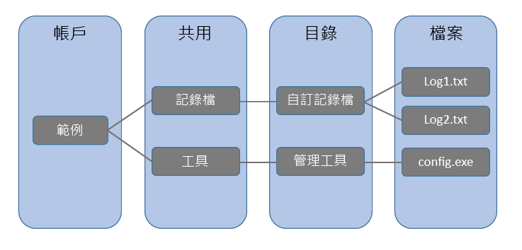

# <a name="introduction-to-azure-file-storage"></a>Azure 檔案儲存體簡介
Azure 檔案儲存體在雲端中提供網路檔案共用功能，並使用業界標準[伺服器訊息區塊 (SMB) 通訊協定](https://msdn.microsoft.com/library/windows/desktop/aa365233.aspx)和 [Samba/一般網際網路檔案系統 (CIFS)](https://technet.microsoft.com/library/cc939973.aspx)。 用戶端 (例如 Windows、macOS、Linux 的內部部署) 或 Azure 虛擬機器可同時掛接 Azure 檔案共用。 


## <a name="videos"></a>影片
| 介紹 Azure 檔案儲存體 (27 分鐘) | Azure 檔案儲存體教學課程 (5 分鐘)  |
|-|-|
| [](https://www.youtube.com/watch?v=zlrpomv5RLs) | [](https://channel9.msdn.com/Blogs/Azure/Azure-File-storage-with-Windows/) |

## <a name="why-azure-file-storage-is-useful"></a>Azure 檔案儲存體為何很實用
Azure 檔案儲存體可讓您使用沒有作業系統的雲端檔案共用，取代裝載於內部部署或在雲端中的 Windows Server、Linux 或以 NAS 為基礎的檔案伺服器。 具有下列好處：

* **共用存取**。 Azure 檔案共用支援業界標準 SMB 通訊協定，這表示您可以使用 Azure 檔案共用順暢地取代您的內部檔案共用，而不需擔心應用程式相容性。 能夠跨多部電腦和應用程式/執行個體共用檔案系統，是 Azure 檔案儲存體的重大優勢，尤其是針對需要共用能力的應用程式。 
* **受到完整管理**。 不需要管理硬體或作業系統就可以建立 Azure 檔案共用。 這表示您不必透過重大安全性升級或替換故障硬碟來處理修補伺服器作業系統。
* **指令碼和工具**。 PowerShell Cmdlet 和 Azure CLI 可用來建立、掛接和管理儲存體共用，作為 Azure 應用程式系統管理的一部分。您可以使用 Azure 入口網站和 Azure 儲存體總管來建立及管理 Azure 檔案共用。 
* **復原功能**。 Azure 檔案儲存體已從頭建置，可讓您隨時使用。 使用 Azure 儲存體取代內部部署檔案共用，表示您不再需要被吵醒去處理本機電源中斷或網路問題。 
* **熟悉的可程式性**。 Azure 中執行的應用程式可透過檔案[系統 I/O API](https://msdn.microsoft.com/library/system.io.file.aspx) 來存取共用中的資料。 因此，開發人員可利用現有的程式碼和技能來移轉現有的應用程式。 除了系統 IO API，您也可以使用 [Azure 儲存體用戶端程式庫](https://msdn.microsoft.com/library/azure/dn261237.aspx)或 [Azure 儲存體的 REST API](/rest/api/storageservices/file-service-rest-api)。

Azure 檔案共用可以用來：

* **取代內部部署檔案伺服器**：  
    Azure 檔案儲存體可以用來完全取代傳統內部部署檔案伺服器或 NAS 裝置上的檔案共用。 無論身在何處，熱門作業系統 (例如 Windows、macOS 和 Linux) 都可以輕鬆掛接 Azure 檔案共用。

* **「原形移轉」應用程式**：  
    Azure 檔案儲存體使得「原形移轉」應用程式 (使用內部部署檔案共用在應用程式不同部分之間共用資料) 移轉到雲端相當容易。 若要達成此任務，每個 VM 會連線到檔案共用，然後可以讀取和寫入檔案，就好像它會對內部部署檔案共用所採取的動作一樣。

* **簡化雲端開發**：  
    Azure 檔案儲存體可以透過數種不同的使用方式來簡化新的雲端開發專案。
    * **共用的應用程式設定**：  
        分散式應用程式的常見模式是將組態檔放在一個集中的位置，這些應用程式可從許多不同的 VM 進行存取。 這些組態檔現在可以儲存在 Azure 檔案共用中，並由所有應用程式執行個體進行存取。 這些設定可以透過可允許全球存取組態檔的 REST 介面進行管理。

    * **診斷共用**：  
        您可以使用 Azure 檔案共用來儲存診斷檔案，如記錄、度量及損毀傾印。 透過 SMB 和 REST 介面提供這些檔案可允許應用程式建立或利用各種分析工具，進而處理與分析診斷資料。

    * **開發/測試/偵錯**：  
        當開發人員或系統管理員在雲端的 VM 上執行作業時，他們通常需要一組工具或公用程式。 在每台他們所需的虛擬機器上安裝與散佈這些公用程式相當費時。 有了 Azure 檔案儲存體，開發人員或系統管理員可將他們最愛的工具儲存在檔案共用上，然後從任何虛擬機器輕鬆連線。
        
## <a name="how-does-it-work"></a>運作方式
管理 Azure 檔案共用會比管理檔案共用內部部署簡單許多。 下圖說明 Azure 檔案儲存體管理建構：



* **儲存體帳戶**：一律透過儲存體帳戶來存取 Azure 儲存體。 如需關於儲存體帳戶容量的詳細資訊，請參閱＜Azure 儲存體延展性和效能目標＞(英文)。
* **共用**：檔案儲存體共用是 Azure 中的 SMB 檔案共用。 所有的目錄和檔案必須在上層共用中建立。 帳戶可包含無限制數目的共用，而共用可儲存無限制數目的檔案，最多可達 5 TB 總容量的檔案共用。
* **目錄**：選擇性的目錄階層。
* **檔案**：共用中的檔案。 檔案的大小可高達 1 TB。
* **URL 格式**：可利用下列 URL 定址檔案：  

    ```
    https://<storage account>.file.core.windows.net/<share>/<directory/directories>/<file>
    ```
## <a name="next-steps"></a>後續步驟
* [建立 Azure 檔案共用](storage-file-how-to-create-file-share.md)
* [連線並在 Windows 上掛接](storage-file-how-to-use-files-windows.md)
* [連線並在 Linux 上掛接](storage-how-to-use-files-linux.md)
* [連線並在 macOS 上掛接](storage-file-how-to-use-files-mac.md)
* [常見問題集](storage-files-faq.md)
* [疑難排解](storage-troubleshoot-file-connection-problems.md)

### <a name="conceptual-articles-and-videos"></a>概念性文章和影片
* [Azure 檔案儲存體：適用於 Windows 和 Linux 的無摩擦雲端 SMB 檔案系統](https://azure.microsoft.com/documentation/videos/azurecon-2015-azure-files-storage-a-frictionless-cloud-smb-file-system-for-windows-and-linux/)

### <a name="tooling-support-for-azure-file-storage"></a>Azure 檔案儲存體的工具支援
* [搭配使用 Azure PowerShell 與 Azure 儲存體](storage-powershell-guide-full.md)
* [如何搭配使用 AzCopy 與 Microsoft Azure 儲存體](storage-use-azcopy.md)
* [使用 Azure CLI 搭配 Azure 儲存體](storage-azure-cli.md#create-and-manage-file-shares)

### <a name="blog-posts"></a>部落格文章
* [Azure 檔案儲存體現已公開推出](https://azure.microsoft.com/blog/azure-file-storage-now-generally-available/)
* [Azure 檔案儲存體內部](https://azure.microsoft.com/blog/inside-azure-file-storage/)
* [Microsoft Azure 檔案服務簡介](http://blogs.msdn.com/b/windowsazurestorage/archive/2014/05/12/introducing-microsoft-azure-file-service.aspx)
* [將資料移轉至 Azure 檔案](https://azure.microsoft.com/blog/migrating-data-to-microsoft-azure-files/)

### <a name="reference"></a>參考
* [Storage Client Library for .NET 參考資料](https://msdn.microsoft.com/library/azure/dn261237.aspx)
* [檔案服務 REST API 參考](http://msdn.microsoft.com/library/azure/dn167006.aspx)

