<properties
    pageTitle="開始使用 Azure 串流分析來處理 IoT 裝置的資料。 | Microsoft Azure"
    description="IoT 感應器標記和具有串流分析的資料串流與即時資料處理"
    keywords="IoT 解決方案，開始使用 IoT"
    services="stream-analytics"
    documentationCenter=""
    authors="jeffstokes72"
    manager="jhubbard"
    editor="cgronlun"
/>

<tags
    ms.service="stream-analytics"
    ms.devlang="na"
    ms.topic="hero-article"
    ms.tgt_pltfrm="na"
    ms.workload="data-services"
    ms.date="09/26/2016"
    ms.author="jeffstok"
/>

# 開始使用 Azure 串流分析來處理 IoT 裝置的資料

在本教學課程中，您將學習如何建立串流處理邏輯，以從物聯網 (IoT) 裝置收集資料。 我們將使用真實世界的物聯網 (IoT) 使用案例以示範如何快速且經濟地建置您的解決方案。

## 必要條件

-   [Azure 訂用帳戶](https://azure.microsoft.com/pricing/free-trial/)
-   範例查詢和資料檔案可從 [GitHub](https://aka.ms/azure-stream-analytics-get-started-iot)

## 案例

Contoso 是一家工業自動化空間的公司，他們已完全自動化其製造程序。 這家製造廠的機械裝置具有感應器，可以發出即時資料串流。 在此案例中，生產現場經理想要取得感應器資料的即時深入資訊，來尋找模式並且對其採取動作。 我們將對感應器資料使用串流分析查詢語言 (SAQL)，以從內送資料串流中找出感興趣的模式。

這裡的資料是從 Texas Instrument 的感應器標籤裝置產生。

資料的承載格式是 JSON，如下所示：

    {
        "time": "2016-01-26T20:47:53.0000000",  
        "dspl": "sensorE",  
        "temp": 123,  
        "hmdt": 34  
    }  

在真實世界的案例中，您可以擁有數百個此類感應器，產生事件作為串流。 在理想情況下，閘道器裝置會執行程式碼，以將這些事件推送至 [Azure 事件中樞](https://azure.microsoft.com/services/event-hubs/)或 [Azure IoT 中樞](https://azure.microsoft.com/services/iot-hub/)。 串流分析作業會從事件中樞擷取這些事件，並針對串流執行即時分析查詢。 接著，您可以將結果傳送至其中一個[支援輸出](stream-analytics-define-outputs.md)。

為了方便使用，本入門指南會提供擷取自實際感應器標籤裝置的範例資料檔。 您可以對範例資料執行查詢，然後查看結果。 在後續教學課程中，您將了解如何將您的作業連接至輸入和輸出，並將它們部署到 Azure 服務。

## 建立串流分析工作

1. 在 [Azure 入口網站](http://manage.windowsazure.com)中按一下 [串流分析]，然後按一下頁面左下角的 [新增] 來建立新的分析作業。

    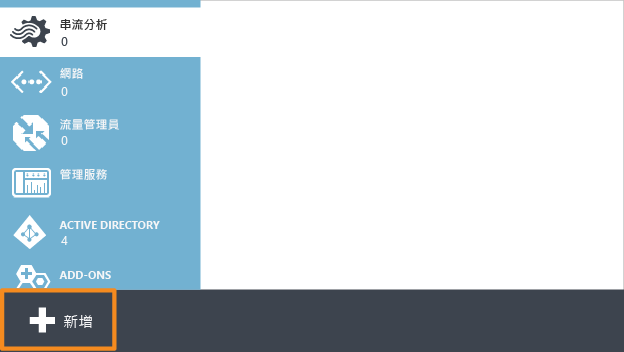

2. 按一下 [快速建立] 。

3. 對於 [區域監視儲存體帳戶] 設定，按一下 [建立新的儲存體帳戶]，並給它一個唯一的名稱。 Azure 串流分析會使用此帳戶來儲存您未來所有工作的監視資訊。

    > [AZURE.NOTE] 每個區域只應該建立一次此儲存體帳戶。 此儲存體會供該區域中建立的所有串流分析作業共用。

4. 按一下頁面底部的 [建立串流分析作業]  。

    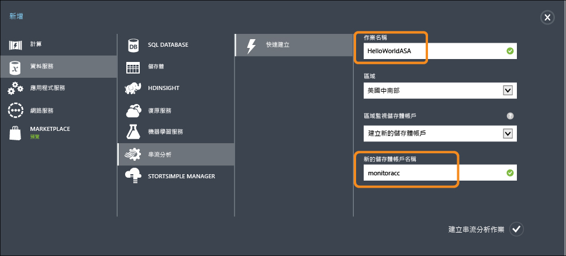

## Azure 串流分析查詢

按一下 [查詢] 索引標籤以移至查詢編輯器。 [查詢] 索引標籤包含會針對傳入事件資料進行轉換的 T-SQL 查詢。

## 封存未經處理資料

形式最簡單的查詢是傳遞查詢，其會將所有輸入資料封存至其指定的輸出。

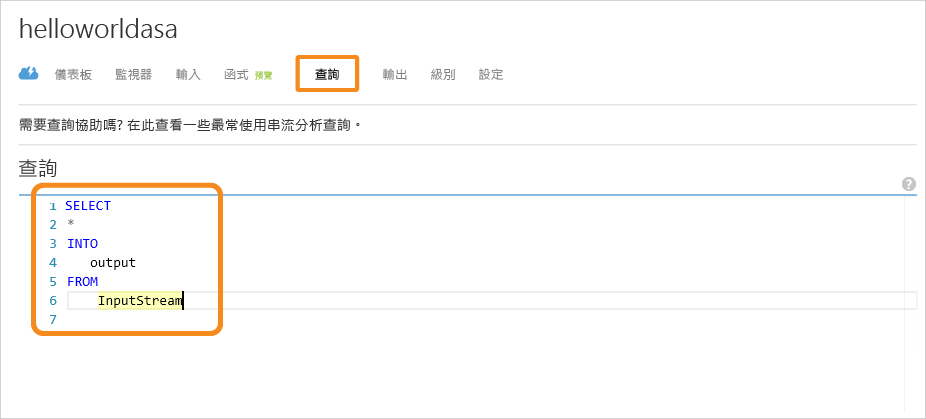

立即從 [GitHub](https://aka.ms/azure-stream-analytics-get-started-iot) 將範例資料檔案下載至電腦上的位置。 貼上 PassThrough.txt 檔案中的查詢。 按一下 [測試] 按鈕，然後從下載位置選取 HelloWorldASA-InputStream.json 資料檔案。

![串流分析中的 [測試] 按鈕](./media/stream-analytics-get-started-with-iot-devices/stream-analytics-get-started-with-iot-devices-05.png)

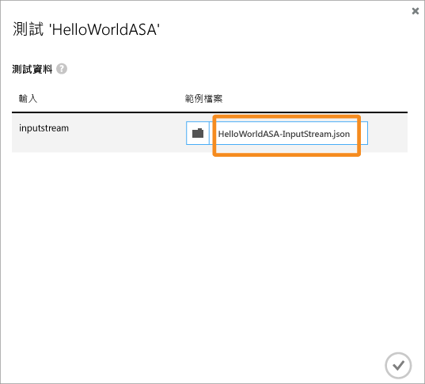

您可以在瀏覽器中看到查詢的結果，如下列螢幕擷取畫面所示。

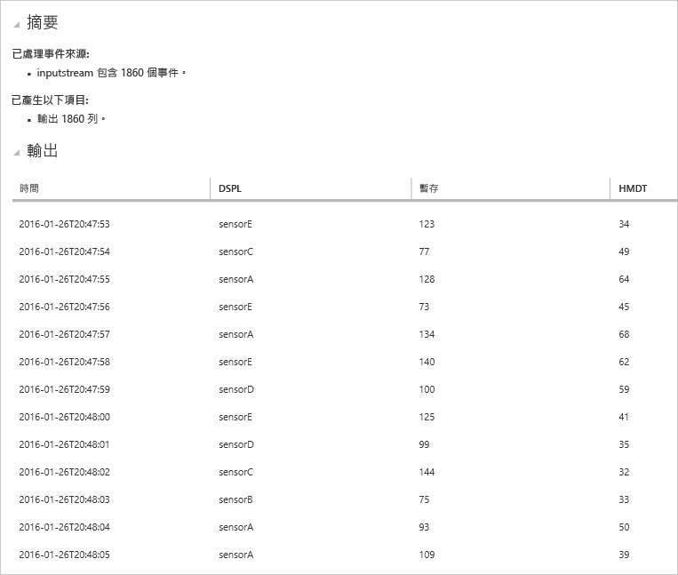

## 根據條件篩選資料

讓我們試著根據條件篩選結果。 我們想要僅針對來自 “sensorA” 的事件顯示結果。 查詢位於 Filtering.txt 檔案中。

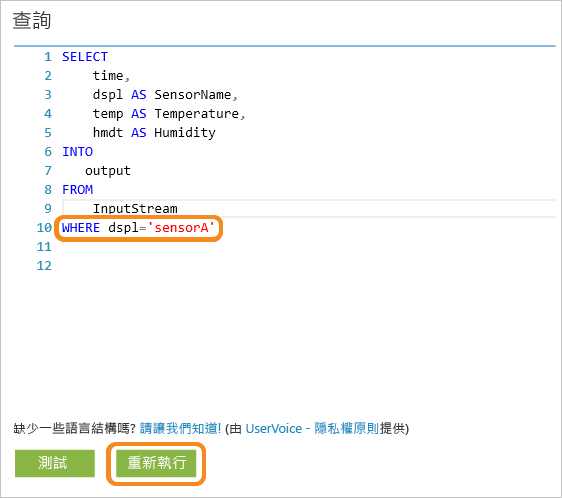

請注意，區分大小寫的查詢會比較字串值。 按一下 [重新執行] 按鈕以執行查詢。 查詢應該會針對 1860 個事件傳回 389 個資料列。

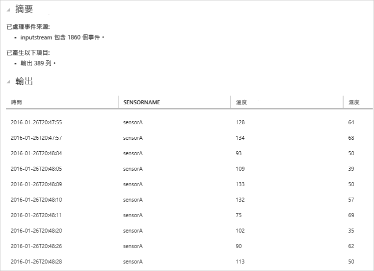

## 觸發商務工作流程的警示

讓我們的查詢變得更為詳細。 對於每一個類型的感應器，我們想要監視每 30 秒時段的平均溫度，並且只顯示平均溫度高於 100 度的結果。 我們會撰寫下列查詢，然後按一下 [重新執行] 來查看結果。 查詢位於 ThresholdAlerting.txt 檔案中。

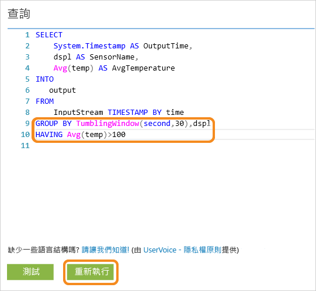

如您所見，現在結果只包含 245 個資料列，以及平均溫度高於 100 的感應器名稱。 此查詢會依據 **dspl** 分組事件串流，dspl 是感應器名稱，而**輪轉視窗**為 30 秒。 暫時查詢必須指明我們要如何讓時間前進。 使用 **TIMESTAMP BY** 子句，我們已指定 **OUTPUTTIME** 資料行來將時間與所有暫時計算相關聯。 如需詳細資訊，請閱讀有關[時間管理](https://msdn.microsoft.com/library/azure/mt582045.aspx)和[時間範圍函式](https://msdn.microsoft.com/library/azure/dn835019.aspx)的 MSDN 文章。

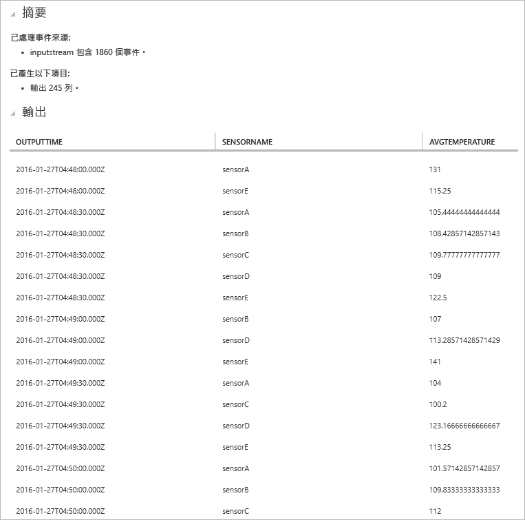

## 偵測不存在的事件

我們要如何撰寫查詢來尋找輸入不足事件？ 讓我們找出上次感應器在傳送資料後，但是接下來一分鐘未傳送事件的情形。 查詢位於 AbsenseOfEvent.txt 檔案中。

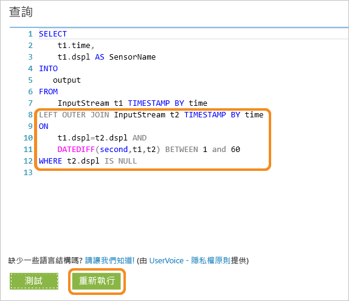

此處，我們對相同的資料串流使用 **LEFT OUTER** 聯結 (自我聯結)。 對於 **INNER** 聯結，只會在找到相符項目時傳回結果。  對於 **LEFT OUTER** 聯結，如果聯結左側的事件不相符，則會針對右側的所有資料行傳回具有 NULL 的資料列。 這項技術對於尋找不存在的事件很有用。 如需 [JOIN](https://msdn.microsoft.com/library/azure/dn835026.aspx) 的詳細資訊，請參閱我們的 MSDN 文件。

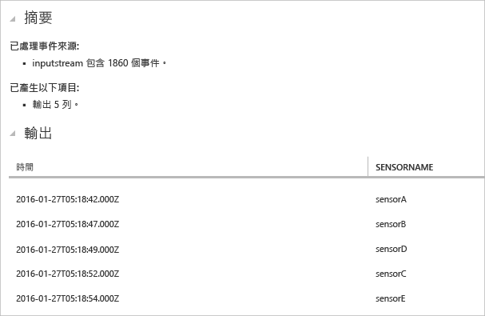

## 結論

本教學課程的目的在於示範如何撰寫不同的串流分析查詢語言查詢，並在瀏覽器中查看結果。 但是，這只是剛開始。 您還可以使用串流分析執行更多功能。 串流分析支援各種輸入和輸出，並甚至可以使用 Azure Machine Learning 中的函式，使其成為分析資料串流的健全工具。 您可以使用我們的[學習地圖](https://azure.microsoft.com/documentation/learning-paths/stream-analytics/)開始深入探索串流分析。 如需如何撰寫查詢的詳細資訊，請閱讀有關[常見查詢模式](./stream-analytics-stream-analytics-query-patterns.md)的文章。

<!--HONumber=Oct16_HO2-->

