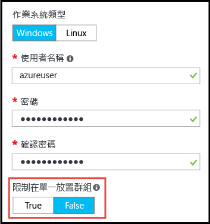

# <a name="working-with-large-virtual-machine-scale-sets"></a>使用大型的虛擬機器擴展集
您現在可以建立容量多達 1,000 個 VM 的 Azure [虛擬機器擴展集](/azure/virtual-machine-scale-sets/)。 本文件將_大型虛擬機器擴展集_定義為能夠調整到 100 個 VM 以上的擴展集。 此容量是由擴展集屬性 (_singlePlacementGroup=False_) 所設定。 

大型擴展集在某些方面 (例如負載平衡和容錯網域) 的行為不同於標準擴展集。 本文件說明大型擴展集的特性，並描述要在應用程式中成功使用這種擴展集的須知事項。 

想要大規模部署雲端基礎結構，常見的方法是建立一組_縮放單位_，例如藉由跨多個 VNET 和儲存體帳戶建立多個 VM 擴展集。 此方法所需的管理作業較單一 VM 簡單，而且多個縮放單位對於許多應用程式來說會很實用，特別是如果應用程式需要其他可堆疊元件時，例如多個虛擬網路和端點。 但如果應用程式需要單一大型叢集，則直接部署多達 1,000 個 VM 的單一擴展集會更快。 範例案例包括集中式的巨量資料部署，或是需要可簡單管理大型背景工作節點集區的計算方格。 結合 VM 擴展集所[附加的資料磁碟](virtual-machine-scale-sets-attached-disks.md)，大型擴展集可讓您在單一作業中，就部署由數千個核心和數 PB 儲存體所組成的可調整基礎結構。

## <a name="placement-groups"></a>放置群組 
「大型」擴展集的特殊之處不在於 VM 數目，而在於其所包含的「放置群組」數目。 放置群組是一種類似於 Azure 可用性設定組的建構，並有自己的容錯網域和升級網域。 根據預設，擴展集包含一個大小上限為 100 個 VM 的位置群組。 如果稱為「singlePlacementGroup」的擴展集屬性設為「false」，擴展集可以包含多個位置群組，且具有範圍為 0 到 1,000 個的 VM。 若設為預設值「true」，擴展集則包含單一放置群組，且具有範圍為 0 到 100 個的 VM。

## <a name="checklist-for-using-large-scale-sets"></a>使用大型擴展集的檢查清單
若要決定應用程式是否能有效運用大型擴展集，請考慮下列需求︰

- 大型擴展集需要 Azure 受控磁碟。 所建立的擴展集若非使用受控磁碟，則需要多個儲存體帳戶 (每 20 個 VM 一個)。 大型擴展集的設計用途是為了獨佔使用受控磁碟，以減少儲存體管理負荷，並避免達到儲存體帳戶之訂用帳戶限制的風險。 如果您未使用受控磁碟，擴展集會限制為 100 個 VM。
- 從 Azure Marketplace 映像所建立的擴展集可以相應增加到 1,000 個 VM。
- 從自訂映像 (您自己建立並上傳的 VM 映像) 所建立的擴展集目前可以相應增加到 100 個 VM。
- 由多個放置群組所組成的擴展集尚未支援使用 Azure Load Balancer 的第&4; 層負載平衡。 如果您需要使用 Azure Load Balancer，請確定擴展集是設定為使用單一放置群組 (預設設定)。
- 所有擴展集皆支援使用 Azure 應用程式閘道的第&7; 層負載平衡。
- 擴展集會使用單一子網路來定義，請確定子網路的位址空間夠大，足以放置您需要的所有 VM。 根據預設，擴展集會過度佈建 (在部署或相應放大時建立額外的 VM，而無須付費) 以提升部署可靠性和效能。 請讓位址空間比您計劃調整成的 VM 數目大 20%。
- 如果您計劃部署許多 VM，您可能需要增加計算核心的配額限制。
- 容錯網域和升級網域只會在放置群組內保持一致。 此架構不會改變擴展集的整體可用性，因為 VM 會平均分散到不同的實體硬體，但的確表示如果您需要保證兩個 VM 位於不同硬體上，請確定它們位於相同放置群組中的不同容錯網域。 容錯網域和放置群組識別碼會在擴展集 VM 的「執行個體檢視」中顯示。 您可以在 [Azure 資源總管](https://resources.azure.com/)中檢視擴展集 VM 的執行個體檢視。


## <a name="creating-a-large-scale-set"></a>建立大型擴展集
當您在 Azure 入口網站中建立擴展集時，您可以允許它調整為多個放置群組，方法是將 [基本概念] 刀鋒視窗中的 [限制為單一放置群組] 選項設定為 [False]。 當此選項設定為 [False] 時，您可以指定 [執行個體計數] 值，最多可指定為 1,000。



您可以使用 [Azure CLI](https://github.com/Azure/azure-cli) _az vmss create_ 命令建立大型的 VM 擴展集。 此命令會根據 _instance-count_ 引數設定適當的預設值，例如子網路大小︰

```bash
az group create -l southcentralus -n biginfra
az vmss create -g biginfra -n bigvmss --image ubuntults --instance-count 1000
```
請注意，_vmss create_ 命令會預設某些組態值 (如果您未指定它們)。 若要查看您可覆寫的可用選項，請嘗試︰
```bash
az vmss create --help
```

如果您要藉由撰寫 Azure Resource Manager 範本來建立大型擴展集，請確定該範本會建立以 Azure 受控磁碟為基礎的擴展集。 您可以在 [Microsoft.Compute/virtualMAchineScaleSets] 資源的 [properties] 區段中，將 [singlePlacementGroup] 屬性設定為 [false]. 下列 JSON 片段顯示擴展集範本的開頭，該範本中包括了 1,000 個 VM 的容量和 _"singlePlacementGroup" : false_ 設定︰
```json
{
  "type": "Microsoft.Compute/virtualMachineScaleSets",
  "location": "australiaeast",
  "name": "bigvmss",
  "sku": {
    "name": "Standard_DS1_v2",
    "tier": "Standard",
    "capacity": 1000
  },
  "properties": {
    "singlePlacementGroup": false,
    "upgradePolicy": {
      "mode": "Automatic"
    }
```
如需完整的大型擴展集範本範例，請參閱 [https://github.com/gbowerman/azure-myriad/blob/master/bigtest/bigbottle.json](https://github.com/gbowerman/azure-myriad/blob/master/bigtest/bigbottle.json)。

## <a name="converting-an-existing-scale-set-to-span-multiple-placement-groups"></a>將現有擴展集轉換為橫跨多個放置群組
若要讓現有擴展集能夠調整為 100 個以上的 VM，您必須將擴展集模型中的 [singplePlacementGroup] 屬性變更為 [false]。 您可以使用 [Azure 資源總管](https://resources.azure.com/)測試此屬性的變更。 找到現有擴展集，選取 [編輯]，然後變更 [singlePlacementGroup] 屬性。 如果未看到此屬性，您可能是以舊版 Microsoft.Compute API 在檢視擴展集。

>[!NOTE] 
您只能將擴展集從支援單一放置群組 (預設行為) 變更為支援多個放置群組，而無法進行相反方向的轉換。 因此在轉換之前，請確定您已了解大型擴展集的屬性。 尤其是要確定您不需要使用 Azure Load Balancer 的第&4; 層負載平衡。

## <a name="additional-notes"></a>其他注意事項
[_2016-04-30-preview_](https://github.com/Azure/azure-rest-api-specs/blob/master/arm-compute/2016-04-30-preview/swagger/compute.json) 版本的 Microsoft.Compute APi 已新增大型擴展集、具有附加資料磁碟的擴展集和 Azure 受控磁碟的支援。 您可以使用任何利用這一版或更新 API 版本建置的 SDK 或命令列工具。


<!--HONumber=Feb17_HO2-->


