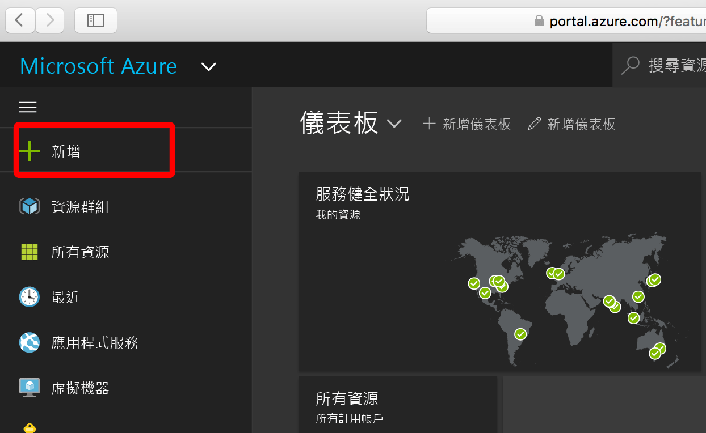
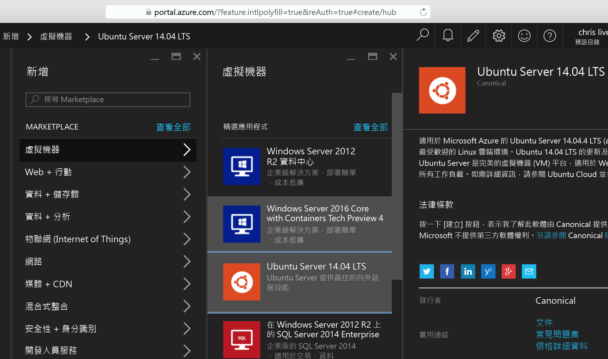
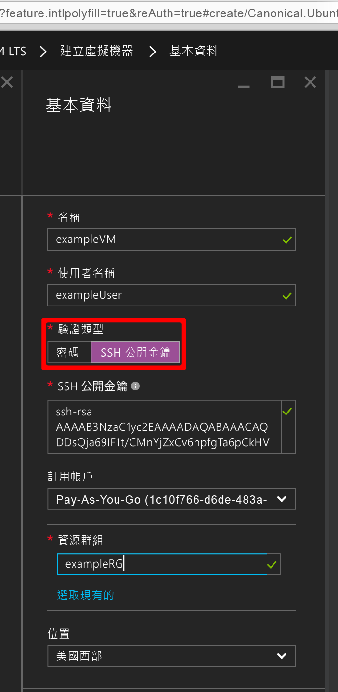
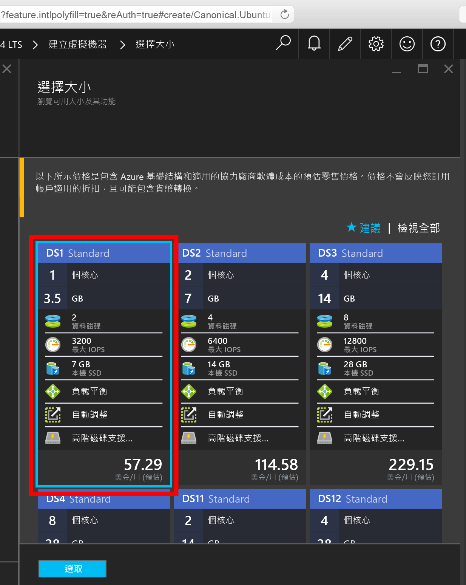
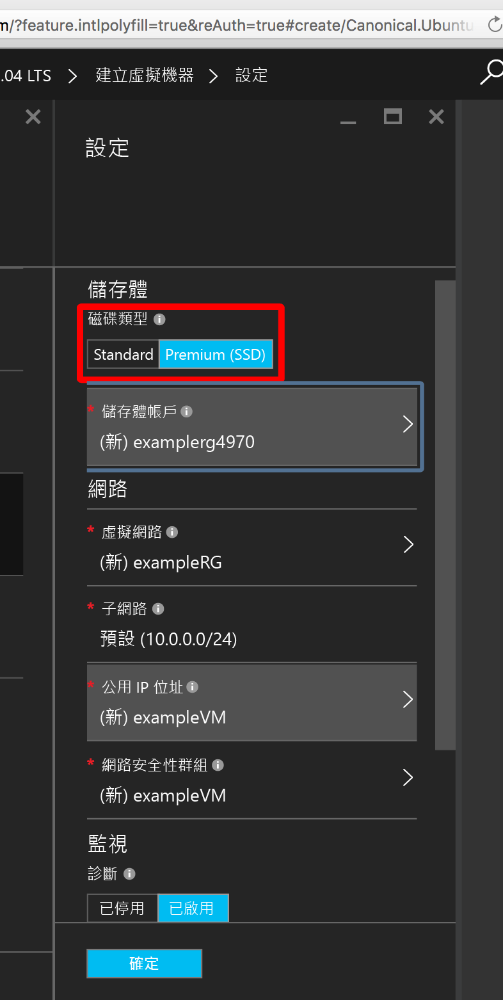
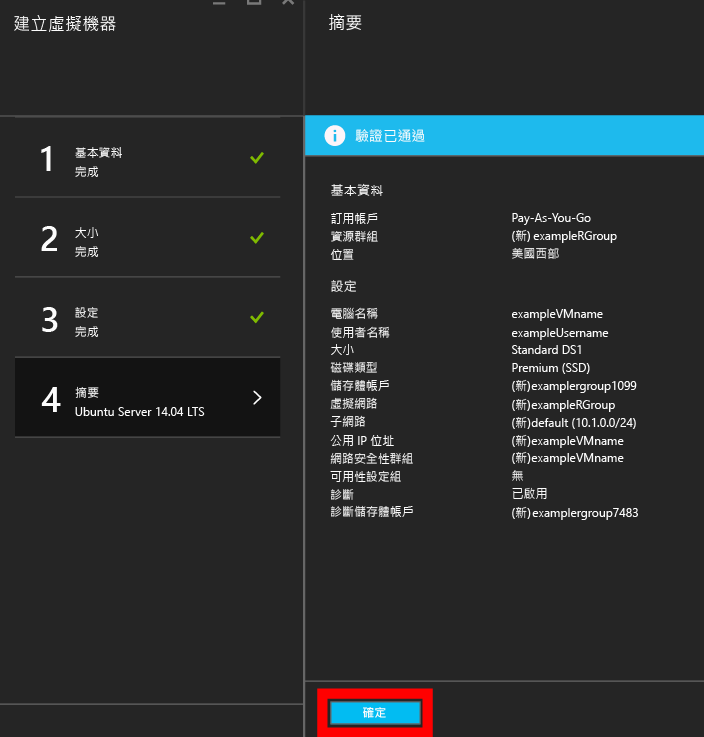
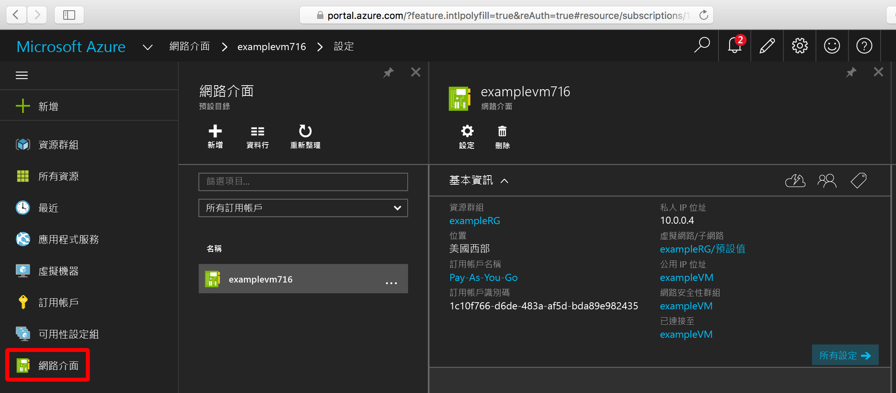
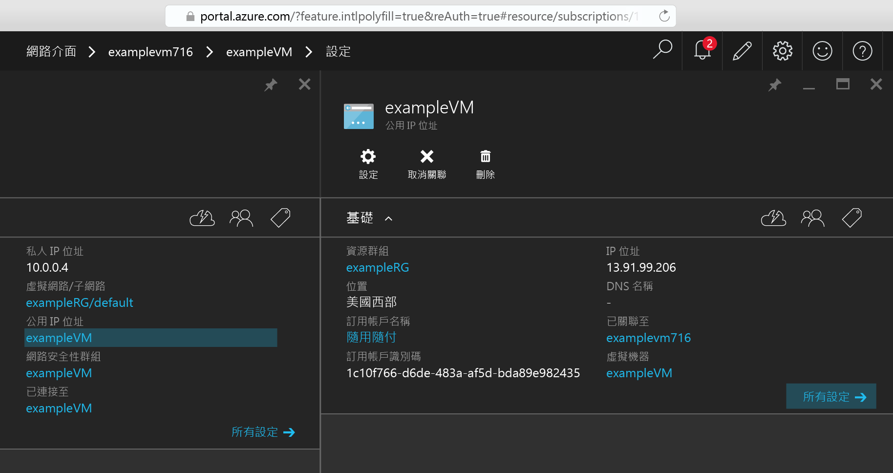

<properties
    pageTitle="使用 Azure 入口網站建立 Linux VM | Microsoft Azure"
    description="使用 Azure 入口網站建立 Linux VM。"
    services="virtual-machines-linux"
    documentationCenter=""
    authors="vlivech"
    manager="timlt"
    editor=""
    tags="azure-resource-manager"
/>

<tags
    ms.service="virtual-machines-linux"
    ms.workload="infrastructure-services"
    ms.tgt_pltfrm="vm-linux"
    ms.devlang="na"
    ms.topic="hero-article"
    ms.date="04/29/2016"
    ms.author="v-livech"
/>

# 使用入口網站在 Azure 上建立 Linux VM

本文將說明如何使用 [Azure 入口網站](https://portal.azure.com/)快速建立 Linux 虛擬機器。僅有的需求是 [Azure 帳戶](https://azure.microsoft.com/pricing/free-trial/)和 [SSH 公開和私密金鑰檔案](virtual-machines-linux-mac-create-ssh-keys.md)。

[AZURE.NOTE] 如果您選擇使用密碼來保護 VM 的存取，則密碼必須大於 12 個字元，並且有至少一個大寫字元、至少一個小寫字元、至少一個特殊字元和至少一個數字。


1. 以您的 Azure 帳戶身分識別登入 Azure 入口網站，按一下左上角的 [+ 新增]︰

    

2. 按一下 [Marketplace] 中的 [虛擬機器]，然後按一下 [精選應用程式] 映像清單中的 [Ubuntu Server 14.04 LTS]。確認下方的部署模型是 `Resource Manager`，然後按一下 [建立]。

    

3. 在 [基本概念] 頁面上，輸入︰
    - VM 的名稱
    - 系統管理員的使用者名稱
    - 要設定為 [SSH 公開金鑰] 的驗證類型
    - SSH 公開金鑰做為字串 (根據預設，來自您的 `~/.ssh/` 目錄)
    - 資源群組名稱 (以建立新的部署群組)，或選取現有的群組

    以及按一下 [確定] 繼續執行並選擇 VM 大小，看起來應該如下所示︰

    

4. 選擇 [DS1] 大小 (這會在進階 SSD 上安裝 Ubuntu)，然後按一下 [選取] 進行設定。

    

5. 在 [設定] 中，保留 [儲存體] 和 [網路] 的預設值，然後按一下 [確定] 來檢視摘要。請注意，磁碟類型已藉由選擇 DS1 (**S** 表示 SSD) 設定為進階 SSD。

    

6. 確認新的 Ubuntu VM 的設定，然後按一下 [確定]。

    

7. 開啟入口網站儀表板並 [網路介面] 中選擇您的 NIC

    

8. 開啟 NIC 設定之下的公用 IP 位址功能表

    

9. 使用 SSH 公開金鑰透過 SSH 連接到公用 IP

```
ssh -i ~/.ssh/azure_id_rsa ubuntu@13.91.99.206
```

## 後續步驟

現在您已經快速建立一個用於測試或示範用途的 Linux VM。若要建立為您的基礎結構自訂的 Linux VM，您可以依照以下任何文章執行。

- [使用範本在 Azure 上建立 Linux VM](virtual-machines-linux-cli-deploy-templates.md)
- [使用範本在 Azure 上建立受 SSH 保護的 Linux VM](virtual-machines-linux-create-ssh-secured-vm-from-template.md)
- [使用 CLI 建立 Linux VM](virtual-machines-linux-create-cli-complete.md)

這些文章可幫您開始建置 Azure 基礎結構，以及多種專屬和開放原始碼基礎結構部署、組態和協調流程工具。

<!---HONumber=AcomDC_0608_2016-->