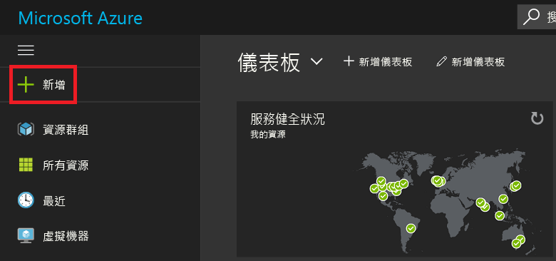
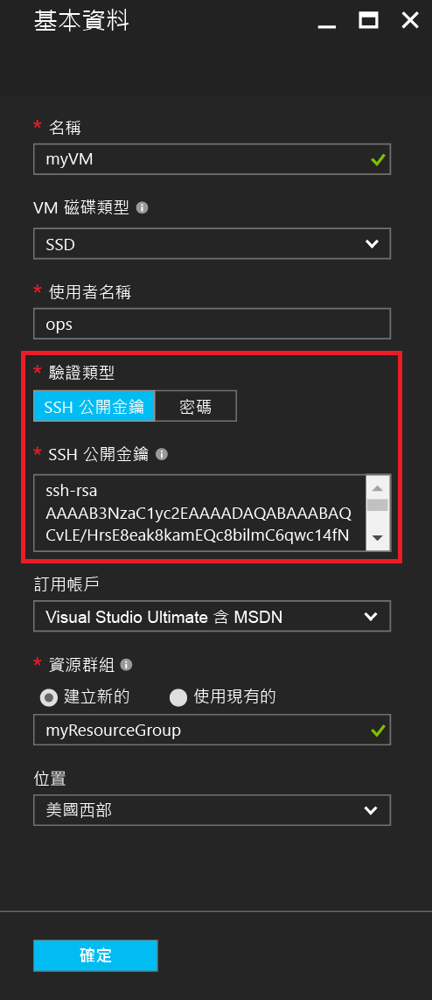
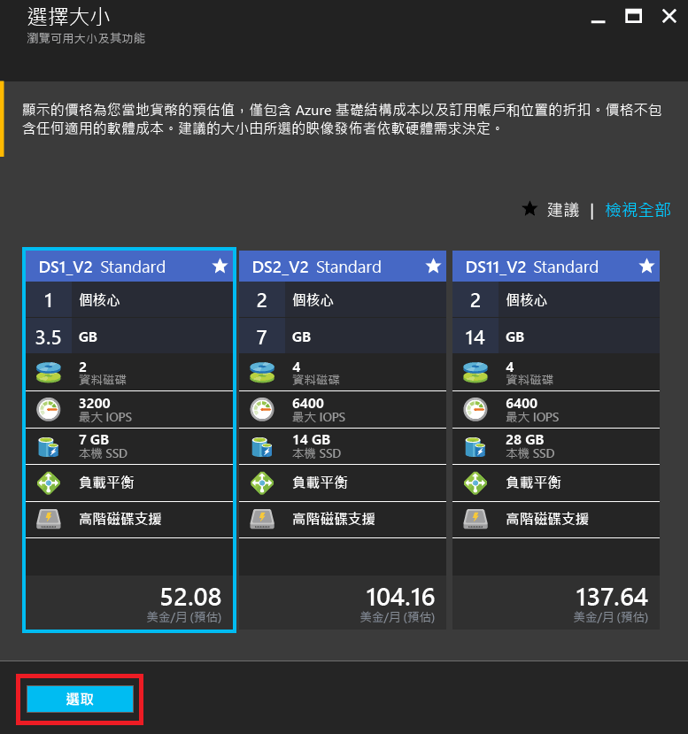
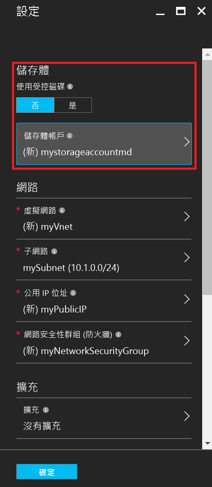
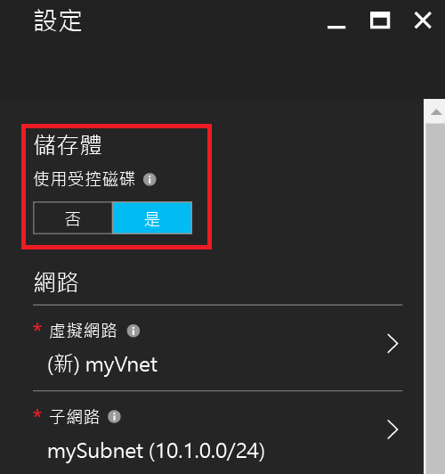
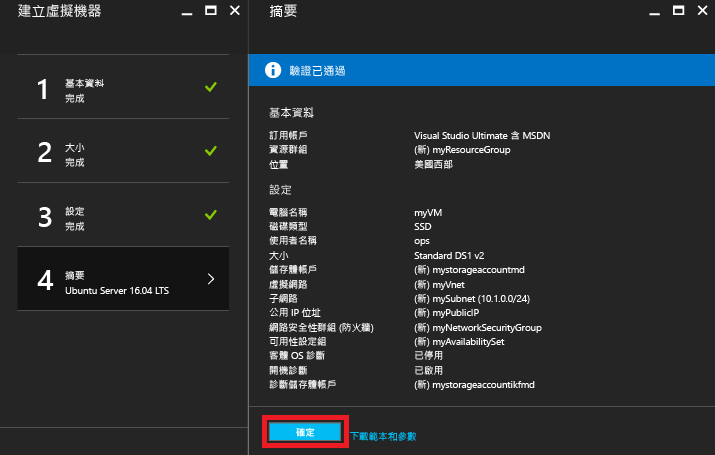
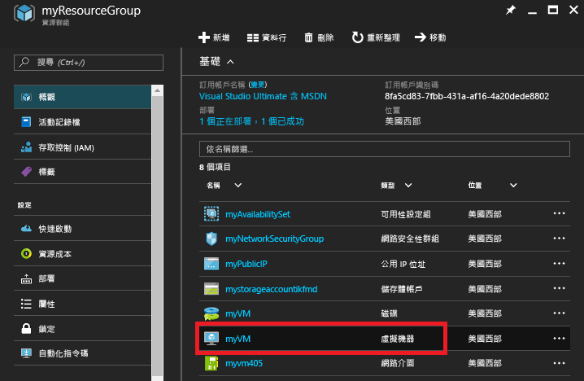
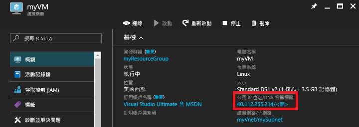

# <a name="create-a-linux-vm-on-azure-using-the-portal"></a>使用入口網站在 Azure 上建立 Linux VM
本文將說明如何使用 [Azure 入口網站](https://portal.azure.com/)建立 Linux 虛擬機器。

這些需求包括：

* [一個 Azure 帳戶](https://azure.microsoft.com/pricing/free-trial/)
* [SSH 公開金鑰和私密金鑰檔案](virtual-machines-linux-mac-create-ssh-keys.md?toc=%2fazure%2fvirtual-machines%2flinux%2ftoc.json)

## <a name="sign-in"></a>Sign in
使用您的 Azure 帳戶身分識別登入 Azure 入口網站。 按一下左下角的 [+新增]：



## <a name="choose-vm"></a>選擇 VM
按一下 [Marketplace] 中的 [計算]，然後選取 [精選 App] 映像清單中的 [Ubuntu Server 16.04 LTS]。  確認下方的部署模型是 `Resource Manager`，然後按一下 [建立]。


## <a name="enter-vm-options"></a>輸入 VM 選項
在 **基本概念** 頁面上，輸入︰

* VM 的名稱
* VM 磁碟類型 (預設為 SSD﹐或 HDD)
* 系統管理員的使用者名稱
* 將 [驗證類型] 設定為 [SSH 公開金鑰]
* SSH 公開金鑰做為字串 (來自您的 `~/.ssh/` 目錄)
* 資源群組名稱﹐或選取現有的資源群組

然後按一下 [確定] 以繼續。 刀鋒視窗應該類似下列螢幕擷取畫面：



## <a name="choose-vm-size"></a>選擇 VM 大小
選擇 VM 大小。 下列範例選擇 **DS1_V2 標準**，其在進階 SSD 上安裝 Ubuntu。 VM 大小中的 **S** 表示 SSD 支援。 按一下 [選取] 進行設定。



## <a name="storage-and-network"></a>儲存體和網路
在 [設定] 刀鋒視窗中，您可以選擇對您的 VM 使用 Azure 受控磁碟。 目前的預設設定為使用非受控磁碟。 Azure 受控磁碟是由 Azure 平台處理，不需要任何準備或位置來儲存它們。 如需 Azure 受控磁碟的詳細資訊，請參閱 [Azure 受控磁碟概觀](../storage/storage-managed-disks-overview.md)。 若為非受控磁碟，您需要為您的虛擬硬碟建立或選取儲存體帳戶︰



如果您選擇使用 Azure 受控磁碟，則沒有額外的儲存體選項需要設定，如下列範例所示︰



保留其餘網路設定做為預設值。

## <a name="confirm-vm-settings-and-launch"></a>確認 VM 的設定並啟動
確認新的 Ubuntu VM 的設定，然後按一下 [確定] 。



## <a name="select-the-vm-resource"></a>選取 VM 資源
開啟入口網站首頁，然後選取左上角功能表中的 [資源群組]。 如有需要﹐按一下功能表頂端的三條橫線以展開清單，如下所示︰


選取資源群組，然後按一下新的 VM：



## <a name="find-the-public-ip"></a>尋找公用 IP
檢視指派給您的 VM 的**公用 IP 位址**：



## <a name="ssh-to-the-vm"></a>透過 SSH 連接到 VM
使用 SSH 公開金鑰透過 SSH 連接到公用 IP。  從 Mac 或 Linux 工作站，您可以直接從終端機進行 SSH。 如果您位於 Windows 工作站上，您需要使用 PuTTY、MobaXTerm 或 Cygwin 來透過 SSH 連接到 Linux。  如果您還沒有這麼做，這裡有文件可讓您的 Windows 工作站準備好透過 SSH 連接到 Linux。

[如何在 Azure 上搭配 Windows 使用 SSH 金鑰](virtual-machines-linux-ssh-from-windows.md?toc=%2fazure%2fvirtual-machines%2flinux%2ftoc.json)

```
ssh -i ~/.ssh/azure_id_rsa ops@40.112.255.214
```

## <a name="next-steps"></a>後續步驟
現在您已經快速建立一個用於測試或示範用途的 Linux VM。 若要建立為您的基礎結構自訂的 Linux VM，您可以依照以下任何文章執行。

* [使用範本在 Azure 上建立 Linux VM](virtual-machines-linux-cli-deploy-templates.md?toc=%2fazure%2fvirtual-machines%2flinux%2ftoc.json)
* [使用範本在 Azure 上建立受 SSH 保護的 Linux VM](virtual-machines-linux-create-ssh-secured-vm-from-template.md?toc=%2fazure%2fvirtual-machines%2flinux%2ftoc.json)
* [使用 CLI 建立 Linux VM](virtual-machines-linux-create-cli-complete.md?toc=%2fazure%2fvirtual-machines%2flinux%2ftoc.json)


