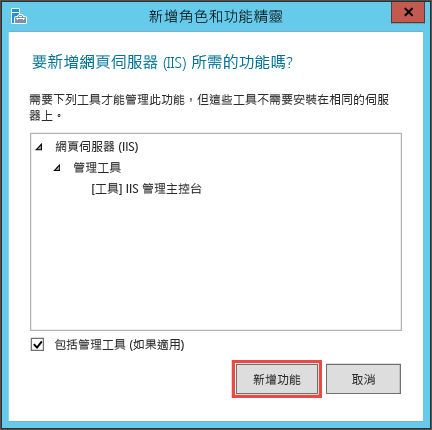
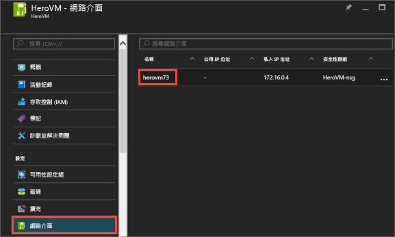
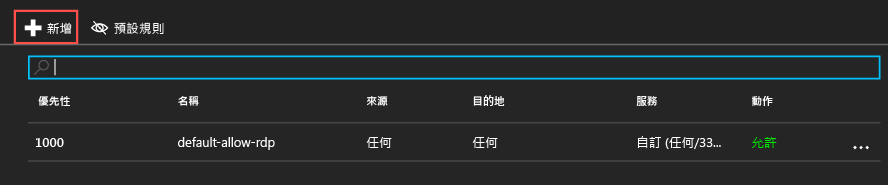
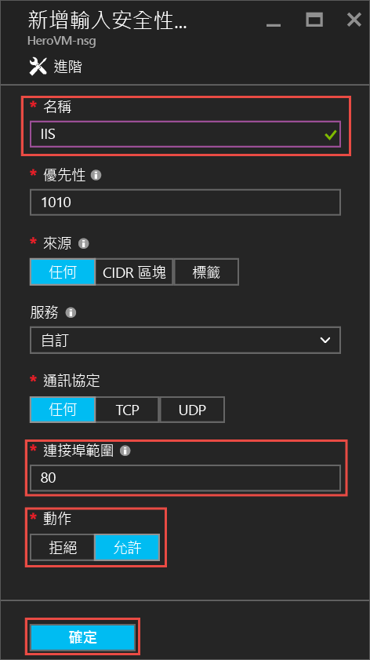
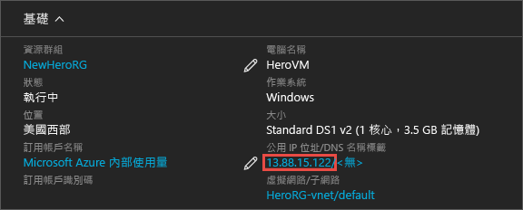
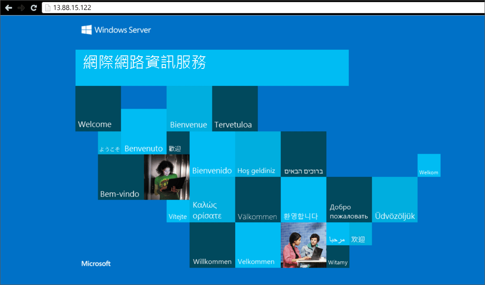

<properties
	pageTitle="建立第一個 Windows VM | Microsoft Azure"
	description="了解如何使用 Azure 入口網站建立第一個 Windows 虛擬機器。"
	keywords="Windows 虛擬機器,建立虛擬機器,虛擬電腦,設定虛擬機器"
	services="virtual-machines-windows"
	documentationCenter=""
	authors="cynthn"
	manager="timlt"
	editor=""
	tags="azure-resource-manager"/>
<tags
	ms.service="virtual-machines-windows"
	ms.workload="infrastructure-services"
	ms.tgt_pltfrm="vm-windows"
	ms.devlang="na"
	ms.topic="hero-article"
	ms.date="08/29/2016"
	ms.author="cynthn"/>

# 在 Azure 入口網站中建立第一個 Windows 虛擬機器

本教學課程示範使用 Azure 入口網站建立 Windows VM 有多麼容易，只需數分鐘。

如果您沒有 Azure 訂用帳戶，則只需要幾分鐘的時間就可以建立[免費帳戶](https://azure.microsoft.com/free/)。

以下是本教學課程的[視訊逐步解說](https://channel9.msdn.com/Blogs/Azure-Documentation-Shorts/Create-A-Virtual-Machine-Running-Windows-In-The-Azure-Preview-Portal)。

## 從 Marketplace 選擇 VM 映像

我們使用 Windows Server 2012 R2 資料中心映像做為範例，這只是 Azure 提供眾多映像中的一種。您的映像選擇取決於訂用帳戶。例如，桌面映像可能可供 [MSDN 訂閱者](https://azure.microsoft.com/pricing/member-offers/msdn-benefits-details/?WT.mc_id=A261C142F)使用。

1. 登入 [Azure 入口網站](https://portal.azure.com)。

2. 在 [中樞] 功能表上，依序按一下 [新增] > [虛擬機器] > [Windows Server 2012 R2 資料中心]。

	

3. 在 [Windows Server 2012 R2 資料中心] 刀鋒視窗的 [選取部署模型] 之下，驗證是否已選取 [Resource Manager]。按一下 [建立]。

	

## 建立 Windows 虛擬機器

選取映像之後，您可以針對多數組態使用 Azure 的預設設定，並快速建立虛擬機器。

1. 在 [基本概念] 刀鋒視窗上，輸入虛擬機器的 [名稱]。名稱必須為 1-15 個字元，不能包含特殊字元。

2. 輸入將用來在 VM 上建立本機帳戶的 [使用者名稱] 及強式 [密碼]。此本機帳戶用來登入及管理 VM。

	密碼長度必須介於 8-123 個字元，且符合下列四個複雜性需求的其中三項：1 個小寫字元、1 個大寫字元、1 個數字和 1 個特殊字元。進一步了解[使用者名稱和密碼需求](virtual-machines-windows-faq.md#what-are-the-username-requirements-when-creating-a-vm)。

3. 選取現有的[資源群組](../resource-group-overview.md#resource-groups)，或輸入新群組的名稱。輸入 Azure 資料中心的 [位置]，例如 [美國西部]。

4. 當您完成時，按一下 [確定] 繼續下一個區段。

	![顯示用於設定 Azure VM 之 [基本概念] 刀鋒視窗上的設定的螢幕擷取畫面](./media/virtual-machines-windows-hero-tutorial/basics-blade.png)

	
5. 選擇 VM [大小](virtual-machines-windows-sizes.md)，然後按一下 [選取] 以繼續。

	![顯示您可以選取之 Azure VM 大小的 [大小] 刀鋒視窗的螢幕擷取畫面](./media/virtual-machines-windows-hero-tutorial/size-blade.png)

6. 在 [設定] 刀鋒視窗上，您可以變更儲存體和網路選項。在本教學課程中，接受預設設定。如果您選取支援的虛擬機器大小，可以藉由選取 [磁碟類型] 下的 [進階 (SSD)] 嘗試進階儲存體。當您完成變更時，請按一下 [確定]。

	![顯示可在其中設定 Azure VM 選用功能之 [設定] 刀鋒視窗的螢幕擷取畫面](./media/virtual-machines-windows-hero-tutorial/settings-blade.png)

7. 按一下 [摘要] 以檢閱您的選擇。當您看到 [通過驗證] 訊息時，請按一下 [確定]。

	![顯示針對 Azure VM 所做之設定選擇的 [摘要] 頁面的螢幕擷取畫面](./media/virtual-machines-windows-hero-tutorial/summary-blade.png)

8. 當 Azure 建立虛擬機器時，您可以在 [中樞] 功能表的 [虛擬機器] 下追蹤進度。

## 連線至虛擬機器並登入

1.	在 [中樞] 功能表上，按一下 [虛擬機器]。

2.	然後從清單中選取虛擬機器。

3. 在虛擬機器的刀鋒視窗中，按一下 [**連線**]。這會建立並下載遠端桌面通訊協定檔案 (.rdp 檔案)，該檔案就像是用來連接到您的電腦的捷徑。您可能想要將此檔案儲存至桌面，以便存取。**開啟**此檔案以連接到您的 VM。

	

4. 您會收到警告，表示 .rdp 來自未知的發行者。這是正常現象。在 [遠端桌面] 視窗中按一下 [連接] 以繼續。

	

5. 在 [Windows 安全性] 視窗中，針對您建立 VM 時所建立的本機帳戶，輸入使用者名稱和密碼。使用者名稱會輸入為 vmname&#92;username，然後按一下 [確定]。

	
 	
6.	您會收到警告，表示無法驗證憑證。這是正常現象。按一下 [是] 來確認虛擬機器的身分識別，並完成登入。

	

如果嘗試連線時遇到問題，請參閱[針對執行 Windows 之 Azure 虛擬機器的遠端桌面連線進行疑難排解](virtual-machines-windows-troubleshoot-rdp-connection.md)。

您現在可以開始使用虛擬機器，就如同操作任何其他伺服器一樣。

## 在您的 VM 上安裝 IIS

您現在已登入 VM，我們將安裝一個伺服器角色，以便您進行更多試驗。

1. 開啟 [伺服器管理員] \(如果尚未開啟)。按一下 [啟動] 功能表，然後按一下 [伺服器管理員]。
2. 在 [伺服器管理員] 中，選取左窗格中的 [本機伺服器]。
3. 在功能表中，選取 [管理] > [新增角色及功能]。
4. 在 [新增角色及功能精靈] 的 [安裝類型] 頁面上，選擇 [角色型或功能型安裝]，然後按 [下一步]。

	![顯示 [安裝類型] 的 [新增角色及功能精靈] 索引標籤的螢幕擷取畫面。](./media/virtual-machines-windows-hero-tutorial/role-wizard.png)

5. 從伺服器集區中選取 VM，然後按 [下一步]。
6. 在 [伺服器角色] 頁面上，選取 [Web 伺服器 (IIS)]。

	![顯示 [伺服器角色] 的 [新增角色及功能精靈] 索引標籤的螢幕擷取畫面。](./media/virtual-machines-windows-hero-tutorial/add-iis.png)

7. 在新增 IIS 所需功能的相關快顯視窗中，確定已選取 [包含管理工具]，然後按一下 [新增功能]。當快顯視窗關閉時，請在精靈中按 [下一步]。

	

8. 在功能頁面上，按 [下一步]。
9. 在 [Web 伺服器角色 (IIS)] 頁面上，按 [下一步]。
10. 在 [角色服務] 頁面上，按 [下一步]。
11. 在 [確認] 頁面中上，按一下 [安裝]。
12. 安裝完成時，按一下精靈上的 [關閉]。

## 開啟連接埠 80 

為了讓您的 VM 透過連接埠 80 接收輸入流量，您必須將輸入規則新增至網路安全性群組。

1. 開啟 [Azure 入口網站](https://portal.azure.com)。
2. 在 [虛擬機器] 之下選取您所建立的 VM。
3. 在虛擬機器設定之下，選取 [網路介面]，然後選取現有的網路介面。

	

4. 在網路介面的 [基本資訊] 中，按一下 [網路安全性群組]。

	![顯示網路介面的 [基本資訊] 區段的螢幕擷取畫面。](./media/virtual-machines-windows-hero-tutorial/select-nsg.png)

5. 在 NSG 的 [基本資訊] 刀鋒視窗中，您應該會有一個 **default-allow-rdp** 的現有預設輸入規則可讓您登入 VM。您將加入另一個允許 IIS 流量的輸入規則。按一下 [輸入安全性規則]。

	![顯示 NSG 的 [基本資訊] 區段的螢幕擷取畫面。](./media/virtual-machines-windows-hero-tutorial/inbound.png)

6. 在 [輸入安全性規則] 中，按一下 [新增]。

	

7. 在 [輸入安全性規則] 中，按一下 [新增]。在連接埠範圍中輸入 **80**，請確定已選取 [允許]。完成時按一下 [確定]。

	
 
如需 NSG、輸入和輸出規則的詳細資訊，請參閱[允許使用 Azure 入口網站從外部存取您的 VM](virtual-machines-windows-nsg-quickstart-portal.md)。
 
## 連接到預設 IIS 網站

1. 在 Azure 入口網站中，按一下 [虛擬機器]，然後選取您的 VM。
2. 在 [基本資訊] 刀鋒視窗中，複製您的 [公用 IP 位址]。

	

2. 開啟瀏覽器並在網址列中，輸入您的公用 IP 位址︰http://<publicIPaddress>，然後按一下 **Enter** 前往該位址。
3. 您的瀏覽器應該會顯示預設 IIS 網頁，該頁面如下所示︰

	

## 停止 VM

這是停止 VM 的好主意，所以您不會在未實際使用時產生費用。只要按一下 [停止] 按鈕，然後按一下 [是]。

	
只要按一下 [啟動] 按鈕，以在您準備再次使用 VM 時予以重新啟動。

## 後續步驟

* 您也可以體驗[附加資料磁碟](virtual-machines-windows-attach-disk-portal.md)至虛擬機器。資料磁碟可為虛擬機器提供更多的儲存空間。

* 您也可以[使用 Powershell 建立 Windows VM](virtual-machines-windows-ps-create.md) 或使用 Azure CLI [建立 Linux 虛擬機器](virtual-machines-linux-quick-create-cli.md)。

* 如果您對自動部署有興趣，請參閱[使用 Resource Manager 範本建立 Windows 虛擬機器](virtual-machines-windows-ps-template.md)。

<!---HONumber=AcomDC_0831_2016-->