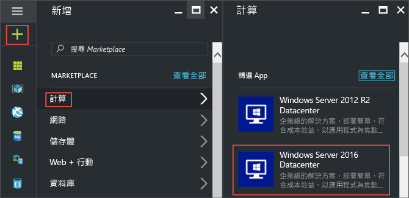
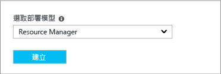
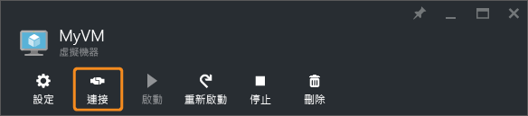
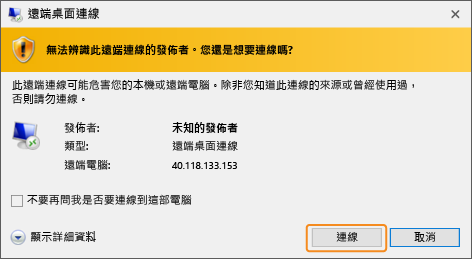
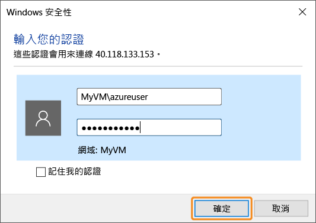
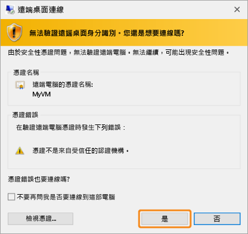
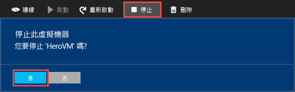

# 在 Azure 入口網站中建立第一個 Windows 虛擬機器
本教學課程示範使用 Azure 入口網站建立 Windows 虛擬機器 (VM) 有多麼容易，只需數分鐘。  

如果您沒有 Azure 訂用帳戶，請在開始前建立 [免費帳戶](https://azure.microsoft.com/free/) 。

## 從 Marketplace 選擇 VM 映像
我們使用 Windows Server 2012 R2 資料中心映像做為範例，這只是 Azure 提供眾多映像中的一種。 您的映像選擇取決於訂用帳戶。 例如，某些桌面映像可供 [MSDN 訂閱者](https://azure.microsoft.com/pricing/member-offers/msdn-benefits-details/?WT.mc_id=A261C142F)使用。

1. 登入 [Azure 入口網站](https://portal.azure.com)。
2. 在中樞功能表上，依序按一下 [新增] > [計算] > [Windows Server 2012 R2 資料中心]。
   
    
3. 在 [Windows Server 2012 R2 資料中心] 刀鋒視窗的 [選取部署模型] 中，驗證是否已選取 [Resource Manager]。 按一下 [建立] 。
   
    

## 建立 Windows 虛擬機器
選取映像之後，您可以使用預設設定並快速建立虛擬機器。

1. 在 [基本概念] 刀鋒視窗上，輸入虛擬機器的 [名稱]。 名稱必須為 1-15 個字元，不能包含特殊字元。
2. 輸入將用來在 VM 上建立本機帳戶的 [使用者名稱] 及強式 [密碼]。 此本機帳戶用來登入及管理 VM。 
   
    密碼長度必須是 8-123 個字元，且符合下列四個複雜性需求的其中三項：1 個小寫字元、1 個大寫字元、1 個數字和 1 個特殊字元。 進一步了解 [使用者名稱和密碼需求](virtual-machines-windows-faq.md#what-are-the-username-requirements-when-creating-a-vm)。
3. 選取現有的[資源群組](../azure-resource-manager/resource-group-overview.md#resource-groups)，或輸入新群組的名稱。 輸入 Azure 資料中心的 [位置]，例如 [美國西部]。 
4. 當您完成時，按一下 [確定]  繼續下一個區段。 
   
    ![顯示用於設定 Azure VM 之 **[基本概念]** 刀鋒視窗上的設定的螢幕擷取畫面](./media/virtual-machines-windows-hero-tutorial/basics-blade.png)
5. 選擇 VM [大小](virtual-machines-windows-sizes.md?toc=%2fazure%2fvirtual-machines%2fwindows%2ftoc.json)，然後按一下 [選取] 以繼續。 
   
    ![顯示您可以選取之 Azure VM 大小的 [大小] 刀鋒視窗的螢幕擷取畫面](./media/virtual-machines-windows-hero-tutorial/size-blade.png)
6. 在 [設定]  刀鋒視窗上，您可以變更儲存體和網路選項。 在本教學課程中，接受預設設定。 如果您選取支援的虛擬機器大小，可以藉由選取 [磁碟類型] 中的 [進階 (SSD)] 嘗試 Azure 進階儲存體。 當您完成變更時，請按一下 [確定] 。
   
    ![顯示可在其中設定 Azure VM 選用功能之 [設定] 刀鋒視窗的螢幕擷取畫面](./media/virtual-machines-windows-hero-tutorial/settings-blade.png)
7. 按一下 [摘要]  以檢閱您的選擇。 當您看到 [通過驗證] 訊息時，請按一下 [確定]。
   
    ![顯示針對 Azure VM 所做之設定選擇的 [摘要] 頁面的螢幕擷取畫面](./media/virtual-machines-windows-hero-tutorial/summary-blade.png)
8. 當 Azure 建立虛擬機器時，您可以在 [中樞] 功能表的 [虛擬機器]  中追蹤進度。 

## 連線至虛擬機器並登入
1. 在 [中樞] 功能表上，按一下 [虛擬機器] 。
2. 然後從清單中選取虛擬機器。
3. 在虛擬機器的刀鋒視窗中，按一下 [ **連線**]。 這會建立並下載遠端桌面通訊協定檔案 (.rdp 檔案)，該檔案就像是用來連接到您的電腦的捷徑。 您可能想要將此檔案儲存至桌面，以便存取。 **開啟** 此檔案以連接到您的 VM。
   
    
4. 您會收到警告，表示 .rdp 來自未知的發行者。 這是正常現象。 在 [遠端桌面] 視窗中按一下 [連接]  以繼續。
   
    
5. 在 [Windows 安全性] 視窗中，針對您建立 VM 時所建立的本機帳戶，輸入使用者名稱和密碼。 使用者名稱會輸入為 vmname&#92;username，然後按一下 [確定]。
   
    
6. 您會收到警告，表示無法驗證憑證。 這是正常現象。 按一下 [是]  來確認虛擬機器的身分識別，並完成登入。
   
   

如果嘗試連線時遇到問題，請參閱 [針對執行 Windows 之 Azure 虛擬機器的遠端桌面連線進行疑難排解](virtual-machines-windows-troubleshoot-rdp-connection.md?toc=%2fazure%2fvirtual-machines%2fwindows%2ftoc.json)。

您現在可以開始使用虛擬機器，如同操作任何其他伺服器一樣。

## 可選用︰停止 VM
這是停止 VM 的好主意，所以您不會在未實際使用時產生費用。 只要按一下 [停止] 再按一下 [是]。

按一下 [啟動]  按鈕，以在您準備再次使用 VM 時予以重新啟動。

## 後續步驟
* 您可以 [安裝 IIS](virtual-machines-windows-hero-role.md?toc=%2fazure%2fvirtual-machines%2fwindows%2ftoc.json)來試試新的 VM。 本教學課程也說明如何使用網路安全性群組 (NSG) 向傳入的 web 流量開啟連接埠 80。 
* 您也可以[使用 PowerShell 建立 Windows VM](virtual-machines-windows-ps-create.md?toc=%2fazure%2fvirtual-machines%2fwindows%2ftoc.json) 或使用 Azure CLI [建立 Linux 虛擬機器](virtual-machines-linux-quick-create-cli.md?toc=%2fazure%2fvirtual-machines%2flinux%2ftoc.json)。
* 如果您對自動部署有興趣，請參閱 [使用 Resource Manager 範本建立 Windows 虛擬機器](virtual-machines-windows-ps-template.md?toc=%2fazure%2fvirtual-machines%2fwindows%2ftoc.json)。

<!--HONumber=Nov16_HO3-->

