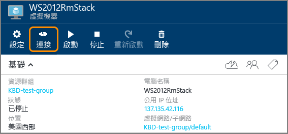

<properties
	pageTitle="在 Azure 入口網站中建立 Windows VM | Microsoft Azure"
	description="了解如何使用 Azure 入口網站建立 Windows 虛擬機器。"
	keywords="Windows 虛擬機器,建立虛擬機器,虛擬電腦,設定虛擬機器"
	services="virtual-machines-windows"
	documentationCenter=""
	authors="cynthn"
	manager="timlt"
	editor=""
	tags="azure-resource-manager"/>
<tags
	ms.service="virtual-machines-windows"
	ms.workload="infrastructure-services"
	ms.tgt_pltfrm="vm-windows"
	ms.devlang="na"
	ms.topic="hero-article"
	ms.date="04/14/2016"
	ms.author="cynthn"/>

# 在 Azure 入口網站中建立 Windows 虛擬機器

本教學課程示範使用 Azure 入口網站建立 Windows VM 有多麼容易，只需數分鐘。我們使用 Windows Server 2012 R2 資料中心映像做為範例，這只是 Azure 提供眾多映像中的一種。您的映像選擇取決於訂用帳戶。例如，桌面映像可能可供 [MSDN 訂閱者](https://azure.microsoft.com/pricing/member-offers/msdn-benefits-details/?WT.mc_id=A261C142F)使用。

如果您沒有 Azure 訂用帳戶，則只需要幾分鐘的時間就可以建立[免費帳戶](https://azure.microsoft.com/free/)。

## 影片逐步解說

以下是本教學課程的[視訊逐步解說](https://channel9.msdn.com/Blogs/Azure-Documentation-Shorts/Create-A-Virtual-Machine-Running-Windows-In-The-Azure-Preview-Portal)。

## 從 Marketplace 選取 Windows 2012 R2 虛擬機器映像

1. 登入 [Azure 入口網站](https://portal.azure.com)。

2. 在 [中樞] 功能表上，依序按一下 [新增] > [計算] > [Windows Server 2012 R2 資料中心]。

	

3. 在 [Windows Server 2012 R2 資料中心] 頁面中，選取 [選取部署模型] 下的 [資源管理員]。按一下 [建立]。

	

## 建立 Windows 虛擬機器

選取映像之後，您可以針對多數組態使用 Azure 的預設設定，並快速建立虛擬機器。

1. 在 [建立虛擬機器] 刀鋒視窗中，按一下 [基本]。

2. 輸入您要用於虛擬機器的 [名稱]。名稱不能包含特殊字元。

3. 輸入系統管理 [使用者名稱]，以及強式 [密碼]。密碼長度必須介於 8-123 個字元，並且具有至少 3 個下列項目：1 個小寫字元、1 個大寫字元、1 個數字和 1 個特殊字元。**您需要使用者名稱和密碼才能連線至虛擬機器**。

4. 如果您有多個訂用帳戶，指定一個新的虛擬機器。選取新的或現有的[資源群組](../resource-group-overview/#resource-groups)和 Azure 資料中心**位置**，例如**美國西部**。

	

	
2. 按一下 [大小]，然後選取符合需求的適當虛擬機器大小。每個大小會指定計算核心、記憶體和其他功能的數目，例如支援將會影響價格的進階儲存體。Azure 會自動根據您選擇的映像來建議特定大小。

	

	>[AZURE.NOTE] 進階儲存體可供某些區域的 DS 系列虛擬機器使用。進階儲存體對於如資料庫這類資料密集的工作負載是最佳的儲存體選項。如需詳細資訊，請參閱[高階儲存體：Azure 虛擬機器工作負載適用的高效能儲存體](../storage/storage-premium-storage.md)。

3. 按一下 [設定] 以查看新虛擬機器的儲存體和網路設定。若為第一個虛擬機器，通常您可以接受預設的設定。如果您選取支援的虛擬機器大小，可以藉由選取 [磁碟類型] 下的 [進階 (SSD)] 嘗試進階儲存體。

	

6. 按一下 [摘要] 以檢閱您的組態選擇。當您檢閱或更新設定後，請按一下 [建立]。

	

8. 當 Azure 建立虛擬機器時，您可以在 [中樞] 功能表的 [虛擬機器] 下追蹤進度。

## 連線至虛擬機器並登入

1. 如果您尚未登入 [Azure 入口網站](https://portal.azure.com/)，請先登入。

2.	在 [中樞] 功能表上，按一下 [虛擬機器]。

3.	然後從清單中選取虛擬機器。

4. 在虛擬機器的刀鋒視窗中，按一下 [**連線**]。

	

[AZURE.INCLUDE [virtual-machines-log-on-win-server](../../includes/virtual-machines-log-on-win-server.md)]

如果嘗試連線時遇到問題，請參閱[針對以 Windows 為基礎的 Azure 虛擬機器的遠端桌面連線進行疑難排解](virtual-machines-windows-troubleshoot-rdp-connection.md)。

您現在可以開始使用虛擬機器，就如同操作任何其他伺服器一樣。

## 後續步驟

* 您也可以[使用 Powershell 建立 Windows VM](virtual-machines-windows-ps-create.md) 或使用 Azure CLI [建立 Linux 虛擬機器](virtual-machines-linux-quick-create-cli.md)。

<!---HONumber=AcomDC_0427_2016-->