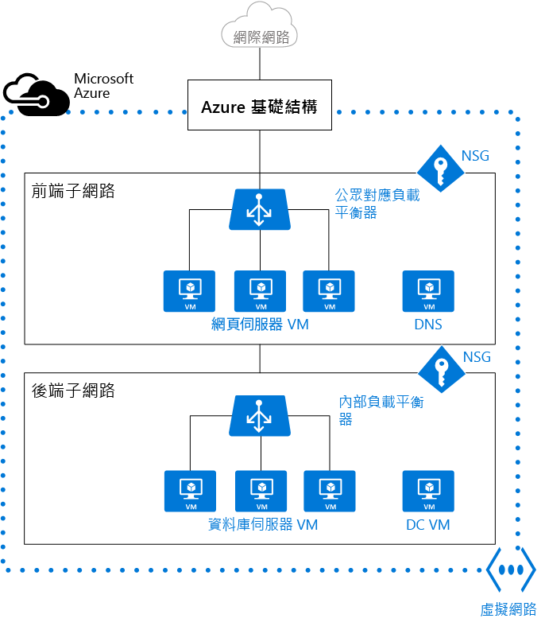

# Azure 中的虛擬網路和 Windows 虛擬機器 

當您建立 Azure 虛擬機器 (VM) 時，您必須建立[虛擬網路](../virtual-network/virtual-networks-overview.md) (VNet)，或使用現有的 VNet。 您也需要決定如何在 VNet 上存取您的 VM。 請務必[在建立資源前進行規劃](../virtual-network/virtual-network-vnet-plan-design-arm.md)，並確定您已了解[網路資源的限制](../azure-subscription-service-limits.md#networking-limits)。

在下圖中，VM 是以 Web 伺服器和資料庫伺服器表示。 每一組 VM 都會指派給 VNet 中的個別子網路。

您可以在建立 VM 前建立 VNet，也可以在建立 VM 時建立 VNet。 您必須自行建立 VNet，否則系統會在您建立 VM 時為您建立 VNet。

您可建立下列資源來支援與 VM 的通訊︰

- 網路介面
- IP 位址
- 虛擬網路和子網路

除了上述基本資源以外，您也應該考慮下列選擇性資源︰

- 網路安全性群組
- 負載平衡器 

## 網路介面

[網路介面 (NIC)](../virtual-network/virtual-network-network-interface-overview.md) 是 VM 與虛擬網路 (VNet) 之間互相連線的橋樑。 VM 必須有至少一個 NIC，但視您所建立的 VM 大小而定，可以有一個以上的 NIC。 若要了解每個 VM 大小支援幾個 NIC，請參閱 [Azure 中的虛擬機器大小](virtual-machines-windows-sizes.md)。 

如果您想要建立具有多個 NIC 的 VM，您必須建立至少有兩個 NIC 的 VM。  建立之後，您可以新增其他 NIC，直到 VM 大小所支援的數目為止，但不論 VM 大小可支援多少個 NIC，您都無法將其他 NIC 新增至僅以一個 NIC 建立的 VM。 

如果 VM 已新增至可用性設定組，則可用性設定組內的所有 VM 都必須具有一或多個 NIC。 具有多個 NIC 的 VM 不需要有相同數目的 NIC，但全都必須有至少兩個 NIC。

連接到 VM 的每個 NIC 都必須與 VM 位於相同的位置和訂用帳戶。 每個 NIC 都必須連接到與 NIC 位於相同 Azure 位置和訂用帳戶中的 VNet。 NIC 建立之後，您可以變更它所連線的子網路，但無法變更它所連線的 VNet。  連接到 VM 的每個 NIC 會被指派 MAC 位址，該 MAC 位址在 VM 刪除前不會變更。

下表列出可用於建立網路介面的方法。

| 方法 | 說明 |
| ------ | ----------- |
| Azure 入口網站 | 當您在 Azure 入口網站中建立 VM 時，系統會自動為您建立網路介面 (您無法使用您個別建立的 NIC)。 入口網站會建立只有一個 NIC 的 VM。 如果您想要建立具有多個 NIC 的 VM，您必須使用不同的方法來建立它。 |
| [Azure PowerShell](../virtual-network/virtual-network-deploy-multinic-arm-ps.md) | 使用 [New-AzureRmNetworkInterface](https://docs.microsoft.com/powershell/resourcemanager/AzureRM.Network/v1.0.13/New-AzureRmNetworkInterface) 搭配 **-PublicIpAddressId** 參數，提供您先前建立之公用 IP 位址的識別項。 |
| Azure CLI 2.0 | 若要提供您先前建立之公用 IP 位址的識別項，請使用 [az network nic create](https://docs.microsoft.com/cli/azure/network/nic#create) 搭配 **--public-ip-address** 參數。 |
| [Azure CLI](../virtual-network/virtual-network-deploy-multinic-arm-cli.md) | 若要提供您先前建立之公用 IP 位址的識別項，請使用 **azure network nic create** 搭配 **--public-ip-address** 參數。 |
| [範本](../virtual-network/virtual-network-deploy-multinic-arm-template.md) | 使用[虛擬網路中具有公用 IP 位址的網路介面](https://github.com/Azure/azure-quickstart-templates/tree/master/101-nic-publicip-dns-vnet)做為使用範本部署網路介面的指南。 |

## IP 位址 

您可以將下列 [IP 位址](../virtual-network/virtual-network-ip-addresses-overview-arm.md)類型指派給 Azure 中的 NIC：

- **公用 IP 位址** - 用來進行輸入和輸出 (不需網路位址轉譯 (NAT)) 與網際網路及其他未連接到 VNet 之 Azure 資源的通訊。 將公用 IP 位址指派給 NIC 是選擇性作業。 公用 IP 位址有象徵性費用，而每個訂用帳戶都有可用的數目上限。
- **私用 IP 位址** - 用於在 VNet、內部部署網路和網際網路 (需要 NAT) 內的通訊。 您必須將至少一個私人 IP 位址指派給 VM。 若要了解 Azure 中的 NAT，請參閱[了解 Azure 中的輸出連線](../load-balancer/load-balancer-outbound-connections.md)。

您可以將公用 IP 位址指派給 VM 或網際網路面向的負載平衡器。 您可以將私人 IP 位址指派給 VM 和內部負載平衡器。 您可使用網路介面將 IP 位址指派給 VM。

有兩種方法可將 IP 位址配置給資源：動態或靜態。 預設配置方法為動態，此方法不會在建立 IP 位址時進行配置。 然而，IP 位址會在您建立 VM 或啟動已停止的 VM 時進行配置。 此 IP 位址會在您停止或刪除 VM 時釋出。 

若要確保 VM 的 IP 位址維持不變，您可以明確地將配置方法設定為靜態。 在此情況下會立即指派 IP 位址。 只有在您刪除 VM 或將其配置方法變更為動態時，才會釋出 IP 位址。
    
下表列出可用於建立 IP 位址的方法。

| 方法 | 說明 |
| ------ | ----------- |
| [Azure 入口網站](../virtual-network/virtual-network-deploy-static-pip-arm-portal.md) | 依照預設，公用 IP 位址是動態的，而且與其相關聯的位址可能會在停止或刪除 VM 時變更。 若要保證 VM 一律使用相同的公用 IP 位址，請建立靜態公用 IP 位址。 根據預設，入口網站會在建立 VM 時將動態私人 IP 位址指派給 NIC。 您可以在 VM 建立後，將此變更為靜態。|
| [Azure PowerShell](../virtual-network/virtual-network-deploy-static-pip-arm-ps.md) | 您可使用 [New-AzureRmPublicIpAddress](https://docs.microsoft.com/powershell/resourcemanager/AzureRM.Network/v1.0.13/New-AzureRmPublicIpAddress) 搭配 [動態] 或 [靜態] 的 **-AllocationMethod** 參數。 |
| Azure CLI 2.0 | 您可使用 [az network public-ip create](https://docs.microsoft.com/cli/azure/network/public-ip#create) 搭配 [動態] 或 [靜態] 的 **--allocation-method** 參數。 |
| [Azure CLI](../virtual-network/virtual-network-deploy-static-pip-arm-cli.md) | 您可使用 **azure network public-ip create** 搭配 [動態] 或 [靜態] 的 **--allocation-method** 參數。 |
| [範本](../virtual-network/virtual-network-deploy-static-pip-arm-template.md) | 使用[虛擬網路中具有公用 IP 位址的網路介面](https://github.com/Azure/azure-quickstart-templates/tree/master/101-nic-publicip-dns-vnet)做為使用範本部署公用 IP 位址的指南。 |

建立公用 IP 位址之後，您可以將它指派給 NIC 以建立其與 VM 的關聯。

## 虛擬網路和子網路

子網路是 VNet 中的 IP 位址範圍。 您可以針對組織和安全性，將 VNet 分割成多個子網路。 VM 中的每個 NIC 都會連接到一個 VNet 中的一個子網路。 連接到 VNet 內 (相同或不同) 子網路的 NIC 不需要進行額外設定，就可以彼此通訊。

當您設定 VNet 時，您可以指定拓撲，包括可用的位址空間和子網路。 如果 VNet 要連接至其他 Vnet 或內部部署網路，您必須選取不重疊的位址範圍。 IP 位址是無法從網際網路存取的私人位址，而不可路由傳送的 IP 位址也是如此，例如 10.0.0.0/8、172.16.0.0/12 或 192.168.0.0/16。 現在，Azure 會將任何位址範圍視為私人 VNet IP 位址空間的一部分，而該位址空間僅能在 VNet、互連式 VNet 中，以及從內部部署位置進行存取。 

如果您在由他人負責內部網路的組織中工作，您應該先洽詢該人員，再選取您的位址空間。 請確定沒有重疊，並且讓他們知道您想要使用的空間，他們才不會嘗試使用相同的 IP 位址範圍。 

根據預設，子網路之間沒有任何安全界限，所以每個子網路中的 VM 都可以彼此通訊。 不過，您可以設定網路安全性群組 (NSG)，以便控制往返子網路及往返 VM 的流量。 

下表列出可用於建立 VNet 和子網路的方法。    

| 方法 | 說明 |
| ------ | ----------- |
| [Azure 入口網站](../virtual-network/virtual-networks-create-vnet-arm-pportal.md) | 如果您讓 Azure 在您建立 VM 時建立 VNet，則名稱為包含 VNet 和 **-vnet** 的資源群組名稱組合。 位址空間是 10.0.0.0/24，必要的子網路名稱是**default**，而子網路位址範圍是 10.0.0.0/24。 |
| [Azure PowerShell](../virtual-network/virtual-networks-create-vnet-arm-ps.md) | 您可使用 [New-AzureRmVirtualNetworkSubnetConfig](https://docs.microsoft.com/powershell/resourcemanager/AzureRM.Network/v1.0.13/New-AzureRmVirtualNetworkSubnetConfig) 和 [New-AzureRmVirtualNetwork](https://docs.microsoft.com/powershell/resourcemanager/AzureRM.Network/v1.0.13/New-AzureRmVirtualNetwork) 來建立子網路和 VNet。 您也可以使用 [Add-AzureRmVirtualNetworkSubnetConfig](https://docs.microsoft.com/powershell/resourcemanager/AzureRM.Network/v1.0.13/Add-AzureRmVirtualNetworkSubnetConfig) 將子網路新增至現有的 VNet。 |
| Azure CLI 2.0 | 子網路和 VNet 會在同一時間建立。 將 **--subnet-name** 參數提供給包含子網路名稱的 [az network vnet create](https://docs.microsoft.com/cli/azure/network/vnet#create)。 |
| [Azure CLI](../virtual-network/virtual-networks-create-vnet-arm-cli.md) | 將 **-n** 參數提供給包含子網路名稱的 **azure network vnet create**。 |
| [範本](../virtual-network/virtual-networks-create-vnet-arm-template-click.md) | 建立 VNet 和子網路的最簡單方式就是下載現有的範本 (例如[具有兩個子網路的虛擬網路](https://github.com/Azure/azure-quickstart-templates/tree/master/101-vnet-two-subnets))，並針對您的需求加以修改。 |

## 網路安全性群組

[網路安全性群組 (NSG)](../virtual-network/virtual-networks-nsg.md) 包含存取控制清單 (ACL) 規則的清單，可允許或拒絕子網路、NIC 或兩者的網路流量。 NSG 可與子網路或連接到子網路的個別 VM 相關聯。 當 NSG 與子網路相關聯時，ACL 規則便會套用至該子網路中的所有 VM。 此外，將 NSG 直接關聯至 NIC，即可限制個別 NIC 的流量。

NSG 包含兩組規則：輸入和輸出。 規則的優先順序在每一個集合中必須是唯一的。 每個規則都有通訊協定、來源和目的地連接埠範圍、位址前置詞、流量方向、優先順序和存取類型的屬性。 

所有 NSG 都包含一組預設規則。 預設規則無法刪除，但因為其會指派為最低優先權，因此可以由您所建立的規則覆寫預設規則。 

當您將 NSG 與 NIC 建立關聯時，NSG 中的網路存取規則只會套用到該 NIC。 如果 NSG 已套用到多重 NIC VM 上的單一 NIC，則不會影響其他 NIC 的流量。 您可以將不同的 NSG 與 NIC (或 VM，根據部署模型而定) 和 NIC 或 VM 所繫結的子網路建立關聯。 優先順序是根據流量的方向來提供。

請務必在規劃 VM 和 VNet 時[規劃](../virtual-network/virtual-networks-nsg.md#planning) NSG。

下表列出可用於建立網路安全性群組的方法。

| 方法 | 說明 |
| ------ | ----------- |
| [Azure 入口網站](../virtual-network/virtual-networks-create-nsg-arm-pportal.md) | 當您在 Azure 入口網站中建立 VM 時，NSG 會自動建立並與入口網站所建立的 NIC 產生關聯。 NSG 名稱是 VM 名稱與 **-nsg** 的組合。 此 NSG 包含一個輸入規則，其優先順序為 1000、服務設定為 RDP、通訊協定設定為 TCP、連接埠設定為 3389，而動作設定為 [允許]。 如果想要允許 VM 的任何其他輸入流量，您必須將其他規則新增至 NSG。 |
| [Azure PowerShell](../virtual-network/virtual-networks-create-nsg-arm-ps.md) | 使用 [New-AzureRmNetworkSecurityRuleConfig](https://docs.microsoft.com/powershell/resourcemanager/AzureRM.Network/v1.0.13/New-AzureRmNetworkSecurityRuleConfig) 並提供必要的規則資訊。 使用 [New-AzureRmNetworkSecurityGroup](https://docs.microsoft.com/powershell/resourcemanager/AzureRM.Network/v1.0.13/New-AzureRmNetworkSecurityGroup) 建立 NSG。 使用 [Set-AzureRmVirtualNetworkSubnetConfig](https://docs.microsoft.com/powershell/resourcemanager/AzureRM.Network/v1.0.13/Set-AzureRmVirtualNetworkSubnetConfig) 設定子網路的 NSG。 使用 [Set-AzureRmVirtualNetwork](https://docs.microsoft.com/powershell/resourcemanager/AzureRM.Network/v1.0.13/Set-AzureRmVirtualNetwork?redirectedfrom=msdn) 將 NSG 新增至 VNet。 |
| Azure CLI 2.0 | 使用 [az network nsg create](https://docs.microsoft.com/cli/azure/network/nsg#create) 初始建立 NSG。 使用 [az network nsg create](https://docs.microsoft.com/cli/azure/network/nsg/rule#create) 將規則新增至 NSG。 使用 [az network vnet subnet update](https://docs.microsoft.com/en-us/cli/azure/network/vnet/subnet#update) 將 NSG 新增至子網路。 |
| [Azure CLI](../virtual-network/virtual-networks-create-nsg-arm-cli.md) | 使用 **azure network nsg create** 初始建立 NSG。 使用 **azure network nsg create** 將規則新增至 NSG。 使用 **azure network vnet subnet update** 將 NSG 新增至子網路。 |
| [範本](../virtual-network/virtual-networks-create-nsg-arm-template.md) | 使用[建立網路安全性群組](https://github.com/Azure/azure-quickstart-templates/tree/master/101-security-group-create)做為使用範本部署網路安全性群組的指南。 |

## 負載平衡器

[Azure Load Balancer](../load-balancer/load-balancer-overview.md) 可為您的應用程式提供高可用性和網路效能。 您可以將負載平衡器設定成[平衡 VM 的傳入網際網路流量](../load-balancer/load-balancer-internet-overview.md)或[平衡 VNet 中 VM 之間的流量](../load-balancer/load-balancer-internal-overview.md)。 負載平衡器也可以平衡內部部署電腦與跨內部部署網路中 VM 之間的流量，或將外部流量轉送到特定的 VM。

負載平衡器會對應公用 IP 位址與負載平衡器上連接埠以及私人 IP 位址與 VM 連接埠之間的傳入和傳出流量。

當您建立負載平衡器時，您也必須考慮下列組態元素︰

- **前端 IP 組態** – 負載平衡器可以包含一或多個前端 IP 位址 (亦稱為虛擬 IP (VIP))。 這些 IP 位址做為流量的輸入。
- **後端位址集區** – 與 NIC 相關聯的 IP 位址，而負載會散發到該 NIC。
- **NAT 規則** - 定義輸入流量流經前端 IP 並散發到後端 IP 的方式。
- **負載平衡器規則** - 將指定的前端 IP 與連接埠組合對應到一組後端 IP 位址與連接埠組合。 單一負載平衡器可以有多個負載平衡規則。 每個規則都是與 VM 相關聯的前端 IP 和連接埠以及後端 IP 和連接埠的組合。
- **[探查](../load-balancer/load-balancer-custom-probe-overview.md)** - 監視 VM 的健康狀態。 當探查無法回應時，負載平衡器會停止將新的連線傳送至狀況不良的 VM。 現有的連線不會受到影響，而新的連線會傳送到狀況良好的 VM。

下表列出可用於建立網際網路面向負載平衡器的方法。

| 方法 | 說明 |
| ------ | ----------- |
| Azure 入口網站 | 您目前無法使用 Azure 入口網站建立網際網路面向的負載平衡器。 |
| [Azure PowerShell](../load-balancer/load-balancer-get-started-internet-arm-ps.md) | 若要提供您先前建立之公用 IP 位址的識別項，請使用 [New-AzureRmLoadBalancerFrontendIpConfig](https://docs.microsoft.com/powershell/resourcemanager/AzureRM.Network/v1.0.13/New-AzureRmLoadBalancerFrontendIpConfig) 搭配 **-PublicIpAddress** 參數。 使用 [New-AzureRmLoadBalancerBackendAddressPoolConfig](https://docs.microsoft.com/powershell/resourcemanager/AzureRM.Network/v1.0.13/New-AzureRmLoadBalancerBackendAddressPoolConfig) 建立後端位址集區的組態。 使用 [New-AzureRmLoadBalancerInboundNatRuleConfig](https://docs.microsoft.com/powershell/resourcemanager/AzureRM.Network/v1.0.13/New-AzureRmLoadBalancerInboundNatRuleConfig) 建立與您所建立之前端 IP 組態相關聯的輸入 NAT 規則。 使用 [New-AzureRmLoadBalancerProbeConfig](https://docs.microsoft.com/powershell/resourcemanager/AzureRM.Network/v1.0.13/New-AzureRmLoadBalancerProbeConfig) 建立您所需的探查。 使用 [New-AzureRmLoadBalancerRuleConfig](https://docs.microsoft.com/powershell/resourcemanager/AzureRM.Network/v1.0.13/New-AzureRmLoadBalancerRuleConfig) 建立負載平衡器組態。 使用 [New-AzureRmLoadBalancer](https://docs.microsoft.com/powershell/resourcemanager/AzureRM.Network/v1.0.13/New-AzureRmLoadBalancer) 建立負載平衡器。|
| Azure CLI 2.0 | 使用 [az network lb create](https://docs.microsoft.com/cli/azure/network/lb#create) 建立初始的負載平衡器組態。 使用 [az network lb frontend-ip create](https://docs.microsoft.com/cli/azure/network/lb/frontend-ip#create) 新增您先前建立的公用 IP 位址。 使用 [az network lb address-pool create](https://docs.microsoft.com/cli/azure/network/lb/address-pool#create) 新增後端位址集區的組態。 使用 [az network lb inbound-nat-rule create](https://docs.microsoft.com/cli/azure/network/lb/inbound-nat-rule#create) 新增 NAT 規則。 使用 [az network lb rule create](https://docs.microsoft.com/cli/azure/network/lb/rule#create) 新增負載平衡器規則。 使用 [az network lb probe create](https://docs.microsoft.com/cli/azure/network/lb/probe#create) 新增探查。 |
| [Azure CLI](../load-balancer/load-balancer-get-started-internet-arm-cli.md) | 使用 ** network lb create** 建立初始的負載平衡器組態。 使用 **azure network lb frontend-ip create** 新增您先前建立的公用 IP 位址。 使用 **azure network lb address-pool create** 新增後端位址集區的組態。 使用 **azure network lb inbound-nat-rule create** 新增 NAT 規則。 使用 **azure network lb rule create** 新增負載平衡器規則。 使用 **azure network lb probe create** 新增探查。 |
| [範本](../load-balancer/load-balancer-get-started-internet-arm-template.md) | 以[負載平衡器中的&2; 部 VM 並在 LB 上設定 NAT 規則](https://github.com/Azure/azure-quickstart-templates/tree/master/201-2-vms-loadbalancer-natrules)做為使用範本部署負載平衡器的指南。 |
    
下表列出可用於建立內部負載平衡器的方法。

| 方法 | 說明 |
| ------ | ----------- |
| Azure 入口網站 | 您目前無法使用 Azure 入口網站建立內部負載平衡器。 |
| [Azure PowerShell](../load-balancer/load-balancer-get-started-ilb-arm-ps.md) | 若要在網路子網路中提供私人 IP 位址，請使用 [New-AzureRmLoadBalancerFrontendIpConfig](https://docs.microsoft.com/powershell/resourcemanager/AzureRM.Network/v1.0.13/New-AzureRmLoadBalancerFrontendIpConfig) 搭配 **-PrivateIpAddress** 參數。 使用 [New-AzureRmLoadBalancerBackendAddressPoolConfig](https://docs.microsoft.com/powershell/resourcemanager/AzureRM.Network/v1.0.13/New-AzureRmLoadBalancerBackendAddressPoolConfig) 建立後端位址集區的組態。 使用 [New-AzureRmLoadBalancerInboundNatRuleConfig](https://docs.microsoft.com/powershell/resourcemanager/AzureRM.Network/v1.0.13/New-AzureRmLoadBalancerInboundNatRuleConfig) 建立與您所建立之前端 IP 組態相關聯的輸入 NAT 規則。 使用 [New-AzureRmLoadBalancerProbeConfig](https://docs.microsoft.com/powershell/resourcemanager/AzureRM.Network/v1.0.13/New-AzureRmLoadBalancerProbeConfig) 建立您所需的探查。 使用 [New-AzureRmLoadBalancerRuleConfig](https://docs.microsoft.com/powershell/resourcemanager/AzureRM.Network/v1.0.13/New-AzureRmLoadBalancerRuleConfig) 建立負載平衡器組態。 使用 [New-AzureRmLoadBalancer](https://docs.microsoft.com/powershell/resourcemanager/AzureRM.Network/v1.0.13/New-AzureRmLoadBalancer) 建立負載平衡器。|
| Azure CLI 2.0 | 使用 [az network lb create](https://docs.microsoft.com/cli/azure/network/lb#create) 命令建立初始的負載平衡器組態。 若要定義私人 IP 位址，請使用 [az network lb frontend-ip create](https://docs.microsoft.com/cli/azure/network/lb/frontend-ip#create) 搭配 **--private-ip-address** 參數。 使用 [az network lb address-pool create](https://docs.microsoft.com/cli/azure/network/lb/address-pool#create) 新增後端位址集區的組態。 使用 [az network lb inbound-nat-rule create](https://docs.microsoft.com/cli/azure/network/lb/inbound-nat-rule#create) 新增 NAT 規則。 使用 [az network lb rule create](https://docs.microsoft.com/cli/azure/network/lb/rule#create) 新增負載平衡器規則。 使用 [az network lb probe create](https://docs.microsoft.com/cli/azure/network/lb/probe#create) 新增探查。|
| [Azure CLI](../load-balancer/load-balancer-get-started-ilb-arm-cli.md) | 使用 **azure network lb create** 命令建立初始的負載平衡器組態。 若要定義私人 IP 位址，請使用 **azure network lb frontend-ip create** 搭配 **--private-ip-address** 參數。 使用 **azure network lb address-pool create** 新增後端位址集區的組態。 使用 **azure network lb inbound-nat-rule create** 新增 NAT 規則。 使用 **azure network lb rule create** 新增負載平衡器規則。 使用 **azure network lb probe create** 新增探查。|
| [範本](../load-balancer/load-balancer-get-started-ilb-arm-template.md) | 以[負載平衡器中的&2; 部 VM 並在 LB 上設定 NAT 規則](https://github.com/Azure/azure-quickstart-templates/tree/master/201-2-vms-internal-load-balancer)做為使用範本部署負載平衡器的指南。 |

## VM

您可以在相同的 VNet 中建立 VM，而這些 VM 可以使用私人 IP 位址彼此連接。 即使它們位於不同的子網路中，仍可連接，而不需設定閘道或使用公用 IP 位址。 若要將 VM 放入 VNet 中，您可建立 VNet，然後在建立每個 VM 時，將它指派給 VNet 和子網路。 VM 會在部署或啟動期間取得其網路設定。  

VM 會在部署時被指派 IP 位址。 如果您將多部 VM 部署至 VNet 或子網路，它們會在啟動時被指派 IP 位址。 動態 IP 位址 (DIP) 是與 VM 相關聯的內部 IP 位址。 您可以將靜態 DIP 配置給 VM。 如果您要配置靜態 DIP，您應該考慮使用特定的子網路，以避免不小心將靜態 DIP 重複使用於另一部 VM。  

如果您建立 VM 而稍後想要將它移轉至 VNet，則不太容易進行組態變更。 您必須將 VM 重新部署到 VNet 中。 最簡單的重新部署方法就是刪除 VM (但不刪除連接到它的任何磁碟)，然後使用原始磁碟在 VNet 中重新建立 VM。 

下表列出可用於在 VNet 中建立 VM 的方法。

| 方法 | 說明 |
| ------ | ----------- |
| [Azure 入口網站](virtual-machines-windows-hero-tutorial.md) | 使用先前所述的預設網路設定來建立具有單一 NIC 的 VM。 若要建立具有多個 NIC 的 VM，您必須使用不同的方法。 |
| [Azure PowerShell](virtual-machines-windows-ps-create.md) | 包含使用 [Add-AzureRmVMNetworkInterface](https://docs.microsoft.com/powershell/resourcemanager/azurerm.compute/v1.3.4/Add-AzureRmVMNetworkInterface) 將先前建立的 NIC 新增至 VM 組態。 |
| [範本](virtual-machines-windows-ps-template.md) | 使用[非常簡單的 Windows VM 部署](https://github.com/Azure/azure-quickstart-templates/tree/master/101-vm-simple-windows)做為使用範本部署 VM 的指南。 |

## 後續步驟

- 了解如何設定[使用者定義的路由和 IP 轉送](../virtual-network/virtual-networks-udr-overview.md)。 
- 了解如何設定 [VNet 對 VNet 連接](../vpn-gateway/vpn-gateway-vnet-vnet-rm-ps.md)。
- 了解如何[針對路由進行疑難排解](../virtual-network/virtual-network-routes-troubleshoot-portal.md)。
