<properties
	pageTitle="佈建 SQL Server 虛擬機器 | Microsoft Azure"
	description="使用入口網站在 Azure 中建立並連接到 SQL Server 虛擬機器。本教學課程會使用 Resource Manager 模式。"
	services="virtual-machines-windows"
	documentationCenter="na"
	authors="rothja"
	editor=""
	manager="jhubbard"
	tags="azure-resource-manager" />
<tags
	ms.service="virtual-machines-windows"
	ms.devlang="na"
	ms.topic="hero-article"
	ms.tgt_pltfrm="vm-windows-sql-server"
	ms.workload="infrastructure-services"
	ms.date="05/16/2016"
	ms.author="jroth" />

# 在 Azure 入口網站中佈建 SQL Server 虛擬機器

> [AZURE.SELECTOR]
- [入口網站](virtual-machines-windows-portal-sql-server-provision.md)
- [PowerShell](virtual-machines-windows-ps-sql-create.md)

本端對端教學課程將示範如何使用 Azure 入口網站佈建執行 SQL Server 的虛擬機器。

[AZURE.INCLUDE [learn-about-deployment-models](../../includes/learn-about-deployment-models-rm-include.md)]傳統部署模型。

Azure 虛擬機器 (VM) 資源庫涵蓋數個包含 Microsoft SQL Server 的映像。只需按幾下，即可從資源庫中選取其中一個 VM 映像，並在您的 Azure 環境中加以佈建。

在本教學課程中，您將：

- [從資源庫中選取 SQL VM 映像](#select-a-sql-vm-image-from-the-gallery)
- [設定並建立 VM](#configure-the-vm)
- [透過遠端桌面開啟 VM](#open-the-vm-with-remote-desktop)
- [從遠端連接到 SQL Server](#connect-to-sql-server-remotely)

## 從資源庫中選取 SQL VM 映像

1. 使用您的帳戶登入 [Azure 入口網站](https://portal.azure.com)。

	>[AZURE.NOTE] 如果您沒有 Azure 帳戶，請造訪 [Azure 免費試用](https://azure.microsoft.com/pricing/free-trial/)。

1. 在 Azure 入口網站上，按一下 [新增]。入口網站將會開啟 [新增] 刀鋒視窗。SQL Server VM 資源位於 Marketplace 的 [虛擬機器] 群組中。

1. 在 [新增] 刀鋒視窗中，按一下 [虛擬機器]。
1. 若要查看所有可用的映像，請按一下 [虛擬機器] 刀鋒視窗上的 [查看全部]。

	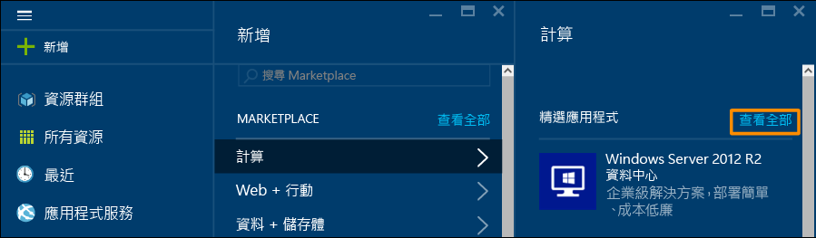

1. 在 [資料庫伺服器] 底下，按一下 [SQL Server] 來查看可用於 SQL Server 的所有範本。您可能必須向下捲動才能找到 [資料庫伺服器]。

	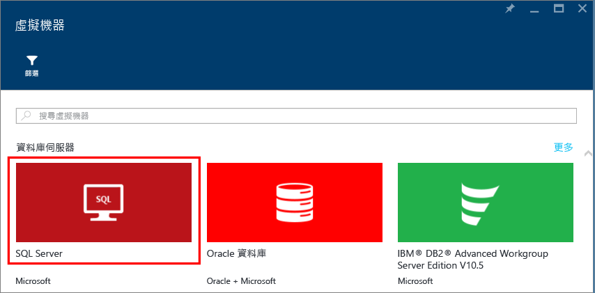

1. 	每個範本皆識別一個 SQL Server 版本和一個作業系統。請從清單中選取這些映像的其中一個，以顯示包含其詳細資料的刀鋒視窗。
1.	詳細資料刀鋒視窗會提供此虛擬機器映像的描述，並可讓您選取部署模型。在 [選取部署模型] 底下，確認已選取 [Resource Manager]，然後按一下 [建立]。

	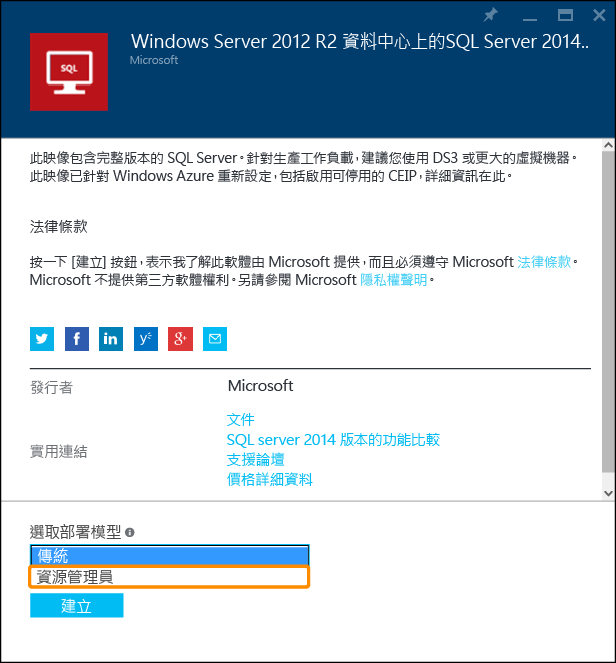

## 設定 VM
Azure 入口網站中有五個用來設定 SQL Server 虛擬機器的刀鋒視窗。

| 步驟 | 說明 |
|---------------------|-------------------------------|
| **基本概念** | [設定基本設定](#1-configure-basic-settings) |
| **大小** | [選擇虛擬機器大小](#2-choose-virtual-machine-size) |
| **設定** | [設定選用功能](#3-configure-optional-features) |
| **SQL Server 設定** | [進行 SQL Server 設定](#4-configure-sql-server-settings) |
| **摘要** | [檢閱摘要](#5-review-the-summary) |

## 1\.設定基本設定
在 [基本概念] 刀鋒視窗中提供下列資訊：

* 輸入唯一的虛擬機器 [名稱]。
* 指該機器之本機系統管理員帳戶 [使用者名稱]。這個帳戶也將會是 SQL Server 系統管理員 (sysadmin) 固定伺服器角色的成員。
* 提供強式 [密碼]。
* 如果您有多個訂用帳戶，請確認訂用帳戶是否適用於您即將建置的 VM。
* 在 [資源群組] 方塊中，輸入新資源群組的名稱。或者，若要使用現有的資源群組，請按一下 [選取現有項目]。資源群組是 Azure (虛擬機器、儲存體帳戶、虛擬網路等) 中相關資源的集合。
	
	>[AZURE.NOTE] 如果您只是測試或了解 Azure 中的 SQL Server 部署，使用新的資源群組很有幫助。一旦完成測試，您可以刪除整個資源群組。這會刪除與該資源群組相關聯的所有資源，包括 SQL VM。如需有關資源群組的詳細資訊，請參閱 [Azure Resource Manager 概觀](../resource-group-overview.md)。

* 選取此專案的 [位置]。
* 按一下 [確定] 來儲存設定。

	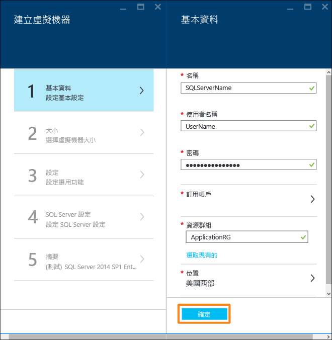

## 2\.選擇虛擬機器大小
在 [大小] 步驟，請在 [選擇大小] 刀鋒視窗中選擇虛擬機器大小。這一開始會顯示建議的機器大小。大小是根據您選取的範本。也可預估執行 VM 的每月成本。

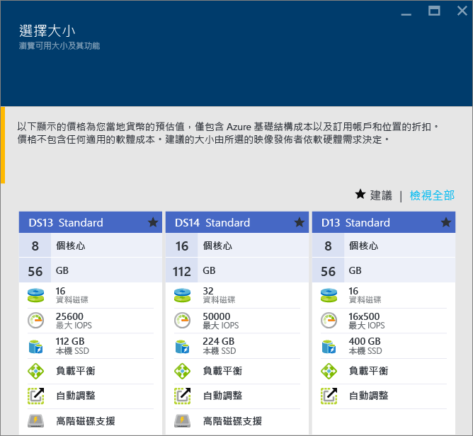

針對生產工作負載，建議選取可支援[進階儲存體](../storage/storage-premium-storage.md)的虛擬機器大小。如果您不需要該層級的效能，請使用 [檢視全部] 按鈕以查看所有機器大小選項。例如，您可能會將較小的機器使用開發或測試環境。

>[AZURE.NOTE] 如需關於虛擬機器大小的詳細資訊，請參閱[虛擬機器大小](virtual-machines-windows-sizes.md)。如需有關 SQL Server VM 大小的考量，請參閱 [Azure 虛擬機器中的 SQL Server 效能最佳作法](virtual-machines-windows-sql-performance.md)。

選擇您的機器大小，然後按一下 [選取] 以繼續。

## 3\.設定選用功能
在 [設定] 刀鋒視窗上，設定虛擬機器的 Azure 儲存體、網路功能及監視功能。

- 在 [儲存體] 之下，指定 [標準] 或 [進階 (SSD)] 的 [磁碟類型]。針對生產環境工作負載，建議使用進階儲存體。

>[AZURE.NOTE] 如果您對不支援進階儲存體的機器大小選取 [進階 (SSD)]，您的機器大小會調整為不支援進階儲存體的大小。

- 在 [儲存體帳戶] 底下，您可以接受自動佈建的儲存體帳戶名稱，或是按一下 [儲存體帳戶] 以選擇現有的帳戶並設定儲存體帳戶類型。Azure 預設會建立具有本地備援儲存體的新儲存體帳戶。如需儲存體選項的詳細資訊，請參閱 [Azure 儲存體複寫](../storage/storage-redundancy.md)。

- 在 [網路] 底下，您可以接受自動填入的功能值，或按一下每個功能以設定 [虛擬網路]、[子網路]、[公用 IP 位址] 及 [網路安全性群組]。基於本教學課程的用途，您可以保留預設值。

- Azure 預設會使用為 VM 指定的相同儲存體帳戶來啟用 [監視]。您可以在這裡變更這些設定。

- 在 [可用性設定組] 底下，指定可用性設定組。基於本教學課程的目的，您可以選取 [無]。如果您打算設定「SQL AlwaysOn 可用性群組」，請設定可用性以避免重新建立虛擬機器。如需詳細資訊，請參閱[管理虛擬機器的可用性](virtual-machines-windows-manage-availability.md)。

完成這些設定時，請按一下 [確定]。

## 4\.進行 SQL Server 設定
在 [SQL Server 設定] 刀鋒視窗上，設定 SQL Server 的特定設定和最佳化。您可以設定的 SQL Server 設定包括：

| 設定 |
|---------------------|
| [連線能力](#connectivity) |
| [驗證](#authentication) |
| [儲存體組態](#storage-configuration) |
| [自動修補](#automated-patching) |
| [自動備份](#automated-backup) |
| [Azure 金鑰保存庫整合](#azure-key-vault-integration) |

### 連線能力
在 [SQL 連線] 之下，指定您要對此 VM 上的 SQL Server 執行個體進行的存取類型。基於本教學課程的目的，指定 [公用 (網際網路)] 以允許從網際網路上的電腦或服務連線到 SQL Server。在已選取此選項的情況下，Azure 會自動設定防火牆和網路安全性群組以允許連接埠 1433 上的流量。

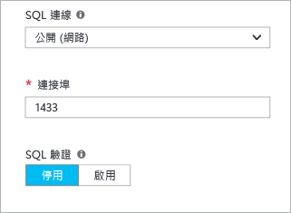

為了透過網際網路連接到 SQL Server，您也必須啟用下一節所述的「SQL Server 驗證」。

>[AZURE.NOTE] 如果您的用戶端從特定的連接埠連接到 SQL Server，您可以將連線能力限制為該來源連接埠。在 VM 建立後，編輯網路安全性群組即可達成此目的。如需詳細資訊，請參閱[什麼是網路安全性群組 (NSG)？](../virtual-network/virtual-networks-nsg.md)。

如果您偏好不要啟用透過網際網路連線到 Database Engine 的功能，請選擇下列其中一個選項：

- [本機 (僅限在 VM 內)] 只允許從 VM 內連接到 SQL Server。
- [私人 (在虛擬網路內)] 允許從相同虛擬網路中的電腦或服務連接到 SQL Server。

一般情況下，選擇您的案例允許的最嚴格連線能力，即可改善安全性。但所有透過網路安全性群組規則和 SQL/Windows 驗證的選項都是安全的。

[連接埠] 預設為 1433。您可以指定其他連接埠號碼。如需詳細資訊，請參閱[連接到 SQL Server 虛擬機器 (Resource Manager) | Microsoft Azure](virtual-machines-windows-sql-connect.md)。

### 驗證
如果您需要「SQL Server 驗證」，請按一下 [SQL 驗證] 底下的 [啟用] 。

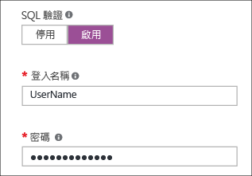

>[AZURE.NOTE] 如果您打算透過網際網路存取 SQL Server (也就是 [公用] 連線選項)，您必須在這裡啟用 SQL 驗證。對 SQL Server 進行公用存取需要使用「SQL 驗證」。

如果您啟用 [SQL Server 驗證]，請指定 [登入名稱] 和 [密碼]。這個使用者名稱將會是「SQL Server 驗證」登入，以及系統管理員 (sysadmin) 固定伺服器角色的成員。如需驗證模式的詳細資訊，請參閱[選擇驗證模式](http://msdn.microsoft.com/library/ms144284.aspx)。

如果您未啟用 SQL Server 驗證，您可以在 VM 上使用本機系統管理員帳戶連接到 SQL Server 執行個體。

### 儲存體組態
按一下 [儲存體組態] 以指定儲存體需求。

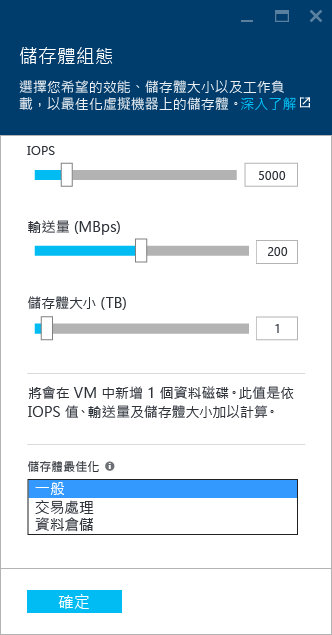

>[AZURE.NOTE] 如果您選取 [標準] 儲存體，則無法使用此選項。自動儲存體最佳化只適用於進階儲存體。

您可以用每秒輸入/輸出作業數 (IOPs)、輸送量 (單位為 MB/s) 及總儲存體大小來指定需求。請使用滑動標尺來設定這些項目。入口網站會自動根據這些需求計算磁碟數目。

Azure 預設會針對 5000 IOPs、200 MBs 及 1 TB 的儲存體空間進行最佳化。您可以根據工作負載變更這些儲存體設定。在 [儲存體最佳化] 底下，選取下列其中之一

- [一般] 是預設設定，支援大多數工作負載。
- [交易式處理] 可將儲存體最佳化來處理傳統資料庫 OLTP 工作負載。
- [資料倉儲] 可將儲存體最佳化來處理分析和報告工作負載。

>[AZURE.NOTE] 滑桿上的上限視您選取的虛擬機器大小而有所不同。

### 自動修補
預設會啟用 [自動修補]。自動修補可讓 Azure 自動修補 SQL Server 和作業系統。請為維護期間指定一週當中的某一天、時間及持續時間。Azure 將會在維護期間執行修補。維護期間排程會使用 VM 地區設定做為時間。如果您不想要讓 Azure 自動修補 SQL Server 和作業系統，請按一下 [停用]。

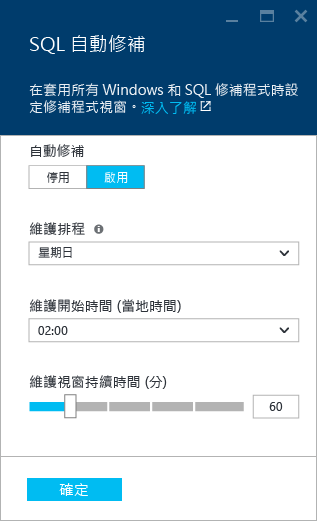

如需詳細資訊，請參閱 [Azure 虛擬機器中的 SQL Server 自動修補](virtual-machines-windows-classic-sql-automated-patching.md)。

### 自動備份
在 [自動備份] 底下，可以為所有資料庫啟用自動資料庫備份。預設會停用自動備份。

當您啟用 SQL 自動備份時，您可以設定下列各項：

- 備份保留期限天數
- 要用於備份的儲存體帳戶
- 備份的加密選項。

若要加密備份，請按一下 [啟用]。然後指定 [密碼]。Azure 會建立憑證來加密備份，並使用指定的密碼來保護該憑證。

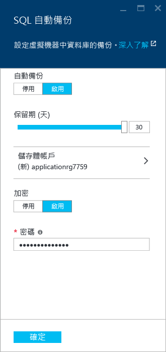

 如需詳細資訊，請參閱 [Azure 虛擬機器中 SQL Server 的自動化備份](virtual-machines-windows-classic-sql-automated-backup.md)。

### Azure 金鑰保存庫整合
若要在 Azure 中儲存用於加密的安全性密碼，請按一下 [Azure 金鑰保存庫整合]，然後按一下 [啟用]。

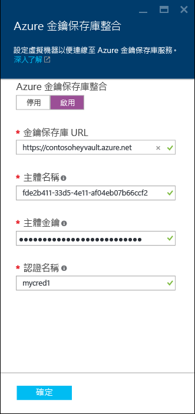

下表列出設定「Azure 金鑰保存庫整合」時所需的參數。

|參數|描述|範例|
|----------|----------|-------|
|**金鑰保存庫 URL** |金鑰保存庫的位置。|https://contosokeyvault.vault.azure.net/ |
|**主體名稱** |Azure Active Directory 服務主體名稱。這也稱為「用戶端識別碼」。 |fde2b411-33d5-4e11-af04eb07b669ccf2|
| **主體密碼**|Azure Active Directory 服務主體密碼。這也稱為「用戶端密碼」。 | 9VTJSQwzlFepD8XODnzy8n2V01Jd8dAjwm/azF1XDKM=|
|**認證名稱**|**認證名稱**：AKV 整合會在 SQL Server 內建立認證，允許 VM 具有金鑰保存庫的存取權。選擇此認證的名稱。| mycred1|

如需詳細資訊，請參閱[在 Azure VM 上設定 SQL Server 的 Azure 金鑰保存庫整合](virtual-machines-windows-classic-ps-sql-keyvault.md)。

完成 SQL Server 設定之後，請按一下 [確定]。

## 5\.檢閱摘要
在 [摘要] 刀鋒視窗上檢閱摘要，然後按一下 [確定] 來建立為此 VM 指定的 SQL Server、資源群組及資源。

您可以從 Azure 入口網站監視部署。畫面頂端的 [通知] 按鈕會顯示基本的部署狀態。

>[AZURE.NOTE] 為了讓您了解部署時間，我已使用預設設定將 SQL VM 部署到美國東部地區。此作業總共花了 26 分鐘才完成。但是根據您的區域和選取的設定，您可能會經歷較快或較慢的部署時間。

## 透過遠端桌面開啟 VM

使用下列步驟，透過遠端桌面連接到虛擬機器。

1. 建置 Azure VM 之後，VM 的圖示會出現在 Azure 儀表板上。瀏覽現有的虛擬機器，也可以找到它。按一下新的 SQL 虛擬機器，以查看其詳細資料。
1. 在 [虛擬機器] 刀鋒視窗頂端，按一下 [連接]。
1. 瀏覽器將會為 VM 下載 .rdp 檔案。開啟 .rdp 檔案。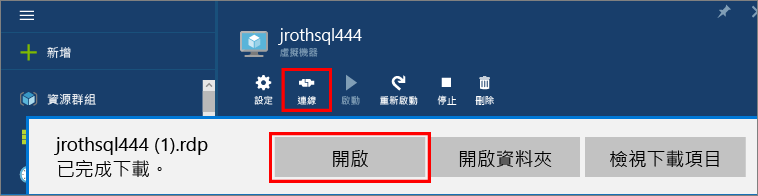
1. [遠端桌面連線] 會通知您無法識別這個遠端連線的發行者。按一下 [連接] 以繼續。
1. 在 [**Windows 安全性**] 對話方塊中按一下 [**使用其他帳戶**]。
1. 針對 [使用者名稱]，輸入 **<使用者名稱>**，其中 <user name> 是您設定 VM 時所指定的使用者名稱。請注意，您必須加入初始反斜線。
1. 輸入您先前為此 VM 設定的 [密碼]，然後按一下 [確定] 進行連線。
1. 如果另一個 [遠端桌面連線] 對話方塊詢問您是否要連線，請按一下 [是]。

連線到 SQL Server 虛擬機器之後，您可以啟動 SQL Server Management Studio，然後使用您的本機系統管理員認證透過「Windows 驗證」進行連線。如果您已啟用 SQL Server 驗證，您也可以使用您在佈建期間所設定的 SQL 登入和密碼以 SQL 驗證連線。

存取電腦可讓您根據您的需求直接變更電腦和 SQL Server 設定。例如，您可以設定防火牆設定或變更 SQL Server 組態設定。

## 從遠端連接到 SQL Server

本教學課程中，我們選取了虛擬機器的 [公用] 存取權和 [SQL Server 驗證]。這些設定會自動設定虛擬機器，以允許透過網際網路來自任何用戶端的 SQL Server 連線 (假設它們有正確的 SQL 登入)。

>[AZURE.NOTE] 如果在佈建時您沒有選取 [公用]，則還必須執行其他步驟，才能透過網際網路存取您的 SQL Server 執行個體。如需詳細資訊，請參閱[連接到 SQL Server 虛擬機器](virtual-machines-windows-sql-connect.md)。

下列各節說明如何透過網際網路，從不同的電腦連接到您的 VM 上的 SQL Server 執行個體。

> [AZURE.INCLUDE [在 VM 資源管理員中連線到 SQL Server](../../includes/virtual-machines-sql-server-connection-steps-resource-manager.md)]

## 後續步驟
如需在 Azure 中使用 SQL Server 的其他資訊，請參閱 [Azure 虛擬機器上的 SQL Server](virtual-machines-windows-sql-server-iaas-overview.md) 和[常見問題集](virtual-machines-windows-sql-server-iaas-faq.md)。

如需 Azure 虛擬機器上 SQL Server 的影片概觀，請觀看 [Azure VM is the best platform for SQL Server 2016 (Azure VM 是 SQL Server 2016 的最佳平台)](https://channel9.msdn.com/Events/DataDriven/SQLServer2016/Azure-VM-is-the-best-platform-for-SQL-Server-2016)。

<!---HONumber=AcomDC_0518_2016-->