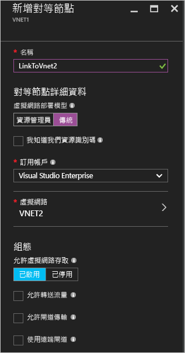
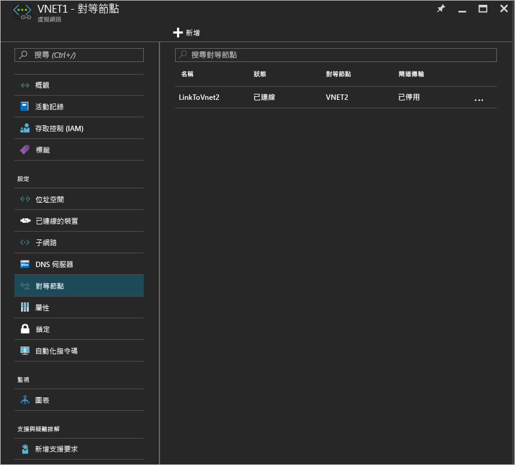

# 使用 Azure 入口網站建立虛擬網路對等互連
[!INCLUDE [virtual-networks-create-vnet-selectors-arm-include](../../includes/virtual-networks-create-vnetpeering-selectors-arm-include.md)]

[!INCLUDE [virtual-networks-create-vnet-intro](../../includes/virtual-networks-create-vnetpeering-intro-include.md)]

[!INCLUDE [virtual-networks-create-vnet-scenario-basic-include](../../includes/virtual-networks-create-vnetpeering-scenario-basic-include.md)]

若要透過 Azure 入口網站依據上述案例建立 VNet 對等互連，請依照下列步驟執行。

1. 透過瀏覽器瀏覽至 http://portal.azure.com，並視需要使用您的 Azure 帳戶登入。
2. 若要建立 VNET 對等互連，您必須在兩個 VNet 之間建立兩個連結，每個方向各一。 您可以先建立 VNET1 至 VNET2 的 VNET 對等互連連結。 在入口網站中，按一下 [瀏覽] > 選擇 [虛擬網路]
   
    
3. 在 [虛擬網路] 刀鋒視窗中，選擇 [VNET1]，按一下 [對等互連]，然後按一下 [新增]
   
    
4. 在 [新增對等互連] 刀鋒視窗中，輸入對等互連連結名稱 LinkToVnet2，選擇訂用帳戶和對等虛擬網路 VNET2，按一下 [確定]。
   
    
5. 建立此 VNET 對等互連連結之後， 您就可以看到如以下的連結狀態︰
   
    
6. 接下來，建立 VNET2 至 VNET1 的 VNet 對等互連連結。 在 [虛擬網路] 刀鋒視窗中，選擇 VNET2，按一下 [對等互連]，然後按一下 [新增]
   
    
7. 在 [新增對等互連] 刀鋒視窗中，輸入對等互連連結名稱 LinkToVnet1，選擇訂用帳戶和對等虛擬網路，按一下 [確定]。
   
    
8. 建立此 VNET 對等互連連結之後， 您就可以看到如以下的連結狀態︰
   
    
9. 檢查 LinkToVnet2 的狀態，它現在也變更為 [已連接]。  
   
    
   
   > [!NOTE]
   > 只有當兩個連結都已連接時，才會建立 VNET 對等互連。
   > 
   > 

每個連結都有幾個可設定的屬性︰

| 選項 | 說明 | 預設值 |
|:--- |:--- |:--- |
| AllowVirtualNetworkAccess |對等 VNet 的位址空間是否包含做為 Virtual_network 標籤內的一部分 |是 |
| AllowForwardedTraffic |要接受或卸除非來自對等互連 VNet 的流量 |否 |
| AllowGatewayTransit |允許對等 VNet 使用您的 VNet 閘道 |否 |
| UseRemoteGateways |使用對等的 VNet 閘道。 對等 VNet 必須設定閘道，並選取 AllowGatewayTransit。 如果閘道已設定則無法使用此選項 |否 |

VNet 對等互連中每個連結都具有一組上述的屬性。 從入口網站中，您可以按一下 [VNet 對等互連連結] 並變更任何可用選項，按一下 [儲存] 以讓變更生效。

[!INCLUDE [virtual-networks-create-vnet-scenario-crosssub-include](../../includes/virtual-networks-create-vnetpeering-scenario-crosssub-include.md)]

1. 透過瀏覽器瀏覽至 http://portal.azure.com，並視需要使用您的 Azure 帳戶登入。
2. 在此範例中我們將使用兩個訂用帳戶 A 和 B 以及兩位使用者 A 和 B，兩位使用者在訂用帳戶中分別具有權限
3. 在入口網站中，按一下 [瀏覽]，選擇 [虛擬網路]。 按一下 VNET，然後按一下 [新增]。
   
    
4. 在 [新增存取] 刀鋒視窗中，按一下 [選取角色] 並選擇 [網路參與者]，按一下 [新增使用者]，輸入使用者 B 登入名稱並按一下 [確定]。
   
    
   
    這不是必要需求，即使使用者針對其個別的 Vnet 個別提出對等互連的要求，只要要求符合就可以建立對等互連。 將另一個 VNet 的權限使用者新增為本機 VNet 使用者，可以輕鬆在入口網站中進行設定。
5. 然後以使用者 B 登入 Azure 入口網站，使用者 B 為訂用帳戶 B 的權限使用者。 依照上述步驟將使用者 A 新增為網路參與者。
   
    
   
   > [!NOTE]
   > 您可以在瀏覽器中登出並登入這兩個使用者工作階段以確定授權已成功啟用。
   > 
   > 
6. 以使用者 A 登入入口網站，瀏覽至 [VNET3] 刀鋒視窗，按一下 [對等互連]，檢查「我知道我的資源識別碼」核取方塊，然後以下列格式輸入 VNET5 的資源識別碼。
   
    /subscriptions/{SubscriptionID}/resourceGroups/{ResourceGroupName}/providers/Microsoft.Network/VirtualNetwork/{VNETname}
   
    
7. 以使用者 B 登入入口網站並依照上述步驟建立從 VNET5 至 VNet3 的對等互連連結。
   
    
8. 對等互連會建立，VNet3 中的任一虛擬機器應可與 VNet5 中的任一虛擬機器進行通訊

[!INCLUDE [virtual-networks-create-vnet-scenario-transit-include](../../includes/virtual-networks-create-vnetpeering-scenario-transit-include.md)]

1. 第一個步驟中，從 HubVnet 至 VNET1 的 VNET 對等互連連結。 請注意，未選取連結的 [允許轉送流量] 選項。
   
    
2. 下一個步驟中，可以建立從 VNET1 至 HubVnet 的對等互連連結。 請注意，已選取 [允許轉送流量] 選項。
   
    
3. 對等互連建立之後，您可以參考此 [文章](virtual-network-create-udr-arm-ps.md) 並定義使用者定義路由 (UDR)，透過虛擬應用裝置重新導向 VNet1 流量以使用其功能。 當您在路徑中指定下個躍點位址時，可以將其設定為對等 VNet HubVNet 中的虛擬設備 IP 位址

[!INCLUDE [virtual-networks-create-vnet-scenario-asmtoarm-include](../../includes/virtual-networks-create-vnetpeering-scenario-asmtoarm-include.md)]

1. 透過瀏覽器瀏覽至 http://portal.azure.com，並視需要使用您的 Azure 帳戶登入。
2. 若要在此案例中建立 VNET 對等互連，您必須只建立一個連結 (從 Azure Resource Manager 中的虛擬網路至傳統虛擬網路)。 也就是，從 **VNET1** 至 **VNET2**。 在入口網站中，按一下 [瀏覽] > 選擇 [虛擬網路]
3. 在 [虛擬網路] 刀鋒視窗中，選擇 [VNET1] 。 按一下 [對等互連]，然後按一下 [新增]。
4. 在 [新增對等互連] 刀鋒視窗中，為您的連結命名。 在此稱為 [LinkToVNet2] 。 在 [對等詳細資料] 下選取 [傳統] 。
5. 然後選擇訂用帳戶和對等虛擬網路 [VNET2] 。 然後按一下 [確定]。
   
    
6. 建立此 VNet 對等互連連結後，兩個虛擬網路會對等互連，您將可看到下列畫面︰
   
    

## 移除 VNet 對等互連
1. 透過瀏覽器瀏覽至 http://portal.azure.com，並視需要使用您的 Azure 帳戶登入。
2. 移至 [虛擬網路] 刀鋒視窗，按一下 [對等互連]，按一下要移除的連結，按一下 [刪除] 按鈕。
   
   
3. 一旦在 VNET 對等互連中移除一個連結，對等連結狀態將會改為已中斷連線。
   
    
4. 在此狀態下，您無法重新建立連結直到對等連結狀態變更為初始化為止。 建議您兩個連結都移除後，再重新建立 VNET 對等互連。

<!--HONumber=Nov16_HO3-->

