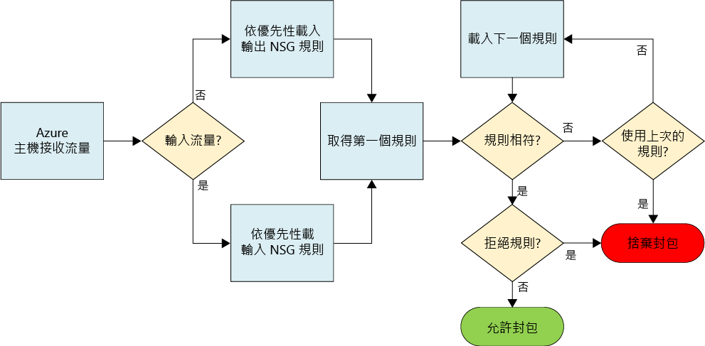
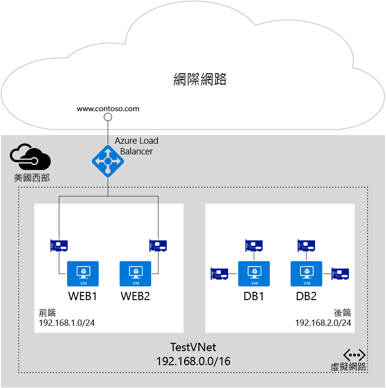

# 使用網路安全性群組來篩選網路流量

網路安全性群組 (NSG) 包含安全性規則的清單，可允許或拒絕已連線至 Azure 虛擬網路 (VNet) 之資源的網路流量。 NSG 可以與子網路、個別 VM (傳統) 或已連結至 VM (Resource Manager) 的個別網路介面 (NIC) 建立關聯。 當 NSG 與子網路相關聯時，系統會將規則套用至已連線至子網路的所有資源。 建立 NSG 與 VM 或 NIC 的關聯也可以進一步限制流量。

> [!NOTE]
> Azure 建立和處理資源的部署模型有二種：[Resource Manager 和傳統](../resource-manager-deployment-model.md)。 本文將說明如何使用這兩個模型，但 Microsoft 建議大多數新的部署請使用 Resource Manager 模型。

## NSG 資源
NSG 包含下列屬性：

| 屬性 | 說明 | 條件約束 | 考量 |
| --- | --- | --- | --- |
| 名稱 |NSG 的名稱 |必須是區域內唯一的。 可以包含字母、數字、底線、句號和連字號。 必須以字母或數字開頭。 必須以字母、數字或底線結尾。 不能超過 80 個字元。 |因為您可能需要建立數個 NSG，請確定您的命名慣例可讓您輕鬆識別 NSG 的功能。 |
| 區域 |在其中建立 NSG 的 [Azure 區域](https://azure.microsoft.com/regions)。 |NSG 只能與 NSG 相同區域內的資源相關聯。 |若要了解每個區域可以有多少個 NSM ，請閱讀 [Azure 限制](../azure-subscription-service-limits.md#virtual-networking-limits-classic)一文。|
| 資源群組 |NSG 所在的[資源群組](../azure-resource-manager/resource-group-overview.md#resource-groups)。 |雖然 NSG 存在於資源群組中，它可以與任何資源群組中的資源相關聯，只要資源是與 NSG 相同的 Azure 區域的一部分。 |資源群組用來以部署單位的形式一起管理多個資源。 您可以考慮將 NSG 其相關聯的資源群組在一起。 |
| 規則 |定義允許或拒絕流量的輸入或輸出規則。 | |請參閱本文的 [NSG 規則](#Nsg-rules)一節。 |

> [!NOTE]
> 端點式 ACL 和網路安全性群組，不支援用於相同的 VM 執行個體。 如果您想要使用 NSG 且已經擁有就地端點 ACL，請先移除端點 ACL。 若要了解如何移除 ACL，請閱讀[使用 PowerShell 管理端點的存取控制清單 (ACL)](virtual-networks-acl-powershell.md) 一文。
> 

### NSG 規則
NSG 規則包含下列屬性：

| 屬性 | 說明 | 條件約束 | 考量 |
| --- | --- | --- | --- |
| **名稱** |規則的名稱。 |必須是區域內唯一的。 可以包含字母、數字、底線、句號和連字號。 必須以字母或數字開頭。 必須以字母、數字或底線結尾。 不能超過 80 個字元。 |在 NSG 內可以有數個規則，因此請確定您遵循可讓您識別規則的功能的命名慣例。 |
| **通訊協定** |規則要符合的通訊協定。 |TCP、UDP 或 * |使用 * 做為通訊協定包含 ICMP (僅東西流量)，以及 UDP 和 TCP，而且可能會降低您需要的規則數目。 同時，使用 * 可能會是過於廣泛的方法，因此建議您只有在必要時使用 *。 |
| **來源連接埠範圍** |規則要符合的來源連接埠範圍。 |1 到 65535 的單一連接埠號碼、連接埠範圍 (例如：1-65635)，或 * (所有連接埠)。 |來源連接埠可以是暫時的。 除非您的用戶端程式是使用特定連接埠，否則在大部分情況下請使用 *。 請嘗試儘可能使用連接埠範圍以避免需要多個規則。 多個連接埠或連接埠範圍不可使用逗號分組。 |
| **目的地連接埠範圍** |規則要符合的目的地連接埠範圍。 |1 到 65535 的單一連接埠號碼、連接埠範圍 (例如：1-65535)，或 \* (所有連接埠)。 |請嘗試儘可能使用連接埠範圍以避免需要多個規則。 多個連接埠或連接埠範圍不可使用逗號分組。 |
| **來源位址首碼** |規則要符合的來源位址首碼或標籤。 |單一 IP 位址 (例如：10.10.10.10)、IP 子網路 (例如：192.168.1.0/24)、[預設標籤](#default-tags)或 * (用於所有位址)。 |考慮使用範圍、預設標籤和 * 以降低規則的數量。 |
| **Destination address prefix** |規則要符合的目的地位址首碼或標籤。 | 單一 IP 位址 (例如：10.10.10.10)、IP 子網路 (例如：192.168.1.0/24)、[預設標籤](#default-tags)或 * (用於所有位址)。 |考慮使用範圍、預設標籤和 * 以降低規則的數量。 |
| **Direction** |規則要符合的流量方向。 |輸入或輸出。 |輸入和輸出規則會根據方向分別處理。 |
| **優先順序** |系統會依照規則優先順序檢查規則。 一旦套用規則，就不會再測試規則是否符合。 | 100 和 4096 之間的數字。 | 考慮為每個規則建立 100 的跳躍優先順序，以保留空間給您未來可能建立的新規則。 |
| **Access** |如果規則符合，要套用的存取類型。 | 允許或拒絕。 | 請注意，如果找不到封包的允許規則，則會捨棄封包。 |

NSG 包含兩組規則：輸入和輸出。 規則的優先順序在每一個集合中必須是唯一的。 

 

上圖顯示 NSG 規則的處理方式。

### 預設標籤
預設標籤是系統提供的識別項，用來解決 IP 位址的類別。 您可以在任何規則的**來源位址首碼**和**目的地位址首碼**屬性使用預設標籤。 有三個您可使用的預設標籤：

* **VirtualNetwork** (Resource Manager) (適用於傳統部署的 **VIRTUAL_NETWORK**)：這個標籤包含虛擬網路位址空間 (在 Azure 中定義的 CIDR 範圍)、所有已連線的內部部署位址空間以及已連線的 Azure VNet (區域網路)。
* **AzureLoadBalancer** (Resource Manager) (適用於傳統部署的 **AZURE_LOADBALANCER**)：這個標籤代表 Azure 基礎結構的負載平衡器。 此標籤會轉譯成做為 Azure 健康狀態探查來源的 Azure 資料中心 IP。
* **Internet** (Resource Manager) (適用於傳統部署的 **INTERNET**)：這個標籤代表虛擬網路以外且可以透過公用網際網路進行存取的 IP 位址空間。 此範圍也包括 [Azure 擁有的公用 IP 空間](https://www.microsoft.com/download/details.aspx?id=41653)。

### 預設規則
所有 NSG 都包含一組預設規則。 預設規則無法刪除，但因為其會指派為最低優先權，因此可以由您所建立的規則覆寫預設規則。 

預設規則可允許及不允許流量，如下所示︰
- 虛擬網路中的流量起始和結束同時允許輸入和輸出方向。
- **網際網路︰**允許輸出流量，但會封鎖輸入流量。
- **負載平衡器︰**允許 Azure 的負載平衡器探查 VM 和角色執行個體的健康狀態。 如果您不使用負載平衡的集合，則可以覆寫此規則。

**輸入預設規則**

| 名稱 | 優先順序 | 來源 IP | 來源連接埠 | 目的地 IP | 目的地連接埠 | 通訊協定 | Access |
| --- | --- | --- | --- | --- | --- | --- | --- |
| AllowVNetInBound |65000 | VirtualNetwork | * | VirtualNetwork | * | * | 允許 |
| AllowAzureLoadBalancerInBound | 65001 | AzureLoadBalancer | * | * | * | * | 允許 |
| DenyAllInBound |65500 | * | * | * | * | * | 拒絕 |

**輸出預設規則**

| 名稱 | 優先順序 | 來源 IP | 來源連接埠 | 目的地 IP | 目的地連接埠 | 通訊協定 | Access |
| --- | --- | --- | --- | --- | --- | --- | --- |
| AllowVnetOutBound | 65000 | VirtualNetwork | * | VirtualNetwork | * | * | 允許 |
| AllowInternetOutBound | 65001 | * | * | Internet | * | * | 允許 |
| DenyAllOutBound | 65500 | * | * | * | * | * | 拒絕 |

## 建立 NSG 關聯
視您使用的部署模型而定，您可以將 NSG 與 VM、NIC 和子網路建立關聯，如下所示：

* **VM (僅限傳統)：**安全性規則會套用至 VM 的所有流量 (雙向)。 
* **NIC (僅限 Resource Manager)：**安全性規則會套用至 NSG 相關聯之 NIC 的所有流量 (雙向)。 在多重 NIC 的 VM 中，您可以將不同 (或相同) 的 NSG 個別套用至每個 NIC。 
* **子網路 (Resource Manager 和傳統)：**安全性規則會套用至連線至 VNet 之任何資源的任何流量 (雙向)。

您可以將不同的 NSG 與 VM (或 NIC，依部署模型而定) 進行關聯，也可與 NIC 或 VM 連線的子網域進行關聯。 安全性規則會依每個 NSG 中的優先順序，以下列順序套用到流量：

- **輸入流量**

  1. **NSG 套用至子網路：**如果子網路 NSG 有拒絕流量的相符規則，封包會遭到捨棄。

  2. **NSG 套用至 NIC** (Resource Manager) 或 VM (傳統)：如果 VM\NIC NSG 有拒絕流量的相符規則，封包會在 VM\NIC 遭到捨棄，即使子網路 NSG 有允許流量的相符規則。

- **輸出流量**

  1. **NSG 套用至 NIC** (Resource Manager) 或 VM (傳統)：如果 VM\NIC NSG 有拒絕流量的相符規則，封包會遭到捨棄。

  2. **NSG 套用至子網路：**如果子網路 NSG 有拒絕流量的相符規則，封包會遭到捨棄，即使 VM\NIC NSG 有允許流量的相符規則。

> [!NOTE]
> 雖然您只能將單一 NSG 與子網路、VM 或 NIC 建立關聯，但您可以盡量將同一個 NSG 與許多您想要的資源建立關聯。
>

## 實作
您可以使用下列工具，在 Resource Manager 或傳統部署模型中實作 NSG：

| 部署工具 | 傳統 | Resource Manager |
| --- | --- | --- |
| Azure 入口網站   | 是 | [是](virtual-networks-create-nsg-arm-pportal.md) |
| PowerShell     | [是](virtual-networks-create-nsg-classic-ps.md) | [是](virtual-networks-create-nsg-arm-ps.md) |
| Azure CLI **V1**   | [是](virtual-networks-create-nsg-classic-cli.md) | [是](virtual-networks-create-nsg-cli-nodejs.md) |
| Azure CLI **V2**   | 否 | [是](virtual-networks-create-nsg-arm-cli.md) |
| Azure Resource Manager 範本   | 否  | [是](virtual-networks-create-nsg-arm-template.md) |

## 規劃
實作 NSG 之前，您需要回答下列問題：

1. 您要篩選何種資源類型的流量 (雙向)？ 您可以取得各種資源，例如 NIC (Resource Manager)、VM (傳統)、雲端服務、應用程式服務環境和 VM 擴展集。 
2. 您想要篩選的資源流量是往返於連線至現有 VNet 中的子網路嗎？

如需 Azure 中的網路安全性規劃的詳細資訊，請閱讀[雲端服務和網路安全性](../best-practices-network-security.md)一文。 

## 設計考量
一旦您知道[規劃](#Planning)一節中問題的答案，在定義您的 NSG 之前，請檢閱下列章節：

### 限制
您可以在訂用帳戶中擁有的 NSG 數目和每個 NSG 的規則數目有一些限制。 若要深入了解限制，請參閱 [Azure 限制](../azure-subscription-service-limits.md#networking-limits)文章。

### VNet 和子網路的設計
由於 NSG 可以套用至子網路，依子網路群組您的資源並將 NSG 套用至子網路，即可減少 NSG 的數量。  如果您決定將 NSG 套用至子網路，可能會發現您擁有的現有 VNet 與子網路未使用 記憶中的 NSG 定義。 您可能需要定義新 VNet 和子網路以支援 NSG 設計，並將新資源部署至新的子網路。 然後您就可以定義移轉策略，將現有的資源移至新的子網路。 

### 特殊規則
如果您封鎖這些規則允許的流量，您的基礎結構便無法與基本 Azure 服務進行通訊：

* **主機節點的虛擬 IP：** 基本的基礎結構服務，例如 DHCP、DNS 和健康狀態監控是透過虛擬化主機 IP 位址 168.63.129.16 所提供。 這個公用 IP 位址屬於 Microsoft，而且是針對此目的唯一用於所有區域的虛擬 IP。 此 IP 位址會對應至伺服器電腦的實體 IP 位址 (主機節點)，該伺服器用來主控 VM。 主機節點的作用如同 DHCP 轉送、DNS 遞迴解析程式，以及負載平衡器健康狀態探查和電腦健康狀態探查的探查來源。 此 IP 位址的通訊並不是攻擊。
* **授權 (金鑰管理服務)**：在 VM 中執行的 Windows 映像必須獲得授權。 若要確保授權，授權要求會傳送至處理此類查詢的金鑰管理服務主機伺服器。 此要求是透過連接埠 1688 輸出。

### ICMP 流量
目前的 NSG 規則僅可用於通訊協定 TCP 或 UDP。 *ICMP*沒有特定的標記。 不過，系統會藉由 AllowVNetInBound 預設規則來允許 VNet 內的 ICMP 流量，該規則會允許 VNet 內任何連接埠和通訊協定的流量 (雙向)。

### 子網路
* 請考慮您的工作負載所需要的階層數目。 每個層級可以使用子網路與套用至子網路的 NSG 來隔離。 
* 如果您需要為 VPN 閘道或 ExpressRoute 線路實作子網路，請**不要**將 NSG 套用至該子網路。 如果您這麼做，跨 VNet 或跨單位連線將會失敗。 
* 如果您需要實作網路虛擬應用裝置 (NVA)，請將 NVA 與自己的子網路連線，並建立 NVA 的雙向使用者定義路由 (UDR)。 您可以實作子網路層級 NSG，以篩選流入和流出此子網路的流量。 若要深入了解 UDR，請閱讀[使用者定義的路由](virtual-networks-udr-overview.md)一文。

### 負載平衡器
* 針對每個工作負載所使用的每個負載平衡器，考慮負載平衡和網路位址轉譯 (NAT) 規則。 NAT 規則會繫結至包含 NIC (Resource Manager) 或 VM/雲端服務角色執行個體 (傳統) 的後端集區。 請考慮為每個後端集區建立 NSG，僅允許透過負載平衡器中實作的規則對應的流量。 為每個後端集區建立 NSG 可保證直接進入後端集區 (而不會透過負載平衡器) 傳遞的流量也會受到篩選。
* 在傳統部署中，您會建立端點，該端點可將負載平衡器上的連接埠對應至您的 VM 或角色執行個體上的連接埠。 您也可以透過 Resource Manager 建立自己個別對外公開的負載平衡器。 連入流量的目的地連接埠是 VM 或角色執行個體中的實際通訊埠，而不是負載平衡器所公開的連接埠。 連線至 VM 的來源連接埠和位址是在網際網路中遠端電腦上的連接埠和位址，而不是負載平衡器所公開的連接埠和位址。
* 當您建立 NSG 來篩選透過內部負載平衡器 (ILB) 的流量時，套用的來源連接埠和位址範圍是來自原始電腦，而不是負載平衡器。 目的地連接埠和位址範圍屬於目的地電腦，而不是負載平衡器。

### 其他
* 不支援將端點式存取控制清單 (ACL) 和 NSG 用於相同的 VM 執行個體。 如果您想要使用 NSG 且已經擁有就地端點 ACL，請先移除端點 ACL。 如需如何移除端點 ACL 的詳細資訊，請參閱[管理端點 ACL](virtual-networks-acl-powershell.md)一文。
* 在 Resource Manager 中，您可以對具有多個 NIC 的 VM 使用與 NIC 相關聯的 NSG，根據每個 NIC 啟用管理 (遠端存取)。 建立唯一 NSG 與每個 NIC 的關聯可以區隔所有 NIC 的流量類型。
* 與使用負載平衡器類似，篩選來自其他 VNet 的流量時，您必須使用遠端電腦的來源位址範圍，而不是連接 VNet 的閘道。
* 許多 Azure 服務無法連線至 VNet。 如果 Azure 資源未連線至 VNet，您便無法使用 NSG 來篩選對資源的流量。  閱讀您所使用的服務文件，以判斷服務是否可以連線到 VNet。

## 部署範例
為了說明本文中的資訊應用，請考慮下圖所示之雙層應用程式的常見案例：

如圖表所示，Web1 和 Web2 VM 連線至 FrontEnd 子網路，而 DB1 和 DB2 VM 連線至 BackEnd 子網路。  這兩個子網路屬於 *TestVNet* VNet。 每個在 Azure VM 中執行的應用程式元件都會連線至 VNet。 此案例具有下列需求︰

1. 間隔 WEB 與 DB 伺服器之間的流量。
2. 負載平衡規則會將來自負載平衡器的流量轉送至所有 Web 伺服器的連接埠 80。
3. 負載平衡器 NAT 規則會將進入通訊埠 50001 上負載平衡器的流量轉送至 WEB1 VM 上的連接埠 3389。
4. 無法從網際網路存取前端或後端 VM，但要求 2 和 3 除外。
5. 沒有來自 WEB 或 DB 伺服器的輸出網際網路存取。
6. 允許從前端子網路存取任何 Web 伺服器的連接埠 3389。
7. 允許從前端子網路存取任何 DB 伺服器的連接埠 3389。
8. 允許從前端子網路存取所有 DB 伺服器的連接埠 1433。
9. 區隔 DB 伺服器中不同 NIC 上的管理流量 (連接埠 3389) 和資料庫流量 (1433)。

需求 1-6 (需求 3 和 4 除外) 均限制在子網路空間。 下列 NSG 符合先前的需求，同時將所需的 NSG 數目降至最低︰

### FrontEnd
**輸入規則**

| 規則 | Access | 優先順序 | 來源位址範圍 | 來源連接埠 | 目的地連接埠範圍 | 目的地連接埠 | 通訊協定 |
| --- | --- | --- | --- | --- | --- | --- | --- |
| Allow-Inbound-HTTP-Internet | 允許 | 100 | Internet | * | * | 80 | TCP |
| Allow-Inbound-RDP-Internet | 允許 | 200 | Internet | * | * | 3389 | TCP |
| Deny-Inbound-All | 拒絕 | 300 | Internet | * | * | * | TCP |

**輸出規則**

| 規則 | Access | 優先順序 | 來源位址範圍 | 來源連接埠 | 目的地連接埠範圍 | 目的地連接埠 | 通訊協定 |
| --- | --- | --- | --- | --- | --- | --- | --- |
| Deny-Internet-All |拒絕 |100 | * | * | Internet | * | * |

### BackEnd
**輸入規則**

| 規則 | Access | 優先順序 | 來源位址範圍 | 來源連接埠 | 目的地連接埠範圍 | 目的地連接埠 | 通訊協定 |
| --- | --- | --- | --- | --- | --- | --- | --- |
| Deny-Internet-All | 拒絕 | 100 | Internet | * | * | * | * |

**輸出規則**

| 規則 | Access | 優先順序 | 來源位址範圍 | 來源連接埠 | 目的地連接埠範圍 | 目的地連接埠 | 通訊協定 |
| --- | --- | --- | --- | --- | --- | --- | --- |
| Deny-Internet-All | 拒絕 | 100 | * | * | Internet | * | * |

建立下列 NSG 並與下列 VM 中的 NIC 產生關聯︰

### WEB1
**輸入規則**

| 規則 | Access | 優先順序 | 來源位址範圍 | 來源連接埠 | 目的地連接埠範圍 | 目的地連接埠 | 通訊協定 |
| --- | --- | --- | --- | --- | --- | --- | --- |
| Allow-Inbound-RDP-Internet | 允許 | 100 | Internet | * | * | 3389 | TCP |
| Allow-Inbound-HTTP-Internet | 允許 | 200 | Internet | * | * | 80 | TCP |

> [!NOTE]
> 前一個規則的來源位址範圍是**網際網路**，而不是負載平衡器的虛擬 IP 位址。 來源連接埠是 *，而不是 500001。 負載平衡器的 NAT 規則與 NSG 全性規則不同。 NSG 安全性規則永遠與流量的原始來源和最終目的地相關，而**不是**兩者之間的負載平衡器。 
> 
> 

### WEB2
**輸入規則**

| 規則 | Access | 優先順序 | 來源位址範圍 | 來源連接埠 | 目的地連接埠範圍 | 目的地連接埠 | 通訊協定 |
| --- | --- | --- | --- | --- | --- | --- | --- |
| Deny-Inbound-RDP-Internet | 拒絕 | 100 | Internet | * | * | 3389 | TCP |
| Allow-Inbound-HTTP-Internet | 允許 | 200 | Internet | * | * | 80 | TCP |

### DB 伺服器 (管理 NIC)
**輸入規則**

| 規則 | Access | 優先順序 | 來源位址範圍 | 來源連接埠 | 目的地連接埠範圍 | 目的地連接埠 | 通訊協定 |
| --- | --- | --- | --- | --- | --- | --- | --- |
| Allow-Inbound-RDP-Front-end | 允許 | 100 | 192.168.1.0/24 | * | * | 3389 | TCP |

### DB 伺服器 (資料庫流量 NIC)
**輸入規則**

| 規則 | Access | 優先順序 | 來源位址範圍 | 來源連接埠 | 目的地連接埠範圍 | 目的地連接埠 | 通訊協定 |
| --- | --- | --- | --- | --- | --- | --- | --- |
| Allow-Inbound-SQL-Front-end | 允許 | 100 | 192.168.1.0/24 | * | * | 1433 | TCP |

因為某些 NSG 與個別的 NIC 關聯，所以這些規則適用於透過 Resource Manager 部署的資源。 視子網路與 NIC 的關聯方式而定，會結合兩者的規則。 

## 後續步驟
* [部署 NSG (Resource Manager)](virtual-networks-create-nsg-arm-pportal.md)。
* [部署 NSG (傳統)](virtual-networks-create-nsg-classic-ps.md).
* [管理 NSG 記錄檔](virtual-network-nsg-manage-log.md)。
* [針對 NSG 進行疑難排解] (virtual-network-nsg-troubleshoot-portal.md)

