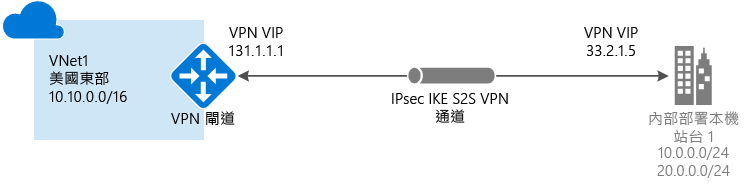
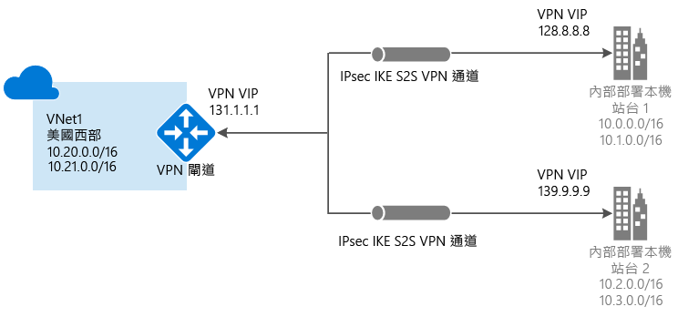
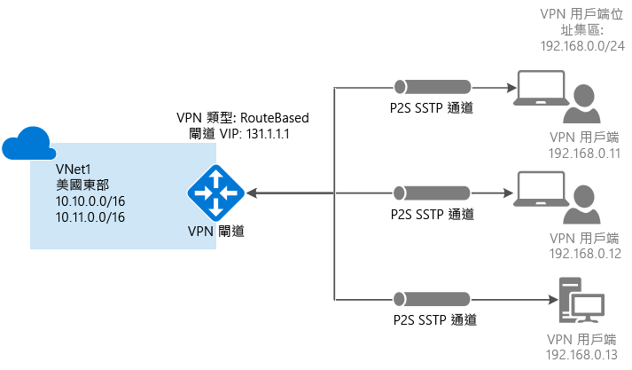
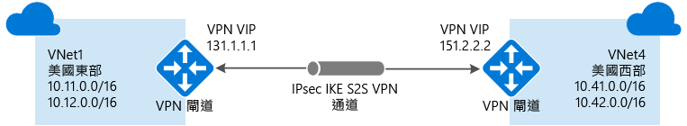
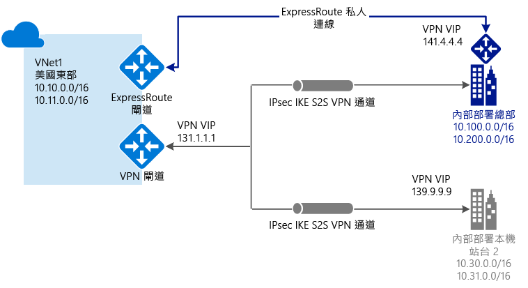

# 關於 VPN 閘道
若要傳送 Azure 虛擬網路和內部部署網站之間的網路流量，您必須為您的虛擬望路建立虛擬網路閘道。 VPN 閘道是一種虛擬網路閘道，可透過公用連接傳送加密的流量。 您也可以使用 VPN 閘道，透過 Microsoft 網路來傳送 Azure 虛擬網路之間的流量。

虛擬網路閘道類型有兩種︰'ExpressRoute' 和 'Vpn'。 建立虛擬網路閘道時，您可指定想要建立的閘道類型。 VPN 閘道是使用閘道類型 'Vpn' 的虛擬網路閘道。 

每個虛擬網路可以有兩個虛擬網路閘道，但每種類型只能有一個。 視您選擇的設定而定，您可以對單一 VPN 閘道建立多個連線。 例如，多站台連線設定。 當您對相同的 VPN 閘道建立多個連線時，所有 VPN 通道 (包括點對站 VPN) 都會共用此閘道可用的頻寬。

## 設定 VPN 閘道
VPN 閘道連線需仰賴多個具有特定設定的資源。 大部分的資源可以分別進行設定，雖然在某些情況下必須以特定順序來設定。

###設定
您為每個資源選擇的設定，對於建立成功連線而言極為重要。 如需 VPN 閘道個別資源和設定的資訊，請參閱 [關於 VPN 閘道設定](vpn-gateway-about-vpn-gateway-settings.md)。 您可以尋找資訊來協助您了解閘道類型、VPN 類型、連線類型、閘道子網路、區域網路閘道，以及您可能可量的各種其他資源設定。

###部署工具
您可以使用設定工具 (例如 Azure 入口網站) 開始建立及設定資源。 您可以稍後再決定切換到另一個工具 (如 PowerShell) 來設定其他資源，或是在適用的時機修改現有資源。 您目前無法在 Azure 入口網站中進行每一項資源和資源設定。 文章中各連線拓撲的指示會指定何時需要特定組態工具。 

###部署模型
當您設定 VPN 閘道時，您採用的步驟取決於用來建立虛擬網路的部署模型。 例如，如果您使用傳統部署模型建立 VNet，您會使用傳統部署模型的指導方針和指示來建立和進行 VPN 閘道設定。 如需部署模型的詳細資訊，請參閱 [了解 Resource Manager 和傳統部署模型](../azure-resource-manager/resource-manager-deployment-model.md)。

## 連線拓撲圖表
請務必知道 VPN 閘道連線有不同的組態可用。 您必須決定哪個組態最符合您的需求。 在下列各節中，您可以檢視有關下列 VPN 閘道連線的資訊和拓撲圖表︰下列各節包含的資料表可列出︰

* 可用的部署模型
* 可用的設定工具
* 直接帶您前往某篇文章的連結 (如果可用)

使用圖形和描述來協助選取符合您需求的連線拓撲。 這些圖表顯示主要基準拓撲，但您也可以使用這些圖表做為指導方針來建置更複雜的組態。

### 站對站和多站台連線
#### 站對站
網站間 (S2S) VPN 閘道連線是透過 IPsec/IKE (IKEv1 或 IKEv2) VPN 通道建立的連線。 此類型的連線需要位於內部部署的 VPN 裝置，其具有指派的公用 IP 位址且不是位於 NAT 後方。 S2S 連線可以用於跨單位與混合式組態。   

#### 多站台
這類型的連線是站對站連線的變化。 您可以從虛擬網路閘道建立多個 VPN 連線，通常會連接至多個內部部署網站。 處理多重連線時，您必須使用路由式 VPN 類型 (也就是使用傳統 VNet 時的動態閘道)。 因為每個虛擬網路只能有一個 VPN 閘道，所以透過該閘道的所有連線會共用可用的頻寬。 這通常稱為「多網站」連線。

#### 站對站和多網站的部署模型和方法
[!INCLUDE [vpn-gateway-table-site-to-site](../../includes/vpn-gateway-table-site-to-site-include.md)]

### 點對站連線
點對站 (P2S) VPN 閘道連線可讓您建立從個別用戶端電腦到您的虛擬網路的安全連線。 P2S 是透過 SSTP (安全通訊端通道通訊協定) 的 VPN 連線。 P2S 連線不需要 VPN 裝置或公眾對應 IP 位址即可運作。 您可從用戶端電腦啟動 VPN 連線，以建立 VPN 連線。 當您想要從遠端位置 (例如從住家或會議) 連接到您的 VNet 時，或您只有幾個需要連線至 VNet 的用戶端時，這個解決方案很實用。 P2S 連線可與 S2S 連線透過相同的 VPN 閘道一起使用，前提是這兩個連線的所有設定需求都相容。

#### 點對站的部署模型和方法
[!INCLUDE [vpn-gateway-table-point-to-site](../../includes/vpn-gateway-table-point-to-site-include.md)]

### VNet 對 VNet 連線
將虛擬網路連接至另一個虛擬網路 (VNet 對 VNet)，類似於將 VNet 連接至內部部署網站位置。 這兩種連線類型都使用 VPN 閘道提供使用 IPsec/IKE 的安全通道。 您甚至可以將多網站連線組態與 VNet 對 VNet 通訊結合。 這可讓您建立結合了跨單位連線與內部虛擬網路連線的網路拓撲。

您所連接的 VNet 可以：

* 在相同或不同的區域中
* 在相同或不同的訂用帳戶中 
* 在相同或不同的部署模型中

####部署模型之間的連線
Azure 目前有兩種部署模型：傳統和 Resource Manager。 如果您已使用 Azure 一段時間，則可能具有傳統 VNet 上執行的 Azure VM 和執行個體角色。 較新的 VM 和角色執行個體可能會在 Resource Manager 中建立的 VNet 中執行。 您可以建立 Vnet 間的連線，讓其中一個 VNet 中的資源直接與另一個 VNet 中的資源通訊。

####VNet 對等互連
只要您的虛擬網路符合特定需求，您就能夠使用 VNet 對等互連來建立連線。 VNet 對等互連不會使用虛擬網路閘道。 如需詳細資訊，請參閱 [VNet 對等互連](../virtual-network/virtual-network-peering-overview.md)。

####VNet 對 VNet 的部署模型和方法
[!INCLUDE [vpn-gateway-table-vnet-to-vnet](../../includes/vpn-gateway-table-vnet-to-vnet-include.md)]

### ExpressRoute
[!INCLUDE [expressroute-intro](../../includes/expressroute-intro-include.md)]

ExpressRoute 連線不會使用 VPN 閘道，但是會以虛擬網路閘道做為其必要組態的一部分。 在 ExpressRoute 連線中，虛擬網路閘道的閘道類型已設定為 'ExpressRoute' 而不是 'Vpn'。 如需 ExpressRoute 的詳細資訊，請參閱 [ExpressRoute 技術概觀](../expressroute/expressroute-introduction.md)。

### 站對站及 ExpressRoute 並存連線
ExpressRoute 是從 WAN (不透過公用網際網路) 至 Microsoft 服務 (包括 Azure) 的專用連線。 站對站 VPN 流量會以加密方式透過公用網際網路進行傳輸。 能夠對相同的虛擬網路設定網站間 VPN 和 ExpressRoute 連線有諸多好處。

您可以將網站間 VPN 設定為 ExpressRoute 的安全容錯移轉路徑，或使用網站間 VPN 來連線至不在您網路中但透過 ExpressRoute 連接的網站。 請注意，對於相同的虛擬網路，此組態需要兩個虛擬網路閘道，一個使用 'Vpn' 閘道類型，而另一個使用 'ExpressRoute' 閘道類型。

#### S2S 和 ExpressRoute 的部署模型和方法
[!INCLUDE [vpn-gateway-table-coexist](../../includes/vpn-gateway-table-coexist-include.md)]

## 價格
[!INCLUDE [vpn-gateway-about-pricing-include](../../includes/vpn-gateway-about-pricing-include.md)]

## 閘道 SKU
[!INCLUDE [vpn-gateway-gwsku-include](../../includes/vpn-gateway-gwsku-include.md)]

如需 VPN 閘道之閘道 SKU 的詳細資訊，請參閱[閘道 SKU](vpn-gateway-about-vpn-gateway-settings.md#gwsku)。

### 依 SKU 列出的估計彙總輸送量
[!INCLUDE [vpn-gateway-table-gwtype-aggthroughput](../../includes/vpn-gateway-table-gwtype-aggtput-include.md)]

## 後續步驟
- 規劃您的 VPN 閘道設定。 請參閱 [VPN 閘道的規劃與設計](vpn-gateway-plan-design.md)。
- 如需詳細資訊，請參閱 [VPN 閘道常見問題集](vpn-gateway-vpn-faq.md)。
- 檢視[訂用帳戶與服務限制](../azure-subscription-service-limits.md#networking-limits)。

<!--HONumber=Jan17_HO5-->

