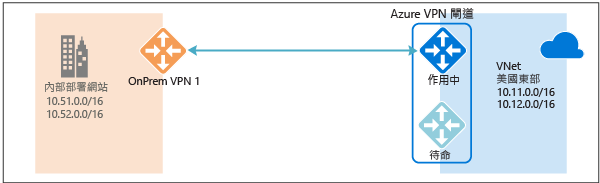
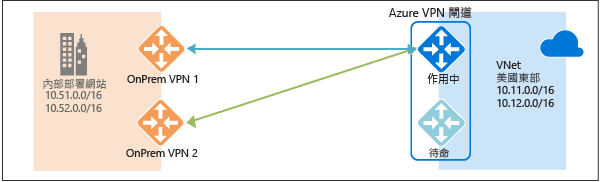
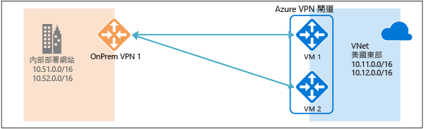
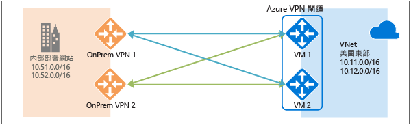
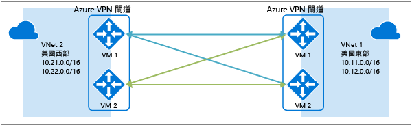

# 高可用性跨單位和 VNet 對 VNet 連線
本文針對使用 Azure VPN 閘道的跨單位和 VNet 對 VNet 連線提供高可用性組態選項的概觀。

## 關於 Azure VPN 閘道備援
每個 Azure VPN 閘道都是由作用中-待命組態中的兩個執行個體組成。對於作用中執行個體所發生的任何計劃性維護或非計劃性中斷，待命執行個體都會自動進行接管 (容錯移轉)，並繼續 S2S VPN 或 VNet 對 VNet 連線。切換會導致短暫中斷。對於計劃性維護，應在 10 到 15 秒內還原連線。對於非計劃問題，連線復原會更久，大約 1 分鐘到 1 分半 (最糟的情況)。對於閘道的 P2S VPN 用戶端連線，P2S 連接將會中斷連線，而使用者必須從用戶端電腦重新連線。

## 高可用性跨單位連線
若要為跨單位連線提供更好的可用性，有幾個選項可用︰

* 多個內部部署 VPN 裝置
* 主動-主動 Azure VPN 閘道
* 兩者的組合

### 多個內部部署 VPN 裝置
您可以使用內部部署網路中的多個 VPN 裝置連接到 Azure VPN 閘道，如下圖所示︰

此組態會提供多個作用中通道 (從同一個 Azure VPN 閘道到相同位置的內部部署裝置)。有一些需求和限制︰

1. 您需要建立從 VPN 裝置至 Azure 的多個 S2S VPN 連線。當您從同一個內部部署網路的多個 VPN 裝置連接到 Azure 時，您需要為每個 VPN 裝置建立一個區域網路閘道，以及一個從 Azure VPN 閘道至區域網路閘道的連線。
2. 對應到 VPN 裝置的區域網路閘道在 "GatewayIpAddress" 屬性中必須有唯一的公用 IP 位址。
3. 此組態需要 BGP。代表 VPN 裝置的每個區域網路閘道都必須有在 "BgpPeerIpAddress" 屬性中指定的唯一 BGP 對等 IP 位址。
4. 每個區域網路閘道中的 AddressPrefix 屬性欄位不得重疊。您應該在 AddressPrefix 欄位中指定 /32 CIDR 格式的 "BgpPeerIpAddress"，例如 10.200.200.254/32。
5. 您應該使用 BGP 向您的 Azure VPN 閘道通告相同內部部署網路首碼的相同首碼，而流量會同時透過這些通道轉送。
6. 每個連線會計入 Azure VPN 閘道的通道數目上限，基本和標準 SKU 的上限為 10，而高效能 SKU 的上限為 30。

在此組態中，Azure VPN 閘道仍處於作用中-待命模式，因此，仍會發生如[上面](#activestandby)所述的相同容錯移轉行為和短暫中斷。但這項設定可防範內部部署網路和 VPN 裝置發生錯誤或中斷。

### 主動-主動 Azure VPN 閘道
您現在可以在主動-主動組態中建立 Azure VPN 閘道，其中兩個閘道 VM 執行個體將會對內部部署 VPN 裝置建立 S2S VPN 通道，如下圖所示︰

在此組態中，每個 Azure 閘道執行個體都會有唯一的公用 IP 位址，而每個執行個體會對在區域網路閘道與連線中指定的內部部署 VPN 裝置建立 IPsec/IKE S2S VPN 通道。請注意，這兩個 VPN 通道實際上屬於相同的連線。您仍必須設定內部部署 VPN 裝置，才能接受或建立對這兩個 Azure VPN 閘道公用 IP 位址的兩個 S2S VPN 通道。

因為 Azure 閘道執行個體是在主動-主動組態中，所以從 Azure 虛擬網路到內部部署網路的流量會同時透過這兩個通道路由傳送，即使內部部署 VPN 裝置可能偏好其中一個通道亦然。請注意，除非其中一個執行個體發生維護事件，否則相同的 TCP 或 UDP 流量一律會周遊相同的通道或路徑。

當一個閘道器執行個體發生計劃性維護或非計劃性事件時，從該執行個體至內部部署 VPN 裝置的 IPsec 通道將會中斷。VPN 裝置上的對應路由應會自動移除或撤銷，以便將流量切換到其他作用中 IPsec 通道。在 Azure 端，會從受影響的執行個體自動切換到作用中執行個體。

### 雙重備援︰Azure 和內部部署網路的主動-主動 VPN 閘道
最可靠的選項是結合網路和 Azure 上的主動-主動閘道，如下圖所示。

您會在主動-主動組態中建立和設定 Azure VPN 閘道，並針對如上所述的兩個內部部署 VPN 裝置，建立兩個區域網路閘道和兩個連線。結果是 Azure 虛擬網路與內部部署網路之間有包含 4 個 IPsec 通道的完整網狀連線。

所有閘道和通道都是從 Azure 端起作用，所以流量會同時分散於 4 個通道，而每個 TCP 或 UDP 流量會再次遵循出自 Azure 端的相同通道或路徑。即使分散流量，您可能會看到 IPsec 通道上的輸送量稍微變好，而此組態的主要目標是要達到高可用性。而且由於分散的統計特性，因此難以提供不同應用程式流量狀況對彙總輸送量有何影響的測量方式。

此拓撲需要兩個區域網路閘道和兩個連線以支援成對的內部部署 VPN 裝置，而且需要 BGP 才能允許相同內部部署網路的兩個連線。這些需求與[上面](#activeactiveonprem)的需求相同。

## 透過 Azure VPN 閘道的高可用性 VNet 對 VNet 連線
相同的主動-主動組態也適用於 Azure VNet 對 VNet 連線。您可以為兩個虛擬網路建立主動-主動 VPN 閘道，並將它們連在一起，以在兩個 VNet 之間形成包含 4 個通道的相同完整網狀連線，如下圖所示︰

這可確保任何計劃性維護事件的兩個虛擬網路之間一律有一組通道，以提供更好的可用性。即使適用於跨單位連線的相同拓撲需要兩個連線，如上所示的 VNet 對 VNet 拓樸對每個閘道只需要一個連線。此外，除非透過 VNet 對 VNet 連線的傳輸路由是必要的，否則 BGP 是選擇性的。

## 後續步驟
如需設定主動-主動跨單位和 VNet 對 VNet 連線的步驟，請參閱[設定跨單位和 VNet 對 VNet 連線的主動-主動 VPN 閘道](http://go.microsoft.com/fwlink/?LinkId=828726)。

<!---HONumber=AcomDC_0928_2016-->