# 使用 Azure 入口網站設定 VNet 的點對站連線 (傳統)

[!INCLUDE [deployment models](../../includes/vpn-gateway-classic-deployment-model-include.md)]

本文顯示如何使用 Azure 入口網站，在傳統部署模型中建立具有點對站連線的 VNet。 您也可從下列清單中選取不同的選項，以使用不同的部署工具或部署模型來建立此組態：

> [!div class="op_single_selector"]
> * [Azure 入口網站](vpn-gateway-howto-point-to-site-resource-manager-portal.md)
> * [PowerShell](vpn-gateway-howto-point-to-site-rm-ps.md)
> * [Azure 入口網站 (傳統)](vpn-gateway-howto-point-to-site-classic-azure-portal.md)
>
>

點對站 (P2S) 設定可讓您建立從個別的用戶端電腦到虛擬網路的安全連線。 當您想要從遠端位置 (例如從住家或會議) 連線至 VNet 時，或只有幾個需要連線至虛擬網路的用戶端時，點對站連線是很實用的解決方案。 使用原生 Windows VPN 用戶端從用戶端電腦起始 P2S VPN 連線。 連線用戶端會使用憑證進行驗證。 

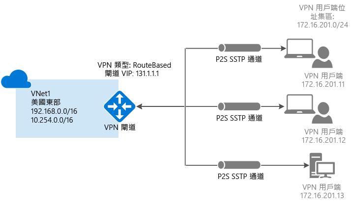

點對站連線不需要 VPN 裝置或公眾對應 IP 位址。 P2S 會建立透過 SSTP (安全通訊端通道通訊協定) 的 VPN 連線。 我們在伺服器端上支援 SSTP 1.0、1.1 和 1.2 版。 用戶端會決定要使用的版本。 若為 Windows 8.1 和更新版本，SSTP 預設使用 1.2。 如需有關點對站連線的詳細資訊，請參閱本文結尾的[點對站常見問題集](#faq)。

P2S 連線需要下列各個條件：

* 動態 VPN 閘道。
* 已上傳至 Azure 之根憑證的公開金鑰 (.cer 檔案)。 這會被視為受信任的憑證並且用於驗證。
* 用戶端憑證是從根憑證產生，並安裝在每部即將連線的用戶端電腦上。 此憑證使用於用戶端憑證。
* 必須在每部連線的用戶端電腦上產生並安裝 VPN 用戶端組態套件。 用戶端組態套件會使用連線到 VNet 的必要資訊，設定已在作業系統上的原生 VPN 用戶端。

### 範例設定

您可以使用下列值來建立測試環境，或參考這些值來進一步了解本文中的範例：

* **名稱：VNet1**
* **位址空間：192.168.0.0/16** 在此範例中，我們只使用一個位址空間。 您可以針對 VNet 使用一個以上的位址空間。
* **子網路名稱：FrontEnd**
* **子網路位址範圍：192.168.1.0/24**
* **訂用帳戶：**如果您有一個以上的訂用帳戶，請確認您使用正確的訂用帳戶。
* **資源群組：TestRG**
* **位置：美國東部**
* **連線類型：點對站**
* **用戶端位址空間：172.16.201.0/24**。 使用這個點對站連線來連線到 VNet 的 VPN 用戶端，會收到來自指定集區的 IP 位址。
* **GatewaySubnet: 192.168.200.0/24**。 閘道子網路必須命名為 'GatewaySubnet'。
* **大小**：選取您想要使用的閘道 SKU。
* **路由類型：動態**

## 區段 1 - 建立虛擬網路和 VPN 閘道

在開始之前，請確認您有 Azure 訂用帳戶。 如果您還沒有 Azure 訂用帳戶，則可以啟用 [MSDN 訂戶權益](https://azure.microsoft.com/pricing/member-offers/msdn-benefits-details)或註冊[免費帳戶](https://azure.microsoft.com/pricing/free-trial)。

### 第 1 部分：建立虛擬網路

如果您還沒有虛擬網路，請建立一個。 已提供螢幕擷取畫面做為範例。 請務必將值取代為您自己的值。 若要使用 Azure 入口網站建立 VNet，請使用下列步驟：

1. 透過瀏覽器瀏覽至 [Azure 入口網站](http://portal.azure.com) ，並視需要使用您的 Azure 帳戶登入。
2. 按一下 [新增] 。 在 [搜尋 Marketplace] 欄位中，輸入「虛擬網路」。 在傳回的清單中找到 [虛擬網路]，並按一下以開啟 [虛擬網路] 刀鋒視窗。

  
3. 從接近 [虛擬網路] 刀鋒視窗底部的 [選取部署模型] 清單中，選取 [傳統]，然後按一下 [建立]。

  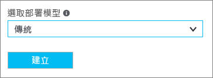
4. 在 [建立虛擬網路]  刀鋒視窗中進行 VNet 設定。 在此刀鋒視窗中，您會新增您的第一個位址空間和單一子網路位址範圍。 完成 VNet 建立之後，您可以返回並新增其他子網路和位址空間。

  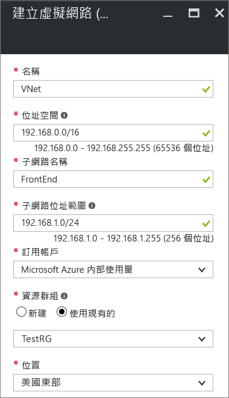
5. 確認 [訂用帳戶]  正確無誤。 您可以使用下拉式清單變更訂用帳戶。
6. 按一下 [資源群組]  並選取現有的資源群組，或輸入新的資源群組名稱以建立新的資源群組。 如果您要建立新的資源群組，請根據您計劃的組態值來命名資源群組。 如需資源群組的詳細資訊，請瀏覽 [Azure Resource Manager 概觀](../azure-resource-manager/resource-group-overview.md#resource-groups)。
7. 接著，選取 VNet 的 [位置]  設定。 此位置會決定您部署到此 VNet 之資源所在的位置。
8. 如果想要能夠在儀表板上輕鬆地尋找您的 VNet，請選取 [釘選到儀表板]，然後按一下 [建立]。

  
9. 按一下 [建立] 之後，儀表板上會出現一個圖格會反映 VNet 的進度。 建立 VNet 時，此圖格會變更。

  
10. 一旦建立虛擬網路之後，您將在 Azure 傳統入口網站的網路頁面上看見 [狀態] 下列出 [已建立]。
11. 新增 DNS 伺服器 (選擇性)。 建立虛擬網路之後，您可以新增 DNS 伺服器的 IP 位址，以便進行名稱解析。 您指定的 DNS 伺服器應該可以解析 VNet 中資源的名稱。 若要新增 DNS 伺服器，請開啟您的虛擬網路設定，按一下 DNS 伺服器，並新增您要使用的 DNS 伺服器 IP 位址。 您在後續步驟中產生的用戶端設定套件，將會包含您在此設定中指定的 DNS 伺服器 IP 位址。 如果您未來需要更新 DNS 伺服器清單，可以產生並安裝新的 VPN 用戶端設定套件，以反映更新後的清單。

### 第 2 部分：建立閘道子網路和動態路由閘道

在此步驟中，您會建立一個閘道子網路和一個動態路由閘道。 在傳統部署模型的 Azure 入口網站中，建立閘道子網路和閘道可以透過相同的組態刀鋒視窗完成。

1. 在入口網站中，瀏覽至要建立閘道的虛擬網路。
2. 在虛擬網路的刀鋒視窗的 [概觀] 刀鋒視窗fe 的 [VPN 連線] 區段中，按一下 [閘道]。

  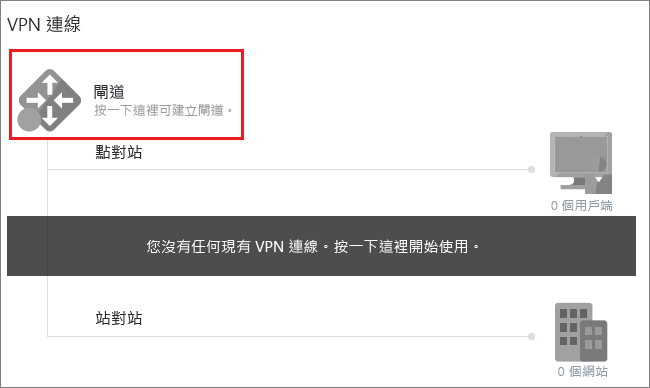
3. 在 [新增 VPN 連線] 刀鋒視窗上，選取 [點對站]。

  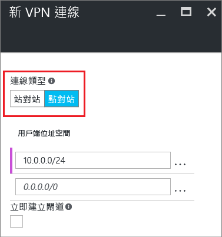
4. 針對 [用戶端位址空間]，新增 IP 位址範圍。 這是 VPN 用戶端在連線時將從其接收 IP 位址的範圍。 使用不會重疊的私人 IP 位址範圍搭配您將從其連線的內部部署位置，或搭配您要連線至的 VNet。 您可以刪除自動填滿的區域，然後新增您要使用的私人 IP 位址範圍。

  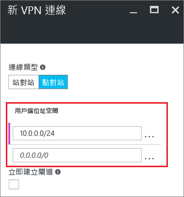
5. 選取 [立即建立閘道] 核取方塊。

  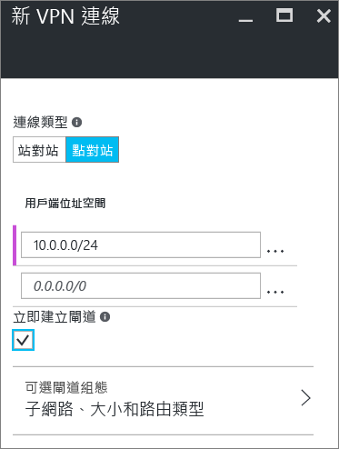
6. 按一下 [選擇性閘道組態] 可開啟 [閘道組態] 刀鋒視窗。

  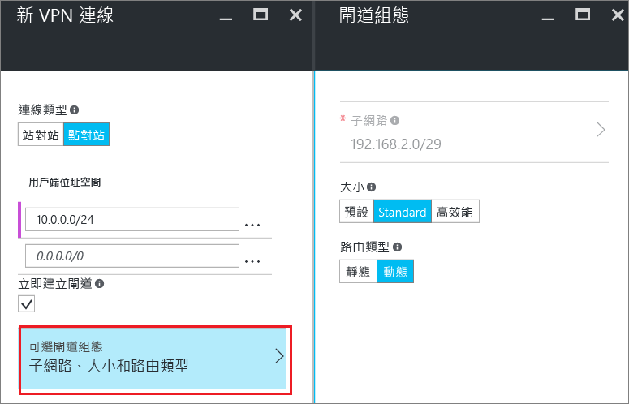
7. 按一下 [子網路設定所需設定] 可新增**閘道子網路**。 雖然您可以建立小至 /29 的閘道子網路，我們建議您選取至少 /28 或 /27，建立包含更多位址的較大子網路。 這將允許足夠的位址，以容納您未來可能需要的其他組態。 使用閘道子網路時，避免將網路安全性群組 (NSG) 與閘道子網路產生關聯。 將網路安全性群組與此子網路產生關聯，可能會導致您的 VPN 閘道如預期般停止運作。

  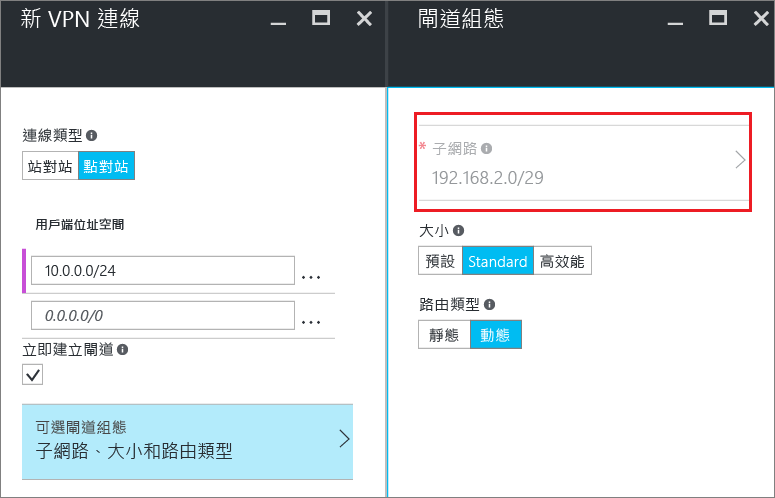
8. 選取閘道**大小**。 大小是虛擬網路閘道的閘道 SKU。 在入口網站中，預設的 SKU 是**基本**。 如需關於閘道 SKU 的資訊，請參閱[關於 VPN 閘道設定](vpn-gateway-about-vpn-gateway-settings.md#gwsku)。

  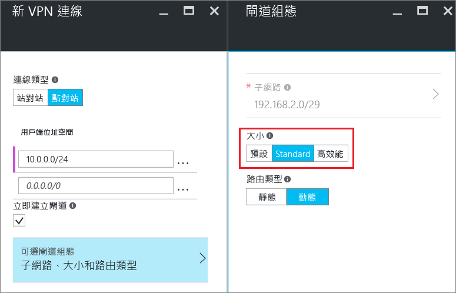
9. 選取閘道的 [路由類型]。 P2S 組態需要**動態**路由類型。 完成此刀鋒視窗的設定時，按一下 [確定]。

  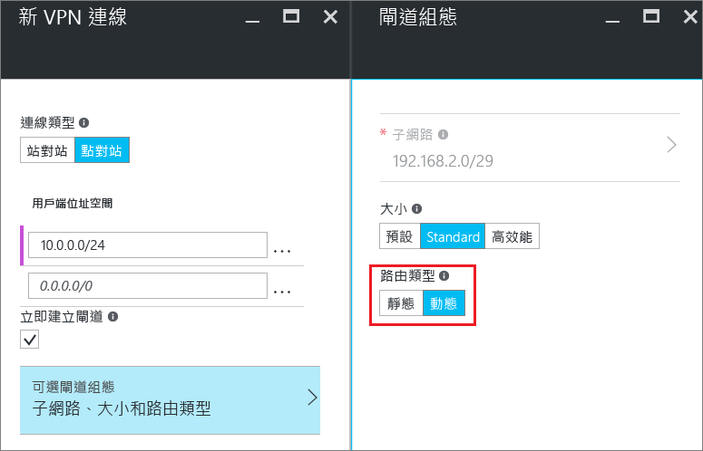
10. 在 [新增 VPN 連線] 刀鋒視窗中，按一下刀鋒視窗底部的 [確定]，來開始建立虛擬網路閘道。 視您選取的閘道 sku 而定，VPN 閘道可能需要 45 分鐘的時間才能完成。

## 第 2 節 - 建立憑證

憑證是 Azure 用於點對站 VPN 的 VPN 用戶端驗證。 您會將根憑證的公開金鑰資訊上傳至 Azure。 公開金鑰就會被視為「受信任」。 用戶端憑證必須從信任的根憑證產生，然後安裝在 [憑證-目前使用者/個人憑證] 存放區中的每部用戶端電腦上。 在用戶端初始 VNet 連線時，此憑證用來驗證用戶端。 如需有關產生和安裝憑證的詳細資訊，請參閱[點對站的憑證](vpn-gateway-certificates-point-to-site.md)。

### 第 1 部分︰取得根憑證的公開金鑰 (.cer)

[!INCLUDE [vpn-gateway-basic-vnet-rm-portal](../../includes/vpn-gateway-p2s-rootcert-include.md)]

### 第 2 部分：產生用戶端憑證

[!INCLUDE [vpn-gateway-basic-vnet-rm-portal](../../includes/vpn-gateway-p2s-clientcert-include.md)]

## 第 3 節 - 上傳根憑證 .cer 檔案

建立閘道之後，您可以將受信任根憑證的 .cer 檔案 (其中包含公開金鑰資訊) 上傳至 Azure。 您並未將根憑證的私密金鑰上傳至 Azure。 一旦上傳 .cer 檔案，Azure 就可以使用它來驗證已安裝從受信任根憑證產生之用戶端憑證的用戶端。 如有需要，您稍後可以上傳其他受信任的根憑證檔案 (最多總計 20 個檔案)。  

1. 在 VNet 刀鋒視窗的 [VPN 連線] 區段中，按一下**用戶端**圖形以開啟 [點對站 VPN 連線] 刀鋒視窗。

  
2. 在 [點對站連線] 刀鋒視窗中，按一下 [管理憑證] 來開啟 [憑證] 刀鋒視窗。 

  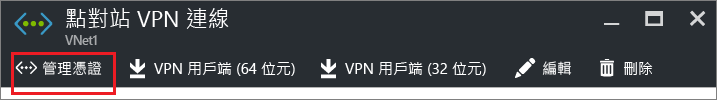  
3. 在 [憑證] 刀鋒視窗中，按一下 [上傳] 來開啟 [上傳憑證] 刀鋒視窗。 

    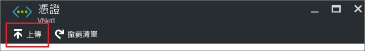 
4. 按一下資料夾圖片來瀏覽 .cer 檔案。 選取檔案，然後按一下 [確定]。 重新整理頁面，以在 [憑證] 刀鋒視窗上查看所上傳的憑證。

  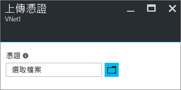 

## 第 4 節 - 設定用戶端

若要使用點對站 VPN 連線至 VNet，每個用戶端都必須安裝用來設定原生 Windows VPN 用戶端的套件。 組態套件可使用連線至虛擬網路所需的設定來設定原生 Windows VPN 用戶端，而如果您指定了 VNet 的 DNS 伺服器，它會包含用戶端將用於名稱解析的 DNS 伺服器 IP 位址。 如果您之後變更了指定的 DNS 伺服器，請在產生用戶端設定套件之後，務必產生新的用戶端設定套件以安裝於用戶端電腦上。

您可以在每個用戶端電腦上使用相同的 VPN 用戶端組態套件，只要版本符合用戶端的架構。 如需支援的用戶端作業系統清單，請參閱本文結尾的[點對站連線常見問題集](#faq)。

### 第 1 部分：產生和安裝 VPN 用戶端組態套件

1. 在 Azure 入口網站中，於 VNet 的 [概觀] 刀鋒視窗的 [VPN 連線] 中，按一下用戶端圖形以開啟 [點對站 VPN 連線] 刀鋒視窗。
2. 在 [點對站 VPN 連線] 刀鋒視窗上方，按一下對應至即將安裝之目標用戶端作業系統的下載套件：

  * 若為 64 位元用戶端，請選取 [VPN 用戶端 (64 位元)]。
  * 若為 32 位元用戶端，請選取 [VPN 用戶端 (32 位元)]。

  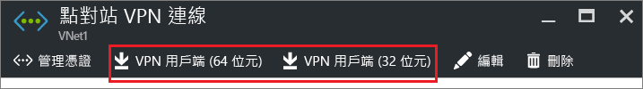 
3. 一旦產生套件之後，將它下載並安裝在用戶端電腦上。 如果您看到 SmartScreen 快顯視窗，請按一下 [更多資訊]，然後按一下 [仍要執行]。 您也可以儲存要在其他用戶端電腦上安裝的套件。

### 第 2 部分：安裝用戶端憑證

如果您想要從不同於用來產生用戶端憑證的用戶端電腦建立 P2S 連線，您需要安裝用戶端憑證。 安裝用戶端憑證時，您需要匯出用戶端憑證時所建立的密碼。 一般而言，這只要按兩下憑證並加以安裝。 如需詳細資訊，請參閱[安裝匯出的用戶端憑證](vpn-gateway-certificates-point-to-site.md#install)。

## 第 5 部分：連線到 Azure

### 連接到您的 VNet

1. 若要連接至您的 VNet，在用戶端電腦上瀏覽到 VPN 連線，然後找出所建立的 VPN 連線。 其名稱會與虛擬網路相同。 按一下 [ **連接**]。 可能會出現與使用憑證有關的快顯訊息。 如果出現，按一下 [繼續]  以使用較高的權限。
2. 在 [連線] 狀態頁面上，按一下 [連線] 以便開始連線。 如果出現 [選取憑證]  畫面，請確認顯示的用戶端憑證是要用來連接的憑證。 如果沒有，請使用下拉箭頭來選取正確的憑證，然後按一下 [確定] 。

  
3. 已建立您的連線。

  

如果您連線時遇到問題，請檢查下列事項︰

- 開啟 [管理使用者憑證] 並瀏覽至 [受信任的根憑證授權單位]\[憑證]。 確認已列出根憑證。 必須要有根憑證驗證才可運作。 當您使用預設值 '[如果可能的話，包含憑證路徑中的所有憑證]' 將用戶端憑證 .pfx 匯出時，也會一併匯出根憑證資訊。 當您安裝用戶端憑證時，也會在用戶端電腦上安裝根憑證。 

- 如果您使用的是藉由企業 CA 解決方案簽發的憑證，而在驗證時發生問題，請檢查用戶端憑證上的驗證順序。 您可以按兩下用戶端憑證，然後移至 [詳細資料] > [增強金鑰使用方法]，來檢查驗證清單順序。 請確定清單所顯示的第一個項目是「用戶端驗證」。 如果不是，您就必須根據以「用戶端驗證」作為清單中第一個項目的「使用者」範本來簽發用戶端憑證。 

### 驗證 VPN 連線

1. 若要驗證您的 VPN 連線為作用中狀態，請開啟提升權限的命令提示字元，並執行 *ipconfig/all*。
2. 檢視結果。 請注意，您接收到的 IP 位址是建立 VNet 時所指定之點對站連線位址範圍內的其中一個位址。 結果應該類似下面的內容：

範例：

    PPP adapter VNet1:
        Connection-specific DNS Suffix .:
        Description.....................: VNet1
        Physical Address................:
        DHCP Enabled....................: No
        Autoconfiguration Enabled.......: Yes
        IPv4 Address....................: 192.168.130.2(Preferred)
        Subnet Mask.....................: 255.255.255.255
        Default Gateway.................:
        NetBIOS over Tcpip..............: Enabled

 
 如果您在透過 P2S 連線至虛擬機器時發生問題，請使用 'ipconfig' 來檢查指派給所連線電腦上的乙太網路介面卡之 IPv4 位址。 如果 IP 位址位在您要連線的 VNet 位址範圍內，或在您 VPNClientAddressPool 的位址範圍內，這稱為重疊位址空間。 當您的位址空間以這種方式重疊時，網路流量不會連線到 Azure，它會保留在本機網路上。 如果您的網路位址空間並未重疊，而且仍然無法連線至虛擬機器，請參閱[針對遠端桌面連線至 VM 進行疑難排解](../virtual-machines/windows/troubleshoot-rdp-connection.md)。

## 連線至虛擬機器

[!INCLUDE [Connect to a VM](../../includes/vpn-gateway-connect-vm-p2s-classic-include.md)]

## 新增或移除受信任的根憑證

您可以從 Azure 新增和移除受信任的根憑證。 當您移除根憑證時，從該根憑證產生憑證的用戶端將無法進行驗證，因而無法進行連線。 若希望用戶端進行驗證和連線，您需要安裝從 Azure 信任 (已上傳至 Azure) 的根憑證產生的新用戶端憑證。

### 若要新增受信任的根憑證

您最多可新增 20 個受信任的根憑證 .cer 檔案至 Azure。 如需指示，請參閱[第 3 節 - 上傳根憑證 .cer 檔案](#upload)。

### 移除受信任的根憑證

1. 在 VNet 刀鋒視窗的 [VPN 連線] 區段中，按一下**用戶端**圖形以開啟 [點對站 VPN 連線] 刀鋒視窗。

  
2. 在 [點對站連線] 刀鋒視窗中，按一下 [管理憑證] 來開啟 [憑證] 刀鋒視窗。 

    
3. 在 [憑證] 刀鋒視窗中，按一下您想要移除之憑證旁邊的省略符號，然後按一下 [刪除]。

   

## 撤銷用戶端憑證

您可以撤銷用戶端憑證。 憑證撤銷清單可讓您選擇性地拒絕以個別的用戶端憑證為基礎的點對站連線。 這不同於移除受信任的根憑證。 若您從 Azure 移除受信任的根憑證 .cer，就會撤銷所有由撤銷的根憑證所產生/簽署的用戶端憑證之存取權。 撤銷用戶端憑證，而不是根憑證，可以讓從根憑證產生的憑證繼續用於點對站連線的驗證。

常見的做法是使用根憑證管理小組或組織層級的存取權，然後使用撤銷的用戶端憑證針對個別使用者進行細部的存取控制。

### 若要撤銷用戶端憑證

您可以藉由將指紋新增至撤銷清單來撤銷用戶端憑證。

1. 擷取用戶端憑證指紋。 如需詳細資訊，請參閱[做法：擷取憑證的指紋](https://msdn.microsoft.com/library/ms734695.aspx)。
2. 將資訊複製到文字編輯器，並移除所有的空格，讓它是連續字串。
3. 瀏覽至 [「傳統虛擬網路名稱」> 點對站 VPN 連線 > 憑證] 刀鋒視窗，然後按一下 [撤銷清單] 以開啟 [撤銷清單] 刀鋒視窗。 
4. 在 [撤銷清單] 刀鋒視窗中，按一下 [+新增憑證] 以開啟 [將憑證加入撤銷清單] 刀鋒視窗。
5. 在 [將憑證加入撤銷清單] 刀鋒視窗中，貼上連續一行文字且不含空格的憑證指紋。 按一下刀鋒視窗底部的 [確定]。
6. 更新完成之後，憑證無法再用於連線。 嘗試使用此憑證進行連線的用戶端會收到訊息，指出憑證不再有效。

## 點對站常見問題集

[!INCLUDE [Point-to-Site FAQ](../../includes/vpn-gateway-point-to-site-faq-include.md)]

## 後續步驟
一旦完成您的連接，就可以將虛擬機器加入您的虛擬網路。 如需詳細資訊，請參閱[虛擬機器](https://docs.microsoft.com/azure/#pivot=services&panel=Compute)。 若要了解網路與虛擬機器的詳細資訊，請參閱 [Azure 與 Linux VM 網路概觀](../virtual-machines/linux/azure-vm-network-overview.md)。

