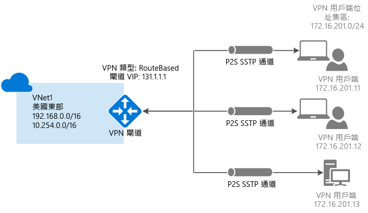
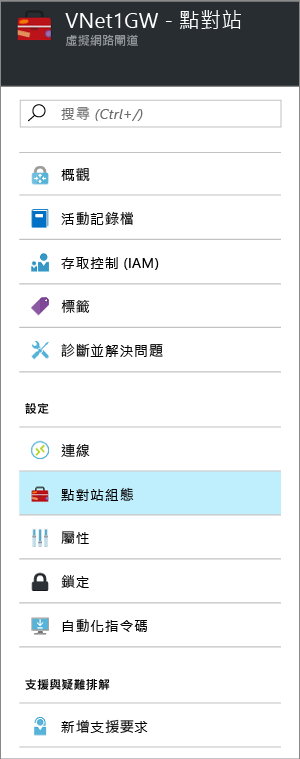
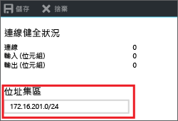
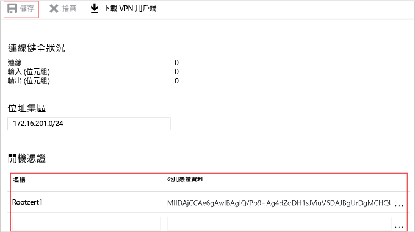

# 使用 Azure 入口網站設定 VNet 的點對站連線

本文顯示如何使用 Azure 入口網站，在 Resource Manager 部署模型中建立具有點對站連線的 VNet。 您也可從下列清單中選取不同的選項，以使用不同的部署工具或部署模型來建立此組態：

> [!div class="op_single_selector"]
> * [Azure 入口網站](vpn-gateway-howto-point-to-site-resource-manager-portal.md)
> * [PowerShell](vpn-gateway-howto-point-to-site-rm-ps.md)
> * [Azure 入口網站 (傳統)](vpn-gateway-howto-point-to-site-classic-azure-portal.md)
>
>

點對站 (P2S) 設定可讓您建立從個別的用戶端電腦到虛擬網路的安全連線。 當您想要從遠端位置 (例如從住家或會議) 連線至 VNet 時，或只有幾個需要連線至虛擬網路的用戶端時，點對站連線是很實用的解決方案。 使用原生 Windows VPN 用戶端從用戶端電腦起始 P2S VPN 連線。 連線用戶端會使用憑證進行驗證。 

點對站連線不需要 VPN 裝置或公眾對應 IP 位址。 P2S 會建立透過 SSTP (安全通訊端通道通訊協定) 的 VPN 連線。 我們在伺服器端上支援 SSTP 1.0、1.1 和 1.2 版。 用戶端會決定要使用的版本。 若為 Windows 8.1 和更新版本，SSTP 預設使用 1.2。 如需有關點對站連線的詳細資訊，請參閱本文結尾的[點對站常見問題集](#faq)。

P2S 連線需要下列各個條件：

* RouteBased VPN 閘道。
* 已上傳至 Azure 之根憑證的公開金鑰 (.cer 檔案)。 這會被視為受信任的憑證並且用於驗證。
* 用戶端憑證是從根憑證產生，並安裝在每部即將連線的用戶端電腦上。 此憑證使用於用戶端憑證。
* 必須在每部連線的用戶端電腦上產生並安裝 VPN 用戶端組態套件。 用戶端組態套件會使用連線到 VNet 的必要資訊，設定已在作業系統上的原生 VPN 用戶端。

### 範例值

您可以使用下列值來建立測試環境，或參考這些值來進一步了解本文中的範例：

* **名稱：VNet1**
* **位址空間：192.168.0.0/16** 在此範例中，我們只使用一個位址空間。 您可以針對 VNet 使用一個以上的位址空間。
* **子網路名稱：FrontEnd**
* **子網路位址範圍：192.168.1.0/24**
* **訂用帳戶：**如果您有一個以上的訂用帳戶，請確認您使用正確的訂用帳戶。
* **資源群組：TestRG**
* **位置：美國東部**
* **GatewaySubnet：192.168.200.0/24**
* **虛擬網路閘道名稱：VNet1GW**
* **閘道類型：VPN**
* **VPN 類型：路由式**
* **公用 IP 位址：VNet1GWpip**
* **連線類型：點對站**
* **用戶端位址集區：172.16.201.0/24** 使用這個點對站連線來連線到 VNet 的 VPN 用戶端，會收到來自用戶端位址集區的 IP 位址。

## 1 - 建立虛擬網路

在開始之前，請確認您有 Azure 訂用帳戶。 如果您還沒有 Azure 訂用帳戶，則可以啟用 [MSDN 訂戶權益](https://azure.microsoft.com/pricing/member-offers/msdn-benefits-details)或註冊[免費帳戶](https://azure.microsoft.com/pricing/free-trial)。 如果您要練習建立此組態，您可以參考[範例值](#example)。

[!INCLUDE [vpn-gateway-basic-vnet-rm-portal](../../includes/vpn-gateway-basic-vnet-rm-portal-include.md)]

## 2 - 指定位址空間和子網路

您可以將其他位址空間和子網路新增至已建立的 Vnet。

[!INCLUDE [vpn-gateway-additional-address-space](../../includes/vpn-gateway-additional-address-space-include.md)]

## 3 - 新增閘道子網路

將虛擬網路連接到閘道之前，您必須先建立虛擬網路要連接的閘道子網路。 閘道服務會使用閘道子網路中指定的 IP 位址。 如果可能，請使用 /28 或 /27 的 CIDR 區塊來建立閘道子網路，以提供足夠的 IP 位址來因應未來額外的組態需求。

本節中的螢幕擷取畫面提供作為參考範例。 請務必使用與您的組態所需值對應的 GatewaySubnet 位址範圍。

### 建立閘道子網路

[!INCLUDE [vpn-gateway-add-gwsubnet-rm-portal](../../includes/vpn-gateway-add-gwsubnet-rm-portal-include.md)]

## 4 - 指定 DNS 伺服器 (選擇性)

建立虛擬網路之後，您可以新增 DNS 伺服器的 IP 位址，以便處理名稱解析。 指定的 DNS 伺服器應該是可以解析您所連接的資源名稱的 DNS 伺服器。 您在後續步驟中產生的 VPN 用戶端設定套件，將會包含您在此設定中指定的 DNS 伺服器 IP 位址。 如果未來需要更新 DNS 伺服器清單，您可以產生並安裝新的 VPN 用戶端設定套件，以反映新的清單。

[!INCLUDE [vpn-gateway-add-dns-rm-portal](../../includes/vpn-gateway-add-dns-rm-portal-include.md)]

## 5 - 建立虛擬網路閘道

點對站連線需要下列設定：

* 閘道類型：VPN
* VPN 類型：路由式

### 建立虛擬網路閘道

[!INCLUDE [vpn-gateway-add-gw-rm-portal](../../includes/vpn-gateway-add-gw-rm-portal-include.md)]

## 6 - 產生憑證

憑證是 Azure 用於點對站 VPN 的 VPN 用戶端驗證。 您會將根憑證的公開金鑰資訊上傳至 Azure。 公開金鑰就會被視為「受信任」。 用戶端憑證必須從信任的根憑證產生，然後安裝在 [憑證-目前使用者/個人憑證] 存放區中的每部用戶端電腦上。 在用戶端初始 VNet 連線時，此憑證用來驗證用戶端。 如需有關產生和安裝憑證的詳細資訊，請參閱[點對站的憑證](vpn-gateway-certificates-point-to-site.md)。

### 步驟 1 - 取得根憑證的 .cer 檔案

[!INCLUDE [vpn-gateway-basic-vnet-rm-portal](../../includes/vpn-gateway-p2s-rootcert-include.md)]

### 步驟 2 - 產生用戶端憑證

[!INCLUDE [vpn-gateway-basic-vnet-rm-portal](../../includes/vpn-gateway-p2s-clientcert-include.md)]

## 7 - 新增用戶端位址集區

用戶端位址集區是您指定的私人 IP 位址範圍。 透過 P2S 連線的用戶端會收到來自這個範圍內的 IP 位址。 使用不會重疊的私人 IP 位址範圍搭配您將從其連線的內部部署位置，或搭配您要連線至的 VNet。

1. 一旦建立虛擬網路閘道，請瀏覽至虛擬網路閘道刀鋒視窗的 [設定] 區段。 在 [設定] 區段中，按一下 [點對站組態] 以開啟 [組態] 刀鋒視窗。

  
2. 您可以刪除自動填滿的區域，然後新增您要使用的私人 IP 位址範圍。 按一下 [儲存]  來驗證和儲存設定。

  

## 8 - 上傳根憑證 .cer 檔案

建立閘道之後，您可以將受信任根憑證的 .cer 檔案 (其中包含公開金鑰資訊) 上傳至 Azure。 一旦上傳 .cer 檔案，Azure 就可以使用它來驗證已安裝從受信任根憑證產生之用戶端憑證的用戶端。 如有需要，您稍後可以上傳其他受信任的根憑證檔案 (最多總計 20 個檔案)。 

1. 新增憑證時，是在 [點對站組態] 刀鋒視窗的 [根憑證] 區段中新增。  
2. 請確定您以 Base-64 編碼 X.509 (.cer) 檔案形式匯出根憑證。 您需要以這種格式匯出憑證，以便可以使用文字編輯器開啟憑證。
3. 使用文字編輯器 (例如「記事本」) 開啟憑證。 複製憑證資料時，請確定您是以連續一行的形式複製文字，而不含歸位字元或換行字元。 您可能必須將文字編輯器中的檢視修改成 [顯示符號] 或 [顯示所有字元]，才能看到歸位字元和換行字元。 請只以連續一行的形式複製下列區段：

  
4. 將憑證資料貼到 [公開憑證資料] 欄位中。 提供憑證「名稱」，然後按一下 [儲存]。 您最多可新增 20 個受信任的根憑證。

  

## 9 - 安裝 VPN 用戶端組態套件

若要使用點對站 VPN 連線至 VNet，每個用戶端都必須安裝用來設定原生 Windows VPN 用戶端的套件。 組態套件可使用連線至虛擬網路所需的設定來設定原生 Windows VPN 用戶端，而如果您指定了 VNet 的 DNS 伺服器，它會包含用戶端將用於名稱解析的 DNS 伺服器 IP 位址。 如果您之後變更了指定的 DNS 伺服器，請在產生用戶端設定套件之後，務必產生新的用戶端設定套件以安裝於用戶端電腦上。

您可以在每個用戶端電腦上使用相同的 VPN 用戶端組態套件，只要版本符合用戶端的架構。 如需支援的用戶端作業系統清單，請參閱本文結尾的[點對站連線常見問題集](#faq)。

### 步驟 1 - 下載用戶端組態套件

1. 在 [點對站組態] 刀鋒視窗上，按一下 [下載 VPN 用戶端] 來開啟 [下載 VPN 用戶端] 刀鋒視窗。 需要幾分鐘的時間來產生套件。

  
2. 為您的用戶端選取正確的套件，然後按一下 [下載]。 儲存組態封裝檔案。 您在連線至虛擬網路的每個用戶端電腦上安裝 VPN 用戶端組態套件。

  

### 步驟 2 - 安裝用戶端組態套件

1. 在本機將組態檔複製到您要連線至虛擬網路的電腦上。 
2. 在用戶端電腦上按兩下 .exe 檔案以安裝套件。 因為是您建立組態套件，所以它尚未簽署，且您可能會看到一則警告。 如果您看到 Windows SmartScreen 快顯視窗，請按一下 [更多資訊] \(左側)，然後按一下 [仍要執行] 來安裝套件。
3. 在用戶端電腦上安裝封裝。 如果您看到 Windows SmartScreen 快顯視窗，請按一下 [更多資訊] \(左側)，然後按一下 [仍要執行] 來安裝套件。
4. 在用戶端電腦上，瀏覽至 [網路設定]，然後按一下 [VPN]。 VPN 連線會顯示其連線的虛擬網路名稱。

## 10 - 安裝用戶端憑證

如果您想要從不同於用來產生用戶端憑證的用戶端電腦建立 P2S 連線，您需要安裝用戶端憑證。 安裝用戶端憑證時，您需要匯出用戶端憑證時所建立的密碼。 一般而言，這只要按兩下憑證並加以安裝。 如需詳細資訊，請參閱[安裝匯出的用戶端憑證](vpn-gateway-certificates-point-to-site.md#install)。

## 11 - 連線到 Azure

1. 若要連接至您的 VNet，在用戶端電腦上瀏覽到 VPN 連線，然後找出所建立的 VPN 連線。 其名稱會與虛擬網路相同。 按一下 [ **連接**]。 可能會出現與使用憑證有關的快顯訊息。 按一下 [繼續] 以使用較高的權限。

2. 在 [連線] 狀態頁面上，按一下 [連線] 以便開始連線。 如果出現 [選取憑證]  畫面，請確認顯示的用戶端憑證是要用來連接的憑證。 如果沒有，請使用下拉箭頭來選取正確的憑證，然後按一下 [確定] 。

  
3. 已建立您的連線。

  

如果您連線時遇到問題，請檢查下列項目︰

- 開啟 [管理使用者憑證] 並瀏覽至 [受信任的根憑證授權單位]\[憑證]。 確認已列出根憑證。 必須要有根憑證驗證才可運作。 當您使用預設值 '[如果可能的話，包含憑證路徑中的所有憑證]' 將用戶端憑證 .pfx 匯出時，也會一併匯出根憑證資訊。 當您安裝用戶端憑證時，也會在用戶端電腦上安裝根憑證。 

- 如果您使用的是藉由企業 CA 解決方案簽發的憑證，而在驗證時發生問題，請檢查用戶端憑證上的驗證順序。 您可以按兩下用戶端憑證，然後移至 [詳細資料] > [增強金鑰使用方法]，來檢查驗證清單順序。 請確定清單所顯示的第一個項目是「用戶端驗證」。 如果不是，您就必須根據以「用戶端驗證」作為清單中第一個項目的「使用者」範本來簽發用戶端憑證。

## 12 - 確認您的連線

1. 若要驗證您的 VPN 連線為作用中狀態，請開啟提升權限的命令提示字元，並執行 *ipconfig/all*。
2. 檢視結果。 請注意，您接收到的 IP 位址是您在組態中指定的點對站 VPN 用戶端位址集區中的其中一個位址。 結果類似於此範例：
   
        PPP adapter VNet1:
            Connection-specific DNS Suffix .:
            Description.....................: VNet1
            Physical Address................:
            DHCP Enabled....................: No
            Autoconfiguration Enabled.......: Yes
            IPv4 Address....................: 172.16.201.3(Preferred)
            Subnet Mask.....................: 255.255.255.255
            Default Gateway.................:
            NetBIOS over Tcpip..............: Enabled

如果您在透過 P2S 連線至虛擬機器時發生問題，請使用 'ipconfig' 來檢查指派給所連線電腦上的乙太網路介面卡之 IPv4 位址。 如果 IP 位址位在您要連線的 VNet 位址範圍內，或在您 VPNClientAddressPool 的位址範圍內，這稱為重疊位址空間。 當您的位址空間以這種方式重疊時，網路流量不會連線到 Azure，它會保留在本機網路上。 如果您的網路位址空間並未重疊，而且仍然無法連線至虛擬機器，請參閱[針對遠端桌面連線至 VM 進行疑難排解](../virtual-machines/windows/troubleshoot-rdp-connection.md)。

## 連線至虛擬機器

[!INCLUDE [Connect to a VM](../../includes/vpn-gateway-connect-vm-p2s-include.md)]

## 新增或移除受信任的根憑證

您可以從 Azure 新增和移除受信任的根憑證。 當您移除根憑證時，從該根憑證產生憑證的用戶端將無法進行驗證，因而無法進行連線。 若希望用戶端進行驗證和連線，您需要安裝從 Azure 信任 (已上傳至 Azure) 的根憑證產生的新用戶端憑證。

### 若要新增受信任的根憑證

您最多可新增 20 個受信任的根憑證 .cer 檔案至 Azure。 如需指示，請參閱這篇文章的[上傳受信任的根憑證](#uploadfile)一節。

### 移除受信任的根憑證

1. 若要移除受信任的根憑證，瀏覽至虛擬網路閘道的 [點對站組態] 刀鋒視窗。
2. 在刀鋒視窗的 [根憑證] 區段中，找出您想要移除的憑證。
3. 按一下憑證旁邊的省略符號，然後按一下 [移除]。

## 撤銷用戶端憑證

您可以撤銷用戶端憑證。 憑證撤銷清單可讓您選擇性地拒絕以個別的用戶端憑證為基礎的點對站連線。 這不同於移除受信任的根憑證。 若您從 Azure 移除受信任的根憑證 .cer，就會撤銷所有由撤銷的根憑證所產生/簽署的用戶端憑證之存取權。 撤銷用戶端憑證，而不是根憑證，可以繼續使用從根憑證產生的憑證進行驗證。

常見的做法是使用根憑證管理小組或組織層級的存取權，然後使用撤銷的用戶端憑證針對個別使用者進行細部的存取控制。

### 若要撤銷用戶端憑證

您可以藉由將指紋新增至撤銷清單來撤銷用戶端憑證。

1. 擷取用戶端憑證指紋。 如需詳細資訊，請參閱[做法：擷取憑證的指紋](https://msdn.microsoft.com/library/ms734695.aspx)。
2. 將資訊複製到文字編輯器，並移除所有的空格，讓它是連續字串。
3. 瀏覽至虛擬網路閘道 [點對站組態] 刀鋒視窗。 這個刀鋒視窗與您用來[上傳受信任根憑證](#uploadfile)的刀鋒視窗相同。
4. 在 [撤銷憑證] 區段中，輸入憑證的易記名稱 (它不一定是憑證 CN)。
5. 將指紋字串複製並貼上到 [指紋]欄位。
6. 指紋會進行驗證，並且自動新增至撤銷清單。 畫面上會出現一則訊息，指出清單正在更新。 
7. 更新完成之後，憑證無法再用於連線。 嘗試使用此憑證進行連線的用戶端會收到訊息，指出憑證不再有效。

## 點對站常見問題集

[!INCLUDE [Point-to-Site FAQ](../../includes/vpn-gateway-point-to-site-faq-include.md)]

## 後續步驟
一旦完成您的連接，就可以將虛擬機器加入您的虛擬網路。 如需詳細資訊，請參閱[虛擬機器](https://docs.microsoft.com/azure/#pivot=services&panel=Compute)。 若要了解網路與虛擬機器的詳細資訊，請參閱 [Azure 與 Linux VM 網路概觀](../virtual-machines/linux/azure-vm-network-overview.md)。
