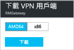

# 使用 Azure 入口網站設定 VNet 的點對站連線
> [!div class="op_single_selector"]
> * [Resource Manager - Azure 入口網站](vpn-gateway-howto-point-to-site-resource-manager-portal.md)
> * [Resource Manager - PowerShell](vpn-gateway-howto-point-to-site-rm-ps.md)
> * [傳統 - Azure 入口網站](vpn-gateway-howto-point-to-site-classic-azure-portal.md)
> 
> 

點對站 (P2S) 設定可讓您建立從個別的用戶端電腦到虛擬網路的安全連線。 當您想要從遠端位置 (例如從住家或會議) 連接到您的 VNet 時，或您只有幾個需要連線至虛擬網路的用戶端時，P2S 連線是很實用的解決方案。 

點對站連線不需要 VPN 裝置或公眾對應 IP 位址即可運作。 VPN 連線的建立方式是從用戶端電腦啟動連線。 如需有關點對站連線的詳細資訊，請參閱本文結尾的[點對站常見問題集](#faq)。

本文將逐步引導您使用 Azure 入口網站，建立具有點對站連線的 VNet。 這些步驟適用於 Resource Manager 部署模型。

### P2S 連線的部署模型和方法
[!INCLUDE [deployment models](../../includes/vpn-gateway-deployment-models-include.md)]

下表顯示 P2S 組態的兩種部署模型和可用的部署方法。 當包含設定的文章推出時，我們會直接從此資料表連結至該文章。

[!INCLUDE [vpn-gateway-clasic-rm](../../includes/vpn-gateway-table-point-to-site-include.md)]

## 基本工作流程

### 範例值
* **名稱：VNet1**
* **位址空間：192.168.0.0/16** 在此範例中，我們只使用一個位址空間。 您可以針對 VNet 使用一個以上的位址空間。
* **子網路名稱：FrontEnd**
* **子網路位址範圍：192.168.1.0/24**
* **訂用帳戶：**如果您有一個以上的訂用帳戶，請確認您使用正確的訂用帳戶。
* **資源群組：TestRG**
* **位置：美國東部**
* **GatewaySubnet：192.168.200.0/24**
* **虛擬網路閘道名稱：VNet1GW**
* **閘道類型：VPN**
* **VPN 類型：路由式**
* **公用 IP 位址：VNet1GWpip**
* **連線類型：點對站**
* **用戶端位址集區：172.16.201.0/24** 使用這個點對站連線來連線到 VNet 的 VPN 用戶端，會收到來自用戶端位址集區的 IP 位址。

## 開始之前
* 請確認您有 Azure 訂用帳戶。 如果您還沒有 Azure 訂用帳戶，則可以啟用 [MSDN 訂戶權益](https://azure.microsoft.com/pricing/member-offers/msdn-benefits-details)或註冊[免費帳戶](https://azure.microsoft.com/pricing/free-trial)。

## 第 1 部分 - 建立虛擬網路
如果您要練習建立此組態，您可以參考[範例值](#example)。

[!INCLUDE [vpn-gateway-basic-vnet-rm-portal](../../includes/vpn-gateway-basic-vnet-rm-portal-include.md)]

## 第 2 部分 - 指定位址空間和子網路
您可以將其他位址空間和子網路新增至已建立的 Vnet。

[!INCLUDE [vpn-gateway-additional-address-space](../../includes/vpn-gateway-additional-address-space-include.md)]

## 第 3 部分 - 新增閘道子網路

將虛擬網路連接到閘道之前，您必須先建立虛擬網路要連接的閘道子網路。 閘道服務會使用閘道子網路中指定的 IP 位址。 如果可能，請使用 /28 或 /27 的 CIDR 區塊來建立閘道子網路，以提供足夠的 IP 位址來因應未來額外的組態需求。

本節中的螢幕擷取畫面提供作為參考範例。 請務必使用與您的組態所需值對應的 GatewaySubnet 位址範圍。

###建立閘道子網路

[!INCLUDE [vpn-gateway-add-gwsubnet-rm-portal](../../includes/vpn-gateway-add-gwsubnet-rm-portal-include.md)]

## 第 4 部分 - 指定 DNS 伺服器 (選擇性)
[!INCLUDE [vpn-gateway-add-dns-rm-portal](../../includes/vpn-gateway-add-dns-rm-portal-include.md)]

## 第 5 部分 - 建立虛擬網路閘道
點對站連線需要下列設定：

* 閘道類型：VPN
* VPN 類型：路由式

### 建立虛擬網路閘道
[!INCLUDE [vpn-gateway-add-gw-rm-portal](../../includes/vpn-gateway-add-gw-rm-portal-include.md)]

## 第 6 部分 - 產生憑證
憑證是 Azure 用於點對站 VPN 的 VPN 用戶端驗證。 然後您可以透過來自企業憑證解決方案所產生的根憑證或自我簽署的根憑證，以 Base-64 編碼 X.509 .cer 檔案形式匯出公開憑證資料 (不是私密金鑰)。 接著將來自根憑證的公開憑證資料匯入到 Azure。 此外，您需要從用戶端的根憑證產生用戶端憑證。 要使用 P2S 連線來連接至虛擬網路的每個用戶端，這些用戶端都必須安裝從根憑證所產生的用戶端憑證。

### 步驟 1 - 取得根憑證的 .cer 檔案

您必須取得根憑證的 .cer 檔案。 您可以使用來自企業解決方案的根憑證，或是使用 [makecert 來建立自我簽署的根憑證](vpn-gateway-certificates-point-to-site.md)。 雖然可以使用 PowerShell 來建立自我簽署的憑證，但透過 PowerShell 產生的憑證不包含 P2S 連接的必要欄位。

1. 若要取得憑證的 .cer 檔案，請開啟 **certmgr.msc** 並找出根憑證。 在自我簽署的根憑證上按一下滑鼠右鍵，按一下 [所有工作]，然後按一下 [匯出]。 將會開啟 [憑證匯出精靈]。
2. 在精靈中，按 [下一步]，接著選取 [否，不要匯出私密金鑰]，然後按 [下一步]。
3. 在 [匯出檔案格式] 頁面上，選取 [Base-64 編碼 X.509 (.CER)]。 然後按 [下一步] 。 
4. 在 [要匯出的檔案] 中，[瀏覽] 到您要匯出憑證的位置。 針對 [檔案名稱] ，請為憑證檔案命名。 然後按 [下一步] 。
5. 按一下 [完成]  以匯出憑證。

### 步驟 2 - 產生用戶端憑證
您可以為每個會連接到虛擬網路的用戶端產生一個唯一的憑證，或是在多個用戶端上使用相同的憑證。 產生唯一的用戶端憑證的優點是能夠視需要撤銷單一憑證。 否則，如果每個人都使用相同的用戶端憑證，而您發現需要撤銷某個用戶端的憑證時，將必須為所有使用該憑證進行驗證的用戶端產生並安裝新的憑證。

####企業憑證
- 如果您使用企業憑證解決方案，請以一般的名稱值格式 'name@yourdomain.com', 產生用戶端憑證，而不要使用 'domain name\username' 格式。
- 請確定您簽發的用戶端憑證所根據的憑證範本，是以「用戶端驗證」(而不是「智慧卡登入」等) 作為使用清單中第一個項目的「使用者」憑證範本。您可以按兩下用戶端憑證，然後檢視 [詳細資料] > [增強金鑰使用方法]，來檢查憑證。

####自我簽署憑證 
如果您使用自我簽署的憑證解決方案，請參閱 [使用點對站設定的自我簽署根憑證](vpn-gateway-certificates-point-to-site.md) ，以產生用戶端憑證。

### 步驟 3 - 匯出用戶端憑證
驗證會需要用戶端憑證。 產生用戶端憑證之後，將它匯出。 稍後將在每個用戶端電腦上安裝您所匯出的用戶端憑證。

1. 若要匯出用戶端憑證，請使用 *certmgr.msc*。 以滑鼠右鍵按一下要匯出的用戶端憑證，然後依序按一下 [所有工作] 和 [匯出]。
2. 匯出具有私密金鑰的用戶端憑證。 這會是 *.pfx* 檔案。 請務必記下或牢記您為這個憑證設定的密碼 (金鑰)。

## 第 7 部分 - 新增用戶端位址集區
1. 一旦建立虛擬網路閘道，請瀏覽至虛擬網路閘道刀鋒視窗的 [設定] 區段。 在 [設定] 區段中，按一下 [點對站組態] 以開啟 [組態] 刀鋒視窗。
   
    
2. **位址集區**是連線的用戶端將接收 IP 位址的 IP 位址集區。 新增位址集區，然後按一下 [儲存]。
   
    

## 第 8 部分 - 上傳根憑證 .cer 檔案
建立閘道之後，您可以將信任的根憑證的 .cer 檔案上傳至 Azure。 您最多可上傳 20 個根憑證。 您並未將根憑證的私密金鑰上傳至 Azure。 一旦上傳 .cer 檔案，Azure 會使用它來驗證連接至虛擬網路的用戶端。

1. 新增憑證時，是在 [點對站組態] 刀鋒視窗的 [根憑證] 區段中新增。  
2. 請確定您以 Base-64 編碼 X.509 (.cer) 檔案形式匯出根憑證。 您需要以這種格式匯出它，以便可以使用文字編輯器開啟憑證。
3. 使用文字編輯器 (例如「記事本」) 開啟憑證。 請只以連續一行的形式複製下列區段：
   
    

    > [!NOTE]
    > 複製憑證資料時，請確定您是以連續一行的形式複製文字，而不含歸位字元或換行字元。 您可能必須將文字編輯器中的檢視修改成 [顯示符號] 或 [顯示所有字元]，才能看到歸位字元和換行字元。                                                                                                                                                                            
    >
    >

4. 將憑證資料貼到 [公開憑證資料] 欄位中。 提供憑證「名稱」，然後按一下 [儲存]。 您最多可新增 20 個受信任的根憑證。
   
    

## 第 9 部分 - 下載和安裝 VPN 用戶端組態套件
使用 P2S 連接到 Azure 的用戶端必須安裝用戶端憑證和 VPN 用戶端組態封裝。 VPN 用戶端組態封裝可供 Windows 用戶端使用。 

VPN 用戶端套件包含的資訊可設定 Windows 內建的 VPN 用戶端軟體。 此組態專屬於您要連線的 VPN。 此套件不會安裝其他軟體。

1. 在 [點對站組態] 刀鋒視窗上，按一下 [下載 VPN 用戶端] 來開啟 [下載 VPN 用戶端] 刀鋒視窗。
   
    
2. 為您的用戶端選取正確的封裝，然後按一下 [下載]。 若為 64 位元用戶端，請選取 [AMD64]。 若為 32 位元用戶端，請選取 [x86]。

    
3. 在用戶端電腦上安裝封裝。 如果您看到 SmartScreen 快顯視窗，請按一下 [更多資訊]，然後按一下 [仍要執行] 來安裝封裝。
4. 在用戶端電腦上，瀏覽至 [網路設定]，然後按一下 [VPN]。 您會看到列出的連線。 它會顯示將要連接的虛擬網路名稱，如以下範例所示︰ 
   
    

## 第 10 部分 - 安裝用戶端憑證
每個用戶端電腦都必須具備用戶端憑證才能進行驗證。 安裝用戶端憑證時，您需要匯出用戶端憑證時所建立的密碼。

1. 將 .pfx 檔案複製到用戶端電腦。
2. 按兩下 .pfx 檔案來安裝。 請勿修改安裝位置。

## 第 11 部分 - 連接至 Azure
1. 若要連接至您的 VNet，在用戶端電腦上瀏覽到 VPN 連線，然後找出所建立的 VPN 連線。 其名稱會與虛擬網路相同。 按一下 [ **連接**]。 可能會出現與使用憑證有關的快顯訊息。 如果出現，按一下 [繼續]  以使用較高的權限。 
2. 在 [連線] 狀態頁面上，按一下 [連線] 以便開始連線。 如果出現 [選取憑證]  畫面，請確認顯示的用戶端憑證是要用來連接的憑證。 如果沒有，請使用下拉箭頭來選取正確的憑證，然後按一下 [確定] 。
   
    

    
3. 現在應該已建立您的連接。
   
    
                                                                                                                                                                           

> [!NOTE]
> 如果您使用的是藉由企業 CA 解決方案簽發的憑證，而在驗證時發生問題，請檢查用戶端憑證上的驗證順序。 您可以按兩下用戶端憑證，然後移至 [詳細資料] > [增強金鑰使用方法]，來檢查驗證清單順序。 請確定清單所顯示的第一個項目是「用戶端驗證」。 如果不是，您就必須根據以「用戶端驗證」作為清單中第一個項目的「使用者」範本來簽發用戶端憑證。 
>
>

## 第 12 部分 - 驗證您的連接
1. 若要驗證您的 VPN 連線為作用中狀態，請開啟提升權限的命令提示字元，並執行 *ipconfig/all*。
2. 檢視結果。 請注意，您接收到的 IP 位址是您在組態中指定的點對站 VPN 用戶端位址集區中的其中一個位址。 結果應該類似下面的內容：
   
        PPP adapter VNet1:
            Connection-specific DNS Suffix .:
            Description.....................: VNet1
            Physical Address................:
            DHCP Enabled....................: No
            Autoconfiguration Enabled.......: Yes
            IPv4 Address....................: 172.16.201.3(Preferred)
            Subnet Mask.....................: 255.255.255.255
            Default Gateway.................:
            NetBIOS over Tcpip..............: Enabled

## 新增或移除受信任的根憑證
您可以從 Azure 移除受信任的根憑證。 當您移除受信任的憑證時，從根憑證所產生的用戶端憑證將不再能夠透過點對站連線到 Azure。 若您希望用可以戶端連線，他們需要安裝在 Azure 中受信任的憑證所產生的新用戶端憑證。

您可以在 [點對站組態] 刀鋒視窗上管理所撤銷用戶端憑證的清單。 這是您用來[上傳受信任的根憑證](#uploadfile)的刀鋒視窗。

## 管理撤銷的用戶端憑證清單
您可以撤銷用戶端憑證。 憑證撤銷清單可讓您選擇性地拒絕以個別的用戶端憑證為基礎的點對站連線。 若您從 Azure 移除根憑證.cer，就會撤銷所有由撤銷的根憑證所產生/簽署的用戶端憑證之存取權。 若您想要的話，也可以撤銷特定的用戶端憑證而非根憑證。 如此一來從根憑證所產生的憑證仍然會是有效的。 

常見的做法是使用根憑證管理小組或組織層級的存取權，然後使用撤銷的用戶端憑證針對個別使用者進行細部的存取控制。

您可以在 [點對站組態] 刀鋒視窗上管理所撤銷用戶端憑證的清單。 這是您用來[上傳受信任的根憑證](#uploadfile)的刀鋒視窗。 新增憑證名稱和指紋，然後儲存。

## 點對站常見問題集

[!INCLUDE [Point-to-Site FAQ](../../includes/vpn-gateway-point-to-site-faq-include.md)]

## 後續步驟
一旦完成您的連接，就可以將虛擬機器加入您的虛擬網路。 如需詳細資訊，請參閱[虛擬機器](https://docs.microsoft.com/azure/#pivot=services&panel=Compute)。

