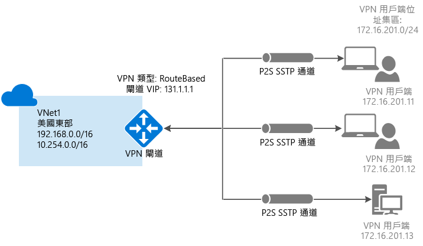

# <a name="configure-a-point-to-site-connection-to-a-vnet-using-certificate-authentication-powershell"></a>使用憑證驗證設定 VNet 的點對站連線：PowerShell

本文顯示如何使用 PowerShell，在 Resource Manager 部署模型中建立具有點對站連線的 VNet。 這項設定使用憑證來驗證連線用戶端。 您也可從下列清單中選取不同的選項，以使用不同的部署工具或部署模型來建立此組態：

> [!div class="op_single_selector"]
> * [Azure 入口網站](vpn-gateway-howto-point-to-site-resource-manager-portal.md)
> * [PowerShell](vpn-gateway-howto-point-to-site-rm-ps.md)
> * [Azure 入口網站 (傳統)](vpn-gateway-howto-point-to-site-classic-azure-portal.md)
>
>

點對站 (P2S) 設定可讓您建立從個別的用戶端電腦到虛擬網路的安全連線。 當您想要從遠端位置 (例如從住家或會議) 連線至 VNet 時，或只有幾個需要連線至虛擬網路的用戶端時，點對站連線是很實用的解決方案。 使用原生 Windows VPN 用戶端從用戶端電腦起始 P2S VPN 連線。 連線用戶端會使用憑證進行驗證。 



點對站連線驗證連線需要下列各項：

* RouteBased VPN 閘道。
* 已上傳至 Azure 之根憑證的公開金鑰 (.cer 檔案)。 這會被視為受信任的憑證並且用於驗證。
* 用戶端憑證是從根憑證產生，並安裝在每部即將連線的用戶端電腦上。 此憑證使用於用戶端憑證。
* 必須在每部連線的用戶端電腦上產生並安裝 VPN 用戶端組態套件。 用戶端組態套件會使用連線到 VNet 的必要資訊，設定已在作業系統上的原生 VPN 用戶端。

點對站連線不需要 VPN 裝置或內部部署公眾對應 IP 位址。 已透過 SSTP (安全通訊端通道通訊協定) 建立 VPN 連線。 我們在伺服器端上支援 SSTP 1.0、1.1 和 1.2 版。 用戶端會決定要使用的版本。 若為 Windows 8.1 和更新版本，SSTP 預設使用 1.2。 

如需有關點對站連線的詳細資訊，請參閱本文結尾的[點對站常見問題集](#faq)。

## <a name="before-beginning"></a>開始之前

* 請確認您有 Azure 訂用帳戶。 如果您還沒有 Azure 訂用帳戶，則可以啟用 [MSDN 訂戶權益](https://azure.microsoft.com/pricing/member-offers/msdn-benefits-details)或註冊[免費帳戶](https://azure.microsoft.com/pricing/free-trial)。
* 安裝最新版的 Azure Resource Manager PowerShell Cmdlet。 如需如何安裝 PowerShell Cmdlet 的詳細資訊，請參閱[如何安裝和設定 Azure PowerShell](/powershell/azure/overview)。

### <a name="example"></a>範例值

您可以使用範例值來建立測試環境，或參考這些值來進一步了解本文中的範例。 我們會在本文的區段 [1](#declare) 中設定變數。 您可以使用這些步驟做為逐步解說並使用未經變更的值，或變更這些值以反映您的環境。 

* **名稱：VNet1**
* **位址空間：192.168.0.0/16** 和 **10.254.0.0/16**<br>在此範例中，我們使用一個以上的位址空間來說明此組態可以與多個位址空間搭配使用。 不過，此組態不需要多個位址空間。
* **子網路名稱：FrontEnd**
  * **子網路位址範圍：192.168.1.0/24**
* **子網路名稱：BackEnd**
  * **子網路位址範圍：10.254.1.0/24**
* **子網路名稱：GatewaySubnet**<br>子網路名稱 *GatewaySubnet* 是 VPN 閘道能夠運作的必要項目。
  * **閘道子網路位址範圍：192.168.200.0/24** 
* **VPN 用戶端位址集區：172.16.201.0/24**<br>使用這個點對站連線來連線到 VNet 的 VPN 用戶端，會收到來自 VPN 用戶端位址集區的 IP 位址。
* **訂用帳戶：**如果您有一個以上的訂用帳戶，請確認您使用正確的訂用帳戶。
* **資源群組：TestRG**
* **位置：美國東部**
* **DNS 伺服器：**您想要用於名稱解析的 DNS 伺服器的 IP 位址。
* **GW 名稱：Vnet1GW**
* **公用 IP 名稱：VNet1GWPIP**
* **VpnType：RouteBased** 

## <a name="declare"></a>1 - 登入和設定變數

在此區段中，您可以登入並宣告用於此組態的值。 在範例指令碼中，會使用宣告的值。 請變更相關值以反映自己的環境。 或者，可以使用宣告的值並執行各步驟做為練習。

1. 以提高的權限開啟 PowerShell 主控台並登入您的 Azure 帳戶。 此 Cmdlet 會提示您提供登入認證。 登入之後，它會下載您的帳戶設定以供 Azure PowerShell 使用。

  ```powershell
  Login-AzureRmAccount
  ```
2. 取得您的 Azure 訂用帳戶清單。

  ```powershell
  Get-AzureRmSubscription
  ```
3. 指定您要使用的訂用帳戶。

  ```powershell
  Select-AzureRmSubscription -SubscriptionName "Name of subscription"
  ```
4. 宣告您想要使用的變數。 使用以下範例，在需要時將該值替換為您自己的值。

  ```powershell
  $VNetName  = "VNet1"
  $FESubName = "FrontEnd"
  $BESubName = "Backend"
  $GWSubName = "GatewaySubnet"
  $VNetPrefix1 = "192.168.0.0/16"
  $VNetPrefix2 = "10.254.0.0/16"
  $FESubPrefix = "192.168.1.0/24"
  $BESubPrefix = "10.254.1.0/24"
  $GWSubPrefix = "192.168.200.0/26"
  $VPNClientAddressPool = "172.16.201.0/24"
  $RG = "TestRG"
  $Location = "East US"
  $DNS = "8.8.8.8"
  $GWName = "VNet1GW"
  $GWIPName = "VNet1GWPIP"
  $GWIPconfName = "gwipconf"
  ```

## <a name="ConfigureVNet"></a>2 - 設定 VNet

1. 建立資源群組。

  ```powershell
  New-AzureRmResourceGroup -Name $RG -Location $Location
  ```
2. 為虛擬網路建立子網路組態，將其命名為 FrontEndBackEnd 和 GatewaySubnet。 這些前置詞必須是您宣告的 VNet 位址空間的一部分。

  ```powershell
  $fesub = New-AzureRmVirtualNetworkSubnetConfig -Name $FESubName -AddressPrefix $FESubPrefix
  $besub = New-AzureRmVirtualNetworkSubnetConfig -Name $BESubName -AddressPrefix $BESubPrefix
  $gwsub = New-AzureRmVirtualNetworkSubnetConfig -Name $GWSubName -AddressPrefix $GWSubPrefix
  ```
3. 建立虛擬網路 <br>DNS 伺服器是選擇性的。 指定此值並不會建立新的 DNS 伺服器。 您在後續步驟中產生的用戶端設定套件，將會包含您在此設定中指定的 DNS 伺服器 IP 位址。 如果未來需要更新 DNS 伺服器清單，您可以產生並安裝新的 VPN 用戶端設定套件，以反映新的清單。 指定的 DNS 伺服器應該是可以解析您所連接的資源名稱的 DNS 伺服器。 此範例中，我們使用了公用 IP 位址。 請務必使用您自己的值。

  ```powershell
  New-AzureRmVirtualNetwork -Name $VNetName -ResourceGroupName $RG -Location $Location -AddressPrefix $VNetPrefix1,$VNetPrefix2 -Subnet $fesub, $besub, $gwsub -DnsServer $DNS
  ```
4. 指定您所建立的虛擬網路的變數。

  ```powershell
  $vnet = Get-AzureRmVirtualNetwork -Name $VNetName -ResourceGroupName $RG
  $subnet = Get-AzureRmVirtualNetworkSubnetConfig -Name "GatewaySubnet" -VirtualNetwork $vnet
  ```
5. VPN 閘道必須具有公用 IP 位址。 您會先要求 IP 位址資源，然後在建立虛擬網路閘道時參考它。 建立 VPN 閘道時，系統會將 IP 位址動態指派給此資源。 VPN 閘道目前僅支援*動態*公用 IP 位址配置。 您無法要求靜態公用 IP 位址指派。 不過，這不表示 IP 位址變更之後已被指派至您的 VPN 閘道。 公用 IP 位址只會在刪除或重新建立閘道時變更。 它不會因為重新調整、重設或 VPN 閘道的其他內部維護/升級而變更。

  要求動態指派的公用 IP 位址。

  ```powershell
  $pip = New-AzureRmPublicIpAddress -Name $GWIPName -ResourceGroupName $RG -Location $Location -AllocationMethod Dynamic
  $ipconf = New-AzureRmVirtualNetworkGatewayIpConfig -Name $GWIPconfName -Subnet $subnet -PublicIpAddress $pip
  ```

## <a name="Certificates"></a>3 - 產生憑證

憑證是 Azure 用於點對站 VPN 的 VPN 用戶端驗證。 您會將根憑證的公開金鑰資訊上傳至 Azure。 公開金鑰就會被視為「受信任」。 用戶端憑證必須從信任的根憑證產生，然後安裝在 [憑證-目前使用者/個人憑證] 存放區中的每部用戶端電腦上。 在用戶端初始 VNet 連線時，此憑證用來驗證用戶端。 

如果您使用自我簽署憑證，則必須使用特定參數來建立這些憑證。 您可以依循 [PowerShell 和 Windows 10](vpn-gateway-certificates-point-to-site.md) 的指示建立自我簽署憑證；或者，如果您沒有 Windows 10，可以使用 [MakeCert](vpn-gateway-certificates-point-to-site-makecert.md)。 產生自我簽署的根憑證和用戶端憑證時，請務必遵循指示中的步驟。 否則，您所產生的憑證將無法與 P2S 連線相容，而且會收到連線錯誤的訊息。

### <a name="cer"></a>步驟 1 - 取得根憑證的 .cer 檔案

[!INCLUDE [vpn-gateway-basic-vnet-rm-portal](../../includes/vpn-gateway-p2s-rootcert-include.md)]


### <a name="generate"></a>步驟 2 - 產生用戶端憑證

[!INCLUDE [vpn-gateway-basic-vnet-rm-portal](../../includes/vpn-gateway-p2s-clientcert-include.md)]

## <a name="upload"></a>4 - 準備根憑證 .cer 檔案以供上傳

準備將受信任根憑證的 .cer 檔案 (其中包含公開金鑰資訊) 上傳至 Azure。 您並未將根憑證的私密金鑰上傳至 Azure。 一旦上傳 .cer 檔案，Azure 就可以使用它來驗證已安裝從受信任根憑證產生之用戶端憑證的用戶端。 如有需要，您稍後可以上傳其他受信任的根憑證檔案 (最多總計 20 個檔案)。 本節中，您可以宣告根憑證 .cer 檔案，該檔案將會與您在下一節中建立的 VPN 閘道相關聯。

1. 宣告您的憑證名稱的變數，以自己的值取代。

  ```powershell
  $P2SRootCertName = "P2SRootCert.cer"
  ```
2. 將檔案路徑以您的路徑取代，然後執行 Cmdlet。

  ```powershell
  $filePathForCert = "C:\cert\P2SRootCert.cer"
  $cert = new-object System.Security.Cryptography.X509Certificates.X509Certificate2($filePathForCert)
  $CertBase64 = [system.convert]::ToBase64String($cert.RawData)
  $p2srootcert = New-AzureRmVpnClientRootCertificate -Name $P2SRootCertName -PublicCertData $CertBase64
  ```

## <a name="creategateway"></a>5 - 建立 VPN 閘道

設定和建立 VNet 的虛擬網路閘道。

* -GatewayType 必須是 **Vpn**，而且 -VpnType 必須是 **RouteBased**。
* 在此範例中，使用上一節中指定的變數 '$p2srootcert'，根憑證的公開金鑰會與 VPN 閘道相關聯。
* 在此範例中，VPN 用戶端位址集區會宣告為步驟 1 中的[變數](#declare)。 VPN 用戶端位址集區是 VPN 用戶端在連線時將從其接收 IP 位址的範圍。 使用不會重疊的私人 IP 位址範圍搭配您將從其連線的內部部署位置，或搭配您要連線至的 VNet。
* 視您選取的[閘道 sku](vpn-gateway-about-vpn-gateway-settings.md) 而定，VPN 閘道可能需要 45 分鐘的時間才能完成。

```powershell
New-AzureRmVirtualNetworkGateway -Name $GWName -ResourceGroupName $RG `
-Location $Location -IpConfigurations $ipconf -GatewayType Vpn `
-VpnType RouteBased -EnableBgp $false -GatewaySku VpnGw1 `
-VpnClientAddressPool $VPNClientAddressPool -VpnClientRootCertificates $p2srootcert
```

## <a name="clientconfig"></a>6 - 下載 VPN 用戶端設定套件

若要使用點對站 VPN 連線至 VNet，每個用戶端都必須安裝用來設定原生 Windows VPN 用戶端的套件。 組態套件可使用連線至虛擬網路所需的設定來設定原生 Windows VPN 用戶端，而如果您指定了 VNet 的 DNS 伺服器，它會包含用戶端將用於名稱解析的 DNS 伺服器 IP 位址。 如果您之後變更了指定的 DNS 伺服器，請在產生用戶端設定套件之後，務必產生新的用戶端設定套件以安裝於用戶端電腦上。

您可以在每個用戶端電腦上使用相同的 VPN 用戶端組態套件，只要版本符合用戶端的架構。 如需支援的用戶端作業系統清單，請參閱本文結尾的[點對站連線常見問題集](#faq)。

1. 建立閘道之後，您可以產生並下載用戶端組態套件。 這個範例會下載 64 位元用戶端的封裝。 如果您想要下載 32 位元用戶端，請將 'Amd64' 取代為 'x86'。 您也可以使用 Azure 入口網站來下載 VPN 用戶端。

  ```powershell
  Get-AzureRmVpnClientPackage -ResourceGroupName $RG `
  -VirtualNetworkGatewayName $GWName -ProcessorArchitecture Amd64
  ```
2. 複製並貼上傳回給網頁瀏覽器的連結以下載套件，並小心移除連結周圍的引號。 
3. 在用戶端電腦上下載及安裝套件。 如果您看到 SmartScreen 快顯視窗，請按一下 [更多資訊]，然後按一下 [仍要執行]。 您也可以儲存要在其他用戶端電腦上安裝的套件。
4. 在用戶端電腦上，瀏覽至 [網路設定]，然後按一下 [VPN]。 VPN 連線會顯示其連線的虛擬網路名稱。

## <a name="clientcertificate"></a>7 - 安裝匯出的用戶端憑證

如果您想要從不同於用來產生用戶端憑證的用戶端電腦建立 P2S 連線，您需要安裝用戶端憑證。 安裝用戶端憑證時，您需要匯出用戶端憑證時所建立的密碼。 一般而言，這只要按兩下憑證並加以安裝。 如需詳細資訊，請參閱[安裝匯出的用戶端憑證](vpn-gateway-certificates-point-to-site.md#install)。

## <a name="connect"></a>8 - 連線到 Azure
1. 若要連接至您的 VNet，在用戶端電腦上瀏覽到 VPN 連線，然後找出所建立的 VPN 連線。 其名稱會與虛擬網路相同。 按一下 [ **連接**]。 可能會出現與使用憑證有關的快顯訊息。 按一下 [繼續] 以使用較高的權限。 
2. 在 [連線] 狀態頁面上，按一下 [連線] 以便開始連線。 如果出現 [選取憑證]  畫面，請確認顯示的用戶端憑證是要用來連接的憑證。 如果沒有，請使用下拉箭頭來選取正確的憑證，然後按一下 [確定] 。

  
3. 已建立您的連線。

  

[!INCLUDE [verify client certificates](../../includes/vpn-gateway-certificates-verify-client-cert-include.md)]

## <a name="verify"></a>9 - 確認您的連線

1. 若要驗證您的 VPN 連線為作用中狀態，請開啟提升權限的命令提示字元，並執行 *ipconfig/all*。
2. 檢視結果。 請注意，您接收到的 IP 位址是您在組態中指定的點對站 VPN 用戶端位址集區中的其中一個位址。 結果類似於此範例：

  ```
  PPP adapter VNet1:
      Connection-specific DNS Suffix .:
      Description.....................: VNet1
      Physical Address................:
      DHCP Enabled....................: No
      Autoconfiguration Enabled.......: Yes
      IPv4 Address....................: 172.16.201.3(Preferred)
      Subnet Mask.....................: 255.255.255.255
      Default Gateway.................:
      NetBIOS over Tcpip..............: Enabled
  ```

## <a name="connectVM"></a>連線至虛擬機器

[!INCLUDE [Connect to a VM](../../includes/vpn-gateway-connect-vm-p2s-include.md)]

## <a name="addremovecert"></a>新增或移除根憑證

您可以從 Azure 新增和移除受信任的根憑證。 當您移除根憑證時，從該根憑證產生憑證的用戶端將無法進行驗證，因而無法進行連線。 若希望用戶端進行驗證和連線，您需要安裝從 Azure 信任 (已上傳至 Azure) 的根憑證產生的新用戶端憑證。

### <a name="to-add-a-trusted-root-certificate"></a>若要新增受信任的根憑證

您最多可將 20 個根憑證 .cer 檔案新增至 Azure。 下列步驟可協助您新增根憑證︰

1. 建立並準備要新增至 Azure 的新根憑證。 將公開金鑰匯出成 Base-64 編碼 X.509 (.CER) 並使用文字編輯器開啟。 如下列範例所示，複製相關值：

  

  > [!NOTE]
  > 複製憑證資料時，請確定您是以連續一行的形式複製文字，而不含歸位字元或換行字元。 您可能必須將文字編輯器中的檢視修改成 [顯示符號] 或 [顯示所有字元]，才能看到歸位字元和換行字元。
  >
  >

2. 指定憑證名稱和金鑰資訊做為變數。 如下列範例所示，以您自己的資訊加以取代：

  ```powershell
  $P2SRootCertName2 = "ARMP2SRootCert2.cer"
  $MyP2SCertPubKeyBase64_2 = "MIIC/zCCAeugAwIBAgIQKazxzFjMkp9JRiX+tkTfSzAJBgUrDgMCHQUAMBgxFjAUBgNVBAMTDU15UDJTUm9vdENlcnQwHhcNMTUxMjE5MDI1MTIxWhcNMzkxMjMxMjM1OTU5WjAYMRYwFAYDVQQDEw1NeVAyU1Jvb3RDZXJ0MIIBIjANBgkqhkiG9w0BAQEFAAOCAQ8AMIIBCgKCAQEAyjIXoWy8xE/GF1OSIvUaA0bxBjZ1PJfcXkMWsHPzvhWc2esOKrVQtgFgDz4ggAnOUFEkFaszjiHdnXv3mjzE2SpmAVIZPf2/yPWqkoHwkmrp6BpOvNVOpKxaGPOuK8+dql1xcL0eCkt69g4lxy0FGRFkBcSIgVTViS9wjuuS7LPo5+OXgyFkAY3pSDiMzQCkRGNFgw5WGMHRDAiruDQF1ciLNojAQCsDdLnI3pDYsvRW73HZEhmOqRRnJQe6VekvBYKLvnKaxUTKhFIYwuymHBB96nMFdRUKCZIiWRIy8Hc8+sQEsAML2EItAjQv4+fqgYiFdSWqnQCPf/7IZbotgQIDAQABo00wSzBJBgNVHQEEQjBAgBAkuVrWvFsCJAdK5pb/eoCNoRowGDEWMBQGA1UEAxMNTXlQMlNSb290Q2VydIIQKazxzFjMkp9JRiX+tkTfSzAJBgUrDgMCHQUAA4IBAQA223veAZEIar9N12ubNH2+HwZASNzDVNqspkPKD97TXfKHlPlIcS43TaYkTz38eVrwI6E0yDk4jAuPaKnPuPYFRj9w540SvY6PdOUwDoEqpIcAVp+b4VYwxPL6oyEQ8wnOYuoAK1hhh20lCbo8h9mMy9ofU+RP6HJ7lTqupLfXdID/XevI8tW6Dm+C/wCeV3EmIlO9KUoblD/e24zlo3YzOtbyXwTIh34T0fO/zQvUuBqZMcIPfM1cDvqcqiEFLWvWKoAnxbzckye2uk1gHO52d8AVL3mGiX8wBJkjc/pMdxrEvvCzJkltBmqxTM6XjDJALuVh16qFlqgTWCIcb7ju"
  ```
3. 加入新的根憑證。 您一次只能新增一個憑證。

  ```powershell
  Add-AzureRmVpnClientRootCertificate -VpnClientRootCertificateName $P2SRootCertName2 -VirtualNetworkGatewayname "VNet1GW" -ResourceGroupName "TestRG" -PublicCertData $MyP2SCertPubKeyBase64_2
  ```
4. 您可使用下列範例確認新憑證已正確新增：

  ```powershell
  Get-AzureRmVpnClientRootCertificate -ResourceGroupName "TestRG" `
  -VirtualNetworkGatewayName "VNet1GW"
  ```

### <a name="to-remove-a-root-certificate"></a>若要移除根憑證：

1. 宣告變數。

  ```powershell
  $GWName = "Name_of_virtual_network_gateway"
  $RG = "Name_of_resource_group"
  $P2SRootCertName2 = "ARMP2SRootCert2.cer"
  $MyP2SCertPubKeyBase64_2 = "MIIC/zCCAeugAwIBAgIQKazxzFjMkp9JRiX+tkTfSzAJBgUrDgMCHQUAMBgxFjAUBgNVBAMTDU15UDJTUm9vdENlcnQwHhcNMTUxMjE5MDI1MTIxWhcNMzkxMjMxMjM1OTU5WjAYMRYwFAYDVQQDEw1NeVAyU1Jvb3RDZXJ0MIIBIjANBgkqhkiG9w0BAQEFAAOCAQ8AMIIBCgKCAQEAyjIXoWy8xE/GF1OSIvUaA0bxBjZ1PJfcXkMWsHPzvhWc2esOKrVQtgFgDz4ggAnOUFEkFaszjiHdnXv3mjzE2SpmAVIZPf2/yPWqkoHwkmrp6BpOvNVOpKxaGPOuK8+dql1xcL0eCkt69g4lxy0FGRFkBcSIgVTViS9wjuuS7LPo5+OXgyFkAY3pSDiMzQCkRGNFgw5WGMHRDAiruDQF1ciLNojAQCsDdLnI3pDYsvRW73HZEhmOqRRnJQe6VekvBYKLvnKaxUTKhFIYwuymHBB96nMFdRUKCZIiWRIy8Hc8+sQEsAML2EItAjQv4+fqgYiFdSWqnQCPf/7IZbotgQIDAQABo00wSzBJBgNVHQEEQjBAgBAkuVrWvFsCJAdK5pb/eoCNoRowGDEWMBQGA1UEAxMNTXlQMlNSb290Q2VydIIQKazxzFjMkp9JRiX+tkTfSzAJBgUrDgMCHQUAA4IBAQA223veAZEIar9N12ubNH2+HwZASNzDVNqspkPKD97TXfKHlPlIcS43TaYkTz38eVrwI6E0yDk4jAuPaKnPuPYFRj9w540SvY6PdOUwDoEqpIcAVp+b4VYwxPL6oyEQ8wnOYuoAK1hhh20lCbo8h9mMy9ofU+RP6HJ7lTqupLfXdID/XevI8tW6Dm+C/wCeV3EmIlO9KUoblD/e24zlo3YzOtbyXwTIh34T0fO/zQvUuBqZMcIPfM1cDvqcqiEFLWvWKoAnxbzckye2uk1gHO52d8AVL3mGiX8wBJkjc/pMdxrEvvCzJkltBmqxTM6XjDJALuVh16qFlqgTWCIcb7ju"
  ```
2. 移除憑證。

  ```powershell
  Remove-AzureRmVpnClientRootCertificate -VpnClientRootCertificateName $P2SRootCertName2 -VirtualNetworkGatewayName $GWName -ResourceGroupName $RG -PublicCertData $MyP2SCertPubKeyBase64_2
  ```
3. 使用下列範例確認已成功移除憑證。

  ```powershell
  Get-AzureRmVpnClientRootCertificate -ResourceGroupName "TestRG" `
  -VirtualNetworkGatewayName "VNet1GW"
  ```

## <a name="revoke"></a>撤銷用戶端憑證

您可以撤銷用戶端憑證。 憑證撤銷清單可讓您選擇性地拒絕以個別的用戶端憑證為基礎的點對站連線。 這不同於移除受信任的根憑證。 若您從 Azure 移除受信任的根憑證 .cer，就會撤銷所有由撤銷的根憑證所產生/簽署的用戶端憑證之存取權。 撤銷用戶端憑證，而不是根憑證，可以繼續使用從根憑證產生的憑證進行驗證。

常見的做法是使用根憑證管理小組或組織層級的存取權，然後使用撤銷的用戶端憑證針對個別使用者進行細部的存取控制。

### <a name="to-revoke-a-client-certificate"></a>若要撤銷用戶端憑證

1. 擷取用戶端憑證指紋。 如需詳細資訊，請參閱[做法：擷取憑證的指紋](https://msdn.microsoft.com/library/ms734695.aspx)。
2. 將資訊複製到文字編輯器，並移除所有的空格，讓它是連續字串。 這在下一個步驟中會宣告為變數。
3. 宣告變數。 請確定宣告您在上一個步驟中擷取的指紋。

  ```powershell
  $RevokedClientCert1 = "NameofCertificate"
  $RevokedThumbprint1 = "‎51ab1edd8da4cfed77e20061c5eb6d2ef2f778c7"
  $GWName = "Name_of_virtual_network_gateway"
  $RG = "Name_of_resource_group"
  ```
4. 將指紋新增到撤銷的憑證清單。 指紋新增時，您會看到「成功」。

  ```powershell
  Add-AzureRmVpnClientRevokedCertificate -VpnClientRevokedCertificateName $RevokedClientCert1 `
  -VirtualNetworkGatewayName $GWName -ResourceGroupName $RG `
  -Thumbprint $RevokedThumbprint1
  ```
5. 確認指紋已新增到憑證撤銷清單。

  ```powershell
  Get-AzureRmVpnClientRevokedCertificate -VirtualNetworkGatewayName $GWName -ResourceGroupName $RG
  ```
6. 新增指紋之後，憑證無法再用於連線接。 嘗試使用此憑證進行連線的用戶端會收到訊息，指出憑證不再有效。

### <a name="to-reinstate-a-client-certificate"></a>若要恢復用戶端憑證

您可以從撤銷的用戶端憑證清單中移除指紋來恢復用戶端憑證。

1. 宣告變數。 請確定針對您要恢復的憑證宣告正確指紋。

  ```powershell
  $RevokedClientCert1 = "NameofCertificate"
  $RevokedThumbprint1 = "‎51ab1edd8da4cfed77e20061c5eb6d2ef2f778c7"
  $GWName = "Name_of_virtual_network_gateway"
  $RG = "Name_of_resource_group"
  ```
2. 從憑證撤銷清單中移除憑證指紋。

  ```powershell
  Remove-AzureRmVpnClientRevokedCertificate -VpnClientRevokedCertificateName $RevokedClientCert1 `
  -VirtualNetworkGatewayName $GWName -ResourceGroupName $RG -Thumbprint $RevokedThumbprint1
  ```
3. 檢查指紋是否已從撤銷的清單中移除。

  ```powershell
  Get-AzureRmVpnClientRevokedCertificate -VirtualNetworkGatewayName $GWName -ResourceGroupName $RG
  ```

## <a name="faq"></a>點對站常見問題集

[!INCLUDE [Point-to-Site FAQ](../../includes/vpn-gateway-point-to-site-faq-include.md)]

## <a name="next-steps"></a>後續步驟
一旦完成您的連接，就可以將虛擬機器加入您的虛擬網路。 如需詳細資訊，請參閱[虛擬機器](https://docs.microsoft.com/azure/#pivot=services&panel=Compute)。 若要了解網路與虛擬機器的詳細資訊，請參閱 [Azure 與 Linux VM 網路概觀](../virtual-machines/linux/azure-vm-network-overview.md)。
