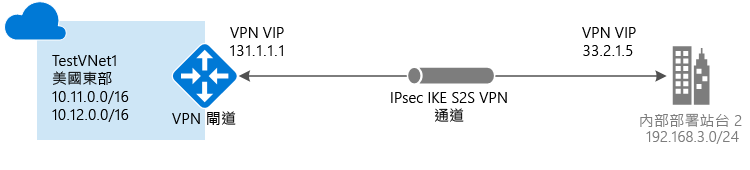

# 使用 Azure 入口網站建立具有網站間連線的 VNet
> [!div class="op_single_selector"]
> * [Resource Manager - Azure 入口網站](vpn-gateway-howto-site-to-site-resource-manager-portal.md)
> * [Resource Manager - PowerShell](vpn-gateway-create-site-to-site-rm-powershell.md)
> * [傳統 - 傳統入口網站](vpn-gateway-site-to-site-create.md)
> 
> 

本文逐步引導您使用 Azure Resource Manager 部署模型 和 Azure 入口網站，以建立虛擬網路及連至內部部署網路的網站間 VPN 閘道連線。 網站間連線可以用於跨單位與混合式組態。

### 網站間連接的部署模型和方法
[!INCLUDE [deployment models](../../includes/vpn-gateway-deployment-models-include.md)]

下表顯示網站間組態目前可用的部署模型和方法。 當包含設定的文章推出時，我們會直接從此資料表連結至該文章。

[!INCLUDE [site-to-site table](../../includes/vpn-gateway-table-site-to-site-include.md)]

#### 其他組態
如果您想要將 VNet 連接在一起，但不要建立對內部部署位置的連線，請參閱 [設定 VNet 對 VNet 連線](vpn-gateway-vnet-vnet-rm-ps.md)。 如果您想要網站間連接新增至已經有連接的 VNet，請參閱[將 S2S 連接新增至已有現有 VPN 閘道連接的 VNet](vpn-gateway-howto-multi-site-to-site-resource-manager-portal.md)。

## 開始之前
在開始設定之前，請確認您具備下列項目：

* 相容的 VPN 裝置 (以及能夠進行設定的人員)。 請參閱 [關於 VPN 裝置](vpn-gateway-about-vpn-devices.md)。 如果不熟悉設定 VPN 裝置，或不熟悉位於內部部署網路組態的 IP 位址範圍，則您需要與能夠提供那些詳細資料的人協調。
* 您的 VPN 裝置對外開放的公用 IP 位址。 此 IP 位址不能位於 NAT 後方。
* Azure 訂用帳戶。 如果您還沒有 Azure 訂用帳戶，則可以啟用 [MSDN 訂戶權益](http://azure.microsoft.com/pricing/member-offers/msdn-benefits-details)或註冊[免費帳戶](http://azure.microsoft.com/pricing/free-trial)。

### 此練習的範例組態值
練習這些步驟時，您可以使用範例組態值：

* **VNet 名稱︰**TestVNet1
* **位址空間︰**10.11.0.0/16 和 10.12.0.0/16
* **子網路：**
  * FrontEnd：10.11.0.0/24
  * BackEnd：10.12.0.0/24
  * GatewaySubnet：10.12.255.0/27
* **資源群組︰**TestRG1
* **位置：**美國東部
* **DNS 伺服器︰**8.8.8.8
* **閘道名稱：**VNet1GW
* **公用 IP：**VNet1GWIP
* **VPN 類型：**路由式
* **連線類型︰**網站間 (IPsec)
* **閘道類型：**VPN
* **區域網路閘道名稱：**Site2
* **連線名稱︰**VNet1toSite2

## 1.建立虛擬網路
如果您已經有 VNet，請驗證設定是否與您的 VPN 閘道設計相容。 請特別注意任何可能與其他網路重疊的子網路。 如果有重疊的子網路，您的連線便無法正常運作。 如果您的 VNet 已設定為正確的設定，即可開始執行 [指定 DNS 伺服器](#dns) 一節中的步驟。

### 建立虛擬網路
[!INCLUDE [vpn-gateway-basic-vnet-rm-portal](../../includes/vpn-gateway-basic-vnet-rm-portal-include.md)]

## 2.新增其他位址空間和子網路
您可以將其他位址空間和子網路新增至已建立的 Vnet。

[!INCLUDE [vpn-gateway-additional-address-space](../../includes/vpn-gateway-additional-address-space-include.md)]

## 3.指定 DNS 伺服器
### 指定 DNS 伺服器
[!INCLUDE [vpn-gateway-add-dns-rm-portal](../../includes/vpn-gateway-add-dns-rm-portal-include.md)]

## 4.建立閘道子網路
將虛擬網路連接到閘道之前，您必須先建立虛擬網路要連接的閘道子網路。 可能的話，最好使用 /28 或 /27 的 CIDR 區塊建立閘道子網路，以便提供足以容納未來其他組態需求的 IP 位址。

如果您在練習中建立此設定，請在建立閘道子網路時參考這些 [值](#values) 。

### 建立閘道子網路
[!INCLUDE [vpn-gateway-add-gwsubnet-rm-portal](../../includes/vpn-gateway-add-gwsubnet-rm-portal-include.md)]

## 5.建立虛擬網路閘道
如果您要練習建立此組態，您可以參考[範例組態值](#values)。

### 建立虛擬網路閘道
[!INCLUDE [vpn-gateway-add-gw-rm-portal](../../includes/vpn-gateway-add-gw-rm-portal-include.md)]

## 6.建立區域網路閘道
「區域網路閘道」會參考您的內部部署位置。 賦予區域網路閘道一個可供 Azure 參考它的名稱。 

如果您要練習建立此組態，您可以參考[範例組態值](#values)。

### 建立區域網路閘道
[!INCLUDE [vpn-gateway-add-lng-rm-portal](../../includes/vpn-gateway-add-lng-rm-portal-include.md)]

## 7.設定 VPN 裝置
[!INCLUDE [vpn-gateway-configure-vpn-device-rm](../../includes/vpn-gateway-configure-vpn-device-rm-include.md)]

## 8.建立網站間 VPN 連線
在虛擬網路閘道與 VPN 裝置之間建立網站間 VPN 連線。 請務必將值取代為您自己的值。 共用的金鑰必須符合您用於 VPN 裝置設定的值。 

開始這一節之前，請確認虛擬網路閘道與區域網路閘道已完成建立。 如果您在練習中建立此組態，請在建立連線時參考這些 [值](#values) 。

### 建立 VPN 連線
[!INCLUDE [vpn-gateway-add-site-to-site-connection-rm-portal](../../includes/vpn-gateway-add-site-to-site-connection-rm-portal-include.md)]

## 9.驗證 VPN 連線
您可以在入口網站中，或使用 PowerShell 來驗證您的 VPN 連線。

[!INCLUDE [vpn-gateway-verify-connection-rm](../../includes/vpn-gateway-verify-connection-rm-include.md)]

## 後續步驟
*  一旦完成您的連接，就可以將虛擬機器加入您的虛擬網路。 如需詳細資訊，請參閱[虛擬機器](https://docs.microsoft.com/azure/#pivot=services&panel=Compute)。
*  如需 BGP 的相關資訊，請參閱 [BGP 概觀](vpn-gateway-bgp-overview.md)和[如何設定 BGP](vpn-gateway-bgp-resource-manager-ps.md)。

<!--HONumber=Jan17_HO4-->

