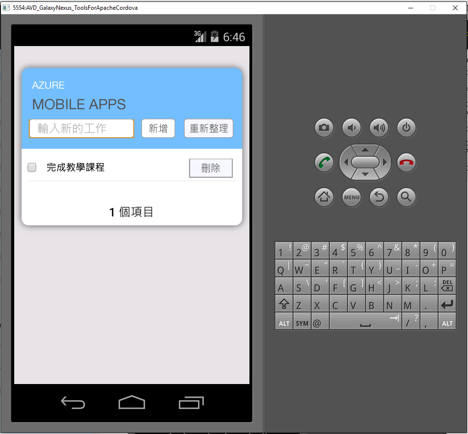

1. 瀏覽 [Azure 入口網站]。 按一下 [瀏覽全部] > [行動應用程式] > 您剛才建立的後端。 在行動應用程式設定中，按一下 [快速入門]  >  [Cordova]。 在 [設定用戶端應用程式] 下方，選取 [建立新的應用程式]，然後按 [下載]。 這會為已預先設定成連接到您後端的應用程式，下載一個完整的 Cordova 專案。
2. 將下載的 ZIP 檔案解壓縮至您硬碟上的目錄，瀏覽至方案檔 (.sln) 並使用 Visual Studio 加以開啟。
3. 在 Visual Studio 中，從開始箭號旁邊的下拉式清單選擇方案平台 (Android、iOS 或 Windows)，然後按一下綠色箭號上的下拉式清單以選取特定的部署裝置或模擬器。 請注意，您可以使用預設 Android 平台和 Ripple 模擬器。 更進階的教學課程會要求您選取支援的裝置或模擬器。 
4. 按 F5 或按一下綠色箭號來建置和執行 Cordova 應用程式。 如果您在模擬器中看到要求網路存取權的安全性對話方塊，請接受它。   
5. 在裝置或模擬器上啟動應用程式後，請在 [輸入新文字] 中輸入有意義的文字 (例如 Complete the tutorial)，然後按一下 [新增] 按鈕。  
   這會將 POST 要求傳送至先前部署的 Azure 後端。 後端會將要求中的資料插入 SQL Database 中的 TodoItem 資料表，並將新儲存之項目的相關資訊傳回給行動應用程式。 行動應用程式會以清單顯示此資料。
   
    
6. 針對您打算支援的每個裝置平台，重複前面三個步驟。

[Azure 入口網站]: https://portal.azure.com/

<!--HONumber=Nov16_HO2-->

