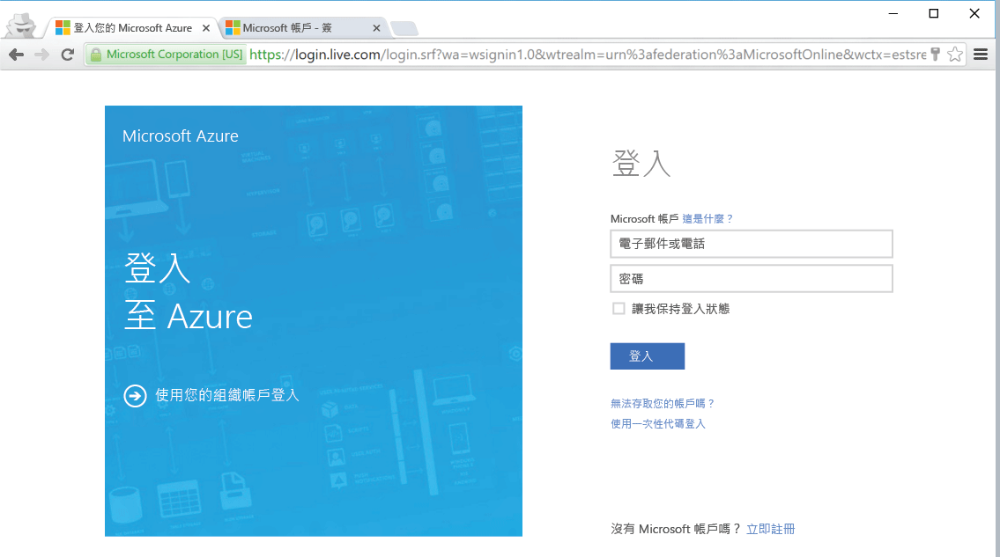

<!--
includes/azure-include-getting-started-v12portal-gettings-an-account.md

Latest Freshness check:  2016-04-11 , carlrab.

As of circa 2016-04-11, the following topics might include this include:
articles/sql-database/sql-database-get-started-tutorial.md

-->
## 使用訂用帳戶連接到 Microsoft Azure 入口網站

若要連接到 Microsoft Azure 入口網站，您必須擁有訂用帳戶。

### 取得新帳戶

如果您沒有現有的 Microsoft Azure 帳戶，請遵循下列其中一個連結來取得帳戶：

- 取得[免費帳戶](https://azure.microsoft.com/get-started/)
- 使用 [MSDN 訂用帳戶](https://azure.microsoft.com/pricing/member-offers/msdn-benefits/)

###使用您現有的帳戶登入

使用您[現有的訂用帳戶](https://account.windowsazure.com/Home/Index)，遵循下列步驟來連接到 Azure 入口網站。

1. 開啟您選擇的瀏覽器並連接到 [Azure 入口網站](https://portal.azure.com/)。

1. 登入 [Azure 入口網站](https://portal.azure.com/)。

1. 登入頁面出現時，請提供您訂用帳戶的認證

   
   

<!---HONumber=AcomDC_0420_2016-->