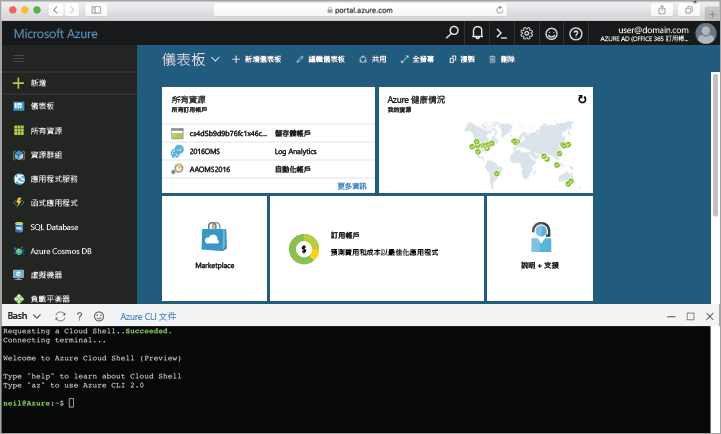

## 啟動 Azure Cloud Shell

Azure Cloud Shell 是免費的 Bash Shell，您可以直接在 Azure 入口網站內執行。 它具有預先安裝和設定的 Azure CLI，可與您的帳戶搭配使用。 按一下 [Azure 入口網站](https://portal.azure.com) 右上方功能表上的 [Cloud Shell] 按鈕。

按鈕會啟動互動式殼層，可讓您用來執行本主題中的所有步驟：

