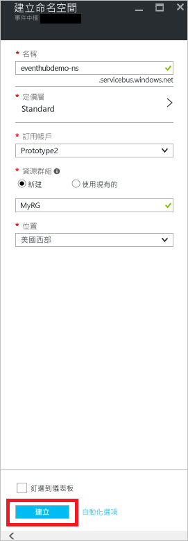
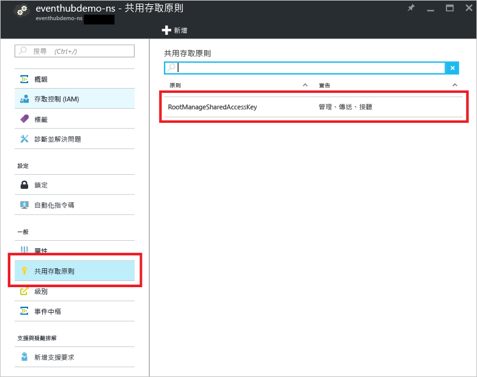

## 建立事件中心

1. 登入 [Azure 入口網站][]，然後按一下畫面左上方的 [新增]。

2. 按一下 [資料 + 分析]，然後按一下 [事件中樞]。

	![][9]

3. 在 [建立命名空間] 刀鋒視窗中，輸入命名空間名稱。系統會立即檢查此名稱是否可用。

	

4. 確定命名空間名稱可用之後，請選擇定價層 ([基本] 或 [標準])。此外，選擇要在其中建立資源的 Azure 訂用帳戶、資源群組和位置。

2. 按一下 [建立] 來建立命名空間。

6. 在事件中樞命名空間清單中，按一下新建立的命名空間。

	![][2]

7. 在命名空間刀鋒視窗中，按一下 [事件中樞]。

	![][3]

8. 在刀鋒視窗頂端，按一下 [新增事件中樞]。

	![][4]

3. 輸入您的事件中心名稱，然後按一下 [建立]。

	![][5]

4. 在事件中樞清單中，按一下新建立的事件中樞名稱。

	![][6]

5. 回到命名空間刀鋒視窗 (而不是特定事件中樞刀鋒視窗)，按一下 [共用存取原則]，然後按一下 [RootManageSharedAccessKey]。

	

5. 按一下複製按鈕，將 **RootManageSharedAccessKey** 連接字串複製到剪貼簿。儲存此連接字串，以便稍後在本教學課程中使用。

	![][8]

現已建立事件中心，並具有傳送與接收事件所需的連接字串。

[2]: ./media/event-hubs-create-event-hub/create-event-hub2.png
[3]: ./media/event-hubs-create-event-hub/create-event-hub3.png
[4]: ./media/event-hubs-create-event-hub/create-event-hub4.png
[5]: ./media/event-hubs-create-event-hub/create-event-hub5.png
[6]: ./media/event-hubs-create-event-hub/create-event-hub6.png
[8]: ./media/event-hubs-create-event-hub/create-event-hub8.png
[9]: ./media/event-hubs-create-event-hub/create-event-hub9.png

[Azure 入口網站]: https://portal.azure.com/

<!---HONumber=AcomDC_0914_2016-->