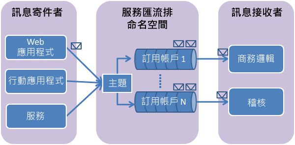

## 什麼是服務匯流排主題和訂用帳戶？
服務匯流排主題和訂用帳戶支援「發佈/訂閱」訊息通訊模型。使用主題和訂用帳戶時，分散式應用程式的元件彼此不會直接通訊，相反地，它們會透過扮演中繼角色的主題來交換訊息。

服務匯流排佇列中的每個訊息只會由單一取用者處理，而服務匯流排主題和訂用帳戶則採用發佈/訂用帳戶模式，提供「一對多」的通訊形式。一個主題可以登錄多個訂閱。當訊息傳送至主題時，每個訂閱都可取得訊息來個別處理。

某個主題的訂用帳戶，類似可接收已傳送到主題之訊息複本的虛擬佇列。您可以選擇為個別訂用帳戶針對主題登錄篩選規則，以篩選或限制主題的哪些訊息可以由哪些主題訂用帳戶接收。

服務匯流排主題和訂用帳戶可讓您調整並處理許多使用者和應用程式上的大量訊息。

## 建立命名空間
若要開始在 Azure 中使用服務匯流排主題和訂用帳戶，首先必須建立「服務命名空間」。命名空間提供範圍容器，可在應用程式內定址服務匯流排資源。

若要建立命名空間：

1. 登入 [Azure 入口網站][Azure 入口網站]。
2. 在入口網站的左方瀏覽窗格中，依序按一下 [新增]，[企業整合] 及 [服務匯流排]。
3. 在 [建立命名空間] 對話方塊中，輸入命名空間名稱。系統會立即檢查此名稱是否可用。
4. 確定命名空間名稱可用之後，請選擇定價層 ([基本]、[標準] 或 [進階])。
5. 在 [訂用帳戶] 欄位中，選擇要在其中建立命名空間的 Azure 訂用帳戶。
6. 在 [資源群組] 欄位中，選擇將存留命名空間的現有資源群組，或是建立新的資源群組。
7. 在 [位置] 中，選擇應裝載您命名空間的國家或地區。
   
    ![建立命名空間][create-namespace]
8. 按一下 [**建立**] 按鈕。此時系統會建立並啟用命名空間。系統為帳戶提供資源時，您可能需要等幾分鐘。

### 取得認證
1. 在命名空間清單中，按一下新建立的命名空間名稱。
2. 在 [服務匯流排命名空間] 刀鋒視窗中，按一下 [共用存取原則]。
3. 在 [共用存取原則] 刀鋒視窗中，按一下 **RootManageSharedAccessKey**。
   
    ![connection-info][connection-info]
4. 在 [原則: RootManageSharedAccessKey] 刀鋒視窗中，按一下 [連接字串 – 主索引鍵] 旁邊的複製按鈕，將連接字串複製到剪貼簿以供稍後使用。
   
    ![connection-string][connection-string]

[Azure 入口網站]: https://portal.azure.com
[create-namespace]: ./media/howto-service-bus-topics/create-namespace.png
[connection-info]: ./media/howto-service-bus-topics/connection-info.png
[connection-string]: ./media/howto-service-bus-topics/connection-string.png

<!---HONumber=AcomDC_0824_2016-->