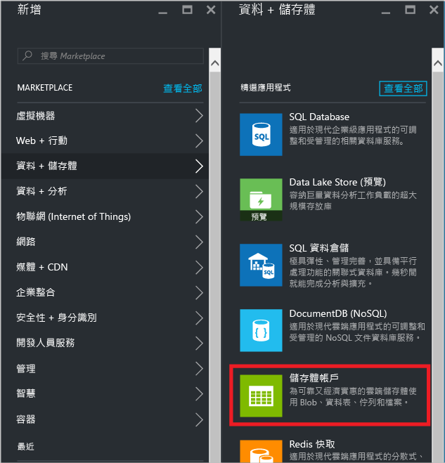
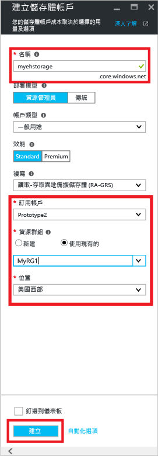
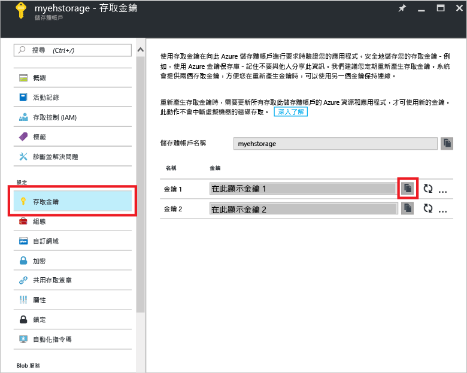
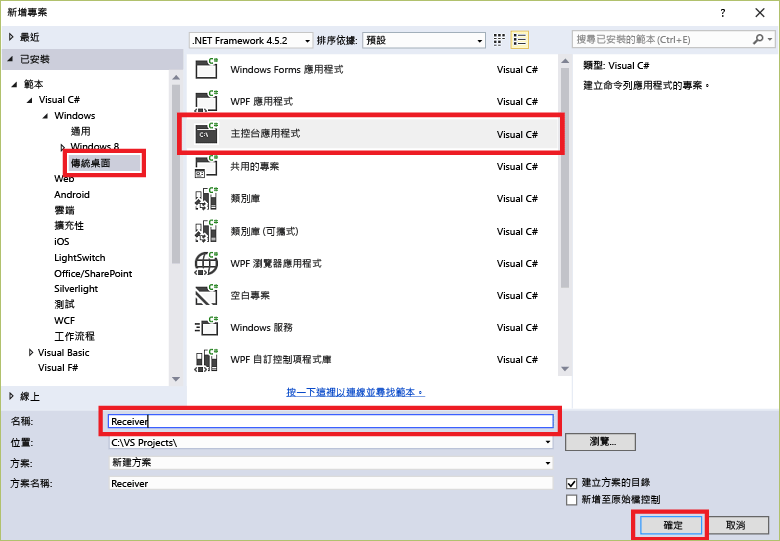
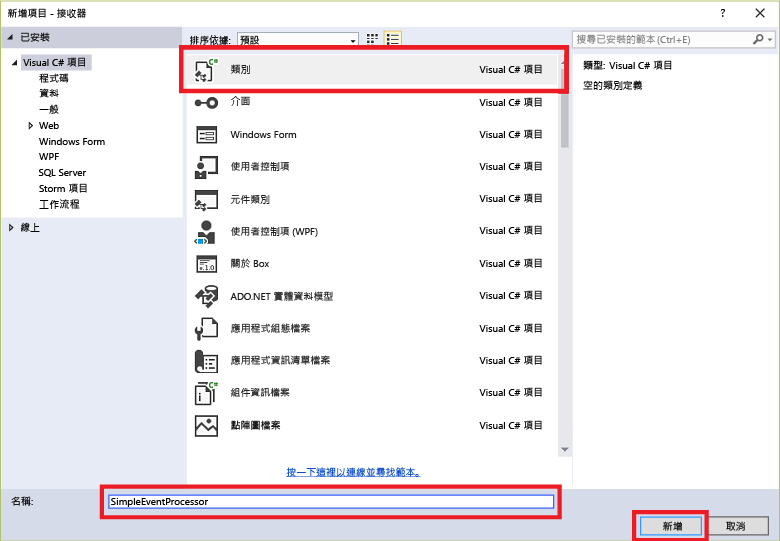

## <a name="receive-messages-with-eventprocessorhost"></a>使用 EventProcessorHost 接收訊息
[EventProcessorHost][EventProcessorHost] 是一個 .NET 類別，透過管理持續檢查點以及來自事件中樞的平行接收，簡化來自事件中樞之事件的接收作業。 使用 [EventProcessorHost][EventProcessorHost]，您可以將事件分割到多個接收者，即使裝載於不同的節點時也是一樣。 這個範例顯示單一接收者如何使用 [EventProcessorHost][EventProcessorHost]。 [擴充事件處理][擴充事件處理]範例顯示如何搭配使用 [EventProcessorHost][EventProcessorHost] 與多個接收者。

若要使用 [EventProcessorHost][EventProcessorHost]，您必須擁有 [Azure 儲存體帳戶][Azure 儲存體帳戶]：

1. 登入 [Azure 入口網站][Azure 入口網站]，然後按一下畫面左上方的 [新增]。
2. 按一下 [資料 + 儲存體]，然後按一下 [儲存體帳戶]。
   
    
3. 在 [建立儲存體帳戶] 刀鋒視窗中，輸入儲存體帳戶名稱。 選擇要在其中建立資源的 Azure 訂用帳戶、資源群組和位置。 然後按一下 [ **建立**]。
   
    
4. 在儲存體帳戶清單中，按一下新建立的儲存體帳戶。
5. 在 [儲存體帳戶] 刀鋒視窗中，按一下 [存取金鑰]。 複製 **key1** 的值以便稍後在此教學課程中使用。
   
    
6. 在 Visual Studio 中，使用**主控台應用程式**專案範本建立新的「Visual C# 桌面應用程式」專案。 將專案命名為 **Receiver**。
   
    
7. 在 [方案總管] 中，以滑鼠右鍵按一下方案，然後按一下 [管理方案的 NuGet 封裝] 。
8. 按一下 [瀏覽] 索引標籤，然後搜尋 `Microsoft Azure Service Bus Event Hub - EventProcessorHost`。 確定已在 [版本] 方塊中指定專案名稱 (**接收者**)。 按一下 [安裝] 並接受使用條款。
   
    
   
    Visual Studio 會下載、安裝並加入 [Azure 服務匯流排事件中樞 - EventProcessorHost NuGet 封裝](https://www.nuget.org/packages/Microsoft.Azure.ServiceBus.EventProcessorHost)的參考與其所有相依性。
9. 在 [接收者] 專案上按一下滑鼠右鍵，按一下 [新增]，然後按一下 [類別]。 將新類別命名為 **SimpleEventProcessor**，然後按一下 [新增] 以建立該類別。
   
    
10. 在 SimpleEventProcessor.cs 檔案開頭處新增下列陳述式：
    
     ```csharp
     using Microsoft.ServiceBus.Messaging;
     using System.Diagnostics;
     ```
    
     接著，將該類別的主體取代為下列程式碼：
    
     ```csharp
     class SimpleEventProcessor : IEventProcessor
     {
         Stopwatch checkpointStopWatch;
    
         async Task IEventProcessor.CloseAsync(PartitionContext context, CloseReason reason)
         {
             Console.WriteLine("Processor Shutting Down. Partition '{0}', Reason: '{1}'.", context.Lease.PartitionId, reason);
             if (reason == CloseReason.Shutdown)
             {
                 await context.CheckpointAsync();
             }
         }
    
         Task IEventProcessor.OpenAsync(PartitionContext context)
         {
             Console.WriteLine("SimpleEventProcessor initialized.  Partition: '{0}', Offset: '{1}'", context.Lease.PartitionId, context.Lease.Offset);
             this.checkpointStopWatch = new Stopwatch();
             this.checkpointStopWatch.Start();
             return Task.FromResult<object>(null);
         }
    
         async Task IEventProcessor.ProcessEventsAsync(PartitionContext context, IEnumerable<EventData> messages)
         {
             foreach (EventData eventData in messages)
             {
                 string data = Encoding.UTF8.GetString(eventData.GetBytes());
    
                 Console.WriteLine(string.Format("Message received.  Partition: '{0}', Data: '{1}'",
                     context.Lease.PartitionId, data));
             }
    
             //Call checkpoint every 5 minutes, so that worker can resume processing from 5 minutes back if it restarts.
             if (this.checkpointStopWatch.Elapsed > TimeSpan.FromMinutes(5))
             {
                 await context.CheckpointAsync();
                 this.checkpointStopWatch.Restart();
             }
         }
     }
     ```
    
     **EventProcessorHost** 會呼叫這個類別來處理接收自事件中樞的事件。 請注意， `SimpleEventProcessor` 類別會使用馬錶定期在 **EventProcessorHost** 內容上呼叫檢查點方法。 這可確保重新啟動接收者時，遺失的處理工作不超過五分鐘。
11. 在 **Program** 類別檔案的頂端，新增下列 `using` 陳述式：
    
     ```csharp
     using Microsoft.ServiceBus.Messaging;
     ```
    
     然後，以下列程式碼取代 `Program` 類別中的 `Main` 方法，並替代您先前儲存的事件中樞名稱和命名空間層級連接字串，以及您在先前各節中複製的儲存體帳戶和金鑰。 
    
     ```csharp
     static void Main(string[] args)
     {
       string eventHubConnectionString = "{Event Hub connection string}";
       string eventHubName = "{Event Hub name}";
       string storageAccountName = "{storage account name}";
       string storageAccountKey = "{storage account key}";
       string storageConnectionString = string.Format("DefaultEndpointsProtocol=https;AccountName={0};AccountKey={1}", storageAccountName, storageAccountKey);
    
       string eventProcessorHostName = Guid.NewGuid().ToString();
       EventProcessorHost eventProcessorHost = new EventProcessorHost(eventProcessorHostName, eventHubName, EventHubConsumerGroup.DefaultGroupName, eventHubConnectionString, storageConnectionString);
       Console.WriteLine("Registering EventProcessor...");
       var options = new EventProcessorOptions();
       options.ExceptionReceived += (sender, e) => { Console.WriteLine(e.Exception); };
       eventProcessorHost.RegisterEventProcessorAsync<SimpleEventProcessor>(options).Wait();
    
       Console.WriteLine("Receiving. Press enter key to stop worker.");
       Console.ReadLine();
       eventProcessorHost.UnregisterEventProcessorAsync().Wait();
     }
     ```

> [!NOTE]
> 本教學課程使用單一 [EventProcessorHost][EventProcessorHost]執行個體。 若要增加輸送量，建議您執行多個 [EventProcessorHost][EventProcessorHost] 執行個體 (如[擴充事件處理][擴充事件處理]範例所示)。 在這些情況下，各種執行個體會自動彼此協調，以對已接收的事件進行負載平衡。 如果您想要多個接收者都處理 *所有* 事件，則必須使用 **ConsumerGroup** 概念。 收到來自不同電腦的事件時，根據在其中執行 [EventProcessorHost][EventProcessorHost] 執行個體的電腦 (或角色) 來指定名稱可能十分有用。 如需這些主題的詳細資訊，請參閱[事件中樞概觀][事件中樞概觀]和[事件中樞程式設計指南][事件中樞程式設計指南]主題。
> 
> 

<!-- Links -->
[事件中樞概觀]: ../articles/event-hubs/event-hubs-overview.md
[事件中樞程式設計指南]: ../articles/event-hubs/event-hubs-programming-guide.md
[擴充事件處理]: https://code.msdn.microsoft.com/Service-Bus-Event-Hub-45f43fc3
[Azure 儲存體帳戶]: ../articles/storage/storage-create-storage-account.md
[EventProcessorHost]: http://msdn.microsoft.com/library/azure/microsoft.servicebus.messaging.eventprocessorhost(v=azure.95).aspx
[Azure 入口網站]: https://portal.azure.com

<!--HONumber=Nov16_HO4-->


