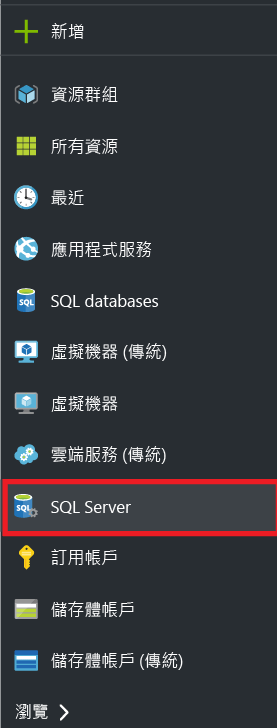
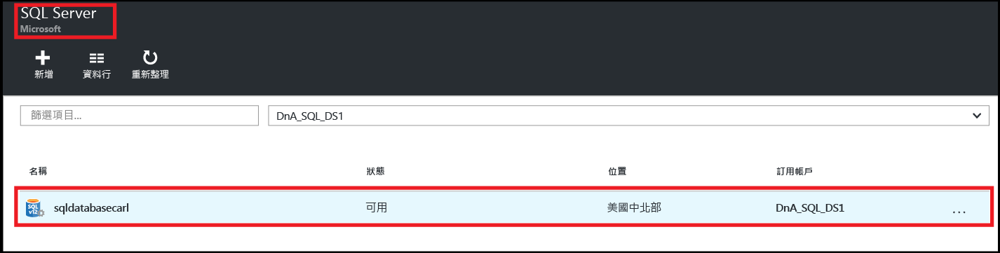
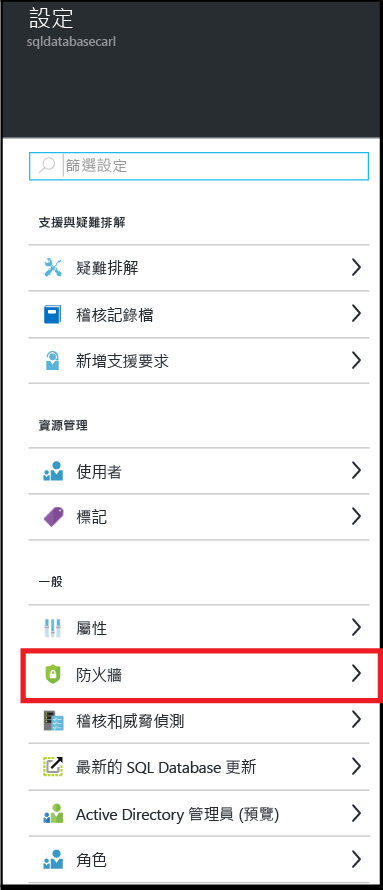
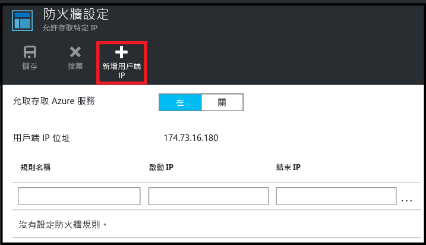
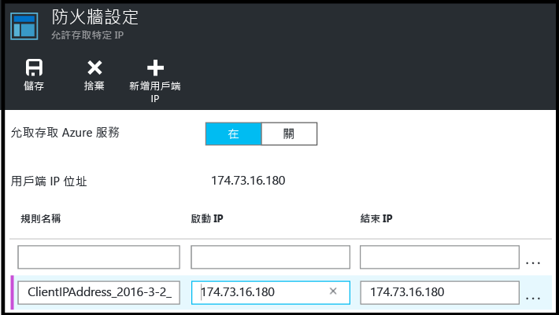
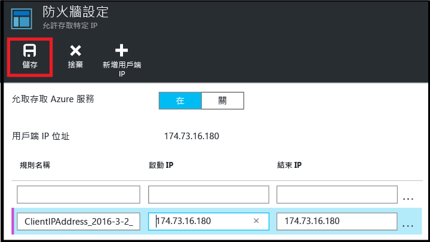

<!--
includes/sql-database-create-new-server-firewall-portal.md

Latest Freshness check:  2016-04-11 , carlrab.

As of circa 2016-04-11, the following topics might include this include:
articles/sql-database/sql-database-get-started-tutorial.md
articles/sql-database/sql-database-configure-firewall-settings

-->
## 建立新的 Azure SQL Database 伺服器層級防火牆

在 Azure 入口網站中使用下列步驟來建立伺服器層級防火牆規則，以允許從個別 IP 位址 (您的用戶端電腦) 或整個 IP 位址範圍連接到 SQL Database 邏輯伺服器。

1. 如果目前未連線，請連線到 [Azure 入口網站](http://portal.azure.com)。
2. 在預設刀鋒視窗中，按一下 [SQL Server]。

  	

2. 在 SQL Server 刀鋒視窗中，按一下要在其上建立防火牆規則的 SQL Database 伺服器。

 	
           
3. 檢閱您伺服器的屬性。

 	
      
4. 在 [設定] 刀鋒視窗中，按一下 [防火牆]。

 	
    
5. 按一下 [新增用戶端 IP] 讓 Azure 為您的用戶端 IP 位址建立規則。

      

6. (選擇性) 按一下所新增的 IP 位址來編輯防火牆地址，以允許某個 IP 位址範圍的存取。

      
    
7. 按一下 [儲存] 以建立伺服器層級防火牆規則。

     

	>[AZURE.IMPORTANT] 您的用戶端 IP 位址可能會不時變動，且在您建立新的防火牆規則前，將可能無法存取伺服器。您可以使用 [Bing](http://www.bing.com/search?q=my%20ip%20address) 檢查 IP 位址，然後新增單一 IP 位址或某個範圍的 IP 位址。如需詳細資訊，請參閱[管理防火牆設定](sql-database-configure-firewall-settings.md#manage-existing-server-level-firewall-rules-through-the-azure-portal)。

<!---HONumber=AcomDC_0427_2016-->