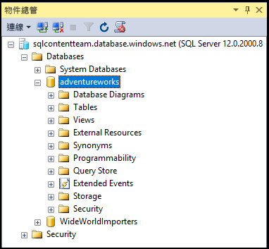

## 使用伺服器層級主體登入來連接到 SQL Database

透過下列步驟，使用伺服器層級主體登入來連接到採用 SSMS 的 SQL Database。

1. 在 Windows 搜尋方塊中輸入 "Microsoft SQL Server Management Studio"，然後按一下桌面應用程式來啟動 SSMS。

2. 在 [連接到伺服器] 視窗中，輸入下列資訊：

 - **伺服器類型**︰預設為資料庫引擎；請勿變更此值。
 - **伺服器名稱**：以下列格式輸入裝載 SQL Database 的伺服器名稱：&lt;servername>.**database.windows.net**
 - **驗證類型**︰如果您剛開始使用，請選取 [SQL 驗證]。如果您已對 SQL Database 邏輯伺服器啟用 Active Directory，您可以選取 [Active Directory 密碼驗證] 或 [Active Directory 整合式驗證]。
 - **使用者名稱**︰如果您選取 [SQL 驗證] 或 [Active Directory 密碼驗證]，請輸入有權存取伺服器上資料庫的使用者名稱。
 - **密碼**︰如果您選取 [SQL 驗證] 或 [Active Directory 密碼驗證]，請輸入指定使用者的密碼。
   
       

3. 按一下 [連接]。
 
4. 如果您的用戶端 IP 位址沒有 SQL Database 邏輯伺服器的存取權，系統會提示您登入 Azure 帳戶並建立伺服器層級的防火牆規則。如果您是 Azure 訂用帳戶管理員，請按一下 [登入] 以建立伺服器層級的防火牆規則。如果不是，請讓 Azure 管理員建立伺服器層級的防火牆規則。
 
      
 
1. 如果您是 Azure 訂用帳戶管理員而且需要登入，當登入頁面出現時，請提供您訂用帳戶的認證並登入。

      
 
1. 順利登入 Azure 後，請檢閱建議的伺服器層級防火牆規則 (您可加以修改來允許某個範圍的 IP 位址)，然後按一下 [確定] 以建立防火牆規則並完成 SQL Database 的連接。
 
      
 
5. 如果您的認證授與您存取權，則 [物件總管] 會開啟，您現在即可執行系統管理工作或查詢資料。
 
     
 
     
## 針對連接失敗進行疑難排解

最常見的連接失敗原因是伺服器名稱 (請記得，<servername> 是邏輯伺服器而非資料庫的名稱)、使用者名稱或密碼錯誤，以及基於安全性理由不允許連接伺服器。

<!---HONumber=AcomDC_0601_2016-->