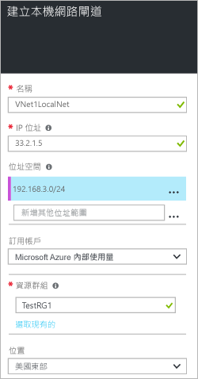

1. 在入口網站中，瀏覽至 [新增] > [網路] > [區域網路閘道]。

	

2. 在 [建立區域網路閘道] 刀鋒視窗中，指定區域網路閘道物件的 [名稱]。
 
3. 為您想要連接的 VPN 裝置或虛擬網路閘道，指定有效的公用 **IP 位址**。 如果此區域網路代表內部部署位置，這是您想要連接之 VPN 裝置的公用 IP 位址。它不能在 NAT 後方且必須可讓 Azure 連線。 如果此區域網路代表另一個 VNet，您會指定已指派給該 Vnet 之虛擬網路閘道的公用 IP 位址。 

4. [位址空間] 是指此區域網路所代表之網路的位址範圍。您可以加入多個位址空間範圍。確定您在此指定的範圍，不會與您要連接到的其他網路範圍重疊。
 
5. 對於 [訂用帳戶]，請確認顯示的是正確的訂用帳戶。

6. 對於 [資源群組]，請選取要使用的資源群組。您可以建立新的資源群組或選取已建立的資源群組。

7. 針對 [位置]，選取將要建立此物件的位置。建議您選取 VNet 所在的相同位置，但您可以不用這麼做。

8. 按一下 [建立] 來建立區域網路閘道。

<!---HONumber=AcomDC_0810_2016-->